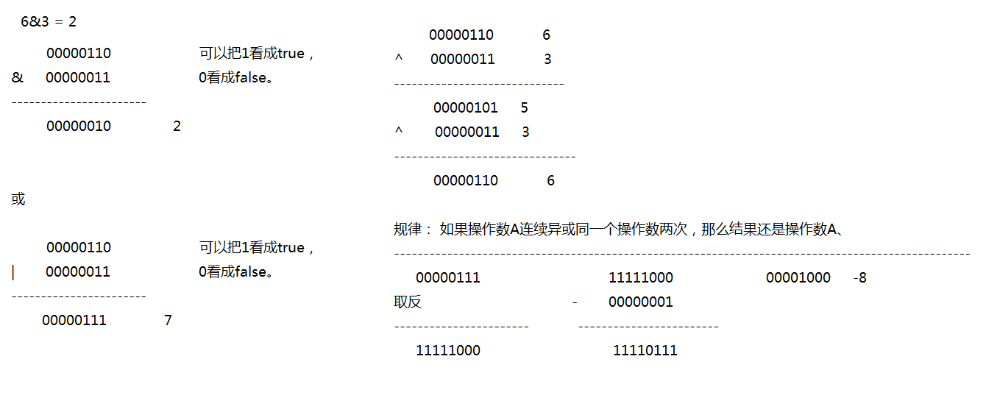

## 注释

注释就是使用文字对程序的说明，注释是写给程序员看的，编译器会忽略注释的 内容的。

1.  注释的类别

   + 第一种： 单行注释。   `// 注释的内容`
   + 第二种： 多行注释。   `/* 注释的内容  */`
   + 第三种： 文档注释.     `/** 注释的内容  */`

   > 注释要注意的细节：
   >
   > 单行注释可以嵌套使用，多行注意是不能嵌套使用的。


2. 注释的作用
   + 使用文字对程序说明。
   + 调试程序


3. 文档注释与多行注释的区别

   + 多行注释与文档注释的区别： 多行注释的内容不能用于生成一个`开发者文档`，
     而文档注释 的内容可以生产一个开发者文档。

   

4. 使用`javadoc`开发工具即可生成一个开发者文档。

   + `javadoc`工具的使用格式：
     + `javadoc -d `   存放文档的路径 java 的源文件 

   > 使用javadoc工具要注意细节：
   >
   > 1. 如果一个类需要使用javadoc工具生成一个软件的开发者文档，那么该类必须使用`public`修饰。
   > 2. 文档注释注释的内容一般都是位于类或者方法的上面的。


**若编程语言足够有表达力，就不需要注释，尽量通过代码来阐述。**


## 标识符和关键字

### 标识符

在java程序中有些名字是可以`自定义`的，那么这些自定义的名字就称作为`自定义的标识符`。

1. 标识符要注意的细节
   + 标识符的组成元素是由 字母（`a-zA-Z`） 、数字(`0-9`) 、 下划线(`_`)、 美元符号(`$`).
     + 标识符`不能以数字开头`。
     + 标识符是`严格区分大小写`的。
     + 标识符的长度是没有长度限制的。
     + 标识符的命名一般要有意义（要做到让人`见名知意`）
     + 关键字、保留字不能用于自定义的标识符。


2. 自定义标识符的规范
   1. `类名`和`接口名`单词的`首字母大写`，`其他单词小写`。 比如： RunTime.
   2. `变量名`与`方法名` `首单词全部小写`，`其他单词首字母大写`，`其他小写`。  比如： doCook()；
   3. `包名全部单词小写`。
   4. `常量全部单词大写`，单词与单词之间使用`下划线`分隔。  比如： UP_DIRECTION


3. 判断一下那些是 符合的标识符
   + 12abc_       不合法  数字不能开头
   + _12abc       合法
   + $ab12#       不合法  #号不属于标识符组成元素。
   + abc@123   不合法  @号不属于标识符组成元素。 


### 关键字

**关键字**：关键字就是在java程序中具备`特殊含义的标识符`。关键字一般用于描述一个程序的结构或者表示数据类型。

|                      |          |            |          |              |            |           |        |
| :------------------: | -------- | ---------- | -------- | ------------ | ---------- | --------- | ------ |
|       访问控制       | private  | protected  | public   |              |            |           |        |
| 类，方法和变量修饰符 | abstract | class      | extends  | final        | implements | interface | native |
|                      | new      | static     | strictfp | synchronized | transient  | volatile  |        |
|       程序控制       | break    | continue   | return   | do           | while      | if        | else   |
|                      | for      | instanceof | switch   | case         | default    |           |        |
|       错误处理       | try      | catch      | throw    | throws       | finally    |           |        |
|        包相关        | import   | package    |          |              |            |           |        |
|       基本类型       | boolean  | byte       | char     | double       | float      | int       | long   |
|                      | short    | null       | true     | false        |            |           |        |
|       变量引用       | super    | this       | void     |              |            |           |        |
|        保留字        | goto     | const      |          |              |            |           |        |


## 常量和变量

### 常量

**常量就是程序在运行过程中其值不能发生改变的量。**

1. 常量的类别：

   + 整数常量：        10
   + 小数常量：	    3.14
   + 布尔常量：        布尔常量只有两个值： `true`(正确). `false`(错误)
   + 字符常量：        字符常量就是单个字符使用单引号引起来的内容我们称作为字符常量。
   + 字符串常量：    字符串常量就是使用双引号引起来的内容称作为字字符串常量。

   > 整数常量的表现形式：整数的表现形式主要是以不同的进制(二进制、八进制、十六进制)表现出来。

```java
class Demo{
	public static void main(String[] args){
		System.out.println(12);    // 整数常量
		System.out.println(3.14);  // 小数常量
		System.out.println(false); // 布尔常量
		System.out.println('1');   // 字符常量
		System.out.println("hello world");  // 字符串常量

		// 如果一个数据没有加上任何的标识之前，默认就是十进制的数据。
		System.out.println(10);   // 十进制  10
		System.out.println(0b10); // 二进制 2
		System.out.println(010);  // 八进制数据， 八进制的数据需要以0开头  8 
		System.out.println(0x10); // 十六进制数据， 十六进制的数据需要以0x开头    16
	}
}
```


### 变量

**变量**就是在程序`运行过程`中其值可以`发生变化`的量,     变量就是一个`存储数据的容器`。

1. 容器具备什么特点
   + 容量(大小)
   + 存储一定格式的数据。
   + 名字


2. 声明（定义）一个变量的格式
   - `容量  变量名字 = 数据;`。   int age = 22;
   - **变量名的命名规范： 首单词小写，其他单词首字母大写，其他小写**  


3. 声明变量的方式

   + 声明变量的方式一：
     + `数据类型 变量名;`
   +  声明变量的方式二： 一次性声明了多个相同类型变量
     + `据类型  变量名1, 变量名2...;`

   > 注意：
   >
   > 1. 变量是必须先`声明`再使用。
   > 2. 在一个作用域中不能声明`同名`的变量。  

```java
class Demo {
	public static void main(String[] args) {	
        
		//int age = 12; //声明一个变量
		int age ,height ;  //声明了变量

		//给变量赋值
		age = 10;
		height = 175;
		System.out.println(age);
		System.out.println(height);
	}
}
```


## 基本数据类型及转换

### 基本数据类型

Java中有`8`种基本数据类型，分别为

+ 6种数字类型 ：`byte`、`short`、`int`、`long`、`float`、`double`
+ 1种字符类型：`char`
+ 1种布尔型：`boolean`

> 这八种基本类型都有对应的包装类分别为：`Byte`、`Short`、`Integer`、`Long`、`Float`、`Double`、`Character`、`Boolean`
>
> 字符串的数据类型是：`String `引用数据类型,不属于基本数据类型。

| 基本类型 | 位数 | 字节 | 默认值  |      |
| :------- | :--- | :--- | ------- | ---- |
| int      | 32   | 4    | 0       |      |
| short    | 16   | 2    | 0       |      |
| long     | 64   | 8    | 0L      |      |
| byte     | 8    | 1    | 0       |      |
| char     | 16   | 2    | 'u0000' |      |
| float    | 32   | 4    | 0f      |      |
| double   | 64   | 8    | 0d      |      |
| boolean  | 1    |      | false   |      |


**布尔类型： 布尔类型只有两个 值，true或者false。**1字节或者4个字节 

+ 如果使用boolean声明一个`基本`类型的变量时，那么该变量占`4`个字节，
+ 如果使用boolean声明一个`数组`类型 的时候，那么每个数组的元素占`1`个字节。

对于`boolean`，官方文档未明确定义，它依赖于 JVM 厂商的具体实现。逻辑上理解是占用 1位，但是实际中会考虑计算机高效存储因素。


> 注意：
>
> 1. Java 里使用 `long` 类型的数据一定要在数值后面加上` L`，否则将作为整型解析：
> 2. `char a = 'h'`char :`单引号`，`String a = "hello"` :`双引号`


> 注意： 
>
> 如果一个整数没有加上任何的标识的时候，那么默认是`int`类型的数据。
> 如果需要把该数据表示成一个`long`类型的数据，那么需要加数据后面加上`L`表示，L是`不区分大小写`的，但是建议使用`大写`。


> 注意： 
>
> 如果一个小数没有加上任何标识的时候，那么该小数默认是`double`类型的数据，如果需要表示成`float`类型，那么需要在小数的后面加上`f`表示。f不区分大小写的。


### 数据类型转换

1. 数据类型转换
   + 小数据类型--------->大数据类型     自动类型转换
   + 大数据类型--------->小数据类型     强制类型转换


2. 强制类型转换的格式
   + `小数据类型  变量名 = (小数据类型)大数据类型`


3. 数据类型转换要注意的细节：
   + 凡是`byte`、`short `、 `char`数据类型数据在运算的时候都会自动转换成`int`类型的数据再运算。
   	2. 两个不同数据类型的数据在运算的时候，结果取决于大的数据类型。

```java
class Demo {
	public static void main(String[] args) {
	
		byte  b=  11;   // 一个字节   
		short s = b;    // 把b变量存储的值赋予给s变量。 2字节 二两的碗
		int i = s;      // i是4字节
		long l = i;     // l 是8个字节。 
		System.out.println(l);
		
		int i = 128;  //4个字节
		byte b =(byte) i;  // 1个字节
		System.out.println(b);  // -128 
		
		// 如果是负数，那么最高位肯定是1， 正数的二进制位的最高位是0。
        // sun提供一个功能 Integer.tobinaryString()  查看一个数据的二进制数据形式的。
		System.out.println(Integer.toBinaryString(-7)); // 11111001（补码）

		//凡是byte、short 、 char数据类型数据在运算的时候都会自动转换成int类型的数据再运算。
		byte b1 =1;
		byte b2 = 2;
		byte b3 = (byte)(b1+b2);
		System.out.println(b3); //3  
		
		System.out.println('a'+1); //98 
				
		// 两个不同数据类型的数据在运算的时候，结果取决于大的数据类型
		int i =10;
		long l = 20;
		i = (int)(i+l); 
		System.out.println(i);

		int i = 10;  
		byte b = i;  // 一个整数没有加上任何标识的时候，默认是int类型的数据。
		// 10 是一个常量， 编译器在编译的时候就能够确认常量的值了，byte b = 10,在编译到的时候
		// java编译器就会检查到10并没有超出byte的表示范围，所以允许赋值。
		// java编译器在编译 的时候并不能确认变量所存储的值，变量存储的值是在运行的时候才在内存中分配  空间的。
		System.out.println(b);
	}
}
```


## 自动装箱与拆箱和常量池

### 装箱与拆箱

- **装箱**：将基本类型用它们对应的引用类型包装起来；
- **拆箱**：将包装类型转换为基本数据类型；

```java
public class Main {
    public static void main(String[] args) {
        // 自动装箱
        Integer a = 99;

        // 自定拆箱
        int b = a;
    }
}
```


### 常量池

1. Java 基本类型的包装类的大部分都实现了常量池技术 即

   + `Byte`,`Short`,`Integer`,`Long` 这4 种包装类默认创建了数值`[-128，127]` 的相应类型的缓存数据

   + `Character `创建了数值在`[0,127]`范围的缓存数据
   + `Boolean` 直接返回`True` Or `False`。

   >  如果超出对应范围仍然会去创建新的对象。
   >
   > 为什么把缓存设置为[-128，127]区间？性能和资源之间的权衡。

```java
public static Boolean valueOf(boolean b) {
    return (b ? TRUE : FALSE);
}
```

```java
private static class CharacterCache {         
    private CharacterCache(){}
    static final Character cache[] = new Character[127 + 1];          
    static {
        for (int i = 0; i < cache.length; i++)                 
            cache[i] = new Character((char)i);         
    }   
}
```


2. Integer 缓存源代码：

   ```java
   /**
   *此方法将始终缓存-128 到 127（包括端点）范围内的值，并可以缓存此范围之外的其他值。
   */
   public static Integer valueOf(int i) {
       if (i >= IntegerCache.low && i <= IntegerCache.high)
           return IntegerCache.cache[i + (-IntegerCache.low)];
       return new Integer(i);
   }
   ```

   

   **两种浮点数类型的包装类 Float,Double 并没有实现常量池技术**

```java
Integer i1 = 33;
Integer i2 = 33;
System.out.println(i1 == i2);   // 输出 true

Integer i11 = 333;
Integer i22 = 333;
System.out.println(i11 == i22); // 输出 false

Double i3 = 1.2;
Double i4 = 1.2;
System.out.println(i3 == i4);   // 输出 false
```


3. 应用场景

   + `Integer i1=40;`Java 在编译的时候会直接将代码封装成 `Integer i1=Integer.valueOf(40);`，从而使用常量池中的对象。
   + `Integer i1 = new Integer(40);`这种情况下会创建新的对象。

   ```java
   Integer i1 = 40;
   Integer i2 = new Integer(40);
   System.out.println(i1==i2);//输出 false
   ```


4. 例子

   ```java
   Integer i1 = 40;
   Integer i2 = 40;
   Integer i3 = 0;
   Integer i4 = new Integer(40);
   Integer i5 = new Integer(40);
   Integer i6 = new Integer(0);
   
   System.out.println("i1=i2   " + (i1 == i2));
   System.out.println("i1=i2+i3   " + (i1 == i2 + i3));
   System.out.println("i1=i4   " + (i1 == i4));
   System.out.println("i4=i5   " + (i4 == i5));
   System.out.println("i4=i5+i6   " + (i4 == i5 + i6));
   System.out.println("40=i5+i6   " + (40 == i5 + i6));
   
   // 结果：
       i1=i2   true
       i1=i2+i3   true
       i1=i4   false
       i4=i5   false
       i4=i5+i6   true
       40=i5+i6   true
   ```

   > 解释：
   >
   > 语句 i4 == i5 + i6，因为+这个操作符不适用于 Integer 对象，首先 i5 和 i6 进行自动拆箱操作，进行数值相加，即 i4 == 40。然后 Integer 对象无法与数值进行直接比较，所以 i4 自动拆箱转为 int 值 40，最终这条语句转为 40 == 40 进行数值比较。
   >
   > 
   >
   > 必须满足两个条件才为true： 
   >
   > 1. 类型相同 
   > 2. 内容相同 

   


## 运算符

### 算术运算符

算术运算符

+ `+ `  ：正数、加法、连接符
  		连接符的作用： 让任何的数据都可以与字符串进行拼接。
  		如果`+号用于字符串`的时候，那么+号就是一个连接符，并不是 做加法功能了
          连接符要注意：任何类型的数据与字符串使用连接符连接，那么结果都是字符串类型的数据。
+ `-`：减法
+ `*`：乘法
+ `/ ` ：除法
+ `%`：取模、取余数

```java
class Demo {
	public static void main(String[] args){
	
		int i1 = 1;
		int i2 = 2;
		System.out.println(i1 +" world");  //    1 world
		
		// 计算机每次运算的时候只能取两个 数据运算。
		System.out.println(1+2+3 +" world"+1+2+3); // 6 world123

		double a= 12.0;
		int b = 3;
		System.out.println(a/b); // 4.0

		//在java中做取模 运算的时，结果的正负号是取决于被除数。
		System.out.println("结果:"+(10%3));  // 1
		System.out.println("结果:"+(10%-3)); // 1      
		System.out.println("结果:"+(-10%3)); // -1    
		System.out.println("结果:"+(-10%-3)); // -1 
	}
}
```


### 自增和自减

1. 自增
   + `++ `（自增） :  自增就是相当于操作数+1.
     + 前自增：++位于操作数的前面。  比如： ++a；
     + 前自增：先自增，后使用
     + 后自增：++位于操作数的后面。  比如： a++
     + 后自增： 先使用，后自增。

```java
class Demo {
	public static void main(String[] args) {
		
		int a = 0;
		int sum1 = ++a; // 前自增。 a = a+1  ， sum = a
		System.out.println("sum1 = "+ sum1+ " a = "+ a);  // sum1 = 1 a = 1
		int sum2 = a++; // 后自增  sum = 0 , a = a+1
		System.out.println("sum2 = "+ sum2+ " a = "+ a); //sum2 = 1 a = 2

   		// 后自增在jvm的运行原理：
		// 因为后自增要使用 到没有+1之前 的值，那么jvm会先声明一个变量用于保存没有+1之前的值。
		// int i = 0;
		// i = temp;

		/*原理：
			1. int temp = i; // 声明了一个临时变量用于记录了i没有加1之前的值。
			2. 自增。  i = i+1;   i = 1;
			3. temp用作了表达式的结果。
	
			i的值发生了几次变化：
			i = 0 -----> 1----> 0
         */

		int i = 0;
		i = i++; // 后自增...  后自增要使用到没有+1之前的值。
		System.out.println("i= "+i);   //0
	}
}
```


2. 自减
   + 自减： 操作数-1
     + 前自减: --位于操作数的前面。  --操作数
     + 前自减： 先自减，后使用
     + 后自减：--位于操作数的后面。 操作数--；
     + 后自减： 先使用，后自减。

```java
class Demo {
	public static void main(String[] args) {	
		/*
		int i = 1;
		int sum = --i;  //前自减   i = i-1 , sum = i;
		int sum = i--; // 后自减   sum = i ; i = i-1;
		System.out.println("sum = "+ sum);  // 0  1 
		*/

		int num = 10;
		//int sum = 10* num++; // 后自增
		int sum = 10* ++num;   // 前自增 
		System.out.println("sum = "+ sum);  //110
	}
}
```


### 赋值运算符

赋值运算符：

+ `= `  
+ `+= `
+ `-=`
+ `*=`
+ ``/=``
+ `%=`

```java
class Demo {
	public static void main(String[] args) {
		
		int i = 10; // 把10赋予给i变量。
		i+=2;       // i = i+2; 
		System.out.println("i = "+i);  //12
	
		byte b1 = 1;
		byte b2 = 2;
		// b2 = b2+b1; //报错。需要强制类型转换 错误: 不兼容的类型: 从int转换到byte可能会有损失
		// b2 = (byte)(b2+b1);
		
		b2+=b1;       
        //b2 = b2+ b1;	 b2+=b1 在编译的时候，java编译器会进行强制类型转换，不需要我们手动转换
		System.out.println("b2 : "+ b2);  //3
	}
}
```


### 比较运算符

比较运算符： 比较运算符的结果都是返回一个`布尔值`的。

+ `==`：判断是否等于
  + ==用于比较两个**基本数据类型数据**的时候，比较的是两个变量所**存储的值**是否一致.
  + ==用于比较两个**引用类型变量的数据**时候，比较的是两个 引用类型变量所记录的**内存地址是否一致**. 
+ `>`：大于
+ `<`：小于
+ `!= `：不等于
+ `>=`：大于等于
+ `<=`：小于等于

```java
class Demo {
	public static void main(String[] args) {
		int a = 10;
		int b =10;
		System.out.println("10等于10吗？"+ (a==b));  //true  
		System.out.println("10不等于1吗？"+ (10!=1) ); //true  

		byte c  = 10;
		long l = 30;
		System.out.println(l>c); // true 两个不同类型的数据是否可以比较,可以的，但是两个不                                      // 同类型的数据必须是兼用的数据。
		//这个比较的过程会先把b转换了long类型的数据，然后再进行比较。
		System.out.println('a'>50); //true  
	}
}
```

### 位运算符

位运算符：位运算符就是直接操作二进制位的。

+ `& `：与
+ `| `：或
+ `^`：异或
+ `~`：取反

> 规律： 如果操作数A连续`异或`同一个操作数`两次`，那么结果还是操作数A。
>
> 应用： 对数据加密.

```java
class Demo{
	public static void main(String[] args){
		System.out.println(6&3); // 2 
		System.out.println(6|3); // 7
		System.out.println(6^3); //  5
		System.out.println(~7);  // -8
	}
}
```




### 逻辑运算符

逻辑运算符 ：逻辑运算符的**作用是用于连接布尔表达式**的。 

+ `& `（与,并且）

  + 规律： 只有左右变量同时 为true，那么结果才是true，否则就为false。

+ `|`  (或,或者)

  + 规律： 只要两边的布尔表达式有一边为true，那么结果就为true，只有两边同时为false 的时候，结果才是false.

+ `^ ` (异或)

  + 规律： 只要两边的布尔表达式 结果不一致，那么结果就为true，如果左右两边 的布尔表达式一致，那么就为false.

+ `！` (非)

+ `&&` (短路与\双与)

+ `|| `(短路或\双或)

  

`短路与`和`单与`符号的相同与不同点：

+ 相同点： 短路与和单与运算 的结果是一样的。

+ 不同点： 使用短路与的时候，如果左边的布尔表达式为false，则不会在运算右边的布尔表达式，从而提高了效率。使用单与的时候，即使发现左边的布尔表达式为false，还是会运算右边的布尔表达式的。

  > 只有左边的布尔表达式为false时，双与的效率才要高于单与的.


`短路或`与`单或`的相同点与不同点：

+ 相同点：运算的结果是一致 的。

+ 不同点：使用短路或的时候，当发现左边的布尔表达式为true时，则不会运算右边的布尔表达式。

  > 使用单或的时候 发现左边的布尔表达式为true，还是会运算右边布尔表达式 

```JAVA
class Demo {
	public static void main(String[] args) {
	
		int workAge = 2;
		int age = 24;
		System.out.println(workAge>=2|age++>18);
		System.out.println("age:"+ age);
		
		
		System.out.println(true&true);   //true
		System.out.println(true&false);  // false
		System.out.println(false&true);  // false
		System.out.println(false&false); // false
		

		System.out.println(true|true);   // true
		System.out.println(true|false);  // true
		System.out.println(false|true);  // true
		System.out.println(false|false); // false

		

		System.out.println(true^true);   //  false
		System.out.println(true^false);  //  true
		System.out.println(false^true);  //  true
		System.out.println(false^false); //  false
		
		System.out.println(!true);       // false
		
		System.out.println(true&&true);   // true
		System.out.println(true&&false);  // false
		System.out.println(false&&true);  // false
		System.out.println(false&&false); // false

		System.out.println(true||true);   // true
		System.out.println(true||false);  // true
		System.out.println(false||true);  // true
		System.out.println(false||false); // false
	}
}
```


位运算符可能会出现的笔试题目：

```JAVA
位运算符可能会出现的笔试题目：
 	1. 交换两个变量的值,不准出现第三方变量。
 	2. 取出一个二进制数据的指定位数。要求读取该二进制数据的低4位
		00000000-00000000-00010100-01001101
	&   00000000-00000000-00000000-00001111
	------------------------------------------
		00000000-00000000-00000000-00001101


class Demo {
	public static void main(String[] args) {
		int a = 3;
		int b = 5;
		/*
		第一种方式： 定义第三方变量。
		int temp = a;  // 3 
		a = b;         // a = 5 
		b = temp; 

		方式2：相加法， 缺点： 两个int类型的数据相加，有可能会出现超出int的表示范围。
		a = a+b;  // a =8
		b = a-b;  // b = 8 - 5 = 3
		a = a-b;  // a = 8 - 3 = 5

		方式3： 可以使用异或。 缺点： 逻辑不清晰。
		*/
		a = a^b;  // a = 3^5
		b = a^b;  // b = (3^5)^5 = 3
		a = a^b; //  a = (5^3)^3 = 5 
		System.out.println("a = " + a +" b="+b);
	}
}
```

### 移位运算符

`<<`    (左移)
规律：一个操作数进行左移运算的时候，结果就是等于操作数乘以2的n次方，n就是左移 的位数.
	>3<<1 = 3 *2(1) = 6;
	>3<<2 = 3*2(2) = 12
	>3<<3 = 3*2(3) = 24