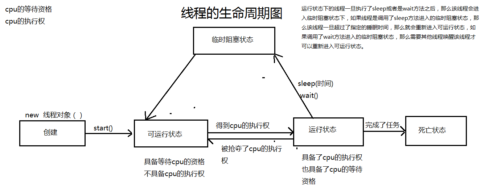

## 进程和线程

`进程`：正在执行的程序称作为一个进程。进程负责了内存空间的划分。

+ 每个进程有独立的内存空间线程（ Thread）：进程的执行单元（CPU 调度和分派的基本单位），线程之间共享堆空间，每个线程有独立的`栈空间`（共享父进程中的共享变量及部分环境）
+ `并发`（concurrency）：多条指令在多个处理器上同时执行
+ `并行`（ parallel）：多个进程指令被**快速轮换**执行
+ 进程的属性
  + 动态性
    + 一次执行过程、有生命周期、创建/调度/等待
  + 共享性
    + 同一程序同时运行于不同数据集合上时，构成不同进程
    + 进程和程序不是一一对应的
  + 独立性
    + 独立实体，有自己的虚存空间、程序计数器和内部状态
  + 制约性
    + 共享资源或协同工作，产生相互制约关系，必须对进程的执行次序，或相对执行速度加以协调
  + 并发性
    + 多个进程的执行在时间上可以重叠
    + 在多处理器环境中可并行执行
+ 进程`通信`方式：
  + 管道（pipe）、有名管道（named pipe）
  + 信号量（semophore）
  + 消息队列（message queue）
  + 信号（sinal）
  + 共享内存（shared memory）
  + 套接字（socket）


`线程`：线程在一个进程中负责了代码的执行，就是进程中一个执行路径，一个线程不能独立的存在，它必须是进程的一部分。一个进程一直运行，直到所有的`非守护线程`都结束运行后才能结束。

+ 线程调度：**JVM** 负责线程的调度，采用的是**抢占式调度**，而不是分时调度

+ Java 程序运行时至少启动了 `2` 个线程：主线程 `main`、`垃圾回收`线程（后台线程）

+ 多线程是为了同步完成多项任务，不是为了提高程序运行效率，而是通过**提高资源使用效率**来提高系统的效率

+ 多线程的好处：

  + 解决了一个进程能同时执行多个任务的问题。
  + 提高了`资源的利用率`。

+ 多线程的弊端：

  + 增加cpu的负担。
  + 降低了一个进程中线程的执行概率。
  + 引发了线程安全问题。
  + 出现了死锁现象。

  

> 一个java应用程序至少有几个线程？
>
> + `至少有两个线程`， 一个是主线程负责`main方法`代码的执行，一个是`垃圾回收器线程`,负责了回收垃圾。


## 同步 异步 阻塞 非阻塞

- 同步/异步：数据如果尚未就绪，是否需要等待数据结果
- 阻塞/非阻塞：进程/线程需要操作的数据如果尚未就绪，是否妨碍了当前进程/线程的后续操作
- 同步与异步
  - 同步和异步关注的是**消息通信机制**（synchronous communication/ asynchronous communication）
  - 所谓同步，就是在发出一个调用时，**在没有得到结果之前，该调用就不返回**，但是一旦调用返回，就得到返回值了。换句话说，就是由调用者主动等待这个调用的结果
  - 而异步则是相反，调用在发出之后，**这个调用就直接返回了**，所以没有返回结果。换句话说，当一个异步过程调用发出后，调用者不会立刻得到结果，而是在调用发出后，被调用者通过状态、通知来通知调用者，或通过回调函数处理这个调用
- 线程阻塞与非阻塞
  - 阻塞和非阻塞关注的是程序在等待调用结果（消息，返回值）时的**状态**
  - 阻塞调用是指调用结果返回之前，当前线程会被挂起，调用线程只有在得到结果之后才会返回
  - 非阻塞调用指在不能立刻得到结果之前，该调用不会阻塞当前线程

[书栈网](https://www.bookstack.cn/read/sdky-java-note/fe65c7aeb76516e3.md)


## 生命周期(五态模型)

线程是一个`动态`执行的过程，它也有一个从产生到死亡的过程。

+ 新建状态:

  + 使用 new 关键字和 Thread 类或其子类建立一个线程对象后，该线程对象就处于新建状态。它保持这个状态直到程序 start() 这个线程。

+ 就绪状态:

  + 当线程对象调用了start()方法之后，该线程就进入就绪状态。就绪状态的线程处于就绪队列中，要等待JVM里线程调度器的调度。

+ 运行状态:

  + 如果就绪状态的线程获取 CPU 资源，就可以执行 run()，此时线程便处于运行状态。处于运行状态的线程最为复杂，它可以变为阻塞状态、就绪状态和死亡状态。

+ 阻塞状态:

  + 如果一个线程执行了sleep（睡眠）、suspend（挂起）等方法，失去所占用资源之后，该线程就从运行状态进入阻塞状态。在睡眠时间已到或获得设备资源后可以重新进入就绪状态。可以分为三种：

    + 等待阻塞：运行状态中的线程执行 wait() 方法，使线程进入到等待阻塞状态。

    + 同步阻塞：线程在获取 synchronized 同步锁失败(因为同步锁被其他线程占用)。

    + 其他阻塞：通过调用线程的 sleep() 或 join() 发出了 I/O 请求时，线程就会进入到阻塞状态。当sleep() 状态超时，join() 等待线程终止或超时，或者 I/O 处理完毕，线程重新转入就绪状态。

+ 死亡状态:

  + 一个运行状态的线程完成任务或者其他终止条件发生时，该线程就切换到终止状态。




当线程处于就绪状态后，可以用如下几种方法使线程再次进入运行状态。

+ 线程调用 notify() 方法。
+ 线程调用 notifyAll() 方法。
+ 线程调用 intermpt() 方法。
+ 线程的休眠时间结束。
+ 输入或者输出结束。


> 进程运行模型
>
> * 三 态模型
>   + 运行态（占用CPU）
>   + 就绪态（等待CPU）
>   + 等待态（等待事件）
> * 五态模型
>   + 新建态
>   + 就绪态
>   + 运行态
>   + 等待态
>   + 终止态（死亡）
> * 七态模型
>   + 五态模型之上增加
>     + 挂起就绪态
>     + 挂起等待态
>   + 挂起状态引入原因
>     + 为了让某些进程暂时不参与低级调度，释放它占有的资源，以平滑系统负荷


## 进程的创建和启动

- `Runtime` 类中的 exec 方法，如 `Runtime.getRuntime().exec("notepad");`
- `ProcessBuilder` 类中的 start 方法，如 `new ProcessBuilder("notepad").start();`


### Thread的构造器和方法

一个 Thread

+ **实现了 Runnable 接口**

- 所有的线程对象都必须是 **Thread 类或其子类**的实例
- 构造器
  - `Thread()`
  - `Thread(Runnable target)`
  - `Thread(String name)`
  - `Thread(Runnable target, String name)`
  - Thread(ThreadGroup group, Runnable target, String name)：在指定的线程组中创建线程

+ 类方法
  - `Thread currentThread()`：返回当前正在执行的线程对象
  - `void sleep(long millis)`：让当前正在执行的线程暂停 millis 毫秒，并进入**阻塞状态**（线程睡眠）（该方法声明抛出了 InterruptedException 异常）
  - `void yield()`：暂停当前正在执行的线程对象，转入**就绪状态**（线程让步）

+ 实例方法
  - `void start()`：使该线程开始执行，Java 虚拟机**调用该线程的 run 方法**，只能被处于新建状态的线程调用，否则会引发 IllegalThreadStateException 异常
  - `void run()`：如果该线程是使用独立的 Runnable 运行对象构造的，则调用该 Runnable 对象的 run 方法；否则，该方法不执行任何操作并返回
  - `void setName(String name)`：为线程设置名字，在默认情况下，主线程的名字为 main，用户启动的多个线程的名字依次为 Thread-0、Thread-1、Thread-2、…、Thread-n 等
  - `String getName()`：返回调用该方法的线程名字
  - `void join()`：等待**调用该方法的线程**执行完成，而当前正在执行的线程进入阻塞状态（联合线程）（该方法声明抛出了 InterruptedException 异常）
  - `void setDaemon(boolean on)`：on为"`true`"时，将该线程设置成`守护线程`，该方法必须在 `start() 之前`调用，否则会引发 IllegalThreadStateException 异常
  - `boolean isDaemon()`：判断该线程是否为守护线程
  - `int getPriority()`：返回线程的优先级
  - `void setPriority(int newPriority)`：更改线程的优先级（范围是 1~10 之间）
  - `boolean isAlive()`：测试线程是否处于活动状态


### 继承 Thread 类

继承 Thread 类创建线程类步骤

1. 自定义一个类继承Thread类。
2. 重写Thread类的run方法 , 把自定义线程的任务代码写在run方法中
3. 创建Thread的子类对象，并且调用start方法开启线程。

> 疑问： 重写run方法的目的是什么？  
>
> 每个线程都有自己的任务代码，jvm创建的主线程的任务代码就是main方法中的所有代码, 自定义线程的任务代码就写在run方法中，自定义线程负责了run方法中代码。

> 注意：一个线程一旦开启，那么线程就会执行`run`方法中的代码，run方法`不能直接调用`，直接调用run方法就相当调用了一个普通的方法而已并没有开启新的线程。

Thread类 本质上也是实现了 `Runnable` 接口的一个实例。

使用继承 Thread 类的方法来创建线程类时，多个线程之间**无法共享**线程类的实例变量

```java
// 定义 Thread 类的子类
public class MyThread extends Thread {
    // 重写 Thread 类中的 run() 方法，线程执行体
    public void run() {
    }
}

public class Demo {
    public static void main(String[] args) {                
        Thread t = new MyThread(); // 创建 Thread 子类的对象
        t.start(); // 调用线程对象的 start() 方法来启动该线程
    }
}

// 使用匿名内部类的方式创建
new Thread() {
    public void run() {
    }
}.start();
```


```java
public class Demo extends Thread {

	@Override  // 把自定义线程的任务代码写在run方法中。
	public void run() {
		for(int i  = 0 ; i < 100 ; i++){
			System.out.println("自定义线程："+i);
		}
	}

	public static void main(String[] args) {
		// 创建了自定义的线程对象。
		Demo d = new Demo();
		// 调用start方法启动线程
		d.start();
		
		for(int i  = 0 ; i < 100 ; i++){
			System.out.println("main线程："+i);
		}
	}
}
```

```java
/*
  需求： 模拟QQ视频与聊天同时在执行。
 */

class TalkThread extends Thread{

	@Override
	public void run() {
		while(true){
			System.out.println("hi，你好！开视频呗...");
		}
	}
}

class VideoThread extends Thread{

	@Override
	public void run() {
		while(true){
			System.out.println("视频视频....");
		}
	}
}

public class Demo {
	public static void main(String[] args) {
		TalkThread talkThread = new TalkThread();
		talkThread.start();
		VideoThread videoThread = new VideoThread();
		videoThread.start();
	}
}
```


### 实现 Runnable 接口

实现 Runnable 接口创建多线程步骤

1. 自定义一个类实现Runnable接口。
2. 实现Runnable接口 的run方法，把自定义线程的任务定义在run方法上。
3. 创建Runnable实现类对象。
4. 创建Thread类的对象，并且把Runnable实现类的对象作为实参传递。
5. 调用Thread对象的start方法开启一个线程。

采用 Runnable 接口的方式创建的多个线程可以**共享**同一个 target 对象的**实例变量**

> 问题：请问Runnable实现类的对象是线程对象吗？
> Runnable实现类的对象并不是一个线程对象，只不过是实现了Runnable接口的对象而已。
> 只有是Thread或者是Thread的子类才是线程对象。

> 问题：为什么要把Runnable实现类的对象作为实参传递给Thread对象呢？作用是什么？
> 作用就是把Runnable实现类的对象的run方法作为了线程的任务代码去执行了。

> 推荐：  实现Runable接口创建多线的。
> 原因： 因为java单继承 ,多实现的。

```java
// Thread类 的run方法
@Override
public void run() {
	if (target != null) {
		target.run();  // 就相当于Runnable实现类的对象的run方法作为了Thread对象的任务代码了。
	}
}
```

```java

public class Demo implements Runnable{

	@Override
	public void run() {
		// System.out.println("this："+ this);
		System.out.println("当前线程："+ Thread.currentThread());
		for(int i = 0 ; i < 100 ; i++){
			System.out.println(Thread.currentThread().getName()+":"+i);
		}
	}

	public static void main(String[] args) {

		// 创建Runnable实现类的对象
		Demo d = new Demo();
		// 创建Thread类的对象， 把Runnable实现类对象作为实参传递。
		Thread thread = new Thread(d,"狗娃");  // Thread类使用Target变量记录了d对象，
		// 调用thread对象的start方法开启线程。
		thread.start();
		
		for(int i = 0 ; i < 100 ; i++){
			System.out.println(Thread.currentThread().getName()+":"+i);
		}
	}
}
```


### 使用 Callable 和 FutureTask

Callable 和 Future 创建线程步骤

1. 创建 `Callable` 接口的实现类，并实现 `call()` 方法，该 call() 方法将作为线程执行体，并且有返回值。
2. 创建 Callable 实现类的实例，使用 `FutureTask` 类来包装 Callable 对象，该 FutureTask 对象封装了该 Callable 对象的 call() 方法的返回值。
3. 使用 FutureTask 对象作为 `Thread` 对象的 `target` 创建并启动新线程。
4. 调用 FutureTask 对象的 `get()` 方法来获得子线程执行结束后的返回值。


`Callable<V>` 接口

- Callable 接口提供了一个 `call()` 方法（可以有返回值，可以声明抛出异常）可以作为**线程执行体**，Callable 接口里的泛型形参类型与 call() 方法返回值类型相同
- `V call()`：计算结果，如果无法计算结果，则抛出一个异常


`Future<V>` 接口

- Future 接口代表 Callable 接口里 call() 方法的`返回值`，表示异步计算的结果
- Future 接口的常用方法
  + `V get()`：返回 Callable 任务里 call() 方法的返回值
    + 如果计算抛出异常将会抛出 ExecutionException 异常
    + 如果当前的线程在等待时被中断将会抛出 InterruptedException 异常（调用该方法将导致程序阻塞，必须等到子线程结束后才会得到返回值）
  + `V get(long timeout, TimeUnit unit)`：返回 Callable 任务里 call() 方法的返回值，该方法让程序最多阻塞 timeout 和 unit 指定的时间，如果经过指定时间后 Callable 任务依然没有返回值，将会抛出 TimeoutException 异常
  + `boolean cancel(boolean maylnterruptlfRunning)`：试图取消该 Future 里关联的 Callable 任务
  + `boolean isCancelled()`：如果在 Callable 任务正常完成前被取消，则返回 true
  + `boolean isDone()`：如果 Callable 任务已完成，则返回 true


`FutureTask<V>` 类

- FutureTask 实现类**实现**了 `RunnableFuture` 接口（RunnableFuture 接口继承了 **Runnable 接口和Future** 接口）
- 构造器：
  + FutureTask(Callable callable)
  + FutureTask(Runnable runnable, V result)（指定成功完成时 get 返回给定的结果为 result）

```java
// 使用 Lambda 表达式创建 Callable<V> 接口的实现类，并实现 Call() 方法
// 使用 FutureTask 来包装 Callable 对象，该 FutureTask 对象封装了该 Callable 对象的 call() 方法的返回值
FutureTask<Integer> task = new FutureTask<Integer>((Callable<Integer>) () -> {
    // call() 方法可以有返回值
    return 100;
});
// 将 FutureTask 对象作为 Thread 对象的 target 创建并启动新线程
new Thread(task, "线程名").start();

try {
    // 调用 FutureTask 对象的 get() 方法来获得子线程执行结束后的返回值，在最多等待 1 秒之后退出
    System.out.println("子线程的返回值：" + task.get(1, TimeUnit.SECONDS));
} catch (Exception e) {
    e.printStackTrace();
}
```


```java
public class CallableThreadTest implements Callable<Integer> {
    public static void main(String[] args)  {  

        CallableThreadTest ctt = new CallableThreadTest();  
        FutureTask<Integer> ft = new FutureTask<>(ctt);

        for(int i = 0;i < 100;i++)  {  
            System.out.println(Thread.currentThread().getName()+" 的循环变量i的值"+i);  
            if(i==20){  
                new Thread(ft,"有返回值的线程").start();  
            }  
        }  
        try {
            System.out.println("子线程的返回值："+ft.get());  
        } catch (InterruptedException e) {  
            e.printStackTrace();  
		} catch (ExecutionException e) {  
            e.printStackTrace();  
        }  
  
    }
    
    @Override  
    public Integer call() throws Exception {  
        int i = 0;  
        for(;i<100;i++) {  
            System.out.println(Thread.currentThread().getName()+" "+i);  
        }  
        return i;  
    }  
}
```


### 创建线程的三种方式对比

- 继承 Thread 类
  - 线程类已经继承了 Thread 类，不能再继承其它父类
  - 如果需要访问当前线程，直接使用 this 即可获得当前线程
  - 多个线程之间**无法共享线程类中的实例变量**
- 实现 Runnable、Callable 接口的方式创建多线程
  - 线程类只是实现了 Runnable 接口，还可以继承其它类
  - 如果需要访问当前线程，则必须使用 `Thread. currentThread()` 方法
  - 所创建的 Runnable 对象只是**线程的 target**，而多个线程**可以共享同一个 target 对象的实例变量**，所以适合多个相同线程来处理同一份资源的情况


## 线程同步

- 原子操作（atomic operation）：不可被中断的一个或一系列操作
- **只需要**对那些**会改变共享资源的、不可被中断的操作**进行同步即可
- 保证在任一时刻只有一个线程可以进入修改共享资源的代码区，其它线程只能在该共享资源对象的**锁池**中等待获取锁
- 在 Java 中，每一个对象都拥有一个锁标记（monitor），也称为`监视器`
- 线程开始执行同步代码块或同步方法之前，必须先获得对同步监视器的锁定才能进入同步代码块或者同步方法进行操作
- 当前线程释放同步监视器：当前线程的同步代码块或同步方法执行结束，遇到 `break` 或 `return` 语句，出现了未处理的 Error 或 Exception，执行了同步监视器对象的 `wait()` 方法或 `Thread.join()` 方法
- 当前线程**不会**释放同步监视器：当前线程的同步代码块或同步方法中调用 `Thread. sleep()`、`Thread.yield()` 方法其它线程调用了该线程的 suspend() 方法


## 线程安全

线程安全出现的根本原因：

+ 存在两个或者两个以上的线程对象`共享同一个资源`。
+ 多线程操作共享资源的代码有多句。

线程安全保证

+ 保证多线程环境下共享的、可修改的状态的正确性
+ 线程安全需要保证几个基本特性：
  - 原子性，简单说就是相关操作不会中途被其他线程干扰，一般通过同步机制实现
  - 可见性，是一个线程修改了某个共享变量，其状态能够立即被其他线程知晓，通常被解释为将线程本地状态反映到主内存上，volatile 就是负责保证可

线程安全问题的解决方案:

+ `同步代码块`: `synchronized(锁对象){ 需要被同步的代码 }`
+ ``同步函数`  ： 同步函数就是使用`synchronized`修饰一个函数。
+ `Lock同步锁`：给临界临界资源加锁等。

### 同步代码块

格式：

```java
synchronized(锁对象){
	// 需要被同步的代码
}
```

同步代码块要注意的事项：

+ 锁对象可以是任意的一个对象。
+ 一个线程在同步代码块中sleep了，并不会释放锁对象。
+ 如果不存在着线程安全问题，千万不要使用同步代码块，因为会降低效率。
+ 锁对象必须是多线程共享的一个资源，否则锁不住。

> 通常推荐使用可能被并发访问的**共享资源**作为同步监视器

```java
class SaleTicket extends Thread{
	 // 票数 非静态的成员变量,非静态的成员变量数据是在每个对象中都会维护一份数据的。
	 static int num = 50; 
	 
     static	Object o = new Object();

	 public SaleTicket(String name) {
		super(name);
	}

	@Override
	public void run() {
		while(true){
			// 同步代码块
			synchronized ("锁") {
				if(num>0){
					System.out.println(Thread.currentThread().
                                       getName()+"售出了第"+num+"号票");
					try {
						Thread.sleep(100);
					} catch (InterruptedException e) {
						e.printStackTrace();
					}
					num--;
				}else{
					System.out.println("售罄了..");
					break;
				}
			}

		}
	}
}

public class Demo {
	public static void main(String[] args) {
		//创建三个线程对象，模拟三个窗口
		SaleTicket thread1 = new SaleTicket("窗口1");
		SaleTicket thread2 = new SaleTicket("窗口2");
		SaleTicket thread3 = new SaleTicket("窗口3");
		//开启线程售票
		thread1.start();
		thread2.start();
		thread3.start();
	}
}

// ------------------------------------------------------------------------


class SaleTicket implements Runnable{

	int  num = 50; // 票数

	@Override
	public void run() {
		while(true){
			synchronized ("锁") {
				if(num>0){
					System.out.println(Thread.currentThread().
                                       getName()+"售出了第"+ num+"号票");
					num--;
				}else{
					System.out.println("售罄了..");
					break;
				}
			}
		}		
	}
}

public class Demo {
	public static void main(String[] args) {
		// 创建了一个Runnable实现类的对象
		SaleTicket saleTicket = new SaleTicket();
		//创建三个线程对象模拟三个窗口
		Thread thread1 = new Thread(saleTicket,"窗口1");
		Thread thread2 = new Thread(saleTicket,"窗口2");
		Thread thread3 = new Thread(saleTicket,"窗口3");
		//开启线程售票
		thread1.start();
		thread2.start();
		thread3.start();
	}
}

```


### 同步方法

`同步函数` : 就是使用`synchronized`修饰一个函数。就相当于**给调用该方法的对象**加锁

+ 如果是一个非静态的同步函数的锁对象是`this`对象
+ 如果是静态的同步函数的锁对象是当前函数所属的类的`字节码文件`（class对象， 如ArrayUtil.class）。
+ 同步函数的锁对象是固定的，不能由你来指定的。

> 推荐使用： 同步代码块。
> 原因：
>
> + 同步代码块的锁对象可以随意指定，方便控制。同步函数的锁对象是固定的，不能由我们来指定。
> + 同步代码块可以很`方便控制需要被同步代码的范围`，同步函数必须是`整个函数的所有代码都被同步`了。

```java

class BankThread extends Thread{
	static int count = 5000;

	public BankThread(String name){
		super(name);
	}

	@Override  
	public synchronized  void run() {
		while(true){
			synchronized ("锁") {
				if(count>0){
					System.out.println(Thread.currentThread().
                               getName()+"取走了1000块,还剩余"+(count-1000)+"元");
					count= count - 1000;
				}else{
					System.out.println("取光了...");
					break;
				}
			}
		}
	}

	// 静态的函数---->函数所属的类的字节码文件对象---> BankThread.class  唯一的。
	public static synchronized  void getMoney(){
		
	}
}

public class Demo {
	public static void main(String[] args) {
		//创建两个线程对象
		BankThread thread1 = new BankThread("老公");
		BankThread thread2 = new BankThread("老婆");
		//调用start方法开启线程取钱
		thread1.start();
		thread2.start();
	}
}
```


### 同步锁（Lock）

- java.util.concurrent.locks 包中，`Lock` 替代了 synchronized 方法和语句的使用
- Lock 接口的实现允许锁在不同的作用范围内获取和释放，并允许以任何顺序获取和释放多个锁
- 常用的实现类 `ReentrantLock`（可重入锁）：java.util.concurrent.locks 包中，通常建议**使用 finally 块来确保在必要时释放锁**ReentrantLock 是可重入锁：**当前持有该锁的线程能够多次获取该锁**，无需等待（可以在递归算法中使用锁）

```java
class Apple implements Runnable {
    private int num = 50;
    private final Lock lock = new ReentrantLock();
    public void run() {
        while (num > 0) {
            lock.lock();
            try {
                if (num > 0) {
                    System.out.println(Thread.currentThread().
                                       getName() + " 吃了编号为 " + num-- + " 的苹果");
                }
            } finally {
                lock.unlock();
            }
        }
    }
}
```


### Lock 和 synchronized 的选择

- Lock 是一个接口，而 synchronized 是 Java 中的关键字，synchronized 是内置的语言实现
- synchronized 在发生异常时，会自动释放线程占有的锁，因此不会导致死锁现象发生；而 Lock 在发生异常时，如果没有主动通过 unLock 去释放锁，则很可能造成死锁现象，因此使用 Lock 时需要在 finally 块中释放锁
- Lock 可以让等待锁的线程响应中断，而 synchronized 却不行，使用 synchronized 时，等待的线程会直等待下去，不能够响应中断
- 通过 Lock 可以知道有没有成功获取锁，而 synchronized 却无法办到
- Lock 可以提高多个线程进行读操作的效率
- 在性能上来说，如果竞争资源不激烈，两者的性能是差不多的，而当竞争资源非常激烈时（即有大量线程同时竟争），此时 Lock 的性能要远远优于 synchronized。所以说，在具体使用时要根据适当情况选择


## 死锁现象

java中同步机制解决了线程安全问题，但是也同时引发`死锁`现象。

死锁现象出现 的根本原因：

+ 存在两个或者两个以上的线程。
+ 存在两个或者两个以上的共享资源。

> 死锁现象的解决方案： 没有方案。只能尽量避免发生而已。

```java
class DeadLock extends Thread{
	public DeadLock(String name){
		super(name);
	}

	public void run() {
		if("张三".equals(Thread.currentThread().getName())){
			synchronized ("遥控器") {
				System.out.println("张三拿到了遥控器，准备 去拿电池!!");
				synchronized ("电池") {
					System.out.println("张三拿到了遥控器与电池了，开着空调爽歪歪的吹着...");
				}
			}
		}else if("狗娃".equals(Thread.currentThread().getName())){
			synchronized ("电池") { 
				System.out.println("狗娃拿到了电池，准备去拿遥控器!!");
				synchronized ("遥控器") {
					System.out.println("狗娃拿到了遥控器与电池了，开着空调爽歪歪的吹着...");
				}
			}
		}
	}
}

public class Demo {
	public static void main(String[] args) {

		DeadLock thread1 = new DeadLock("张三");
		DeadLock thread2 = new DeadLock("狗娃");
		//开启线程
		thread1.start();
		thread2.start();
	}
}
```


## 线程通讯

线程通讯： 一个线程完成了自己的任务时，要通知另外一个线程去完成另外一个任务.


使用 Object 类中的方法

+ **Object 类**中用于操作线程通信的实例方法
  + `wait()`：调用该方法的当前线程会**释放**对**该同步监视器**（调用者）的锁定，JVM 把该线程存放到**等待池**中，等待其他的线程唤醒该线程（该方法声明抛出了 InterruptedException 异常）（为了防止虚假唤醒，此方法**应始终在循环中使用**，即被唤醒后需要再次判断是否满足唤醒条件）
  + `notify()`：调用该方法的当前线程唤醒在等待池中的任意一个线程，并把该线程转到**锁池**中等待获取锁
  + `notifyAll()`：调用该方法的当前线程唤醒在等待池中的所有线程，并把该线程转到**锁池**中等待获取锁
+ 这些方法必须在同步块中使用，且只能被**同步监视器对象**来调用，否则会引发 IllegalMonitorStateException 异常


wait与notify方法要注意的事项：

+ wait方法与notify方法是属于Object对象的。
+ wait方法与notify方法必须要在`同步代码块`或者是`同步函数`中才能使用。
+ wait方法与notify方法必需要由`锁对象`调用。


生产者与消费者

```java
//产品类
class Product{
	String name;  //名字
	double price;  //价格
	boolean flag = false; //产品是否生产完毕的标识，默认情况是没有生产完成。
}

//生产者
class Producer extends Thread{
	Product  p ;  	//产品
	public Producer(Product p) {
		this.p  = p ;
	}

	@Override
	public void run() {
		int i = 0 ;
		while(true){
		 synchronized (p) {

			if(p.flag==false){
				 if(i%2==0){
					 p.name = "苹果";
					 p.price = 6.5;
				 }else{
					 p.name="香蕉";
					 p.price = 2.0;
				 }

				 System.out.println("生产者生产出了："+ p.name+" 价格是："+ p.price);

				 p.flag = true;
				 i++;

				 p.notifyAll(); //唤醒消费者去消费
			}else{
				//已经生产 完毕，等待消费者先去消费
				try {
					p.wait();   //生产者等待
				} catch (InterruptedException e) {
					e.printStackTrace();
				}
			}
		}
	  }
	}
}

//消费者
class Customer extends Thread{
	Product p;
	public  Customer(Product p) {
		this.p = p;
	}

	@Override
	public void run() {
		while(true){
			synchronized (p) {

				if(p.flag==true){  //产品已经生产完毕

					System.out.println("消费者消费了"+p.name+" 价格："+ p.price);
					p.flag = false;

					p.notifyAll(); // 唤醒生产者去生产

				}else{
					//产品还没有生产,应该 等待生产者先生产。
					try {
						p.wait(); //消费者也等待了...
					} catch (InterruptedException e) {
						e.printStackTrace();
					}
				}
			}
		}
	}
}

public class Demo {
	public static void main(String[] args) {

		Product p = new Product();  //产品
		//创建生产对象
		Producer producer = new Producer(p);
		//创建消费者
		Customer customer = new Customer(p);
		//调用start方法开启线程
		producer.start();
		customer.start();
		
	}
}
```


使用 Condition 接口中的方法

- java.util.concurrent.locks 包中，Condition 接口中的 `await()`、`signal()`、`signalAll()` 方法替代了 Object 监视器方法的使用（await() 方法也声明抛出了 InterruptedException 异常）
- 通过 **Lock 对象**调用 newCondition() 方法，返回绑定到此 Lock 对象的 Condition 对象

```java
publicclassShareResource{
    // 创建使用 private final 修饰的锁对象
    privatefinalLocklock=newReentrantLock();
    // 获得指定 Lock 对象对应的 Condition
    privatefinalCondition cond =lock.newCondition();
    // 标识数据是否为空（初始状态为空）
    privateboolean empty =true;
    
    // 需要同步的方法
    public void doWork(){
    	lock.lock();// 进入方法后，立即获取锁
    	try{
    		while(!empty){// 判断是否方法阻塞
                    cond.await();
    	}
   		 	... // TODO
            empty =false;// 修改标识
            cond.signalAll();// 通知其它线程
   		 }catch(InterruptedException e){
                e.printStackTrace();
   		 }finally{
    		lock.unlock();// 使用 finally 块释放锁
    	}
    }
}
```


## 线程的停止


## 守护线程（后台线程）

- 后台线程 / 守护线程 / 精灵线程（Daemon Thread）
- 在后台运行，为其它线程提供服务的线程，如 垃圾回收线程
- 特征：如果所有的前台线程都死亡，后台线程会自动死亡
- 前台线程创建的子线程默认是前台线程，后台线程创建的子线程默认是后台线程
-  一个线程默认都不是守护线程。
- `setDaemon()` 设置线程是否为守护线程，true为守护线程， false为非守护线程。
- `isDaemon()`  判断线程是否为守护线程。

```java

public class Demo extends Thread {
	public Demo(String name){
		super(name);
	}

	@Override
	public void run() {
		for(int i = 1 ; i<=100 ; i++){
			System.out.println("更新包目前下载"+i+"%");
			if(i==100){
				System.out.println("更新包下载完毕,准备安装..");
			}
			try {
				Thread.sleep(100);
			} catch (InterruptedException e) {
				e.printStackTrace();
			}
		}
	}

	public static void main(String[] args) {
		
		 Demo d = new Demo("后台线程");
        // setDaemon() 设置线程是否为守护线程，true为守护线程， false为非守护线程。
		d.setDaemon(true); 
		System.out.println("是守护线程吗？"+ d.isDaemon()); //判断线程是否为守护线程。
		d.start();

		for(int i = 1 ; i<=100 ; i++){
			System.out.println(Thread.currentThread().getName()+":"+i);
		}
	}
}
```


## join方法

一个线程如果执行join语句，那么就有新的线程加入，执行该语句的线程必须要让步给新加入的线程先完成任务，然后才能继续执行。

```java
//老妈
class  Mon extends Thread{
	public void run() {

		System.out.println("妈妈洗菜");
		System.out.println("妈妈切菜");
		System.out.println("妈妈准备炒菜，发现没有酱油了..");

		//叫儿子去打酱油
		Son s= new Son();
		s.start();

		try {
			s.join();  //加入。
		} catch (InterruptedException e) {
			e.printStackTrace();
		}
		
		System.out.println("妈妈继续炒菜");
		System.out.println("全家一起吃饭..");		
	}
}

class Son extends Thread{

	@Override
	public void run() {
		System.out.println("儿子下楼..");

		try {
			Thread.sleep(1000);
		} catch (InterruptedException e) {
			e.printStackTrace();
		}

		System.out.println("儿子一直往前走");
		System.out.println("儿子打完酱油了");
		System.out.println("上楼，把酱油给老妈");
	}
}

public class Demo {
	public static void main(String[] args) {

		Mon m = new Mon();
		m.start();
	}
}
```


## ThreadLocal

- 代表一个线程局部变量

- 当运行于多线程环境的某个对象使用 ThreadLocal 维护变量时，ThreadLocal **为每一个使用该变量的线程分配一个独立的变量副本**，从而解决多线程中对同一变量的访问冲突

- 其实现的思路：在 ThreadLocal 类中有一个静态内部类 ThreadLocalMap，用于存储每个线程的变量副本，Map 中元素的 key 为线程对象，value 为对应线程的变量副本

- 构造器：`ThreadLocal<T>()`：创建一个线程局部变量，ThreadLocal 对象建议使用 static 修饰（这个变量是一个线程内所有操作共有的）

- 实例方法

  + `protected T initialValue()`：返回此线程局部变量的当前线程的“初始值”
  + `T get()`：返回此线程局部变量中当前线程副本中的值
  + `void remove()`：移除此线程局部变量中当前线程的值
  + `void set(T value)`：设置此线程局部变量中当前线程副本中的值

  ```java
  privatestaticfinalThreadLocal<DateFormat> 
  					sdfThreadLocal = new ThreadLocal<DateFormat>(){
      @Override
      protected DateFormat initialValue(){
          returnnewSimpleDateFormat("yyyy-MM-dd");
      }
  };
  ThreadLocal<DateFormat> sdfThreadLocal =ThreadLocal.withInitial(
  					()->newSimpleDateFormat("yyyy-MM-dd")
  );
  ```

> 同步机制与 ThreadLocal
>
> - 如果多个线程之间**需要共享资源**，以达到线程之间的通信功能，就使用同步机制
> - 如果仅仅需要**隔离多个线程之间的共享冲突**，则可以使用 ThreadLocal

