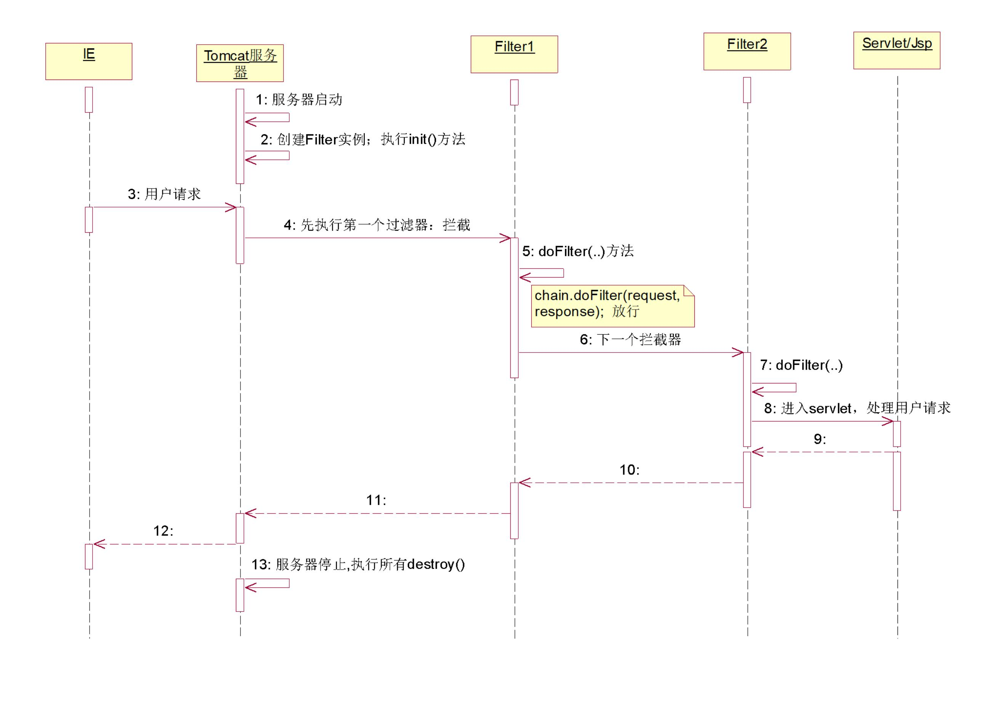

## 基本概念

过滤器 `Filter`

- 用于对用户请求进行预处理，也可以对 HttpServletResponse 进行后处理
- 在服务器启动时创建 Filter 实例并执行初始化，创建或销毁顺序由在 web.xml 中配置的 的先后顺序决定
- 过滤器链：过滤顺序由在 web.xml 中配置的 的先后顺序决定


过滤器，设计执行流程：

1. 用户访问服务器
2. 过滤器： 对Servlet请求进行拦截
3. 先进入过滤器， 过滤器处理
4. 过滤器处理完后， 在放行， 此时，请求到达Servlet/JSP
5. Servlet处理
6. Servlet处理完后，再回到过滤器, 最后在由tomcat服务器相应用户


## Filter 相关Api

```java
|-- interface  Filter	过滤器核心接口
	Void init(filterConfig);                       初始化方法，在服务器启动时候执行
	Void doFilter(request,response,filterChain);   过滤器拦截的业务处理方法
	Void destroy();                                销毁过滤器实例时候调用

|-- interface  FilterConfig   获取初始化参数信息
	String	getInitParameter(java.lang.String name) 
	Enumeration	getInitParameterNames() 

|-- interface  FilterChain     过滤器链参数；一个个过滤器形成一个执行链；
	void doFilter(ServletRequest request, ServletResponse response);  执行下一个过滤器或放行
```


## 创建 Filter 的步骤

1. 写一个普通java类，实现Filter接口

```java
/**
 * 过滤器，测试
 */
public class HelloFilter implements Filter{
	
	// 创建实例
	public HelloFilter(){
		System.out.println("1. 创建过滤器实例");
	}

	@Override
	public void init(FilterConfig filterConfig) throws ServletException {
        
		System.out.println("2. 执行过滤器初始化方法");
		
		// 获取过滤器在web.xml中配置的初始化参数
		String encoding = filterConfig.getInitParameter("encoding");
		System.out.println(encoding);
		
		// 获取过滤器在web.xml中配置的初始化参数 的名称
		Enumeration<String> enums =  filterConfig.getInitParameterNames();
		while (enums.hasMoreElements()){
			// 获取所有参数名称：encoding、path
			String name = enums.nextElement();
			// 获取名称对应的值
			String value = filterConfig.getInitParameter(name);
			System.out.println(name + "\t" + value);
		}
	}

	// 过滤器业务处理方法： 在请求到达servlet之前先进入此方法处理公用的业务逻辑操作
	@Override
	public void doFilter(ServletRequest request, ServletResponse response,
			FilterChain chain) throws IOException, ServletException {
        
		System.out.println("3. 执行过滤器业务处理方法");
		// 放行 (去到Servlet)
		// 如果有下一个过滤器，进入下一个过滤器，否则就执行访问servlet
		chain.doFilter(request, response);
		
		System.out.println("5. Servlet处理完成，又回到过滤器");
	}

	@Override
	public void destroy() {
		System.out.println("6. 销毁过滤器实例");
	}
}
```

2. 配置过滤器

```xml
<!-- 过滤器配置 -->
<filter>
    <!-- 配置初始化参数 -->
    <init-param>
        <param-name>encoding</param-name>
        <param-value>UTF-8</param-value>
    </init-param>
    <init-param>
        <param-name>path</param-name>
        <param-value>c:/...</param-value>
    </init-param>

    <!-- 内部名称 -->
    <filter-name>hello_filter</filter-name>
    <!-- 过滤器类的全名 -->
    <filter-class>cn.ixfosa.filter.HelloFilter</filter-class>
</filter>
<filter-mapping>
    <!-- filter内部名称 -->
    <filter-name>hello_filter</filter-name>
    <!-- 拦截所有资源 -->
    <url-pattern>/*</url-pattern>
</filter-mapping>
```


## 过滤器执行流程




## 对指定的请求拦截

```xml
<!-- /* 表示拦截所有的请求      -->                                 |
<filter-mapping>	
    <filter-name>hello_filter2</filter-name>	
    <url-pattern>/*</url-pattern>
</filter-mapping> 

<!-- 默认拦截的类型：(直接访问或者重定向) -->
<dispatcher>REQUEST</dispatcher>

<!-- 拦截转发 -->
<dispatcher>FORWARD</dispatcher>

<!-- 拦截包含的页面(RequestDispatcher.include(/page.jsp);对page.jsp也执行拦截) -->
<dispatcher>INCLUDE</dispatcher>

<!-- 拦截声明式异常信息 -->
<dispatcher>ERROR</dispatcher>
```

> 默认情况下，Filter 只会对新的请求做拦截 REQUEST，如果是请求转发，则不会过滤

```java
public class HelloFilter2 implements Filter{

	@Override
	public void doFilter(ServletRequest request, ServletResponse response,
			FilterChain chain) throws IOException, ServletException {
        
		System.out.println("第二个过滤器");
		// 放行
		chain.doFilter(request, response);
		System.out.println("第二个过滤器执行结束");
	}

	@Override
	public void init(FilterConfig filterConfig) throws ServletException {
		// TODO Auto-generated method stub	
	}
	
	@Override
	public void destroy() {
		// TODO Auto-generated method stub
	}
}
```

```xml
<!-- 配置第二个过滤器 -->
<!-- 演示： 拦截指定的请求 -->
<filter>
    <filter-name>hello_filter2</filter-name>
    <filter-class>cn.ixfosa.filter.HelloFilter2</filter-class>
</filter>

<filter-mapping>
    <filter-name>hello_filter2</filter-name>
    
    <!-- 1. 拦截所有
      <url-pattern>/*</url-pattern>
    -->

    <!-- 2. 拦截指定的 jsp 
       <url-pattern>/index.jsp</url-pattern>
       <url-pattern>/list.jsp</url-pattern>
    -->
    
    <!-- 拦截所有的jsp
       <url-pattern>*.jsp</url-pattern>
    -->
    
    <!-- 3.根据servlet的内部名称拦截
        <servlet-name>IndexServlet</servlet-name>
    -->
    
    <!-- 拦截指定的servlet 
        <url-pattern>/index</url-pattern>
    -->

    <!-- 4. 指定拦截指定的类型 -->
    <url-pattern>/*</url-pattern>
    <!-- 拦截直接访问的请求或者重定向的资源 -->
    <dispatcher>REQUEST</dispatcher>
    <!--<dispatcher>FORWARD</dispatcher>-->
</filter-mapping>
```


## 案例-编码统一处理

```java
// 设置 POST 提交的请求的编码
request.setCharacterEncoding("UTF-8");

// 设置响应体的编码
response.setCharacterEncoding("UTF-8");

// 设置页面打开时候时候的编码格式、 设置相应体的编码
response.setContentType("text/html; charset=UTF-8");
```

> 几乎每一个Servlet都要涉及编码处理：处理请求数据中文问题
> 每个servlet都要做这些操作，把公用的代码抽取-过滤器实现！

```jsp
<%@ page language="java" import="java.util.*" pageEncoding="UTF-8"%>

<!DOCTYPE HTML PUBLIC "-//W3C//DTD HTML 4.01 Transitional//EN">
<html>
  <head>
    <title>My JSP 'index.jsp' starting page</title>
	<meta http-equiv="pragma" content="no-cache">
	<meta http-equiv="cache-control" content="no-cache">
	<meta http-equiv="expires" content="0">    
  </head>
  
  <body>
  	<form name="frmLogin" action="${pageContext.request.contextPath }/login" method="post">
  	  用户名: <input type="text" name="userName"><br/>
  	  <input type="submit" value="POST提交" >
  	</form>
      
  	<hr/>
      
  	<form name="frmLogin" action="${pageContext.request.contextPath }/login" method="get">
  	  用户名: <input type="text" name="userName"><br/>
  	  <input type="submit" value="GET提交" >
  	</form>
  </body>
</html>
```


```java
public class LoginServlet extends HttpServlet {

	public void doGet(HttpServletRequest request, HttpServletResponse response)
			throws ServletException, IOException {

		// 获取请求数据 
		String name = request.getParameter("userName");
		System.out.println("用户：" + name);
	}
    
	public void doPost(HttpServletRequest request, HttpServletResponse response)
			throws ServletException, IOException {
        
		this.doGet(request, response);
	}
}
```


```java
/**
 * 编码处理统一写到这里(servlet中不需要再处理编码)
 */
public class EncodingFilter implements Filter {

	// 过滤器业务处理方法：处理的公用的业务逻辑操作
	@Override
	public void doFilter(ServletRequest req, ServletResponse res,
			FilterChain chain) throws IOException, ServletException {
		
		// 转型
		final HttpServletRequest request = (HttpServletRequest) req;    
		HttpServletResponse response = (HttpServletResponse) res;
		
		// 一、处理公用业务
		request.setCharacterEncoding("UTF-8");		// POST提交有效
		response.setContentType("text/html; charset=UTF-8");
		
		/*
		 * 出现GET中文乱码，是因为在request.getParameter方法内部没有进行提交方式判断并处理。
		 * String name = request.getParameter("userName");
		 * 
		 * 解决：对指定接口的某一个方法进行功能扩展，可以使用代理!
		 *      对request对象(目标对象)，创建代理对象！
		 */
		HttpServletRequest proxy =  (HttpServletRequest) Proxy.newProxyInstance(
				request.getClass().getClassLoader(), 		// 指定当前使用的类加载器
				new Class[]{HttpServletRequest.class}, 		// 对目标对象实现的接口类型
				new InvocationHandler() {					// 事件处理器
					@Override
					public Object invoke(Object proxy, Method method, Object[] args)
							throws Throwable {
                        
						// 定义方法返回值
						Object returnValue = null;
                        
						// 获取方法名
						String methodName = method.getName();
                        
						// 判断：对getParameter方法进行GET提交中文处理
						if ("getParameter".equals(methodName)) {
							
							// 获取请求数据值【 <input type="text" name="userName">】
							String value = request.getParameter(args[0].toString());	// 调用目标对象的方法
							
							// 获取提交方式
							String methodSubmit = request.getMethod(); // 直接调用目标对象的方法
							
							// 判断如果是GET提交，需要对数据进行处理  (POST提交已经处理过了)
							if ("GET".equals(methodSubmit)) {
								if (value != null && !"".equals(value.trim())){
									// 处理GET中文
									value = new String(value.getBytes("ISO8859-1"),"UTF-8");
								}
							} 
							return value;
						}else {
							// 执行request对象的其他方法
							returnValue = method.invoke(request, args);
						}
						
						return returnValue;
					}
				});
		
		// 二、放行 (执行下一个过滤器或者servlet)
		chain.doFilter(proxy, response);		// 传入代理对象
	}

    
	@Override
	public void init(FilterConfig filterConfig) throws ServletException {
		
	}
	
	@Override
	public void destroy() {
		
	}
}
```


## 案例-无效数据过滤

模拟：论坛过滤敏感词汇！

实现思路：

1. Dis.jsp    讨论区页面

2. DisServlet.java    处理提交

   - 获取请求参数
   - 保存到request域
   - 跳转dis.jsp  【从request取数据显示(处理后)】

3. DataFilter.java   过滤器

   * 编码

   * 无效数据处理

     即： 在上一个案例基础上，再添加无效数据过滤的相关代码!


Dis.jsp    讨论区页面

+ JSP引入ckeditor组件：客户端组件，便于用户输入内容！

```java
<%@ page language="java" import="java.util.*" pageEncoding="UTF-8"%>

<!DOCTYPE HTML PUBLIC "-//W3C//DTD HTML 4.01 Transitional//EN">
<html>
  <head>
    <title>My JSP</title>
	<meta http-equiv="pragma" content="no-cache">
	<meta http-equiv="cache-control" content="no-cache">
	<meta http-equiv="expires" content="0">   
    
	<!-- 引入ckeditor组件(给用户输入提供方便) --> 
	<script src="${pageContext.request.contextPath }/ckeditor/ckeditor.js"></script>
	<link rel="stylesheet" href="${pageContext.request.contextPath }/ckeditor/samples/sample.css">
	
  </head>
  
   <body>
  	<form name="frmDis" action="${pageContext.request.contextPath }/dis" method="post">	
  	  发表评论: <textarea class="ckeditor" rows="6" cols="30" name="content"></textarea>
          
  	  <br/>
  	  <input type="submit" value="评论" >
  	</form>
  </body>
   
</html>
```


DisServlet.java    处理提交

```java
public class DisServlet extends HttpServlet {

	public void doGet(HttpServletRequest request, HttpServletResponse response)
			throws ServletException, IOException {

		// 获取请求数据 
		String content = request.getParameter("content");
		// 保存到request
		request.setAttribute("content", "Content：" + content);
		// 转发
		request.getRequestDispatcher("/dis.jsp").forward(request, response);
		
	}

	public void doPost(HttpServletRequest request, HttpServletResponse response)
			throws ServletException, IOException {
		this.doGet(request, response);
	}

}
```


DataFilter.java   过滤器

```java
/**
 * 无效数据过滤
 */
public class DateFilter implements Filter {
	
	// 初始化无效数据
	private List<String> dirtyData;
    
	@Override
	public void init(FilterConfig filterConfig) throws ServletException {
		// 模拟几个数据
		dirtyData = new ArrayList<String>();
		dirtyData.add("tmd");
		dirtyData.add("sb");
	}

	@Override
	public void doFilter(ServletRequest req, ServletResponse res,
			FilterChain chain) throws IOException, ServletException {
		
		// 转型
		HttpServletRequest request = (HttpServletRequest) req;    
		HttpServletResponse response = (HttpServletResponse) res;
		
		// 一、处理公用业务
		request.setCharacterEncoding("UTF-8");					// POST提交有效
		response.setContentType("text/html;charset=UTF-8");
		
		HttpServletRequest proxy =  (HttpServletRequest) Proxy.newProxyInstance(
				request.getClass().getClassLoader(), 		// 指定当前使用的类加载器
				new Class[]{HttpServletRequest.class}, 		// 对目标对象实现的接口类型
				new InvocationHandler() {					// 事件处理器
					@Override
					public Object invoke(Object proxy, Method method, Object[] args)
							throws Throwable {
						// 定义方法返回值
						Object returnValue = null;
						// 获取方法名
						String methodName = method.getName();
						// 判断：对getParameter方法进行GET提交中文处理
						if ("getParameter".equals(methodName)) {
							
							// 获取请求数据值
							String value = request.getParameter(args[0].toString());	// 调用目标对象的方法
							
							// 获取提交方式
							String methodSubmit = request.getMethod(); // 直接调用目标对象的方法
							
							// 判断如果是GET提交，需要对数据进行处理  (POST提交已经处理过了)
							if ("GET".equals(methodSubmit)) {
								if (value != null && !"".equals(value.trim())){
									// 处理GET中文
									value = new String(value.getBytes("ISO8859-1"),"UTF-8");
								}
							} 
							
							// 中文数据已经处理完： 下面进行无效数据过滤   
							//【如何value中出现dirtyData中数据，用****替换】  
							for (String data : dirtyData) {
								// 判断当前输入数据(value), 是否包含无效数据
								if (value.contains(data)){
									value = value.replace(data, "*****");
								}
							}
							// 处理完编码、无效数据后的正确数据
							return value;
						}
						else {
							// 执行request对象的其他方法
							returnValue = method.invoke(request, args);
						}
						
						return returnValue;
					}
				});
		
		// 二、放行 (执行下一个过滤器或者servlet)
		chain.doFilter(proxy, response);		// 传入代理对象
	}

	@Override
	public void destroy() {
		
	}
}
```


web.xml

```xml
<!--无效数据过滤器配置 -->
<filter>
    <filter-name>dataFilter</filter-name>
    <filter-class>cn.ixfosa.filter_data.DateFilter</filter-class>
</filter>
<filter-mapping>
    <filter-name>dataFilter</filter-name>
    <url-pattern>/*</url-pattern>
</filter-mapping>

<servlet>
	<servlet-name>DisServlet</servlet-name>
	<servlet-class>cn.ixfosa.filter_data.DisServlet</servlet-class>
</servlet>
<servlet-mapping>
    <servlet-name>DisServlet</servlet-name>
    <url-pattern>/dis</url-pattern>
 </servlet-mapping>
```


## 案例-登陆权限判断

登陆， 提交到登陆Servlet处理其业务！

+ 登陆成功, 跳转到首页，显示欢迎信息 + 列表信息
+ 登陆失败，跳转到登陆！

要求

+ 只有登陆后，才可以访问首页, 显示列表
+ 如果没有登陆，直接访问首页列表，要跳转到登陆!

```java
http://localhost:8080/emp_sys/login.jsp   可以直接访问
http://localhost:8080/emp_sys/login       可以直接访问
http://localhost:8080/emp_sys/index       不能直接访问
http://localhost:8080/emp_sys/list.jsp    不能直接访问
```

实现思路：

1. Login.jsp   登陆页面
2. List.jsp     列表显示
3. LoginServlet.java   登陆处理servlet
4. IndexServlet.java   首页列表查询Servlet
5. LoginFilter.java     登陆验证过滤器


### 引入jar

- mysql-connector-java-5.1.12-bin.jar
- commons-dbutils-1.6.jar
- c3p0-0.9.1.2.jar


### utils

```xml
<c3p0-config>
  <default-config>
     <property name="driverClass">com.mysql.jdbc.Driver</property> 
     <property name="jdbcUrl">jdbc:mysql:///jdbc_demo</property> 
     <property name="user">root</property> 
     <property name="password">root</property> 
     <property name="initialPoolSize">5</property> 
     <property name="maxPoolSize">10</property> 

  </default-config>


  <named-config name="oracleConfig">
    <property name="driverClass">com.mysql.jdbc.Driver</property> 
     <property name="jdbcUrl">jdbc:mysql:///day17</property> 
     <property name="user">root</property> 
     <property name="password">root</property> 
     <property name="initialPoolSize">5</property> 
     <property name="maxPoolSize">10</property> 
   </named-config>

</c3p0-config>
```


```java
/**
 * 工具类
 * 1.始化C3P0连接池
 * 2.创建DbUtils核心工具类对象
 */
public class JdbcUtils {

	/**
	 *  1. 初始化C3P0连接池
	 */
	private static  DataSource dataSource;
	static {
		dataSource = new ComboPooledDataSource();
	}
	
	/**
	 * 2. 创建DbUtils核心工具类对象
	 */
	public static QueryRunner getQueryRuner(){
		// 创建QueryRunner对象，传入连接池对象
		// 在创建QueryRunner对象的时候，如果传入了数据源对象；
		// 那么在使用QueryRunner对象方法的时候，就不需要传入连接对象；
		// 会自动从数据源中获取连接(不用关闭连接)
		return new QueryRunner(dataSource);
	}
}
```


### entity

```java
/**
 * 管理员实体类开发
 */
public class Admin {

	private int id; 
	private String userName;
	private String pwd;
	public int getId() {
	
    // settet...
    // getter...
}
```

```java
/**
 * 员工
 */
public class Employee {

	private int empId;
	private String empName;
	private int dept_id;
    
	// settet...
    // getter...
	
}
```


### Dao

```java
/**
 * 管理员数据访问层接口设计
 */
public interface IAdminDao {

	/**
	 * 根据用户名密码查询
	 * @param admin
	 * @return
	 */
	Admin findByNameAndPwd(Admin admin);
}
```

```java
public class AdminDao implements IAdminDao {

	@Override
	public Admin findByNameAndPwd(Admin admin) {
		try {
			String sql = "select * from admin where userName=? and pwd=?";
			return JdbcUtils.getQueryRuner()//
					.query(sql, 
							new BeanHandler<Admin>(Admin.class),
							admin.getUserName(),
							admin.getPwd());
		} catch (SQLException e) {
			throw new RuntimeException(e);
		}
	}
}
```


```java
/**
 * 员工数据访问层接口设计
 */
public interface IEmployeeDao {

	/**
	 * 查询所有的员工
	 * @return
	 */
	List<Employee> getAll();
}
```

```java
public class EmployeeDao implements IEmployeeDao {

	@Override
	public List<Employee> getAll() {
		String sql = "select * from employee";
		try {
			return JdbcUtils.getQueryRuner()
				.query(sql, new BeanListHandler<Employee>(Employee.class));
		} catch (SQLException e) {
			throw new RuntimeException(e);
		}
	}
}
```


### Servcie

```java
/**
 * 管理员业务逻辑层
 */
public interface IAdminService {

	/**
	 * 根据用户名密码查询
	 * @param admin
	 * @return
	 */
	Admin findByNameAndPwd(Admin admin);
}
```

```java
public class AdminService implements IAdminService {
	
    private IAdminDao adminDao = new AdminDao
	@Override
	public Admin findByNameAndPwd(Admin admin) {
		this.adminDao.findByNameAndPwd(admin);
	}
}
```


```java
/**
 * 员工数据访问层接口设计
 */
public interface IEmployeeService {

	/**
	 * 查询所有的员工
	 * @return
	 */
	List<Employee> getAll();
}
```

```java
public class EmployeeService implements IEmployeeService {
	
    private IEmployeeDao employeeDao = new EmployeeDao();
    
   @Override
   public List<Employee> getAll() {
     return this.employeeDao.getAll();
   }
}
```


### Servlet

```java
public class IndexServlet extends HttpServlet {

	// Service实例
	private IEmployeeService employeeService = new EmployeeService();
	// 跳转资源
	private String uri;

	public void doGet(HttpServletRequest request, HttpServletResponse response)
			throws ServletException, IOException {
		
		try {
			// 调用service查询所有
			List<Employee> list = employeeService.getAll();
			request.setAttribute("listEmp", list);
			// 进入首页jsp
			uri = "/list.jsp";
		} catch (Exception e) {
			e.printStackTrace();
			uri = "/error/error.jsp";
		}
		// 转发
		request.getRequestDispatcher(uri).forward(request, response);

	}

	public void doPost(HttpServletRequest request, HttpServletResponse response)
			throws ServletException, IOException {
		this.doGet(request, response);
	}
}
```

```java
/**
 * 处理登陆请求
 */
public class LoginServlet extends HttpServlet {
	// Service实例
	private IAdminService adminService = new AdminService();
	// 跳转资源
	private String uri;

	public void doGet(HttpServletRequest request, HttpServletResponse response)
			throws ServletException, IOException {

		request.setCharacterEncoding("UTF-8");
		
		// 1.获取参数
		String userName = request.getParameter("userName");
		String pwd = request.getParameter("pwd");
		// 封装
		Admin admin = new Admin();
		admin.setUserName(userName);
		admin.setPwd(pwd);
		
		try {
			// 2.调用service处理业务
			Admin loginInfo = adminService.findByNameAndPwd(admin);
			// 判断:
			if (loginInfo == null){
				// 登陆失败
				uri = "/login.jsp";
			} else {
				// 登陆成功
				// 先，保存数据到session
				request.getSession().setAttribute("loginInfo", loginInfo);
				// 再，跳转到首页显示servlet(/index)
				uri = "/index";
			}
		} catch (Exception e) {
			// 测试
			e.printStackTrace();
			// 错误
			uri = "/error/error.jsp";
		}
		
		// 3.跳转
		request.getRequestDispatcher(uri).forward(request, response);
	}

	public void doPost(HttpServletRequest request, HttpServletResponse response)
			throws ServletException, IOException {

		this.doGet(request, response);
	}
}
```

### Filter

```java
/**
 * 登陆验证过滤器
 * 
 *  http://localhost:8080/emp_sys/login.jsp  可以直接访问
	http://localhost:8080/emp_sys/login      可以直接访问
	http://localhost:8080/emp_sys/index      不能直接访问
	http://localhost:8080/emp_sys/list.jsp   不能直接访问
 *
 */
public class LoginFilter implements Filter {
	
	private String uri;

	/**
	 * 分析：
	 * 
		1. 先指定放行的资源，哪些资源不需要拦截：
		      login.jsp   +    /login  (request对象可以获取)
		2. 获取session，从session中获取登陆用户
		3. 判断是否为空：
		      为空， 说明没有登陆， 跳转到登陆
		       不为空， 已经登陆，放行！
	 */
	@Override
	public void doFilter(ServletRequest req, ServletResponse res,
			FilterChain chain) throws IOException, ServletException {
		
		//0. 转换
		HttpServletRequest request = (HttpServletRequest) req;
		HttpServletResponse response = (HttpServletResponse) res;
		
		// 1.获取请求资源，截取  
		String uri = request.getRequestURI();   // /emp_sys/login.jsp
		// 截取 【login.jsp或login】
		String requestPath = uri.substring(uri.lastIndexOf("/") + 1, uri.length());  
		
		// 2.判断： 先放行一些资源：/login.jsp、/login
		if ("login".equals(requestPath) || "login.jsp".equals(requestPath)) {
			// 放行
			chain.doFilter(request, response);
		} else {
			// 3.对其他资源进行拦截
			// 3.1先获取Session、获取session中的登陆用户(loginInfo)
			HttpSession session = request.getSession(false);
			// 判断
			if (session != null) {
				
				Object obj = session.getAttribute("loginInfo");
				
				// 3.2如果获取的内容不为空，说明已经登陆，放行
				if (obj != null) {
					// 放行
					chain.doFilter(request, response);
				} else {
					// 3.3如果获取的内容为空，说明没有登陆； 跳转到登陆
					uri = "/login.jsp";
				}
				
			} else {
				// 肯定没有登陆
				uri = "/login.jsp";
			}
			request.getRequestDispatcher(uri).forward(request, response);
		}
	}

	@Override
	public void init(FilterConfig filterConfig) throws ServletException {
	}

	@Override
	public void destroy() {
	}
}
```


### Jsp

```jsp
<%@ page language="java" import="java.util.*" pageEncoding="UTF-8"%>

<!DOCTYPE HTML PUBLIC "-//W3C//DTD HTML 4.01 Transitional//EN">
<html>
  <head>
    <title>My JSP 'index.jsp' starting page</title>
	<meta http-equiv="pragma" content="no-cache">
	<meta http-equiv="cache-control" content="no-cache">
	<meta http-equiv="expires" content="0">    
  </head>
  
  <body>
  <form name="frmLogin" action="${pageContext.request.contextPath }/login" method="post">
  	<table align="center" border="1">
  		<tr>
  			<td>用户名</td>
  			<td>
  				<input type="text" name="userName">
  			</td>
  		</tr>
  		<tr>
  			<td>密码</td>
  			<td>
  				<input type="password" name="pwd">
  			</td>
  		</tr>
  		<tr>
  			<td>
  				<input type="submit" value="亲，点我登陆！">
  			</td>
  		</tr>
  	</table>
  </form>
  </body>
</html>
```

```jsp
<%@ page language="java" import="java.util.*" pageEncoding="UTF-8"%>
<!-- 引入jstl核心标签库 -->
<%@taglib uri="http://java.sun.com/jsp/jstl/core" prefix="c" %>
<!DOCTYPE HTML PUBLIC "-//W3C//DTD HTML 4.01 Transitional//EN">
<html>
  <head>
    <title>My JSP 'index.jsp' starting page</title>
	<meta http-equiv="pragma" content="no-cache">
	<meta http-equiv="cache-control" content="no-cache">
	<meta http-equiv="expires" content="0">    
  </head>
  
  <body>
  	<h1>欢迎你，${sessionScope.loginInfo.userName }</h1>
  	<!-- 列表展示数据 -->
  	<table align="center" border="1" width="80%" cellpadding="3" cellspacing="0">
  		<tr>
  			<td>序号</td>
  			<td>编号</td>
  			<td>员工名称</td>
  		</tr>
  		<c:if test="${not empty requestScope.listEmp}">
	  		<c:forEach var="emp" items="${requestScope.listEmp}" varStatus="vs">
		  		<tr>
		  			<td>${vs.count }</td>
		  			<td>${emp.empId }</td>
		  			<td>${emp.empName }</td>
		  		</tr>
	  		</c:forEach>
  		</c:if>
  	</table>
  </body>
</html>
```

### web.xml

```xml
<?xml version="1.0" encoding="UTF-8"?>
<web-app version="2.5" xmlns="http://java.sun.com/xml/ns/javaee"
	xmlns:xsi="http://www.w3.org/2001/XMLSchema-instance"
	xsi:schemaLocation="http://java.sun.com/xml/ns/javaee 
	http://java.sun.com/xml/ns/javaee/web-app_2_5.xsd">

	<!-- 登陆验证过滤器 -->
	<filter>
		<filter-name>loginFilter</filter-name>
		<filter-class>cn.ixfosa.filter.LoginFilter</filter-class>
	</filter>
	<filter-mapping>
		<filter-name>loginFilter</filter-name>
		<url-pattern>/*</url-pattern>
	</filter-mapping>
	
	<servlet>
		<servlet-name>LoginServlet</servlet-name>
		<servlet-class>cn.ixfosa.servlet.LoginServlet</servlet-class>
	</servlet>
	<servlet>
		<servlet-name>IndexServlet</servlet-name>
		<servlet-class>cn.ixfosa.servlet.IndexServlet</servlet-class>
	</servlet>

	<servlet-mapping>
		<servlet-name>LoginServlet</servlet-name>
		<url-pattern>/login</url-pattern>
	</servlet-mapping>
	<servlet-mapping>
		<servlet-name>IndexServlet</servlet-name>
		<url-pattern>/index</url-pattern>
	</servlet-mapping>
</web-app>
```

