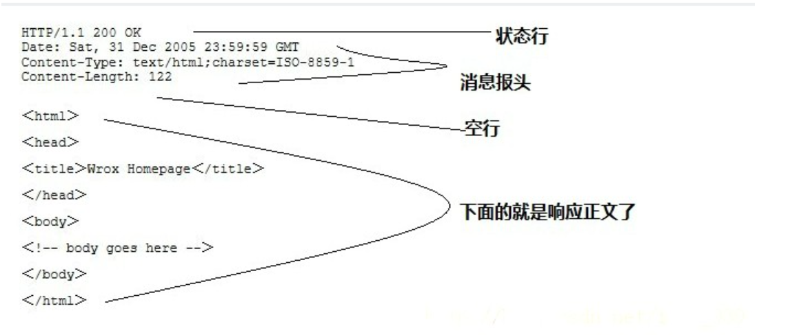
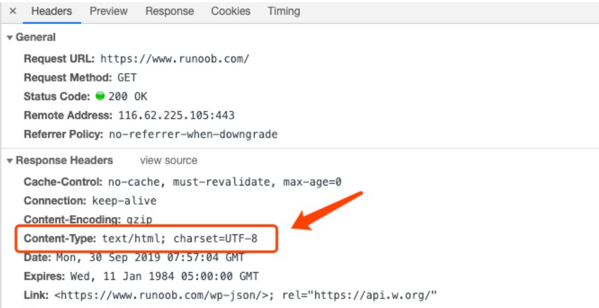

## Http协议概述

- Hypertext Transfer Protocol（超文本传输协议）的缩写
- 简单的 `请求-响应` 协议
- 基于 `C/S架构` 进行通信的
- 属于应用层协议，构建在 TCP 和 IP 协议之上，用来规定服务器和客户浏览器端信息交互的格式
- 特点：无状态，默认端口是 `80`
- 使用统一资源标识符（Uniform Resource Identifiers, `URI`）来传输数据和建立连接。


## Http协议工作原理

HTTP是基于 `客户/服务器` 模式，且 `面向连接`的。典型的HTTP事务处理有如下的过程：

+ 客户与服务器建立连接；
+ 客户向服务器提出请求；
+ 服务器接受请求，并根据请求返回相应的文件作为应答；
+ 客户与服务器关闭连接


在浏览器地址栏键入URL，按下回车之后会经历以下流程：

1. 浏览器向 DNS 服务器请求解析该 URL 中的域名所对应的 IP 地址;
2. 解析出 IP 地址后，根据该 IP 地址和默认端口 80，和服务器建立TCP连接;
3. 浏览器发出读取文件(URL 中域名后面部分对应的文件)的HTTP 请求，该请求报文作为 TCP 三次握手的第三个报文的数据发送给服务器;
4. 服务器对浏览器请求作出响应，并把对应的 html 文本发送给浏览器;
5. 释放 TCP连接;
6. 浏览器将该 html 文本并显示内容; 　


## http协议的特点

+ 支持客户端/服务器模式

  HTTP工作于客户端服务端的架构之上，浏览器作为客户端通过url向服务器及web服务器发送请求，

  web服务器根据接收到的请求向客户端发送响应信息。

+ 简单快速

  客户端向服务器请求时，只需传送请求方法和路径，请求方法有post、get等，每种方法规定了客户与服务器联系的类型不同。

+ 灵活

  面向对象的协议，允许传输任意类型的数据对象。传输的类型由Content-Type（Content-Type是HTTP包中用来表示内容类型的标识）加以标记。允许对数据进行压缩传送

+ `无连接`

  限制每次连接只能处理一个请求，服务器处理完客户端的请求并收到客户端的应答后即断开连接，采用这种方式可以节省时间。

  + HTTP1.1后默认采用 `keepline长连接` ，服务器要等一段时间后才能断开连接，以保证连接特性。

+ `无状态`

  即服务器不保留与客户交易时的任何状态。这就大大减轻了服务器记忆负担，从而保持较快的响应速度。


## HTTP 版本

+ 0.9

  + 适用于各种数据信息的简洁快速协议

  + 是一个交换信息的无序协议，仅仅限于文字。
  + 无法进行内容的协商

+ 1.0
  + 1982年，Tim Berners-Lee提出了HTTP/1.0。
  + 面向事务的应用层协议。该协议对每一次请求/响应建立并拆除一次连接。
  + 其特点是简单、易于管理

+ 1.1
  + 需规定了连接方式和连接类型
  + 对于互联网最重要的速度和效率，并没有太多的考虑。
+  2.0
  + HTTP2.0的前身是HTTP1.0和HTTP1.1。


## TCP 长连接

- 从 HTTP/1.1 起，默认使用 TCP 长连接，用以保持连接特性
  + 在响应头加入 `Connection: keep-alive`
- 在使用长连接的情况下，当一个请求完成后，客户端和服务器之间用于传输 HTTP 数据的 TCP 连接不会关闭，客户端再次访问这个服务器时，会继续使用这一条已经建立的连接发送数据包
- Keep-Alive 不会永久保持连接，它有一个保持时间，可以在不同的服务器软件中设定这个时间
- 实现长连接需要客户端和服务端都支持长连接


## Http 请求

### Http 请求组成

```http
 -- 请求行
GET /test/testMethod.html?name=ixfosa&password=123456 HTTP/1.1 -请求行（get时请求数据）
POST /hello/hello HTTP/1.1     

--请求头（多个key-value对象）
Host: localhost:8080                 
User-Agent: Mozilla/5.0 (Windows NT 6.1; WOW64; rv:35.0) Gecko/20100101 Firefox/35.0
Accept: text/html,application/xhtml+xml,application/xml;q=0.9,*/*;q=0.8
Accept-Language: zh-cn,en-us;q=0.8,zh;q=0.5,en;q=0.3
Accept-Encoding: gzip, deflate
Connection: keep-alive

-- 一个空行    

                                        
--（可选）实体内容(post)（post时请求数据）                                    
name=ixfosa&password=123456             
```

客户端发送一个HTTP请求到服务器的请求消息包括以下格式：

+ 请求行
+ 请求头
+ 一个空行
+ 实体内容(post时请求数据)


### 请求行

+ 请求方式

  + GET

    +  get: 请求行中 

      ```http
      GET /test/testMethod.html?name=ixfosa&password=123456 HTTP/1.1  -- 请求行
      ```

    + GET请求携带的数据在 请求行中

      + name=ixfosa&password=123456 为请求携带的数据

      

  + POST

    + post：请求行中 

      ```http
      POST /hello/hello HTTP/1.1     -- 请求行
      ```

    + POST请求携带的数据在 实体内容中 

      ```http
                                       -- 一个空行
      name=ixfosa&password=123456      --（可选）实体内容(post)（post时请求数据）
      ```

      

+ 请求资源 

  + `URL`:  统一资源定位符。http://localhost:8080/test/test.html。只能定位互联网资源。是URI的子集。
    `URI`： 统一资源标记符。/hello/hello。用于标记任何资源。
  + 可以是本地文件系统，局域网的资源（//192.168.14.10/myweb/index.html），可以是互联网。


+ http协议版本
  + http1.0：当前浏览器客户端与服务器端建立连接之后，只能发送一次请求，一次请求之后连接关闭。
  + http1.1：当前浏览器客户端与服务器端建立连接之后，可以在一次连接中发送多次请求。


### 请求头

多个 `key-value` 结构

```http
Accept: text/html,image/*                          
Accept-Charset: ISO-8859-1           -- 浏览器接受的编码格式
Accept-Encoding: gzip,compress       --浏览器接受的数据压缩格式
Accept-Language: en-us,zh-cn         --浏览器接受的语言
Host: www.ixfosa.top:80              --（必须的）当前请求访问的目标地址（主机:端口）
If-Modified-Since: Tue, 11 Jul 2000 18:23:51 GMT     --浏览器最后的缓存时间
Referer: http://www.it315.org/index.jsp              -- 当前请求来自于哪里
User-Agent: Mozilla/4.0 (compatible; MSIE 5.5; Windows NT 5.0)   --浏览器类型
Cookie:name=eric                        -- 浏览器保存的cookie信息
Connection: close/Keep-Alive      	    --浏览器跟服务器连接状态。
                                    		-- close: 连接关闭  
                                            -- keep-alive：保存连接。                   
Date: Tue, 11 Jul 2000 18:23:51 GMT     -- 请求发出的时间
```


### 实体内容

+ 只有 `POST` 提交的参数会放到实体内容中


### 请求方式

+ 根据 HTTP 标准，HTTP 请求可以使用多种请求方法。
+ HTTP1.0 定义了三种请求方法： `GET`, `POST` 和 HEAD方法。
+ HTTP1.1 新增了六种请求方法：OPTIONS、PUT、PATCH、DELETE、TRACE 和 CONNECT 方法。

| 序 号 | 方法    | 描述                                                         |
| :---: | :------ | :----------------------------------------------------------- |
|   1   | GET     | 请求指定的页面信息，并返回实体主体。                         |
|   2   | HEAD    | 类似于 GET 请求，只不过返回的响应中没有具体的内容，用于获取报头 |
|   3   | POST    | 向指定资源提交数据进行处理请求（例如提交表单或者上传文件）。数据被包含在请求体中。POST 请求可能会导致新的资源的建立和/或已有资源的修改。 |
|   4   | PUT     | 从客户端向服务器传送的数据取代指定的文档的内容。             |
|   5   | DELETE  | 请求服务器删除指定的页面。                                   |
|   6   | CONNECT | HTTP/1.1 协议中预留给能够将连接改为管道方式的代理服务器。    |
|   7   | OPTIONS | 允许客户端查看服务器的性能。                                 |
|   8   | TRACE   | 回显服务器收到的请求，主要用于测试或诊断。                   |
|   9   | PATCH   | 是对 PUT 方法的补充，用来对已知资源进行局部更新 。           |


**常用的请求方式： `GET`  和 `POST`**

```html
<form action="提交地址" method="GET | POST">
    
</form>
```


### GET   vs  POST

#### GET方式提交 

+ 地址栏（URI）会跟上参数数据。以  `?` 开头，多个参数之间以 `&` 分割。

  ```http
  GET /test/testMethod.html?name=ixfosa&password=123456 HTTP/1.1
  Host: localhost:8080
  User-Agent: Mozilla/5.0 (Windows NT 6.1; WOW64; rv:35.0) Gecko/20100101 Firefox/35.0
  Accept: text/html,application/xhtml+xml,application/xml;q=0.9,*/*;q=0.8
  Accept-Language: zh-cn,en-us;q=0.8,zh;q=0.5,en;q=0.3
  Accept-Encoding: gzip, deflate
  Referer: http://localhost:8080/day09/testMethod.html
  Connection: keep-alive
  ```

+ GET提交参数数据有限制，不超过1KB。
+ GET方式不适合提交敏感密码。(其实都看得见)

> 注意： 浏览器直接访问的请求，默认提交方式是GET方式


#### POST方式提交

+ 参数不会跟着URI后面。参数而是跟在请求的实体内容中。没有？开头，多个参数之间以&分割。

  ```http
  POST /test/testMethod.html HTTP/1.1
  Host: localhost:8080
  User-Agent: Mozilla/5.0 (Windows NT 6.1; WOW64; rv:35.0) Gecko/20100101 Firefox/35.0
  Accept: text/html,application/xhtml+xml,application/xml;q=0.9,*/*;q=0.8
  Accept-Language: zh-cn,en-us;q=0.8,zh;q=0.5,en;q=0.3
  Accept-Encoding: gzip, deflate
  Referer: http://localhost:8080/day09/testMethod.html
  Connection: keep-alive
  
  name=ixfosa&password=123456
  ```

+ POST提交的参数数据没有限制。
+ POST方式提交敏感数据。(其实都看得见)


## Http 响应

```http
HTTP/1.1 200 OK                           -- 响应行
Server: Apache-Coyote/1.1                 -- 响应头（key-vaule）
Content-Length: 24 
Date: Fri, 30 Jan 2015 01:54:57 GMT
                                          -- 一个空行
hello servlet!!!                          -- 实体内容
```

HTTP响应也由四个部分组成

+ `状态行`

  + http协议版本:
  + 状态码: 服务器处理请求的结果（状态）

+ ``响应头`

  ```http
  Location: http://www.ixfosa.org/index.jsp   -- 表示重定向的地址，该头和302的状态码一起使用。
  Server:apache tomcat                        -- 表示服务器的类型
  Content-Encoding: gzip                      -- 表示服务器发送给浏览器的数据压缩类型
  Content-Length: 80                          --表示服务器发送给浏览器的数据长度
  Content-Language: zh-cn                     --表示服务器支持的语言
  Content-Type: text/html; charset=GB2312     --表示服务器发送给浏览器的数据类型及内容编码
  Last-Modified: Tue, 11 Jul 2000 18:23:51 GMT   --表示服务器资源的最后修改时间
  Refresh: 1;url=http://www.ixfosa.org           --表示定时刷新
  Content-Disposition: attachment; filename=aaa.zip --表示告诉浏览器以下载方式打开资源													（下载文件时用到）
  Transfer-Encoding: chunked
  Set-Cookie:SS=Q0=5Lb_nQ; path=/search    --表示服务器发送给浏览器的cookie信息（会话管理用到）
  Expires: -1                              --表示通知浏览器不进行缓存
  Cache-Control: no-cache
  Pragma: no-cache
  Connection: close/Keep-Alive             -- 表示服务器和浏览器的连接状态。close：关闭连接 											    keep-alive:保存连接
  ```

  > `Content-Disposition: attachment; filename=aaa.zip` 下载文件时用到

+ `空行`

+ `响应正文`




## HTTP content-type

`Content-Type`（内容类型）

+ 定义网络文件的类型和网页的编码，决定浏览器将以什么形式、什么编码读取这个文件

+ `Content-Type` 标头告诉客户端实际返回的内容的内容类型。

+ 语法格式：

  ```http
  Content-Type: text/html; charset=utf-8
  Content-Type: multipart/form-data; boundary=something
  ```




常见的媒体格式类型如下：

- text/html ： HTML格式
- text/plain ：纯文本格式
- text/xml ： XML格式
- image/gif ：gif图片格式
- image/jpeg ：jpg图片格式
- image/png：png图片格式

以application开头的媒体格式类型：

- `application/xhtml+xml` ：XHTML格式
- `application/xml`： XML数据格式
- application/atom+xml ：Atom XML聚合格式
- `application/json`： JSON数据格式
- application/pdf：pdf格式
- application/msword ： Word文档格式
- application/octet-stream ： 二进制流数据（如常见的文件下载）
- application/x-www-form-urlencoded ： <form encType="">中默认的encType，form表单数据被编码为key/value格式发送到服务器（表单默认的提交数据的格式）

上传文件之时使用的：

- `multipart/form-data` ： 需要在表单中进行文件上传时，就需要使用该格式


## 状态消息

常见的HTTP状态码：

+ `200 `- 请求成功
+ `301` - 资源（网页等）被永久转移到其它URL
+ `404` - 请求的资源（网页等）不存在
+ `500 `- 内部服务器错误


### 1xx:信息

| 消息                    | 描述                                                         |
| ----------------------- | ------------------------------------------------------------ |
| 100 Continue            | 服务器仅接收到部分请求，但是一旦服务器并没有拒绝该请求，客户端应该继续发送其余的请求。 |
| 101 Switching Protocols | 服务器转换协议：服务器将遵从客户的请求转换到另外一种协议。   |

### 2xx:成功

| 消息                              | 描述                                                         |
| --------------------------------- | ------------------------------------------------------------ |
| `200 OK`                          | 请求成功（其后是对GET和POST请求的应答文档。）                |
| 201 Created                       | 请求被创建完成，同时新的资源被创建。                         |
| 202 Accepted                      | 供处理的请求已被接受，但是处理未完成。                       |
| 203 Non-authoritative Information | 文档已经正常地返回，但一些应答头可能不正确，因为使用的是文档的拷贝。 |
| 204 No Content                    | 没有新文档。浏览器应该继续显示原来的文档。如果用户定期地刷新页面，而Servlet可以确定用户文档足够新，这个状态代码是很有用的。 |
| 205 Reset Content                 | 没有新文档。但浏览器应该重置它所显示的内容。用来强制浏览器清除表单输入内容。 |
| 206 Partial Content               | 客户发送了一个带有Range头的GET请求，服务器完成了它。         |


### 3xx:重定向

| 消息                   | 描述                                                         |
| ---------------------- | ------------------------------------------------------------ |
| 300 Multiple Choices   | 多重选择。链接列表。用户可以选择某链接到达目的地。最多允许五个地址。 |
| 301 Moved Permanently  | 所请求的页面已经转移至新的url。                              |
| `302Found`             | 所请求的页面已经临时转移至新的url。                          |
| 303 See Other          | 所请求的页面可在别的url下被找到。                            |
| 304 Not Modified       | 未按预期修改文档。客户端有缓冲的文档并发出了一个条件性的请求（一般是提供If-Modified-Since头表示客户只想比指定日期更新的文档）。服务器告诉客户，原来缓冲的文档还可以继续使用。 |
| 305 Use Proxy          | 客户请求的文档应该通过Location头所指明的代理服务器提取。     |
| 306 *Unused*           | 此代码被用于前一版本。目前已不再使用，但是代码依然被保留。   |
| 307 Temporary Redirect | 被请求的页面已经临时移至新的url。                            |


### 4xx:客户端错误

| 消息                                | 描述                                                         |
| ----------------------------------- | ------------------------------------------------------------ |
| `400 Bad Request`                   | 服务器未能理解请求。                                         |
| 401 Unauthorized                    | 被请求的页面需要用户名和密码。                               |
| 402 Payment Required                | 此代码尚无法使用。                                           |
| 403 Forbidden                       | 对被请求页面的访问被禁止。                                   |
| `404 Not Found`                     | 服务器无法找到被请求的页面。                                 |
| 405 Method Not Allowed              | 请求中指定的方法不被允许。                                   |
| 406 Not Acceptable                  | 服务器生成的响应无法被客户端所接受。                         |
| 407 Proxy Authentication Required   | 用户必须首先使用代理服务器进行验证，这样请求才会被处理。     |
| 408 Request Timeout                 | 请求超出了服务器的等待时间。                                 |
| 409 Conflict                        | 由于冲突，请求无法被完成。                                   |
| 410 Gone                            | 被请求的页面不可用。                                         |
| 411 Length Required                 | "Content-Length" 未被定义。如果无此内容，服务器不会接受请求。 |
| 412 Precondition Failed             | 请求中的前提条件被服务器评估为失败。                         |
| 413 Request Entity Too Large        | 由于所请求的实体的太大，服务器不会接受请求。                 |
| 414 Request-url Too Long            | 由于url太长，服务器不会接受请求。当post请求被转换为带有很长的查询信息的get请求时，就会发生这种情况。 |
| 415 Unsupported Media Type          | 由于媒介类型不被支持，服务器不会接受请求。                   |
| 416 Requested Range Not Satisfiable | 服务器不能满足客户在请求中指定的Range头。                    |
| 417 Expectation Failed              | 执行失败。                                                   |
| 423                                 | 锁定的错误。                                                 |


### 5xx:服务器错误

| 消息                           | 描述                                               |
| ------------------------------ | -------------------------------------------------- |
| `500 Internal Server Error`    | 请求未完成。服务器遇到不可预知的情况。             |
| 501 Not Implemented            | 请求未完成。服务器不支持所请求的功能。             |
| 502 Bad Gateway                | 请求未完成。服务器从上游服务器收到一个无效的响应。 |
| 503 Service Unavailable        | 请求未完成。服务器临时过载或宕机。                 |
| 504 Gateway Timeout            | 网关超时。                                         |
| 505 HTTP Version Not Supported | 服务器不支持请求中指明的HTTP协议版本。             |


