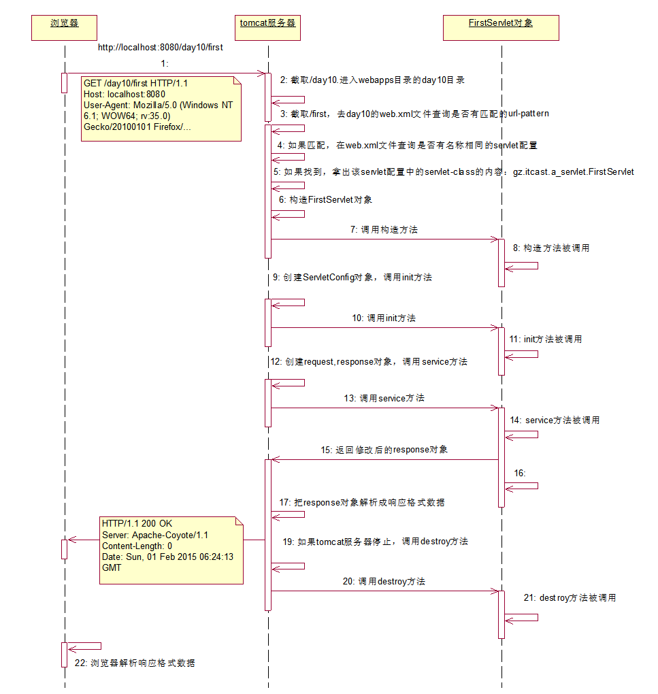

## Web开发入门

### 基本介绍 

软件的结构

+ `C/S` (Client - Server  客户端-服务器端)
  + 典型应用：QQ软件 ，飞秋，红蜘蛛。
  + 特点：
    + 必须下载特定的客户端程序。
    + 服务器端升级，客户端升级。

+ `B/S`（Broswer -Server 浏览器端- 服务器端）
  + 典型应用： 腾讯官方（www.qq.com）  163新闻网站， 传智官网（俗称：网站）
  + 特点：
    + 不需要安装特定的客户端（只需要安装浏览器即可）
    + 服务器端升级，浏览器不需要升级

>  javaweb的程序就是b/s软件结构


服务器

+ 从物理上来说，服务器就是一台PC机器。

+ web服务器：PC机器安装一个具有web服务的软件，称之为web服务器，把本地的资源共享给外部访问。
+ 数据库服务器：PC机器安装一个具有数据管理件服务的软件，称之为数据库服务器。
+ 邮件服务器：PC机器安装一个具有发送邮件服务的软件，称之为邮件服务器。


常见的市面上web服务软件

+ WebLogic: BEA公司的产品。 收费的。支持JavaEE规范。
+ WebSphere： IBM公司的产品。收费的。支持JavaEE规范
+ JBoss: Redhat公司的产品。收费的。支持JavaEE规范
+ `Tomcat`： 开源组织Apache的产品。免费的。支持部分的JavaEE规范。
  + 支持 `servlet` 、`jsp`。`jdbc`，但ejb， rmi不支持
  + javase的规范，包含IO流，线程，集合，socket编程。


### Web应用的目录结构

```java
|-- WebRoot :   		web应用的根目录
	|-- 静态资源（html+css+js+image+vedio）
	|-- WEB-INF ： 	 固定写法。
		|--classes： （可选）固定写法。存放class字节码文件
		|--lib： 	（可选）固定写法。存放`jar包`文件。
		|--web.xml  
```

> 注意：
>
> + `WEB-INF`目录里面的资源不能通过浏览器直接访问
> + 如果希望访问到WEB-INF里面的资源，就必须把资源配置到一个叫web.xml的文件中。
> + 通过转发


练习：

1. 在webapps下建立一个test目录
2. 创建两个文件
   1. index.html  里面随便写内容，有超链接-连接到test.html	
   2. test.html 
3. 通过浏览器访问到。 
   + `http://localhost:8080/test/index.html`


### 手动开发动态资源

静态资源和动态资源的区别

+ 静态资源： 当用户多次访问这个资源，资源的源代码永远不会改变的资源。
+ 动态资源：当用户多次访问这个资源，资源的源代码可能会发送改变。


动态资源的开发技术

+ Servlet : 用java语言来编写动态资源的开发技术。
+ Servlet特点：
  + 普通的java类，继承 `HttpServlet` 类
  + Servlet类只能交给tomcat服务器运行（开发者自己不能运行）


Servlet手动编写步骤：

1. 编写一个servlet程序，继承HttpServlet  

   +  jar包：  `servlet-api.jar`
   + jar位置：`WEB-INF/lib` servlet-api.jar`

   ```java
   import java.io.IOException;
   import java.util.Date;
   
   import javax.servlet.ServletException;
   import javax.servlet.http.HttpServlet;
   import javax.servlet.http.HttpServletRequest;
   import javax.servlet.http.HttpServletResponse;
   
   /**
    * 第一个servlet程序
    */
   public class HelloServlet extends HttpServlet{
   
   	@Override
   	protected void doGet(HttpServletRequest req, HttpServletResponse resp)
   			throws ServletException, IOException {
   		// 解决中文乱码问题
   		resp.setContentType("text/html; charset=utf-8");
   		// 向浏览器输出内容
   		resp.getWriter().write("这是第一个servlet程序。当前时间为："+new Date());
   	}
   }
   ```

2. 找到HelloServlet类的 `class` 字节码，然后把拷贝到tomcat的一个web应用中

   + `WEB-INF/classes`目录下。( webapps\ROOT\WEB-INF\classes)

     

3. `在当前web应用下的` web.xml`文件配置Servlet。

   ```xml
   <!-- 配置一个servlet程序 -->
   <servlet>
       <!-- servlet的内部名称 ，可以自定义-->
       <servlet-name>HelloServlet</servlet-name>
       <!-- servlet类名： 包名+简单类名-->
       <servlet-class>gz.ixfosa.servlet.HelloServlet</servlet-class>
   </servlet>
   
   <servlet-mapping>
       <!-- servlet的内部名称，和上面的名称保持一致！！！-->
       <servlet-name>HelloServlet</servlet-name>
       <!-- servlet的访问名称： /名称 -->
       <url-pattern>/hello</url-pattern>
   </servlet-mapping>
   ```

   

4. 启动tomcat服务器，运行访问

   + 访问servlet:  http://localhost:8080/hello


## Hello Servlet

开发一个Servlet步骤：

1. 编写java类，继承`HttpServlet`类
2. 重新doGet和doPost方法
3. Servlet程序交给tomcat服务器运行！！
   1. servlet程序的class码拷贝到WEB-INF/classes目录
   2. 在web.xml文件中进行配置

```java
package gz.ixfosa.servlet;

import java.io.IOException;

import javax.servlet.ServletException;
import javax.servlet.http.HttpServlet;
import javax.servlet.http.HttpServletRequest;
import javax.servlet.http.HttpServletResponse;

public class FirstServlet extends HttpServlet{
	
	@Override
	protected void doGet(HttpServletRequest req, HttpServletResponse response)
			throws ServletException, IOException {
		//向浏览器输出内容
		response.getWriter().write("this is first servlet！");
	}
}
```

WebRoot\WEB-INF\web.xml（IDE）

```xml
<!-- 配置一个servlet -->
  <!-- servlet的配置 -->
  <servlet>
  	<!-- servlet的内部名称，自定义。尽量有意义 -->
  	<servlet-name>FirstServlet</servlet-name>
  	<!-- servlet的类全名： 包名+简单类名 -->
  	<servlet-class>gz.ixfosa.servlet.FirstServlet</servlet-class>
  </servlet>
  
  
  <!-- servlet的映射配置 -->
  <servlet-mapping>
  	<!-- servlet的内部名称，一定要和上面的内部名称保持一致！！ -->
  	<servlet-name>FirstServlet</servlet-name>
  	<!-- servlet的映射路径（访问servlet的名称） -->
  	<url-pattern>/first</url-pattern>
  </servlet-mapping>
```

访问次URL：  `http://localhost:8080/test/first`  (Tomcat下：webapps/test)

+ http://: http协议
+ localhost： 到本地的hosts文件中查找是否存在该域名对应的IP地址  127.0.0.1		
+ 8080：    找到tomcat服务器
+ /test 在 tomcat 的 webapps 目录下找 test 的目录
+ /first    资源名称。
  + 在 test 的 web.xml 中查找是否有匹配的 url-pattern 的内容（/first）
  + 如果找到匹配的 `url-pattern`,则使用当前 `servlet-name` 的名称到web.xml文件中查询是否相同名称的servlet配置
  + 如果找到，则取出对应的servlet配置信息中的servlet-class内容：	
    字符串： gz.ixfosa.servlet.FirstServlet

+ 通过反射：
  + 构造FirstServlet的对象
  + 然后调用FirstServlet里面的方法

> 前提： tomcat服务器启动时，首先加载 `webapps` 中的每个web应用的 `web.xml` 配置文件。	


## Servlet的映射路径

```xml
<servlet-mapping>
  	<!-- servlet的内部名称，一定要和上面的内部名称保持一致！！ -->
  	<servlet-name>FirstServlet</servlet-name>
  	<!-- servlet的映射路径（访问servlet的名称） -->
  	<url-pattern>/first</url-pattern>
</servlet-mapping>
```

|          | url-pattern  | 浏览器输入                                 |
| -------- | ------------ | ------------------------------------------ |
| 精确匹配 | /first       | http://localhost:8080/test/first           |
|          | /ixfosa/demo | http://localhost:8080/test/ixfosa/demo     |
|          |              |                                            |
| 模糊匹配 | /*           | http://localhost:8080/test/任意路径        |
|          | /ixfosa/     | http://localhost:8080/test/ixfosa/任意路径 |
|          | .后缀名      | http://localhost:8080/test/任意路径.后缀名 |
|          | *.do         | http://localhost:8080/test/任意路径.do     |

> 注意：
>
> + url-pattern要么以 `/` 开头，要么以`*`开头。  
> + 不能同时使用两种模糊匹配，例如 `/path/*.do`是非法路径
> + 当有输入的URL有多个servlet同时被匹配的情况下：
> + 精确匹配优先。（长的最像优先被匹配）
> + 以后缀名结尾的模糊url-pattern优先级最低


**servlet缺省路径**

+  servlet的缺省路径（`<url-pattern>/</url-pattern>`）是在tomcat服务器内置的一个路径。该路径对应的是一个DefaultServlet（缺省Servlet）。
+ 缺省的Servlet的作用是用于解析web应用的静态资源文件。

> 问题： URL输入http://localhost:8080/test/index.html 如何读取文件？
>
> 1. 到当前 test 应用下的web.xml文件查找是否有匹配的url-pattern。
> 2. 如果没有匹配的url-pattern，则交给tomcat的内置的DefaultServlet处理
> 3. DefaultServlet程序到test应用的根目录下查找是存在一个名称为index.html的静态文件。
> 4. 如果找到该文件，则读取该文件内容，返回给浏览器。
> 5. 如果找不到该文件，则返回404错误页面。

> 结论：
>
> + `先找动态资源，再找静态资源`。
> + 静态的web资源是需要通过`DefaultServlet`程序去读取的


## Sevlet的生命周期

​	Servlet的生命周期： servlet类对象什么时候创建，什么时候调用什么方法，什么时候销毁。

+ Servlet程序的生命周期由tomcat服务器控制的


### 四个生命周期方法

+ 构造方法
  + 创建 servlet 对象的时调用。
  + 默认情况下，第一次访问 servlet 的时候创建 servlet 对象只调用1次。
  + servlet对象 在 tomcat 是`单实例`的。
+ init方法 
  + 创建完servlet对象的时候调用。只调用1次。
+ service方法
  + 每次发出请求时调用。调用n次。
+ destroy方法
  + 销毁 servlet对象 的时候调用。停止服务器或者重新部署web应用时销毁servlet对象。只调用1次。
    						

```java
public class LifeDemo extends HttpServlet {

	/**
	 * 1.构造方法
	 */
	public LifeDemo(){
		System.out.println("1.servlet对象被创建了。");
	}

	/**
	 * 2.init方法
	 */
	@Override
	public void init(ServletConfig config) throws ServletException {
		System.out.println("2.init方法被调用");
	}
	
	/**
	 * 3.service方法
	 */
	@Override			
	public void service(ServletRequest req, ServletResponse res)
			throws ServletException, IOException {
		System.out.println("3.service方法被调用");
	}
	
	/**
	 * 4.destroy方法
	 */
	@Override
	public void destroy() {
		System.out.println("4.servlet对象销毁了");
	}
}
```

```xml
<servlet>
    <servlet-name>LifeDemo</servlet-name>
    <servlet-class>gz.ixfosa.life.LifeDemo</servlet-class>
</servlet>

<servlet-mapping>
<servlet-name>LifeDemo</servlet-name>
<url-pattern>/LifeDemo</url-pattern>
</servlet-mapping>
```


### 描述servlet的生命周期

Tomtcat内部代码运行：

   1. 通过映射找到到 `servlet-class` 的内容，字符串：gz.ixfosa.life.LifeDemo

   2. 通过反射构造FirstServlet对象

      1. 得到字节码对象

         ```java
         Class clazz = class.forName("gz.ixfosa.life.LifeDemo");
         ```

      2. 调用无参数的构造方法来构造对象

         ```java
         Object obj = clazz.newInstance();      // 1.servlet的构造方法被调用
         ```

3. 创建ServletConfig对象，通过反射调用init方法

   1. 得到方法对象

      ```java
      Method m = clazz.getDeclareMethod("init", ServletConfig.class);
      ```

   2. 调用方法

      ```java
      m.invoke(obj, config);          // 2.servlet的init方法被调用
      ```

4. 创建request，response对象，通过反射调用service方法

   1. 得到方法对象

      ```java
      Methodm m =  clazz.getDeclareMethod("service",
                               HttpServletRequest.class,
                               HttpServletResponse.class); 
      ```

   2. 调用方法

       ```java
       m.invoke(obj,request,response);   // 3.servlet的service方法被调用
       ```

5. 当tomcat服务器停止或web应用重新部署，通过反射调用destroy方法

   1. 得到方法对象

      ```java
      Method m = clazz.getDeclareMethod("destroy",null);
      ```

   2. 5调用方法

      ```java
      m.invoke(obj,null);            // 4.servlet的destroy方法被调用
      ```

      

### servlet生命周期时序图




## Servlet的自动加载

默认情况下，第一次访问servlet的时候创建servlet对象。如果servlet的构造方法或 init 方法中执行了比较多的逻辑代码，那么导致用户第一次访问sevrlet的时候比较慢。

改变servlet创建对象的时机： 提前到加载web应用的时候

在servlet的配置信息中，加上一个 `<load-on-startup>` 即可

```xml
<servlet>
    <servlet-name>LifeDemo</servlet-name>
    <servlet-class>gz.ixfosa.life.LifeDemo</servlet-class>
    <!-- 让servlet对象自动加载 -->
    <load-on-startup>1</load-on-startup>  
</servlet>
```

> 注意：整数值越大，创建优先级越低！


## 有参init()和无参init()

```java
package gz.ixfosa.init;


import javax.servlet.ServletConfig;
import javax.servlet.ServletException;
import javax.servlet.http.HttpServlet;

/**
 * 有参数的init和无参的init方法
 *
 */
public class InitDemo extends HttpServlet {
		
	/**
	 * 有参数的init方法
	 * 该方法是servlet的生命周期方法，一定会被tomcat服务器调用
	 */
    
	/**
	 * 注意：如果要编写初始代码，不需要覆盖有参数的init方法
	 */
    
	/*@Override
	public void init(ServletConfig config) throws ServletException {
		System.out.println("有参数的init方法");
	}*/
	
	/**
	 * 无参数的init方法
	 * 该方法是servlet的编写初始化代码的方法。
	 * 是Sun公司设计出来专门给开发者进行覆盖，然后在里面编写servlet的初始逻辑代码的方法。
	 */
	@Override
	public void init() throws ServletException {
		System.out.println("无参数的init方法");
	}
}
```

```java
<servlet>
    <servlet-name>InitDemo</servlet-name>
    <servlet-class>gz.ixfosa.init.InitDemo</servlet-class>
    <load-on-startup>3</load-on-startup>
</servlet>

<servlet-mapping>
    <servlet-name>InitDemo</servlet-name>
    <url-pattern>/InitDemo</url-pattern>
</servlet-mapping>
```


## Servlet的多线程并发

`servlet` 对象在tomcat服务器是 `单实例多线程` 的。

+ 因为 servlet是多线程的，所以当多个servlet的线程同时访问了servlet的共享数据，如成员变量，可能会引发`线程安全`问题。
+ 解决办法：
  + 把使用到共享数据的代码块进行同步（使用 `synchronized` 关键字进行同步）
  + 建议在servlet类中尽量不要使用成员变量。如果确实要使用成员，必须同步。而且尽量缩小同步代码块的范围。以避免因为同步而导致并发效率降低。

```java
package gz.ixfosa.thread;

import java.io.IOException;

import javax.servlet.ServletException;
import javax.servlet.http.HttpServlet;
import javax.servlet.http.HttpServletRequest;
import javax.servlet.http.HttpServletResponse;
/**
 * servlet的多线程并发问题
 */
public class TheradDemo extends HttpServlet {
	
	int count = 1;

	public void doGet(HttpServletRequest request, HttpServletResponse response)
			throws ServletException, IOException {
        
		response.setContentType("text/html;charset=utf-8");
		
		synchronized (TheradDemo.class) { // 锁对象必须唯一。建议使用类对象
            // 线程1执行完  ， 线程2执行
			response.getWriter().write("你现在是当前网站的第"+count+"个访客");   

            /*try {
                Thread.sleep(5000);
            } catch (InterruptedException e) {
                e.printStackTrace();
            }*/
            count++;
		}
	}
}
```


## Servlet 接口

+ `void init(ServletConfig config)`：创建 Servlet 实例时，调用该方法初始化 Servlet
+ `void service(ServletRequest req, ServletResponse res)`：对用户请求生成响应
+ `void destroy()`：销毁 Servlet 实例时，自动调用该方法的回收资源
+ `ServletConfig getServletConfig()`：返回 ServletConfig 对象，该对象包含此 servlet 的初始化和启动参数
+ `String getServletInfo()`：返回有关 servlet 的信息，比如作者、版本和版权


## ServletConfig 接口

### ServletConfig对象

+ `ServletConfig` 对象: 主要是用于加载 servlet的`初始化参数`。

+ 在一个web应用可以存在多个 ServletConfig 对象（一个Servlet对应一个ServletConfig对象）

+ 对象创建和得到

  + 创建时机： 在创建完servlet对象之后，在调用init方法之前创建。
  + 得到对象： 直接从有参数的init方法中得到！

+ ServletConfig的API

  ```java
  // 获取此servlet的指定初始化参数名称的值(获取配置参数)
  String getInitParameter(String name) 
      
  // 获取此 servlet 的初始化参数的所有名称（以 String 对象的 Enumeration 的形式）   
  Enumeration<String> getInitParameterNames()
      
  ServletContext getServletContext()  // 得到servlet上下文对象
      
  String getServletName()             // 返回此 servlet 实例的名称
  ```

### 获取初始化参数配置

servlet的初始化参数配置

```xml
<servlet>
    <servlet-name>ConfigDemo</servlet-name>
    <servlet-class>gz.ixfosa.config.ConfigDemo</servlet-class>
    
    <!-- 初始参数： 这些参数会在加载web应用的时候，封装到ServletConfig对象中 -->
    <init-param>
        <param-name>path</param-name>
        <param-value>e:/b.txt</param-value>
    </init-param>
    <init-param>
        <param-name>BBB</param-name>
        <param-value>BBB's value</param-value>
    </init-param>
    <init-param>
        <param-name>CCCC</param-name>
        <param-value>CCCC's value</param-value>
    </init-param>
</servlet>

<servlet-mapping>
    <servlet-name>ConfigDemo</servlet-name>
    <url-pattern>/ConfigDemo</url-pattern>
</servlet-mapping>
```

```java
package gz.ixfosa.config;

import java.io.BufferedReader;
import java.io.File;
import java.io.FileReader;
import java.io.IOException;
import java.util.Enumeration;

import javax.servlet.ServletConfig;
import javax.servlet.ServletException;
import javax.servlet.http.HttpServlet;
import javax.servlet.http.HttpServletRequest;
import javax.servlet.http.HttpServletResponse;

public class ConfigDemo extends HttpServlet {
	/**
	 * 以下两段代码GenericServlet已经写了，无需编写！！
	 */
	// private ServletConfig config;
	
	/**
	 *  1）tomcat服务器把这些参数会在加载web应用的时候，封装到ServletConfig对象中 
	 *  2）tomcat服务器调用init方法传入ServletConfig对象
	 */
	/*@Override
	public void init(ServletConfig config) throws ServletException {
		this.config = config;
	}*/
	
	
	public void doGet(HttpServletRequest request, HttpServletResponse response)
			throws ServletException, IOException {
		/**
		 * 读取servlet的初始参数
		 */
		String path = this.getServletConfig().getInitParameter("path");

		File file = new File(path);
		// 读取内容
		BufferedReader br = new BufferedReader(new FileReader(file));
		String str = null;
		while( (str=br.readLine())!=null ){
			System.out.println(str);
		}
		
		// 查询当前servlet的所有初始化参数
		Enumeration<String> enums = this.getServletConfig().getInitParameterNames();
		while(enums.hasMoreElements()){
			String paramName = enums.nextElement();
			String paramValue = this.getServletConfig().getInitParameter(paramName);
			System.out.println(paramName+"="+paramValue);
		}
        
		// 得到servlet的名称
		String servletName = this.getServletConfig().getServletName();
		System.out.println(servletName);
	}
}
```


## ServletContext 接口

### ServletContext 对象

+ `ServletContext `对象 ,叫做Servlet的上下文对象。表示一个当前的web应用环境。一个web应用中只有一个ServletContext对象。

+ 对象创建和得到

  + 创建时机：加载web应用时创建 ServletContext 对象。
  + 得到对象： 从 ServletConfig对象的 getServletContext 方法得到

+ ServletContext 对象的设计

  + 创建ServletContext对象	 
    + ServletContext  context = new ServletContext()		
     + 创建ServletConfig对象       
       + ServetConfig config = new ServletConfig();
       + config.setServletContxt(context);

  ```java
  class  ServletConfig {
      ServletContext context;
      public ServletContext getServletContxt(){
          return contxt;
      }
  } 
  
  public void init( ServletConfig config ){
      // 得到ServletConfig对象
      // 从ServletConfig对象中得到ServletContext对象
      SerlvetContext context = config.getServletContext();
  }
  ```

+ ServletContext 接口核心API

  ```java
  String getInitParameter(java.lang.String name) // 得到web应用的初始化参数
  Enumeration getInitParameterNames()  
  
  RequestDispatcher getRequestDispatcher(java.lang.String path) // 转发（类似于重定向）
  
  String getContextPath()                        // 得到当前web应用的路径
  String getRealPath(java.lang.String path)      // 得到web应用的资源文件 
  
  // 以 InputStream 对象的形式返回位于指定路径上的资源
  InputStream getResourceAsStream(String path)  
  
  // 域对象有关的方法
  void setAttribute(java.lang.String name, java.lang.Object object)
  Object getAttribute(java.lang.String name)  
  void removeAttribute(java.lang.String name)  
      
  // 获取指定文件的 MIME 类型，如果 MIME 类型未知，则返回 null
  // 常见 MIME 类型： "text/html" 和 "image/gif"
  String getMimeType(String file)
  ```

  

### 获取web应用参数

web应用参数可以让当前web应用的所有servlet获取！

```xml
<!-- 配置web应用参数 -->
<context-param>
    <param-name>AAA</param-name>
    <param-value>AAA's value</param-value>
</context-param>
<context-param>
    <param-name>BBB</param-name>
    <param-value>BBB's value</param-value>
</context-param>
<context-param>
    <param-name>CCC</param-name>
    <param-value>CCC's value</param-value>
</context-param>

<servlet>
    <servlet-name>ContextDemo</servlet-name>
    <servlet-class>gz.ixfosa.context.ContextDemo</servlet-class>
    <init-param>
        <param-name>path</param-name>
        <param-value>e:/b.txt</param-value>
    </init-param>
</servlet>

<servlet-mapping>
    <servlet-name>ContextDemo</servlet-name>
    <url-pattern>/ContextDemo</url-pattern>
</servlet-mapping>
```

```java
package gz.ixfosa.context;

import java.io.IOException;
import java.util.Enumeration;

import javax.servlet.ServletContext;
import javax.servlet.ServletException;
import javax.servlet.http.HttpServlet;
import javax.servlet.http.HttpServletRequest;
import javax.servlet.http.HttpServletResponse;

/**
 * 得到web应用参数
 */
public class ContextDemo extends HttpServlet {

	public void doGet(HttpServletRequest request, HttpServletResponse response)
			throws ServletException, IOException {
        
		// 得到ServletContext对象
		ServletContext context = this.getServletContext();
		
		System.out.println("参数" + context.getInitParameter("AAA"));
		
		Enumeration<String> enums = context.getInitParameterNames();
		while(enums.hasMoreElements()){
			String paramName = enums.nextElement();
			String paramValue  =context.getInitParameter(paramName);
			System.out.println(paramName+"="+paramValue);
		}
		
		// 尝试得到ConfigDemo中的servlet参数
		String path = this.getServletConfig().getInitParameter("path");
		System.out.println("path=" + path);
	}
}
```


### 域对象

域对象：作用是用于保存数据，获取数据。可以在不同的动态资源之间共享数据。

+ 所有域对象

  ```java
  ServletContext  
  HttpSession
  HttpServletRequet         
  PageContext                // jsp 中   
  ```

+ 域对象有关api

  ```java
  保存数据：void setAttribute(java.lang.String name, java.lang.Object object)
      
  获取数据： java.lang.Object getAttribute(java.lang.String name)  
      
  删除数据： void removeAttribute(java.lang.String name)  
  ```

+ ServletContext域对象：作用范围在 `整个web应用` 中有效！

+ 案例： 

  + Servlet1, Servlet2 之间传递   name = ixfosa

    + 方案1： 可以通过传递参数的形式，共享数据。局限：只能传递字符串类型。

      ```java
      response.sendRedirect("/Servlet2?name=ixfosa")     
      String request.getParameter("name");
      ```

    + 方案2： 可以使用域对象共享数据，好处：可以共享任何类型的数据

      ```java
      // 保存到域对象中
      this.getServletContext().setAttribute()
          
      // 从域对象获取
      this.getServletContext().getAttribute()
      ```


```java
class Student{
	private String name;
	private int age;
	public String getName() {
		return name;
	}
	public void setName(String name) {
		this.name = name;
	}
	public int getAge() {
		return age;
	}
	public void setAge(int age) {
		this.age = age;
	}
	public Student(String name, int age) {
		super();
		this.name = name;
		this.age = age;
	}
	@Override
	public String toString() {
		return "Student [age=" + age + ", name=" + name + "]";
	}
}
```

```java
package gz.ixfosa.context;

import java.io.IOException;

import javax.servlet.ServletContext;
import javax.servlet.ServletException;
import javax.servlet.http.HttpServlet;
import javax.servlet.http.HttpServletRequest;
import javax.servlet.http.HttpServletResponse;
/**
 * 保存数据
 */
public class ContextDemo extends HttpServlet {

	public void doGet(HttpServletRequest request, HttpServletResponse response)
			throws ServletException, IOException {
        
		// 1.得到域对象
		ServletContext context = this.getServletContext();
		
		// 2.把数据保存到域对象中
		// context.setAttribute("name", "ixfosa");
		context.setAttribute("student", new Student("ixfosa",20));
		System.out.println("保存成功");
	}
}
```

```java
package gz.ixfosa.f_context;

import java.io.IOException;

import javax.servlet.ServletContext;
import javax.servlet.ServletException;
import javax.servlet.http.HttpServlet;
import javax.servlet.http.HttpServletRequest;
import javax.servlet.http.HttpServletResponse;

/**
 * 获取数据
 */
public class ContextDemo2 extends HttpServlet {

	public void doGet(HttpServletRequest request, HttpServletResponse response)
			throws ServletException, IOException {
        
		// 1.得到域对象
		ServletContext context = this.getServletContext();
		
		// 2.从域对象中取出数据
		String name = (String)context.getAttribute("name");
		Student student = (Student)context.getAttribute("student");
        
		System.out.println("name = " + name);
		System.out.println(student);
	}
}
```


### 转发和重定向

转发：`RequestDispatcher  getRequestDispatcher(String path)`

+ 地址栏不会改变
+ 转发只能转发到当前web应用内的资源
+ 可以在转发过程中，可以把数据保存到`request`域对象中

重定向	`sendRedirect`		

+ 地址栏会改变，变成重定向到地址。
+ 重定向可以跳转到当前web应用，或其他web应用，甚至是外部域名网站。
+ 不能在重定向的过程，把数据保存到request中。

> 如果要使用request域对象进行数据共享，只能用转发技术！


#### 转发

```java
/**
 * 转发（效果：跳转页面）
 */
public class ForwardDemo extends HttpServlet {

   public void doGet(HttpServletRequest request, HttpServletResponse response)
         throws ServletException, IOException {
      
      /**
       * 保存数据到request域对象
       */
      request.setAttribute("name", "ixfosa");
      
      //转发   
      /**
       * 注意：不能转发当前web应用以外的资源。
       */
       
      /*
      RequestDispatcher rd = 
      			this.getServletContext().getRequestDispatcher("/GetDataServlet");
      rd.forward(request, response);
      */
       
    	this.getServletContext().getRequestDispatcher("/GetDateServlet")
                                .forward(request, response);                        	     
   }
}
```

```java
public class GetDataServlet extends HttpServlet {

	public void doGet(HttpServletRequest request, HttpServletResponse response)
			throws ServletException, IOException {

		/**
		 * 从request域对象中获取数据
		 */
		String name = (String)request.getAttribute("name");
		System.out.println("name = " + name);
	}
}
```


#### 重定向

```java
public class RedirectDemo extends HttpServlet {

	public void doGet(HttpServletRequest request, HttpServletResponse response)
			throws ServletException, IOException {
		/**
		 * 保存数据到request域对象
		 */
		request.setAttribute("name", "ixfosa");
		
		//重定向
		/**
		 * 注意：可以跳转到web应用内，或其他web应用，甚至其他外部域名。
		 */
		//response.sendRedirect("/test/adv.html");
		response.sendRedirect("/test/GetDataServlet");
	}
}
```

```java
public class GetDataServlet extends HttpServlet {

	public void doGet(HttpServletRequest request, HttpServletResponse response)
			throws ServletException, IOException {

		/**
		 * 从request域对象中获取数据
		 */
		String name = (String)request.getAttribute("name");
		System.out.println("name = " + name);
	}
}
```


## HttpServlet 继承体系

- 抽象类：GenericServlet，实现了 Servlet、ServletConfig、Serializable 接口
- 抽象类：HttpServlet，继承了 GenericServlet 抽象类


service 和 doXx方法

+ `void service(HttpServletRequest req, HttpServletResponse resp)`：接收来自 public service 方法的标准 HTTP 请求，并将它们分发给此类中定义的 doXXX 方法
+ `void doGet(HttpServletRequest req, HttpServletResponse resp)`：由服务器调用（通过 service 方法），以允许 servlet 处理 GET 请求
+ `void doPost(HttpServletRequest req, HttpServletResponse resp)`：由服务器调用（通过 service 方法），以允许 servlet 处理 POST 请求

> tomcat服务器首先会调用servlet的 `service` 方法，然后在service方法中再根据请求方式来分别调用对应的doXx方法


```html
  <body>
  <h3>GET方式提交</h3>
    <form action="/test/RequestDemo" method="GET">
    	用户名：<input type="text" name="name"/><br/>
    	密码：<input type="password" name="password"/><br/>
    	<input type="submit" value="提交"/>
    </form>
    <hr/>
    
    <h3>POST方式提交</h3>
    <form action="/test/RequestDemo" method="POST">
    	用户名：<input type="text" name="name"/><br/>
    	密码：<input type="password" name="password"/><br/>
    	<input type="submit" value="提交"/>
    </form>
  </body>
```

```java
public class RequestDemo extends HttpServlet {
	
	@Override
	protected void service(HttpServletRequest req, HttpServletResponse resp)
			throws ServletException, IOException {
		System.out.println(req.getMethod());
		System.out.println("service方法被调用");
	}
	
	/**
	 * 该方法用于接收浏览器的Get方式提交的请求
	 */
	public void doGet(HttpServletRequest request, HttpServletResponse response)
			throws ServletException, IOException {
		System.out.println("GET方式提交");
	}

	/**
	 * 该方法用于接收浏览器的Post方式提交的请求
	 */
	public void doPost(HttpServletRequest request, HttpServletResponse response)
			throws ServletException, IOException {
		System.out.println("Post方式提交");
	}
}
```


## HttpServletRequest 接口

+ 继承了 `ServletRequest` 接口


### 核心的API

请求行

```java
// 请求方式
request.getMethod();                                
   
// 获取请求的 URI，从协议名称一直到查询字符串的那一部分，
// 即返回请求行中的资源名，包括上下文路径，如 /test/index.html
request.getRequetURI();  
    
// 获取请求的 URL，包含协议、服务器名、端口号、资源路径信息，不包含查询字符串参数，
// 即浏览器地址栏的内容
request.getRequetURL();  
    
// 请求http协议版本
request.getProtocol();     

// 获取包含在请求 URL 中路径后面的查询字符串，即问号后的字符串
 request.getQueryString()
     
// 获取上下文路径，即 元素的 path 属性值
request.getContextPath()
```

请求头

```java
String getHeader(String name)：                  获取指定请求头的值
    
Enumeration<String> getHeaderNames()：           获取所有请求头的名称
Enumeration<String> getHeaders(String name)：    获取指定请求头的多个值
    
int getIntHeader(String name)：                  获取指定请求头的值，并将该值转为整数值
```


获取请求参数（每个有 name 属性的表单域对应一个请求参数）

```java
// 根据参数名称，获取对应请求参数的值
String getParameter(String paramName) 
    
// 根据参数名称，获取对应请求参数的多个所组成的数组   
String[] getParameterValues(String paramName)
    
// 获取所有请求参数名和参数值所组成的 Map 对象   
Map getParameterMap()
  
// 获取所有请求参数名所组成的 Enumeration 对象
Enumeration<String> getParameterNames()
```


实体内容

```java
request.getInputStream()     获取实体内容数据
request.getReader()          获取请求正文
```


操作 request 范围的属性(域对象)

```java
setAttribute(String attrName, Object value)
getAttribute(String attrName)
```


执行请求转发（forward）或请求包含（include）

```JAVA
// 获取请求分发器，其中 path 就是希望 forward 或者 include 的目标路径
// (以斜线开头表示当前 web 应用的根路径，不以斜线开头表示相对路径)
RequestDispatcher getRequestDispatcher (String path) 
    void forward(ServletRequest request, ServletResponse response)： // 执行 forward
    void include(ServletRequest request, ServletResponse response)： // 执行 include
    
    // forward 用户请求时，请求参数和 request 范围的属性都不会丢失
```


获取网络信息

```JAVA
String getRemoteAddr()：   返回发出请求的客户机的 IP 地址
```


### 获取请求行,头,实体

```java
/**
 * 请求数据的获取
 */
public class RequestDemo extends HttpServlet {

	/**
	 * 1.tomcat服务器接收到浏览器发送的请求数据，然后封装到HttpServetRequest对象
	 * 2.tomcat服务器调用doGet方法，然后把request对象传入到servlet中。
	 */
	public void doGet(HttpServletRequest request, HttpServletResponse response)
			throws ServletException, IOException {
		/**
		 * 3.从request对象取出请求数据。
		 */
        
		// t1(request);
		t2(request); 
	}
	
	// 为了接收POST方式提交的请求
	@Override
	protected void doPost(HttpServletRequest request, HttpServletResponse resp)
			throws ServletException, IOException {
        
		/**
		 * 3.3 请求的实体内容
		 */
		InputStream in = request.getInputStream(); // 得到实体内容
		byte[] buf = new byte[1024];
		int len = 0;
		while(  (len=in.read(buf))!=-1 ){
			String str = new String(buf,0,len);
			System.out.println(str);
		}
	}
    

	private void t2(HttpServletRequest request) {   
		/**
		 * 3.2 请求头
		 */
		String host = request.getHeader("Host"); // 根据头名称的到头的内容
		System.out.println(host);
		
		// 遍历所有请求头
		Enumeration<String> enums = request.getHeaderNames(); // 得到所有的请求头名称列表
		while(enums.hasMoreElements()){  // 判断是否有下一个元素
			String headerName = enums.nextElement(); // 取出下一个元素
			String headerValue = request.getHeader(headerName);
			System.out.println(headerName+":"+headerValue);
		}
	}

	private void t1(HttpServletRequest request) {
		/**
		 * 3.1 请求行   格式：（GET /test/hello HTTP/1.1）
		 */
		System.out.println("请求方式：" + request.getMethod());//请求方式
		System.out.println("URI:" + request.getRequestURI());//请求资源
		System.out.println("URL:" + request.getRequestURL());
		System.out.println("http协议版本：" + request.getProtocol());//http协议
	}
}
```


### 请求参数获取

GET方式： 参数放在URI后面

```java
request.getQueryString();  
```


POST方式： 参数放在实体内容中

```java
request.getInputStream();
```

> 以上两种不通用，而且获取到的参数还需要进一步地解析。


统一的获取参数的方式

```java
request.getParameter("参数名");       // 根据参数名获取参数值（注意，只能获取一个值的参数）
    
request.getParameterValue("参数名");  // 根据参数名获取参数值（可以获取多个值的参数）

request.getParameterNames();         // 获取所有参数名称列表  
```


```html
<body>
  <h3>GET方式提交</h3>
    <form action="/tset/RequestDemo" method="GET">
    	用户名：<input type="text" name="name"/><br/>
    	密码：<input type="password" name="password"/><br/>
    	性别：
    	<input type="radio" name="gender" value="男"/>男
    	<input type="radio" name="gender" value="女"/>女<br/>
    	籍贯：
    		<select name="jiguan">
    			<option value="广东">广东</option>
    			<option value="广西">广西</option>
    			<option value="湖南">湖南</option>
    		</select>
    		<br/>
    	爱好：
    	<input type="checkbox" name="hobit" value="篮球"/>篮球
    	<input type="checkbox" name="hobit" value="足球"/>足球
    	<input type="checkbox" name="hobit" value="羽毛球"/>羽毛球<br/>
    	个人简介：
    	<textarea rows="5" cols="10" name="info"></textarea><br/>
    	<!-- 隐藏域 -->
    	<input type="hidden" name="id" value="001"/>
    	<input type="submit" value="提交"/>
    </form>
    <hr/>
    
    
    <h3>POST方式提交</h3>
    <form action="/day09/RequestDemo" method="POST">
    	用户名：<input type="text" name="name"/><br/>
    	密码：<input type="password" name="password"/><br/>
    	性别：
    	<input type="radio" name="gender" value="男"/>男
    	<input type="radio" name="gender" value="女"/>女<br/>
    	籍贯：
    		<select name="jiguan">
    			<option value="广东">广东</option>
    			<option value="广西">广西</option>
    			<option value="湖南">湖南</option>
    		</select>
    		<br/>
    	爱好：
    	<input type="checkbox" name="hobit" value="篮球"/>篮球
    	<input type="checkbox" name="hobit" value="足球"/>足球
    	<input type="checkbox" name="hobit" value="羽毛球"/>羽毛球<br/>
    	个人简介：
    	<textarea rows="5" cols="10" name="info"></textarea><br/>
    	<!-- 隐藏域 -->
    	<input type="hidden" name="id" value="001"/>
    	<input type="submit" value="提交"/>
    </form>
  </body>
```

```java
/**
 * 获取GET方式和Post方式提交的参数
 */
public class RequestDemo extends HttpServlet {

	public void doGet(HttpServletRequest request, HttpServletResponse response)
			throws ServletException, IOException {
        
		/**
		 * 设置参数查询的编码
		 * 该方法只能对请求实体内容的数据编码起作用。
		 * POST提交的数据在实体内容中，所以该方法对POST方法有效！
		 * GET方法的参数放在URI后面，所以对GET方式无效！
		 */
		request.setCharacterEncoding("utf-8");
		
		
		// 接收GET方式提交的参数
		String value = request.getQueryString();
		System.out.println(value);
		
  
		// 获取请求方式
		System.out.println(request.getMethod()+"方式");
        
		// getParameter(name): 根据参数名得到参数值(只能获取一个值的参数)
		String name = request.getParameter("name");
		/**
		 * 手动重新解码(iso-8859-1 字符串-> utf-8 字符串)
		 */
		String password = request.getParameter("password");
		
		if("GET".equals(request.getMethod())){
            name = new String(name.getBytes("iso-8859-1"),"utf-8");
			password = new String(password.getBytes("iso-8859-1"),"utf-8");
		}
		System.out.println(name+"="+password);
		
        
		Enumeration<String> enums = request.getParameterNames();
		while( enums.hasMoreElements() ){
            
			String paramName = enums.nextElement();
			
			// 如果参数名是hobit，则调用 getParameterValues
			if("hobit".equals(paramName)){
				/**
				 * getParameterValues(name): 根据参数名获取参数值（可以获取多个值的同名参数）
				 */
				System.out.println(paramName+":");
				String[] hobits = request.getParameterValues("hobit");
				for(String h : hobits){
					if("GET".equals(request.getMethod())){
						h = new String(h.getBytes("iso-8859-1"),"utf-8");
					}
					System.out.print(h + ",");
				}
				System.out.println();
                
				//如果不是hobit，则调用getParameter
			}else{
				String paramValue = request.getParameter(paramName);
				
				if("GET".equals(request.getMethod())){
					paramValue = 
                        new String(paramValue.getBytes("iso-8859-1"),"utf-8");
				}
				System.out.println(paramName+"="+paramValue);
			}
		}
	}
    
    
	public void doPost(HttpServletRequest request, HttpServletResponse response)
			throws ServletException, IOException {
        
		// 接收POST方式提交的参数
		InputStream in = request.getInputStream();
		byte[] buf = new byte[1024];
		int len = 0;
		while(  (len=in.read(buf))!=-1 ){
			System.out.println(new String(buf,0,len));
		}
        
		
		/**
		 * 统一方便地获取请求参数的方法
		 */
        
		//根据参数名得到参数值
		String name = request.get("name");
		String password = request.getParameter("password");
		System.out.println(name+"="+password);
		
		Enumeration<String> enums = request.getParameterNames();
		while( enums.hasMoreElements() ){
			String paramName = enums.nextElement();
			String paramValue = request.getParameter(paramName);
			System.out.println(paramName+"="+paramValue);
		}
		// 调用doGet方式
		this.doGet(request, response);
	}
}
```


### 请求参数编码

修改POST方式参数编码：

```java
request.setCharacterEncoding("utf-8");
```

修改GET方式参数编码：

```java
String name = new String(name.getBytes("iso-8859-1"),"utf-8");  //	手动解码：
```


### 浏览器类型（user-agent）

```java
/**
 * 案例-获取浏览器的类型
 */
public class RequestDemo extends HttpServlet {

	public void doGet(HttpServletRequest request, HttpServletResponse response)
			throws ServletException, IOException {
        
		response.setContentType("text/html; charset=utf-8");
        
		// 获取请求头： user-agent
		String userAgent = request.getHeader("user-agent");
		System.out.println(userAgent);
		
		// 判断用户使用的浏览器类型
		if(userAgent.contains("Firefox")){
			response.getWriter().write("你正在使用火狐浏览器");
		}else if(userAgent.contains("Chrome")){
			response.getWriter().write("你正在使用谷歌浏览器");
		}else if(userAgent.contains("Trident")){
			response.getWriter().write("你正在使用IE浏览器");
		}else{
			response.getWriter().write("地球上没有这个浏览器，建议使用火狐浏览器");
		}
	}
}
```


### 案防止非法链接(referer)

`referer`： 当前请求来自于哪里。

非法链接：							

+ 直接访问下载的资源
+ 不是从广告页面过来的链接


```xml
<!-- WebRoot/adv.html -->
<body>
    广告内容，请猛戳这里。<br/>
    <a href="/test/RequestDemo">点击此处下载</a>
</body>
```

```java
/**
 * 案例- 防止非法链接
 */
public class RequestDemo extends HttpServlet {

	public void doGet(HttpServletRequest request, HttpServletResponse response)
			throws ServletException, IOException {
        
		response.setContentType("text/html; charset=utf-8");
		 
		// 得到referer头
		String referer = request.getHeader("referer");
		System.out.println("referer = "+referer);
		
		/**
		 * 判断非法链接：
		 * 	1）直接访问的话referer=null
		 *  2）如果当前请求不是来自广告   
		 */
		if(referer==null || !referer.contains("/t/adv.html")){
			response.getWriter().
                write("当前是非法链接，回到首页。<a href='/test/adv.html'>首页</a>");
		}else{
			// 正确的链接
			response.getWriter().write("资源正在下载...");
		}
	
	}

}

```


## HttpServletResponse 接口

+ 继承了 ServletResponse 接口

### 核心的API

响应行

```java
response.setStatus()  设置状态码
```

响应头： 

```java
response.setHeader("name","value")  设置响应头
```

实体内容：

```java
response.getWriter().writer();       发送字符实体内容
response.getOutputStream().writer()  发送字节实体内容 
```

常用方法

```java
// 设置将发送到客户端的响应的字符编码
void setCharacterEncoding(String charset)
    
// 设置将发送到客户端的响应的内容类型（MIME 类型、编码方式），如 "text/html; charset=UTF-8"
void setContentType(String type)
   
    
// 重新向 path 资源发送请求，path 需加上上下文路径（当以 http 开头时，表示重定向到外部的一个资源）
    // URL 重定向是第一次请求的响应码为 302 并且响应头中有 Location，
    // 浏览器发送将根据 Location 的地址发出第二次请求
    // 与 forward 不同的是，重定向会丢失所有的请求参数和 request 范围的属性，
    // 因为重定向将生成第二次请求
void sendRedirect(String path)
```

###  设置响应信息

```java
/**
 * 设置响应信息
 */
public class ResponseDemo extends HttpServlet {

	/**
	 * 1.tomcat服务器把请求信息封装到HttpServletRequest对象，且把响应信息封装到
	 *   HttpServletResponse
	 * 2.tomcat服务器调用doGet方法，传入request，和response对象
	 */
	public void doGet(HttpServletRequest request, HttpServletResponse response)
			throws ServletException, IOException {
		/**
		 * 3.通过response对象改变响应信息
		 */
        
		/**
		 * 3.1 响应行
		 */
		response.setStatus(404);//修改状态码
		response.sendError(404); //发送404的状态码+404的错误页面
		
	
		/**
		 * 3.2 响应头
		 */
		response.setHeader("server", "JBoss");
		
		
		/**
		 * 3.3 实体内容(浏览器直接能够看到的内容就是实体内容)
		 */
		// response.getWriter().write("hello world"); //字符内容。
		response.getOutputStream().write("hello world".getBytes());//字节内容
		 
	}
	
	/**
	 * 4.tomcat服务器把response对象的内容转换成响应格式内容，再发送给浏览器解析。
	 */
}
```


### 请求重定向（Location）

```java
/**
 *  案例- 请求重定向
 * （相当于超链接跳转页面）
 *
 */
public class ResponseDemo extends HttpServlet {

	public void doGet(HttpServletRequest request, HttpServletResponse response)
			throws ServletException, IOException {
        
		/**
		 * 需求： 跳转到adv.html
		 * 使用请求重定向： 发送一个302状态码+location的响应头
		 */
        
		response.setStatus(302);//发送一个302状态码
		response.setHeader("location", "/test/adv.html"); // location的响应头
        
	
		// 请求重定向简化写法
		// response.sendRedirect("/test/adv.html");
	}
}
```


### 定时刷新(refresh)

```java
/**
 * 案例- 定时刷新
 */
public class ResponseDemo extends HttpServlet {

	public void doGet(HttpServletRequest request, HttpServletResponse response)
			throws ServletException, IOException {
        
		/**
		 * 定时刷新
		 * 原理：浏览器认识refresh头，得到refresh头之后重新请求当前资源
		 */
		//response.setHeader("refresh", "1"); //每隔1秒刷新次页面
		
		/**
		 * 隔n秒之后跳转另外的资源
		 */
        // 隔3秒之后跳转到adv.html
		response.setHeader("refresh", "3;url=/test/adv.html"); 
	}

}
```


### content-Type作用

```java
package gz.ixfosa.response;

import java.io.File;
import java.io.FileInputStream;
import java.io.IOException;

import javax.servlet.ServletException;
import javax.servlet.http.HttpServlet;
import javax.servlet.http.HttpServletRequest;
import javax.servlet.http.HttpServletResponse;
/**
 * 案例- content-Type作用
 */
public class ResponseDemo extends HttpServlet {

	public void doGet(HttpServletRequest request, HttpServletResponse response)
			throws ServletException, IOException {
		/**
		 * 设置响应实体内容编码
		 */
		response.setCharacterEncoding("utf-8");
		
		/**
		 * 1. 服务器发送给浏览器的数据类型和内容编码
		 */
		// response.setHeader("content-type", "text/html");
        // 和上面代码等价。推荐使用此方法
		// response.setContentType("text/html;charset=utf-8");
		// response.setContentType("text/xml");
		response.setContentType("image/jpg");

		
		// response.getWriter().write("<html><head><title>this is tilte</title></head><body>中国</body></html>");
        
		// response.getOutputStream().write("<html><head><title>this is tilte</title></head><body>中国</body></html>".getBytes("utf-8"));

        
		 File file = new File("e:/mm.jpg");
		/**
		 * 设置以下载方式打开文件
		 */
		response.
            setHeader("Content-Disposition", "attachment; filename="+file.getName());
		/**
		 * 发送图片
		 */
		FileInputStream in = new FileInputStream(file);
		byte[] buf = new byte[1024];
		int len = 0;
		
		// 把图片内容写出到浏览器
		while( (len=in.read(buf))!=-1 ){
			response.getOutputStream().write(buf, 0, len);
		}
	}
}
```


## web应用中路径问题

```java
/**
 * web应用中路径问题
 */
public class PathDemo extends HttpServlet {

	public void doGet(HttpServletRequest request, HttpServletResponse response)
			throws ServletException, IOException {
        
		response.setContentType("text/html;charset=utf-8");
        
		// 目标资源： target.html
		/**
		 * 思考:目标资源是给谁使用的。
		 * 		给服务器使用的：   / 表示在当前web应用的根目录（webRoot下）
		 * 		给浏览器使用的：   /  表示在webapps的根目录下
		 */
		/**
		 * 1.转发
		 */
		// request.getRequestDispatcher("/target.html").forward(request, response);
		
		
		/**
		 * 2.请求重定向
		 */
		//response.sendRedirect("/test/target.html");
		
		/**
		 * 3.html页面的超连接href
		 */
		response.getWriter().
            write("<html><body><a href='/test/target.html'>超链接</a></body></html>");
		
		/**
		 * 4.html页面中的form提交地址
		 */
		response.getWriter().write("<html><body><form action='/test/target.html'><input type='submit'/></form></body></html>");
	}
}
```

````java
<servlet>
    <servlet-name>PathDemo</servlet-name>
    <servlet-class>gz.ixfosa.path.PathDemo</servlet-class>
</servlet>

<servlet-mapping>
    <servlet-name>PathDemo</servlet-name>
    <url-pattern>/PathDemo</url-pattern>
</servlet-mapping>
````


> 总结：
>
> 路径分类:
>  + 相对路径: 从当前资源出发找到其他资源的过程
> + 绝对路径: 从根目录(服务器根目录或项目根目录)出发找到其他资源的过程
>
> 标志: 只要以`/`开头的都是绝对路径
>
> 绝对路径:
> + 如果是请求`转发 / 表示项目根目录`(WebContent)
> + 其他重定向,`` `<script/>`,`<style/>`,`location.href `等/都表示`服务器`根目录(tomcat/webapps 文件夹)

> 如果客户端请求的控制器,控制器转发到JSP后,jsp中如果使用相对路径,需要按照控制器的路径去找其他资源.
>
> 使用绝对路径,可以防止上面的问题.


## web应用下资源文件的读取

src/db.properties

```properties
user=root
password=root
```

```java
/**
 * 读取web应用下的资源文件（例如properties）
 */

public class ResourceDemo extends HttpServlet {

	public void doGet(HttpServletRequest request, HttpServletResponse response)
			throws ServletException, IOException {
        
		/**
		 *  '.' 代表java命令运行目录。java运行命令在哪里？？ 在tomcat/bin目录下
		 *    结论： 在web项目中， '.' 代表在tomcat/bin目录下开始，所以不能使用这种相对路径。
		 */
		
		
		// 读取文件。在web项目下不要这样读取。因为.表示在tomcat/bin目录下
		/*
		File file = new File("./src/db.properties");
		FileInputStream in = new FileInputStream(file);
		*/
		
		/**
		 * 使用web应用下加载资源文件的方法
		 */
		/**
		 * 1. getRealPath读取,返回资源文件的绝对路径
		 */
		/*
		String path = this.getServletContext().
						getRealPath("/WEB-INF/classes/db.properties");
		System.out.println(path);
		File file = new File(path);
		FileInputStream in = new FileInputStream(file);
		*/
		
		/** 
		 * 2. getResourceAsStream() 得到资源文件，返回的是输入流
		 */
		InputStream in = this.getServletContext().
            getResourceAsStream("/WEB-INF/classes/db.properties");
		
		
		Properties prop = new Properties();
		// 读取资源文件
		prop.load(in);
		
		String user = prop.getProperty("user");
		String password = prop.getProperty("password");
		System.out.println("user=" + user);
		System.out.println("password=" + password);
	}
}
```

```java
<servlet>
    <servlet-name>ResourceDemo</servlet-name>
    <servlet-class>gz.ixfosa.resource.ResourceDemo</servlet-class>
</servlet>

<servlet-mapping>
    <servlet-name>ResourceDemo</servlet-name>
    <url-pattern>/ResourceDemo</url-pattern>
</servlet-mapping>
```


## 文件上传下载

前台：文件上传表单

+ 提交方式：`post`
+ 表单中有文件上传的表单项： `<input type="file" />`
+ 指定表单类型:  `multipart/form-data`

>   默认类型：enctype="application/x-www-form-urlencoded"

```html
<form action="/upload" method="post" enctype="multipart/form-data">
    <input type="file" name="file" accept="image/*" />
</form>
```


### 手动实现文件上传

```html
<body>	
    <form name="frm_test" action="${pageContext.request.contextPath }/upload" method="post" enctype="multipart/form-data">
        用户名：<input type="text" name="userName">  <br/>
        文件：  <input type="file" name="file_img">   <br/>
        <input type="submit" value="注册">
    </form>
</body>
```


```java
public class UploadServlet extends HttpServlet {
	
	// 手动实现过程
	private void upload(HttpServletRequest request) throws IOException,
			UnsupportedEncodingException {
		/*
		request.getParameter(""); // GET/POST
		request.getQueryString(); // 获取GET提交的数据 
		request.getInputStream(); // 获取post提交的数据   
		*/
		
		/***********手动获取文件上传表单数据************/
		
		// 1.获取表单数据流
		InputStream in =  request.getInputStream();
		// 2.转换流
		InputStreamReader inStream = new InputStreamReader(in, "UTF-8");
		// 3.缓冲流
		BufferedReader reader = new BufferedReader(inStream);
		// 输出数据
		String str = null;
		while ((str = reader.readLine()) != null) {
			System.out.println(str);
		}
		
		// 关闭
		reader.close();
		inStream.close();
		in.close();
	}

	public void doPost(HttpServletRequest request, HttpServletResponse response)
			throws ServletException, IOException {
		this.doGet(request, response);
	}
}
```


### FileUpload组件

#### FileUpload组件简介

- 基于Apache FileUpload 组件
- 需要的 jar 包：commons-fileupload.jar、commons-io.jar
- 步骤：
  - 判断是否有上传的文件
  - 获取保存路径（判断路径是否存在，如果不存在就创建一个）
  - 将上传文件保存到目标文件中，可使用 `commons.io.FileUtils.writeByteArrayToFile()` 快速写文件到磁盘


#### FileUpload组件常用类

`DiskFileItemFactory` 类，实现的接口：FileItemFactory

```java
// 构造器：
    DiskFileItemFactory()
    DiskFileItemFactory(int sizeThreshold, File repository)
    
    
// 实例方法：
    // 设置缓存大小，小于则直接存在内存中，大于则写到临时目录中（单位：字节）
    void setSizeThreshold(int sizeThreshold)
    // 设置临时目录的路径
    void setRepository(File repository)
```


`ServletFileUpload` 类，文件上传处理器

```java
// 构造器：
	ServletFileUpload(FileItemFactory fileItemFactory)
	
// 实例方法：
    // 判断请求是否为处理上传表单的请求
  	boolean isMultipartContent(HttpServletRequest request)：
    // 解析请求，将 request 对象中的每一个表单元素封装到 FileItem 对象中，返回 FileItem 列表
    List<FileItem> parseRequest(HttpServletRequest request)
    // 设置单个上传文件的允许大小（单位：字节），超过时抛出 FileSizeLimitExceededException
  	void setFileSizeMax(long fileSizeMax)
    // 设置整个上传表单的允许大小（单位：字节），超过时抛出 SizeLimitExceededException
 	void setSizeMax(long sizeMax)
```


`FileItem` 接口

```java
// 实例方法：
	boolean isFormField()：              判断是否是普通表单元素
    long getSize()：                     获取表单元素的内容大小
    String getFieldName()：              获取表单元素的 name 属性值（参数名）
    String getString(String encoding)：  获取表单元素的 value 属性值（参数值）
    String getName(String filename)：    获取文件上传控件的文件名（IE 带路径名）
    void write(File file)：              把二进制数据写到文件中
```

`FilenameUtils` 类，文件名工具类

```java
// 类方法：
    String getName(String filename)：       获取文件的名称（不含路径名）
    String getExtension(String filename)：  获取文件的拓展名
    String getBaseName(String filename)：   获取文件的基名（不含拓展名）
    String getFullPath(String filename)：   获取文件所在的绝对路径
```

#### FileUpload组件的使用

```java
package cn.ixfosa.upload;

import java.io.BufferedReader;
import java.io.File;
import java.io.FileInputStream;
import java.io.IOException;
import java.io.InputStream;
import java.io.InputStreamReader;
import java.io.UnsupportedEncodingException;
import java.util.List;
import java.util.UUID;

import javax.servlet.ServletException;
import javax.servlet.http.HttpServlet;
import javax.servlet.http.HttpServletRequest;
import javax.servlet.http.HttpServletResponse;

import org.apache.commons.fileupload.FileItem;
import org.apache.commons.fileupload.FileItemFactory;
import org.apache.commons.fileupload.FileUploadException;
import org.apache.commons.fileupload.disk.DiskFileItemFactory;
import org.apache.commons.fileupload.servlet.ServletFileUpload;
import org.apache.commons.io.FileUtils;

public class UploadServlet extends HttpServlet {

	// upload目录，保存上传的资源  WebRoot/upload
	public void doGet(HttpServletRequest request, HttpServletResponse response)
			throws ServletException, IOException {
		
		/*********文件上传组件： 处理文件上传************/
	
		try {
			// 1.文件上传工厂
			FileItemFactory factory = new DiskFileItemFactory();
			// 2.创建文件上传核心工具类
			ServletFileUpload upload = new ServletFileUpload(factory);
		
			// 一、设置单个文件允许的最大的大小： 30M
			upload.setFileSizeMax(30*1024*1024);
			// 二、设置文件上传表单允许的总大小: 80M
			upload.setSizeMax(80*1024*1024);
			// 三、 设置上传表单文件名的编码
			// 相当于：request.setCharacterEncoding("UTF-8");
			upload.setHeaderEncoding("UTF-8");
			
			
			// 3.判断：当前表单是否为文件上传表单
			if (upload.isMultipartContent(request)){
				// 4.把请求数据转换为一个个FileItem对象，再用集合封装
				List<FileItem> list = upload.parseRequest(request);
				// 遍历：得到每一个上传的数据
				for (FileItem item : list){
					// 判断：普通文本数据
					if (item.isFormField()){
						// 普通文本数据
						String fieldName = item.getFieldName();	// 表单元素名称
						String content = item.getString();  // 表单元素名称， 对应的数据
						// item.getString("UTF-8");  指定编码
						System.out.println(fieldName + " " + content);
					} else {
						// 上传文件(文件流) ----> 上传到upload目录下
                        
						// 普通文本数据
						String fieldName = item.getFieldName();	// 表单元素名称
						String name = item.getName();			// 文件名				
						// String type = item.getContentType();	   // 文件类型
						// InputStream in = item.getInputStream(); // 上传文件流
						
						/*
						 *  四、文件名重名
						 *  对于不同用户readme.txt文件，不希望覆盖！
						 *  后台处理： 给用户添加一个唯一标记!
						 */
						// a. 随机生成一个唯一标记
						String id = UUID.randomUUID().toString();
						// b. 与文件名拼接
						name = id +"#"+ name;
						
						// 获取上传基路径
						String path = getServletContext().getRealPath("/upload");
						// 创建目标文件
						File file = new File(path, name);
						
						// 工具类，文件上传
						item.write(file);
						item.delete();   //删除系统产生的临时文件
						
						System.out.println();
					}
				}
			}
			else {
				System.out.println("当前表单不是文件上传表单，处理失败！");
			}
		} catch (Exception e) {
			e.printStackTrace();
		}
	}
}
```


### 文件上传下载案例

#### Servlet

```java
/**
 * 处理文件上传与下载
 *
 */
public class FileServlet extends HttpServlet {

	public void doGet(HttpServletRequest request, HttpServletResponse response)
			throws ServletException, IOException {

		// 获取请求参数： 区分不同的操作类型
		String method = request.getParameter("method");
		if ("upload".equals(method)) {
			// 上传
			upload(request,response);
		}
		
		else if ("downList".equals(method)) {
			// 进入下载列表
			downList(request,response);
		}
		
		else if ("down".equals(method)) {
			// 下载
			down(request,response);
		}
	}
	
	
	/**
	 * 1. 上传
	 */
	private void upload(HttpServletRequest request, HttpServletResponse response)
	throws ServletException, IOException {
		
		try {
			// 1.创建工厂对象
			FileItemFactory factory = new DiskFileItemFactory();
			// 2.文件上传核心工具类
			ServletFileUpload upload = new ServletFileUpload(factory);
			// 设置大小限制参数
			upload.setFileSizeMax(10*1024*1024);	// 单个文件大小限制
			upload.setSizeMax(50*1024*1024);		// 总文件大小限制
			upload.setHeaderEncoding("UTF-8");		// 对中文文件编码处理

			//  判断请求是否为处理上传表单的请求
			if (upload.isMultipartContent(request)) {
				// 3.把请求数据转换为list集合
				List<FileItem> list = upload.parseRequest(request);
				// 遍历
				for (FileItem item : list){
					// 判断：普通文本数据
					if (item.isFormField()){
						// 获取名称
						String name = item.getFieldName();
						// 获取值
						String value = item.getString();
						System.out.println(value);
					} 
					// 文件表单项
					else {
						/******** 文件上传 ***********/
						// a. 获取文件名称
						String name = item.getName();
						// ----处理上传文件名重名问题----
						// a1. 先得到唯一标记
						String id = UUID.randomUUID().toString();
						// a2. 拼接文件名
						name = id + "#" + name;						
						
						// b. 得到上传目录 WebRoot/upload
						String basePath = getServletContext().getRealPath("/upload");
						// c. 创建要上传的文件对象
						File file = new File(basePath,name);
						// d. 上传
						item.write(file);
						item.delete();  // 删除组件运行时产生的临时文件
					}
				}
			}
		} catch (Exception e) {
			e.printStackTrace();
		}
	}

	
	/**
	 * 2. 进入下载列表
	 */
	private void downList(HttpServletRequest request, HttpServletResponse response)
	throws ServletException, IOException {
		
		// 实现思路：先获取upload目录下所有文件的文件名，再保存；跳转到down.jsp列表展示
		
		// 1.初始化map集合Map<包含唯一标记的文件名, 简短文件名>  ;
		Map<String,String> fileNames = new HashMap<String,String>();
		
		// 2.获取上传目录，及其下所有的文件的文件名
		String bathPath = getServletContext().getRealPath("/upload");
		// 目录
		File file = new File(bathPath);
		// 目录下，所有文件名
		String list[] = file.list();
		// 遍历，封装
		if (list != null && list.length > 0){
			for (int i=0; i<list.length; i++){
				// 全名
				String fileName = list[i];
				// 短名
				String shortName = fileName.substring(fileName.lastIndexOf("#")+1);
				// 封装
				fileNames.put(fileName, shortName);
			}
		}
		
		// 3.保存到request域
		request.setAttribute("fileNames", fileNames);
		// 4.转发
		request.getRequestDispatcher("/downlist.jsp").forward(request, response);

	}

	
	/**
	 *  3.处理下载
	 */
	private void down(HttpServletRequest request, HttpServletResponse response)
	throws ServletException, IOException {
		
		// 获取用户下载的文件名称(url地址后追加数据,get)
		String fileName = request.getParameter("fileName");
		fileName = new String(fileName.getBytes("ISO8859-1"),"UTF-8");
		
		// 先获取上传目录路径
		String basePath = getServletContext().getRealPath("/upload");
		// 获取一个文件流
		InputStream in = new FileInputStream(new File(basePath,fileName));
		
		// 如果文件名是中文，需要进行url编码
		fileName = URLEncoder.encode(fileName, "UTF-8");
		// 设置下载的响应头
		response.setHeader("content-disposition", "attachment;fileName=" + fileName);
		
		// 获取response字节流
		OutputStream out = response.getOutputStream();
		byte[] b = new byte[1024];
		int len = -1;
		while ((len = in.read(b)) != -1){
			out.write(b, 0, len);
		}
		// 关闭
		out.close();
		in.close();
	}
	
	public void doPost(HttpServletRequest request, HttpServletResponse response)
			throws ServletException, IOException {
		this.doGet(request, response);
	}
}
```


#### web.xml

```java
<?xml version="1.0" encoding="UTF-8"?>
<web-app version="2.5" 
	xmlns="http://java.sun.com/xml/ns/javaee" 
	xmlns:xsi="http://www.w3.org/2001/XMLSchema-instance" 
	xsi:schemaLocation="http://java.sun.com/xml/ns/javaee 
	http://java.sun.com/xml/ns/javaee/web-app_2_5.xsd">
  <servlet>
    <servlet-name>FileServlet</servlet-name>
    <servlet-class>cn.ixfosa.servlet.FileServlet</servlet-class>
  </servlet>

  <servlet-mapping>
    <servlet-name>FileServlet</servlet-name>
    <url-pattern>/fileServlet</url-pattern>
  </servlet-mapping>
  <welcome-file-list>
    <welcome-file>index.jsp</welcome-file>
  </welcome-file-list>
</web-app>
```

#### jsp-入口

```jsp
<%@ page language="java" import="java.util.*" pageEncoding="UTF-8"%>

<!DOCTYPE HTML PUBLIC "-//W3C//DTD HTML 4.01 Transitional//EN">
<html>
  <head>
    <title>index</title>
    <meta http-equiv="pragma" content="no-cache">
    <meta http-equiv="cache-control" content="no-cache">
    <meta http-equiv="expires" content="0">    
  </head>

  <body>	
    <a href="${pageContext.request.contextPath }/upload.jsp">文件上传</a> 
    &nbsp;&nbsp;&nbsp;
    <a href="${pageContext.request.contextPath}/fileServlet?method=downList">文件下载</a> 

  </body>
</html>
```

#### jsp-上传

```jsp
<%@ page language="java" import="java.util.*" pageEncoding="UTF-8"%>

<!DOCTYPE HTML PUBLIC "-//W3C//DTD HTML 4.01 Transitional//EN">
<html>
  <head>
    
    <title>upload</title>
	<meta http-equiv="pragma" content="no-cache">
	<meta http-equiv="cache-control" content="no-cache">
	<meta http-equiv="expires" content="0">    
  </head>
  
  <body>	
  	 <form name="frm_test" action="${pageContext.request.contextPath }/fileServlet?method=upload" method="post" enctype="multipart/form-data">
         
  	 	 <%--<input type="hidden" name="method" value="upload">--%>
         
  	 	 用户名：<input type="text" name="userName">  <br/>
  	 	 文 件：<input type="file" name="file_img">   <br/>
  	 	 
  	 	<input type="submit" value="提交">
   	 </form>
  </body>
</html>
```

#### jsp-下载

```java
<%@ page language="java" import="java.util.*" pageEncoding="UTF-8"%>
<%@taglib uri="http://java.sun.com/jsp/jstl/core" prefix="c" %>

<!DOCTYPE HTML PUBLIC "-//W3C//DTD HTML 4.01 Transitional//EN">
<html>
  <head>
    <title>下载列表</title>
	<meta http-equiv="pragma" content="no-cache">
	<meta http-equiv="cache-control" content="no-cache">
	<meta http-equiv="expires" content="0">    
  </head>
  
  <body>	
	<table border="1" align="center">
		<tr>
			<th>序号</th>
			<th>文件名</th>
			<th>操作</th>
		</tr>
		<c:forEach var="en" items="${requestScope.fileNames}" varStatus="vs">
			<tr>
				<td>${vs.count }</td>
				<td>${en.value }</td>
				<td>
					<%--<a href="${pageContext.request.contextPath }/fileServlet?method=down&..">下载</a>--%>
					<!-- 构建一个地址  -->
					<c:url var="url" value="fileServlet">
						<c:param name="method" value="down"></c:param>
						<c:param name="fileName" value="${en.key}"></c:param>
					</c:url>
					<!-- 使用上面地址 -->
					<a href="${url }">下载</a>
				</td>
			</tr>
		</c:forEach>
	</table>  		
  </body>
</html>
```


## 其他代码抽取

### BeanFactory

```properties
# src/instance.properties
类名=完整类名
```

```java
package cn.ixfosa.factory;

import java.util.ResourceBundle;

public class BeanFactory {
	
	private static ResourceBundle bundle ;
	static{
		bundle = ResourceBundle.getBundle("instance");
	}
	
	public static <T> T getInstance(String key, Class<T> clazz){
		try {
			String className = bundle.getString(key);
			return (T) Class.forName(className).newInstance();
		} catch (Exception e) {
			throw new RuntimeException(e);
		}
		
	}
}
```


### 跳转的通用方法

```java
package cn.itcast.utils;

import java.io.IOException;

import javax.servlet.RequestDispatcher;
import javax.servlet.ServletException;
import javax.servlet.http.HttpServletRequest;
import javax.servlet.http.HttpServletResponse;

public class WebUtils {

	/**
	 * 跳转的通用方法
	 */
	public static void goTo(HttpServletRequest request, HttpServletResponse response, Object uri)
			throws ServletException, IOException {
		if (uri instanceof RequestDispatcher){
			((RequestDispatcher)uri).forward(request, response);
		} else if (uri instanceof String) {
			response.sendRedirect(request.getContextPath() + uri);
		} 
	}
}
```


### BaseServlet

```java
public class BaseServlet extends HttpServlet {
    
    @Override
    protected void service(HttpServletRequest req, HttpServletResponse resp) throws ServletException, IOException {
        
        // 完成方法分发
        // 1.获取请求路径
        String uri = req.getRequestURI();   //   /ixfosa/user/add
        System.out.println("请求uri:"+uri);  //   /ixfosa/user/add
        
        // 2.获取方法名称
        String methodName = uri.substring(uri.lastIndexOf('/') + 1);
        System.out.println("方法名称："+methodName);
        
        // 3.获取方法对象Method
        System.out.println(this);
        
        try {
            //获取方法
            Method method = this.getClass().getMethod(methodName, 
                                                      HttpServletRequest.class, 
                                                      HttpServletResponse.class);
            // 4.执行方法
            // 暴力反射
            // method.setAccessible(true);
            Object obj = method.invoke(this, req,resp);
            
            if(obj != null){
                // 将返回值转换为string类型
                String target = obj.toString();
                if(target.startsWith("redirect:")){
                    // 重定向
                    target = target.substring("redirect:".length());
                    res.sendRedirect(target);
                }else {
                    // 请求转发
                    req.getRequestDispatcher(target).forward(req,res);
                }
            }
        } catch (NoSuchMethodException e) {
            e.printStackTrace();
        } catch (IllegalAccessException e) {
            e.printStackTrace();
        } catch (InvocationTargetException e) {
            e.printStackTrace();
        }
    }
}
```


