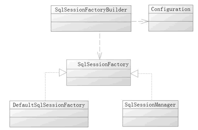

## 概述

### MyBatis简介

`MyBatis` 本是 Apache 的一个开源项目—— `iBatis`，2010 年这个项目由 Apache Software Foundation 迁移到了 Google Code，并且改名为 MyBatis。

MyBatis 是一个基于 Java 的持久层框架。MyBatis 提供的持久层框架包括 SQL Maps 和 Data Access Objects（DAO），它消除了几乎所有的 JDBC 代码和参数的手工设置以及结果集的检索。

MyBatis 使用简单的 XML 或注解用于配置和原始映射，将接口和 Java 的 POJOs（Plain Old Java Objects，普通的 Java 对象）映射成数据库中的记录。

目前，Java 的持久层框架产品有许多，常见的有 Hibernate 和 MyBatis。


### jar文件介绍

[MyBatis 的版本下载](https://github.com/mybatis/mybatis-3/releases)

+ mybatis-3.5.2.jar 					          MyBatis 的核心包
+ ant-1.10.3.jar		                   		 
+ ant-launcher-1.10.3.jar                      
+ asm-7.0.jar			                             Cglib 依赖的包
+ cglib-3.2.10.jar                                    动态代理包
+ commons-logging-1.2.jar                    日志包
+ javassist-3.24.1-GA.jar                       字节码解析包也是 cglib 依赖的包
+ log4j-1.2.17.jar                                    日志包
+ log4j-api-2.11.2.jar                              日志包
+ log4j-core-2.11.2.jar                            日志包
+ ognl-3.2.10.jar                                     OGNL表达式所需要的包,支持EL 
+ slf4j-api-1.7.26.jar                                日志包
+ slf4j-log4j12-1.7.26.jar                         日志包
+ mysql-connector-java-5.1.30.jar           驱动

> 如果是 Web 应用，只需将核心包和依赖包复制到 /WEB-INF/lib 目录中。


### 工作原理	

1. 读取 MyBatis 配置文件：mybatis-config.xml 为 MyBatis 的全局配置文件，配置了 MyBatis 的运行环境等信息，例如数据库连接信息。
2. 加载映射文件。映射文件即 SQL 映射文件，该文件中配置了操作数据库的 SQL 语句，需要在 MyBatis 配置文件 mybatis-config.xml 中加载。mybatis-config.xml 文件可以加载多个映射文件，每个文件对应数据库中的一张表。
3. 构造会话工厂：通过 MyBatis 的环境等配置信息构建会话工厂 SqlSessionFactory。
4. 创建会话对象：由会话工厂创建 SqlSession 对象，该对象中包含了执行 SQL 语句的所有方法。
5. Executor 执行器：MyBatis 底层定义了一个 Executor 接口来操作数据库，它将根据 SqlSession 传递的参数动态地生成需要执行的 SQL 语句，同时负责查询缓存的维护。
6. MappedStatement 对象：在 Executor 接口的执行方法中有一个 MappedStatement 类型的参数，该参数是对映射信息的封装，用于存储要映射的 SQL 语句的 id、参数等信息。
7. 输入参数映射：输入参数类型可以是 Map、List 等集合类型，也可以是基本数据类型和 POJO 类型。输入参数映射过程类似于 JDBC 对 preparedStatement 对象设置参数的过程。
8. 输出结果映射：输出结果类型可以是 Map、 List 等集合类型，也可以是基本数据类型和 POJO 类型。输出结果映射过程类似于 JDBC 对结果集的解析过程。


### 核心组件

MyBatis 的核心组件分为 4 个部分

1. `SqlSessionFactoryBuilder`（构造器）：它会根据配置或者代码来生成 SqlSessionFactory，采用的是分步构建的 Builder 模式。
2. `SqlSessionFactory`（工厂接口）：依靠它来生成 SqlSession，使用的是工厂模式。
3. `SqlSession`（会话）：一个既可以发送 SQL 执行返回结果，也可以获取 Mapper 的接口。在现有的技术中，一般我们会让其在业务逻辑代码中“消失”，而使用的是 MyBatis 提供的 SQL Mapper 接口编程技术，它能提高代码的可读性和可维护性。
4. `SQL Mapper`（映射器）:MyBatis 新设计存在的组件，它由一个 Java 接口和 XML 文件（或注解）构成，需要给出对应的 SQL 和映射规则。它负责发送 SQL 去执行，并返回结果。

> 注意，无论是映射器还是 SqlSession 都可以发送 SQL 到数据库执行


## 创建SqlSessionFactory

### SqlSessionFactory概述

使用 MyBatis 首先是使用配置或者代码去生产 `SqlSessionFactory`，而 MyBatis 提供了构造器 `SqlSessionFactoryBuilder`。

它提供了一个类 org.apache.ibatis.session.Configuration 作为引导，采用的是 Builder 模式。

在 MyBatis 中，既可以通过读取配置的 XML 文件的形式生成 SqlSessionFactory，也可以通过 Java代码的形式去生成 SqlSessionFactory。

> 注意，`SqlSessionFactory` 是一个接口，在 MyBatis 中它存在两个实现类：
>
> + `SqlSessionManager `
> +  `DefaultSqlSessionFactory`。

具体是由 DefaultSqlSessionFactory 去实现的，而 SqlSessionManager 使用在多线程的环境中，它的具体实现依靠 DefaultSqlSessionFactory，它们之间的关系如图所示。



每个基于 MyBatis 的应用都是以一个 SqlSessionFactory 的实例为中心的，而 SqlSessionFactory 唯一的作用就是生产 MyBatis 的核心接口对象 SqlSession，所以它的责任是唯一的。往往会采用单例模式处理它


### XML 构建 SqlSessionFactory

在 MyBatis 中的 XML 分为两类，一类是基础配置文件，通常只有一个，主要是配置一些最基本的上下文参数和运行环境；另一类是映射文件，它可以配置映射关系、SQL、参数等信息。

全局配置文件内容：
创建 src/mybatis-config.xml 文件

```xml
<?xml version="1.0" encoding="UTF-8"?>
<!DOCTYPE configuration
        PUBLIC "-//mybatis.org//DTD Config 3.0//EN"
        "http://mybatis.org/dtd/mybatis-3-config.dtd">

<configuration>
    <!-- default 引用 environment 的 id,当前所使用的环境 -->
    <environments default="defaule">
        <environment id="defaule">
            <!-- 使用原生 JDBC 事务 mybatis会默认开启事务 mybatis默认是关闭自动提交的。-->
            <transactionManager type="JDBC"></transactionManager>
            <dataSource type="POOLED">
                <!-- MySQL数据库驱动 -->
                <property name="driver" value="com.mysql.jdbc.Driver"/>
                <property name="url" value="jdbc:mysql://localhost:3306/ssm?useUnicode=true&amp;characterEncoding=utf8" />
                <property name="username" value="root"/>
                <property name="password" value="ixfosa"/>
            </dataSource>
        </environment>
    </environments>

    <mappers>
        <mapper resource="mapper/FlowerMapper.xml" />
    </mappers>
</configuration>
```

+ `<environment>` 元素的定义，这里描述的是数据库。它里面的 <transactionManager> 元素是配置事务管理器，这里采用的是 MyBatis 的 JDBC 管理器方式。
+ `<dataSource>` 元素配置数据库，其中属性 type="POOLED" 代表采用 MyBatis 内部提供的连接池方式，最后定义一些关于 JDBC 的属性信息。
+ `<mapper>` 元素代表引入的那些映射器

FlowerMapper.xml

```xml
<?xml version="1.0" encoding="UTF-8" ?>
<!DOCTYPE mapper
        PUBLIC "-//mybatis.org//DTD Mapper 3.0//EN"
        "http://mybatis.org/dtd/mybatis-3-mapper.dtd">

<!-- namesapce:理解成实现类的全路径(包名+类名) -->
<mapper namespace="pojo.Flower">
    <!-- id:方法名
		parameterType: 定义参数类型
		resultType: 返回值类型.

		如果方法返回值是list,在resultType中写List的泛型,因为mybatis
		对jdbc封装,一行一行读取数据
	-->
    <select id="selAll" resultType="pojo.Flower">
        select * from flower
    </select>
</mapper>
```


```java
public static void main(String[] args) throws IOException {

    String resoucrce = "mybatis-config.xml";
    InputStream is =  Resources.getResourceAsStream(resoucrce);

    //使用工厂设计模式
    SqlSessionFactory factory = new SqlSessionFactoryBuilder().build(is);

    // 生产SqlSession
    // 在openSession()时，传入true，即可关闭事务
    SqlSession session = factory.openSession();

    List<Flower> flowers = session.selectList("pojo.Flower.selAll");

    System.out.println(flowers);

    session.close();
}
```

> 首先读取 mybatis-config.xml，然后通过 SqlSessionFactoryBuilder 的 Builder 方法去创建 SqlSessionFactory。


### 代码创建 SqlSessionFactory

通过代码来实现与使用 XML 构建 SqlSessionFactory 一样的功能——创建 SqlSessionFactory

```java
public class CodeCreateSqlSessionFactory {
    public static void main(String[] args) {

        PooledDataSource source = new PooledDataSource();
        source.setDriver("com.mysql.jdbc.Driver");
        source.setUrl("jdbc:mysql://localhost:3306/ssm?useUnicode=true&characterEncoding=utf8");
        source.setUsername("root");
        source.setPassword("ixfosa");

        // source.setDefeultAutoCommit(false);

        // 采用 MyBatis 的 JDBC 事务方式
        JdbcTransactionFactory transactionFactory = new JdbcTransactionFactory();
        Environment environment = new Environment("test", transactionFactory, source);

        // 创建 Configuration 对象
        Configuration configuration = new Configuration(environment);

        // 加入一个映射器
        // configuration 添加了一个映射器类（mapper class）。
        // 映射器类是 Java 类，它们包含 SQL 映射语句的注解从而避免依赖 XML 文件。
        configuration.addMapper(FlowerDaoMapper.class);

        // 使用 SqlSessionFactoryBuilder 构建 SqlSessionFactory
        SqlSessionFactory SqlSessionFactory =  new SqlSessionFactoryBuilder().build(configuration);

        // 生产SqlSession
        SqlSession session = SqlSessionFactory.openSession();

        FlowerDaoMapper mapper = session.getMapper(FlowerDaoMapper.class);
		
        List<Flower> flowers = mapper.selAll();
        
        // 也可基础文件中配置 <mapper class="code.dao.FlowerDaoMapper" />
		// List<Flower> flowers = session.selectList("selAll");
        
        System.out.println(flowers);

        session.close();
    }
}
```

映射器类（mapper class）

```java
public interface FlowerDaoMapper {
    @Select("SELECT * FROM flower")
    public List<Flower> selAll();
}
```


## 获取SqlSession及事务控制

### 获取SqlSession

`SqlSession` 完全包含了面向数据库执行 SQL 命令所需的所有方法。

在 MyBatis 中有两个实现类

+ `DefaultSqlSession` 
+ `SqlSessionManager`

DefaultSqlSession 是单线程使用的，而 SqlSessionManager 在多线程环境下使用。SqlSession 的作用类似于一个 JDBC 中的 Connection 对象，代表着一个连接资源的启用。它的作用有 3 个：

- 获取 Mapper 接口。
- 发送 SQL 给数据库。
- 控制数据库事务。

创建方法，从 ` SqlSessionFactory` 创建

```java
SqlSession sqlSession = SqlSessionFactory.openSession();
```

> 注意，SqlSession 只是一个门面接口，它有很多方法，可以直接发送 SQL。在 MyBatis 中，真正干活的是 `Executor`

### 事务控制

每一个 SqlSession 默认都是**不自动提交事务**, 在 mybatis 中默认是关闭了 JDBC 的自动提交功能

在 `openSession()`时 Mybatis 会创建 SqlSession 时同时创建一个 `Transaction`(事务对象),同时 autoCommit 都为 `false`

```java
// 自动提交 JDBC：.setAutoCommit(true);
SqlSession sqlSession = SqlSessionFactoryopenSession(true);

// 提交事务.
sqlSession.commit()
    
// 回滚事务.
sqlSession.rollback()
```


```java
// 定义 SqlSession
SqlSession sqlSession = null;
try {
    // 打开 SqlSession 会话
    sqlSession = SqlSessionFactory.openSession();
    // some code...
    sqlSession.commit();    // 提交事务
} catch (IOException e) {
    sqlSession.rollback();  // 回滚事务
}finally{
    // 在 finally 语句中确保资源被顺利关闭
    if(sqlSession != null){
        sqlSession.close();
    }
}
```

### 三种查询方式

1. `selectList()` 返回值为 `List<resultType>`属性控制

   ```java
   List<resultType> list = session.selectList("namespace.tagIdValue");
   ```

2. `selectOne()` 返回值 `Object`

   适用于返回结果只是变量或一行数据时

   ```java
   Object obj = session.selectOne("namespace.tagIdValue");
   ```

3. `selectMap()` 返回值 `Map`

   + 适用于需要在查询结果中通过某列的值取到这行数据的需求.
   + `Map<key, resultType >`

   ```java
   Map<Object, Object> map = session.selectMap("namespace.tagIdValue", "key");
   ```


## 实现映射器并执行SQL

### 实现映射器简介

映射器是 MyBatis 中最重要、最复杂的组件，它由一个接口和对应的 XML 文件（或注解）组成。它可以配置以下内容：

- 描述映射规则。
- 提供 SQL 语句，并可以配置 SQL 参数类型、返回类型、缓存刷新等信息。
- 配置缓存。
- 提供动态 SQL。

用以下 SQL 语句创建 flower 表

```sql
CREATE TABLE `flower` (
  `id` int NOT NULL AUTO_INCREMENT COMMENT '编号',
  `name` varchar(30) NOT NULL COMMENT '花名',
  `price` float NOT NULL COMMENT '价格',
  `production` varchar(30) NOT NULL COMMENT '原产地',
  PRIMARY KEY (`id`)
) ENGINE=InnoDB AUTO_INCREMENT=2 DEFAULT CHARSET=utf8
```

并且定义一个 POJO

```java
public class Flower {
	private int id;
	private String name;
	private double price;
	private String production;
}
```

映射器的主要作用就是将 SQL 查询到的结果映射为一个 POJO，或者将 POJO 的数据插入到数据库中，并定义一些关于缓存等的重要内容。

> 注意，开发只是一个接口，而不是一个实现类。初学者可能会产生一个很大的疑问，那就是接口不是不能运行吗？
>
> 是的，接口不能直接运行。MyBatis 运用了动态代理技术使得接口能运行起来，


### XML文件形式

基于 XML 映射语句

```java
<?xml version="1.0" encoding="UTF-8" ?>

<!DOCTYPE mapper
        PUBLIC "-//mybatis.org//DTD Mapper 3.0//EN"
        "http://mybatis.org/dtd/mybatis-3-mapper.dtd">

<!-- namesapce:理解成实现类的全路径(包名+类名) -->
<mapper namespace="pojo.Flower">
    
    <!-- id:方法名
		parameterType:定义参数类型
		resultType:返回值类型.

		如果方法返回值是list,在resultType中写List的泛型,因为mybatis
		对jdbc封装,一行一行读取数据
            
        这里采用的是一种被称为自动映射的功能，MyBatis 在默认情况下提供自动映射，
        只要 SQL 返回的列名能和 POJO 对应起来即可。
	-->
    <select id="selAll" resultType="pojo.Flower">
        select * from flower
    </select>
</mapper>
```

XML 方式创建 SqlSession 的配置文件中

```xml
<mappers>
    <mapper resource="mapper/FlowerMapper.xml" />
</mappers>
```

调用映射语句

```java
// SqlSession 发送 SQL
session.selectList("pojo.Flower.selAll");
```


### 注解形式

采用注解方式定义映射器，它只需要一个接口就可以通过 MyBatis 的注解来注入 SQL

```java
public interface FlowerDaoMapper {
    @Select("SELECT * FROM flower")
    List<Flower> selAll();
}
```

这个接口可以在 XML 中定义

```java
<mapper class="code.dao.FlowerDaoMapper" />
// 调用
List<Flower> flowers = session.selectList("selAll");
```

也可以使用 configuration 对象注册这个接口

```java
configuration.addMapper(FlowerDaoMapper.class);
```

调用映射语句

```java
// 用 Mapper 接口发送 SQL
FlowerDaoMapper mapper = session.getMapper(FlowerDaoMapper.class);
List<Flower> flowers = mapper.selAll();
```

### 对比两种发送 SQL 方式

+ SqlSession 发送 SQL
+ 用 Mapper 接口发送 SQL

一种用 SqlSession 直接发送，另外一种通过 SqlSession 获取 Mapper 接口再发送。建议采用 SqlSession 获取 Mapper 的方式，理由如下：

+ 使用 Mapper 接口编程可以消除 SqlSession 带来的功能性代码，提高可读性，而 SqlSession 发送 SQL，需要一个 SQL id 去匹配 SQL，比较晦涩难懂。使用 Mapper 接口，类似 mapper.selAll() 则是完全面向对象的语言，更能体现业务的逻辑。

+ 使用 mapper.selAll() 方式，IDE 会提示错误和校验，而使用 session.selectList("pojo.Flower.selAll"); 语法，只有在运行中才能知道是否会产生错误。


## 作用域以及生命周期

`SqlSessionFactoryBuilder`、`SqlSessionFactory`和`SqlSession`的作用域以及生命周期

+ **SqlSessionFactoryBuilder**

  这个类可以被实例化、使用和丢弃，一旦创建了 SqlSessionFactory，就不再需要它了。 因此 SqlSessionFactoryBuilder 实例的最佳作用域是方法作用域（也就是局部方法变量）。 你可以重用 SqlSessionFactoryBuilder 来创建多个 SqlSessionFactory 实例，但是最好还是不要让其一直存在，以保证所有的 XML 解析资源可以被释放给更重要的事情。

+ **SqlSessionFactory**

  SqlSessionFactory 一旦被创建就应该在应用的运行期间一直存在，没有任何理由丢弃它或重新创建另一个实例。 使用 SqlSessionFactory 的最佳实践是在应用运行期间`不要重复创建多次`，多次重建 SqlSessionFactory 被视为一种代码“坏味道（bad smell）”。因此 SqlSessionFactory 的最佳作用域是应用作用域。 有很多方法可以做到，最简单的就是使用单例模式或者静态单例模式。

+ **SqlSession**

  每个线程都应该有它自己的 SqlSession 实例。SqlSession 的实例不是线程安全的，因此是不能被共享的，所以它的最佳的作用域是请求或方法作用域。 绝对不能将 SqlSession 实例的引用放在一个类的静态域，甚至一个类的实例变量也不行。 也绝不能将 SqlSession 实例的引用放在任何类型的托管作用域中，比如 Servlet 框架中的 HttpSession。 如果你现在正在使用一种 Web 框架，要考虑 SqlSession 放在一个和 HTTP 请求对象相似的作用域中。 换句话说，每次收到的 HTTP 请求，就可以打开一个 SqlSession，返回一个响应，就关闭它。 这个关闭操作是很重要的，你应该把这个关闭操作放到 finally 块中以确保每次都能执行关闭。 下面的示例就是一个确保 SqlSession 关闭的标准模式：

  ```java
  // 所有的代码中一致地使用这种模式来保证所有数据库资源都能被正确地关闭。
  try (SqlSession session = sqlSessionFactory.openSession()) {
    // 应用逻辑代码
  }
  ```

  + **映射器实例**

    映射器是一些由你创建的、绑定你映射的语句的接口。映射器接口的实例是从 SqlSession 中获得的。因此从技术层面讲，任何映射器实例的最大作用域是和请求它们的 SqlSession 相同的。尽管如此，映射器实例的最佳作用域是方法作用域。 也就是说，映射器实例应该在调用它们的方法中被请求，用过之后即可丢弃。 并不需要显式地关闭映射器实例，尽管在整个请求作用域保持映射器实例也不会有什么问题，但是你很快会发现，像 SqlSession 一样，在这个作用域上管理太多的资源的话会难于控制。 为了避免这种复杂性，最好把映射器放在方法作用域内。下面的示例就展示了这个实践：

  ```java
  try (SqlSession session = sqlSessionFactory.openSession()) {
      FlowerDaoMapper mapper = session.getMapper(FlowerDaoMapper.class);
      // 应用逻辑代码
  }
  ```

  

## 配置

### 概述

```xml
<?xml version="1.0" encoding="utf-8"?>
<!DOCTYPE configuration PUBLIC "-//mybatis.org//DTD Config 3.0//EN"
"http://mybatis.org/dtd/mybatis-3-config.dtd">
<configuration><!-- 配置 -->
    <properties /><!-- 属性 -->
    <settings /><!-- 设置 -->
    <typeAliases /><!-- 类型命名 -->
    <typeHandlers /><!-- 类型处理器 -->
    <objectFactory /><!-- 对象工厂 -->
    <plugins /><!-- 插件 -->
    <environments><!-- 配置环境 -->
        <environment><!-- 环境变量 -->
            <transactionManager /><!-- 事务管理器 -->
            <dataSource /><!-- 数据源 -->
        </environment>
    </environments>
    <databaseIdProvider /><!-- 数据库厂商标识 -->
    <mappers /><!-- 映射器 -->
</configuration>
```

> 注意:  MyBatis 配置项的顺序不能颠倒。如果颠倒了它们的顺序，那么在 MyBatis 启动阶段就会发生异常，导致程序无法运行。


### 属性（properties）

properties 属性可以给系统配置一些运行参数，可以放在 XML 文件或者 properties 文件中，而不是放在 Java 编码中，这样的好处在于方便参数修改，而不会引起代码的重新编译。一般而言，MyBatis 提供了 3 种方式让我们使用 properties，它们是：

- property 子元素。
- properties 文件。
- 程序代码传递。

如果属性在不只一个地方进行了配置，那么 MyBatis 将按照下面的顺序来加载：

- 在 properties 元素体内指定的属性首先被读取。
- 然后根据 properties 元素中的 resource 属性读取类路径下属性文件或根据 url 属性指定的路径读取属性文件，并覆盖已读取的同名属性。
- 最后读取作为方法参数传递的属性，并覆盖已读取的同名属性。因此，通过方法参数传递的属性具有最高优先级，resource/url 属性中指定的配置文件次之，最低优先级的是 properties 属性中指定的属性。


#### property子元素和properties文件

这些属性都是可外部配置且可动态替换的，既可以在典型的 Java 属性文件中配置，亦可通过 properties 元素的子元素来传递。

```properties
# jdbc.properties 文件：
database.username=root
database.password=ixfosa
```

在 MyBatis 中通过 `<properties>` 的属性 resource 来引入 properties 文件。

```xml
<?xml version="1.0" encoding="UTF-8"?>
<!DOCTYPE configuration
        PUBLIC "-//mybatis.org//DTD Config 3.0//EN"
        "http://mybatis.org/dtd/mybatis-3-config.dtd">

<configuration>
    <!-- property 子元素 -->
    <properties resource="config/jdbc.properties">
        <property name="driver" value="com.mysql.jdbc.Driver"/>
        <property name="url" value="jdbc:mysql://localhost:3306/ssm?useUnicode=true&amp;characterEncoding=utf8"/>
    </properties>
    
    <environments default="default">
        <environment id="default">
            <transactionManager type="JDBC"></transactionManager>
            <dataSource type="POOLED">
                <!--  driver 和 url 属性将会由 properties 子元素中设置的相应值来替换 -->
                <property name="driver" value="${database.driver}"/>
                <property name="url" value="${database.url}"/>
                
                <!--username 和 password 将会由 config.properties文件中对应的值来替换。-->
                <property name="username" value="${username}"/>
                <property name="password" value="${database.password}"/>
            </dataSource>
        </environment>
    </environments>
</configuration>
```

#### 使用程序传递方式传递参数

属性也可以被传递到 SqlSessionFactoryBuilder.build()方法中。

```java
SqlSessionFactory factory = new SqlSessionFactoryBuilder().build(reader, props);
 
// ... 或者 ...
 
SqlSessionFactory factory = new SqlSessionFactoryBuilder().build(reader, environment, props);
```

在真实的生产环境中，数据库的用户密码是对开发人员和其他人员保密的。运维人员为了保密，一般都需要把用户和密码经过加密成为密文后，配置到 properties 文件中。

现在假设系统已经为提供了这样的一个 CodeUtils.decode（str）进行解密，那么我们在创建 SqlSessionFactory 前，就需要把用户名和密码解密，然后把解密后的字符串重置到 properties 属性中

```java
//  CodeUtils.decode:
public class CodeUtils {
    public static String deCode(String str) {
        return str + "a";
    }
}
```

```properties
# config/jdbc.properties 文件：
database.username=root
# 实际 password = ixfosa
database.password=ixfos
```

```xml
<?xml version="1.0" encoding="UTF-8"?>
<!DOCTYPE configuration
        PUBLIC "-//mybatis.org//DTD Config 3.0//EN"
        "http://mybatis.org/dtd/mybatis-3-config.dtd">

<configuration>
    <!-- property 子元素 -->
    <properties resource="config/jdbc.properties">
        <property name="driver" value="com.mysql.jdbc.Driver"/>
        <property name="url" value="jdbc:mysql://localhost:3306/ssm?useUnicode=true&amp;characterEncoding=utf8"/>
    </properties>

    <environments default="default">
        <environment id="default">
            <transactionManager type="JDBC"></transactionManager>
            <dataSource type="POOLED">
                <!--  driver 和 url 属性将会由 properties 子元素中设置的相应值来替换 -->
                <property name="driver" value="${database.driver}"/>
                <property name="url" value="${database.url}"/>

                <!--username 和 password 将会由 config.properties文件中对应的值来替换。-->
                <property name="username" value="${username}"/>
                <property name="password" value="${database.password}"/>
            </dataSource>
        </environment>
    </environments>
</configuration>
```

现在假设系统已经为提供了这样的一个 CodeUtils.decode（str）进行解密，那么我们在创建 SqlSessionFactory 前，就需要把用户名和密码解密，然后把解密后的字符串重置到 properties 属性中，如下所示。

```java
public class PropertiesTest {
    public static void main(String[] args) throws IOException {

        InputStream in = Resources.getResourceAsStream("config/jdbc.properties");
        Properties props = new Properties();
        props.load(in);

        String username = props.getProperty("database.username");
        String password = props.getProperty("database.password");

        System.out.println(username + " " + password);

        //解密用户和密码，并在属性中重置
        props.put("database.username", username);
        props.put ("database.password", CodeUtils.deCode(password));

        InputStream inputstream = Resources.getResourceAsStream("mybatis-config.xml");
        
        //使用程递的方式覆盖原有的properties属性参数
        SqlSessionFactory factory = new SqlSessionFactoryBuilder().build(inputstream, props);
        
        System.out.println(factory);
    }
}
```

#### 占位符

从 MyBatis 3.4.2 开始，你可以为占位符指定一个默认值。例如：

```xml
<properties resource="org/mybatis/example/config.properties">
  <!-- 启用默认值特性 占位符默认为 : -->
  <property name="org.apache.ibatis.parsing.PropertyParser.enable-default-value" value="true"/> 
</properties>
```

提示 如果已经使用 `":"` 作为属性的键（如：`db:username`） ，或者已经在 SQL 定义中使用 OGNL 表达式的三元运算符（如： `${tableName != null ? tableName : 'global_constants'}`），应该通过设置特定的属性来修改分隔键名和默认值的字符。例如：

```xml
<properties resource="org/mybatis/example/config.properties">
  <!-- ... -->
  <property name="org.apache.ibatis.parsing.PropertyParser.default-value-separator" value="?:"/> <!-- 修改默认值的分隔符 -->
</properties>
```

```xml
<dataSource type="POOLED">
  <!-- 如果属性 'db:username' 没有被配置，'username' 属性的值将为 'ut_user' -->	
  <property name="username" value="${db:username?:ut_user}"/>
</dataSource>
```

### 设置（settings）

在 MyBatis 中 settings 是最复杂的配置，它能深刻影响 MyBatis 底层的运行，但是在大部分情况下使用默认值便可以运行，所以在大部分情况下不需要大量配置它，只需要修改一些常用的规则即可，比如自动映射、驼峰命名映射、级联规则、是否启动缓存、执行器（Executor）类型等。

```xml
<settings>
    <!-- 影响所有映射器中配置缓存的全局开关 -->
    <setting name="cacheEnabled" value="true"/>
    
    <!-- 延迟加载的全局开关。当开启时，所有关联对象都会延迟加载。在特定关联关系中可通过设置 		   			fetchType 属性来覆盖该项的开关状态 --> 
    <setting name="lazyLoadingEnabled" value="true"/>
    
    <!-- 是否允许单一语句返回多结果集（需要兼容驱动）-->
    <setting name="multipleResultSetsEnabled" value="true"/>
    
    <!-- 使用列标签代替列名。不同的驱动会有不同的表现，具体可参考相关驱动文档或通过测试这两种不同的模			式来观察所用驱动的结果 -->
    <setting name="useColumnLabel" value="true"/>
    
    <!-- 允许JDBC 支持自动生成主键，需要驱动兼容。如果设置为 true，则这个设置强制使用自动生成主键，			尽管一些驱动不能兼容但仍可正常工作（比如 Derby）-->
    <setting name="useGeneratedKeys" value="false"/>
    
    <!-- 指定 MyBatis 应如何自动映射列到字段或属性。
		NONE 表示取消自动映射。
		PARTIAL 表示只会自动映射，没有定义嵌套结果集和映射结果集。
		FULL 会自动映射任意复杂的结果集（无论是否嵌套）-->
    <setting name="autoMappingBehavior" value="PARTIAL"/>
    
    <!-- 指定自动映射当中未知列（或未知属性类型）时的行为。 默认是不处理，只有当日志级别达到 WARN 级		   别或者以下，才会显示相关日志，如果处理失败会抛出 SqlSessionException 异常 -->
    <setting name="autoMappingUnknownColumnBehavior" value="WARNING"/>
    
    <!-- 配置默认的执行器。SIMPLE 是普通的执行器；REUSE 会重用预处理语句（prepared 					 statements）；BATCH 执行器将重用语句并执行批量更新 	-->
    <setting name="defaultExecutorType" value="SIMPLE"/>
    
    <!-- 设置超时时间，它决定驱动等待数据库响应的秒数 -->
    <setting name="defaultStatementTimeout" value="25"/>
    
    <!-- 设置数据库驱动程序默认返回的条数限制，此参数可以重新设置 -->
    <setting name="defaultFetchSize" value="100"/>
    
    <!-- 允许在嵌套语句中使用分页（ResultHandler）。如果允许，设置false -->
    <setting name="safeRowBoundsEnabled" value="false"/>
    
    <!-- 是否开启自动驼峰命名规则映射，即从经典数据库列名 A_COLUMN 到经典 Java 属性名 aColumn 的		  类似映射 -->
    <setting name="mapUnderscoreToCamelCase" value="false"/>
    
    <!-- MyBatis 利用本地缓存机制（Local Cache）防止循环引用（circular references）和加速联复		   嵌套査询。
		 默认值为 SESSION，这种情况下会缓存一个会话中执行的所有查询。若设置值为 STATEMENT，本地会          话仅用在语句执行上，对相同 SqlScssion 的不同调用将不会共享数据  -->	
    <setting name="localCacheScope" value="SESSION"/>
    
    <!-- 当没有为参数提供特定的 JDBC 类型时，为空值指定 JDBC 类型。某些驱动需要指定列的 JDBC 类		  型，多数情况直接用一般类型即可，比如 NULL、VARCHAR 或 OTHER -->
    <setting name="jdbcTypeForNull" value="OTHER"/>
    
    <!-- 指定哪个对象的方法触发一次延迟加载 -->
    <setting name="lazyLoadTriggerMethods" value="equals,clone,hashCode,toString"/>
    
    <!-- 指定 MyBatis 所用日志的具体实现，未指定时将自动査找 -->
    <setting name="loglmpl" value="equals,clone,hashCode,toString"/>
    
    <!-- // ..... -->
</settings>
```


### 类型别名（typeAliases）

由于类的全限定名称很长，需要大量使用的时候，总写那么长的名称不方便。在 MyBatis 中允许定义一个简写来代表这个类，这就是别名，别名分为系统定义别名和自定义别名。

#### 系统定义别名

在 MyBatis 的初始化过程中，系统自动初始化了一些别名，它们都是不区分大小写的, 如下表所示。

| 别名       | Java 类型  | 是否支持数组 |
| ---------- | ---------- | ------------ |
| _byte      | byte       | 是           |
| _long      | long       | 是           |
| _short     | short      | 是           |
| _int       | int        | 是           |
| _integer   | int        | 是           |
| _double    | double     | 是           |
| _float     | float      | 是           |
| _boolean   | boolean    | 是           |
| string     | String     | 是           |
| byte       | Byte       | 是           |
| long       | Long       | 是           |
| short      | Short      | 是           |
| int        | Integer    | 是           |
| integer    | Integer    | 是           |
| double     | Double     | 是           |
| float      | Float      | 是           |
| boolean    | Boolean    | 是           |
| date       | Date       | 是           |
| decimal    | BigDecimal | 是           |
| bigdecimal | BigDecimal | 是           |
| object     | Object     | 是           |
| map        | Map        | 否           |
| hashmap    | HashMap    | 否           |
| list       | List       | 否           |
| arraylist  | ArrayList  | 否           |
| collection | Collection | 否           |
| iterator   | Iterator   | 否           |
| ResultSet  | ResultSet  | 否           |

如果需要使用对应类型的数组型，要看其是否能支持数据，如果支持只需要使用别名加`[]`即可，比如 _int 数组的别名就是 `_int[]`。而类似 list 这样不支持数组的别名，则不能那么写。

#### 自定义别名

可以采用配置文件或者扫描方式来自定义

使用配置文件定义:

```xml
<typeAliases><!--别名-->
    <typeAlias alias="role" type="com.mybatis.po.Role"/>
    <typeAlias alias="user" type="com.mybatis.po.User"/>
</typeAliases>
```

当这样配置时，`role`可以用在任何使用 `com.mybatis.po.Role` 的地方。

如果有很多类需要定义别名，那么用这样的方式进行配置可就不那么轻松了。MyBatis 还支持扫描别名。比如上面的两个类都在包 com.mybatis.po 之下，那么就可以定义为：

```xml
<typeAliases><!--别名-->
    <package name="com.mybatis.po"/>
</typeAliases>
```

这样 MyBatis 将扫描这个包里面的类，将其第一个字母变为小写作为其别名，比如类 Role 的别名会变为 role，而 User 的别名会变为 user。使用这样的规则，有时候会出现重名。

比如 com.mybatis.po.User 这个类，MyBatis 还增加了对包 com.mybatis.po 的扫描，那么就会出现异常，这个时候可以使用 MyBatis 提供的注解 @Alias（"user3"）进行区分，如下所示。

```java
package com.mybatis.po;

@Alias("user3")
public Class User {
    // ......
}
```


### 类型处理器（typeHandlers）

#### 概述

在 JDBC 中，需要在 PreparedStatement 对象中设置那些已经预编译过的 SQL 语句的参数。执行 SQL 后，会通过 ResultSet 对象获取得到数据库的数据，而这些 MyBatis 是根据数据的类型通过 typeHandler 来实现的。

在 typeHandler 中，分为 jdbcType 和 javaType，其中 jdbcType 用于定义数据库类型，而 javaType 用于定义 Java类型，那么 typeHandler 的作用就是承担 jdbcType 和 javaType 之间的相互转换。

在很多情况下我们并不需要去配置 typeHandler、jdbcType、javaType，因为 MyBatis 会探测应该使用什么类型的 typeHandler 进行处理，但是有些场景无法探测到。

对于那些需要使用自定义枚举的场景，或者数据库使用特殊数据类型的场景，可以使用自定义的 typeHandler 去处理类型之间的转换问题。

和别名一样，在 MyBatis 中存在系统定义 typeHandler 和自定义 typeHandler。MyBatis 会根据 javaType 和数据库的 jdbcType 来决定采用哪个 typeHandler 处理这些转换规则。系统提供的 typeHandler 能覆盖大部分场景的要求，但是有些情况下是不够的，比如我们有特殊的转换规则，枚举类就是这样。

#### 系统定义的TypeHandler

在 MyBatis 中 typeHandler 都要实现接口 `org.apache.ibatis.type.TypeHandler`，首先让我们先看看这个接口的定义，如下所示。

```java
public interface TypeHandler<T>
    void setParameter(PreparedStatement ps, int i, T parameter, jdbcType jdbcType)
    throws SQLException;
    T getResult(ResultSet rs, String columnName) throws SQLException;
    T getResult(ResultSet rs, int columnIndex) throws SQLException;
    T getResult(CallableStatement cs, int columnIndex) throws SQLException;
}
```

+ 其中 `T` 是泛型，专指 javaType，比如我们需要 String 的时候，那么实现类可以写为 implements TypeHandler<String>。

+ `setParameter` 方法，是使用 typeHandler 通过 PreparedStatement 对象进行设置 SQL 参数的时候使用的具体方法，其中 i 是参数在 SQL 的下标，parameter 是参数，jdbcType 是数据库类型。

+ 其中有 3 个 getResult 的方法，它的作用是从 JDBC 结果集中获取数据进行转换，要么使用列名（columnName）要么使用下标（columnIndex）获取数据库的数据，其中最后一个 getResult 方法是存储过程专用的。

 MyBatis 系统的 typeHandler 是如何实现的，它们都继承了 org.apache.ibatis.type.BaseTypeHandler


#### 自定义TypeHandler

可以重写类型处理器或创建你自己的类型处理器来处理不支持的或非标准的类型。 具体做法为：实现 `org.apache.ibatis.type.TypeHandler` 接口， 或继承一个很便利的类 `org.apache.ibatis.type.BaseTypeHandler`， 然后可以选择性地将它映射到一个 JDBC 类型。

```java
// ExampleTypeHandler.java
@MappedJdbcTypes(JdbcType.VARCHAR)
public class ExampleTypeHandler extends BaseTypeHandler<String> {
 
  @Override
  public void setNonNullParameter(PreparedStatement ps, int i, String parameter, JdbcType jdbcType) throws SQLException {
    ps.setString(i, parameter);
  }
 
  @Override
  public String getNullableResult(ResultSet rs, String columnName) throws SQLException {
    return rs.getString(columnName);
  }
 
  @Override
  public String getNullableResult(ResultSet rs, int columnIndex) throws SQLException {
    return rs.getString(columnIndex);
  }
 
  @Override
  public String getNullableResult(CallableStatement cs, int columnIndex) throws SQLException {
    return cs.getString(columnIndex);
  }
}
```


仿造一个  StringTypeHandler 来实现一个自定义的 typeHandler——MyTypeHandler，它只是用于实现接口 typeHandler，如下所示。

```java
package com.mybatis.test;
import java.sql.CallableStatement;
import java.sql.PreparedStatement;
import java.sql.SQLException;
import java.sql.ResultSet;
import org.apache.ibatis.type.JdbcType;
import org.apache.ibatis.type.TypeHandler;
import org.apache.log4j.Logger;


public class MyTypeHandler implements TypeHandler<String> {
    Logger logger = Logger.getLogger(MyTypeHandler.class);
    
    @Override
    public void setParameter(PreparedStatement ps, int i, String parameter,
            JdbcType jdbcType) throws SQLException {
        logger.info("设置 string 参数【" + parameter + "】");
        ps.setString(i, parameter);
    }
    
    @Override
    public String getResult(ResultSet rs, String columnName)
            throws SQLException {
        String result = rs.getString(columnName);
        logger.info("读取 string 参数 1 【" + result + "】");
        return result;
    }
    
    @Override
    public String getResult(ResultSet rs, int columnIndex) throws SQLException {
        String result = rs.getString(columnIndex);
        logger.info("读取string 参数 2【" + result + "】");
        return result;
    }
    
    @Override
    public String getResult(CallableStatement cs, int columnIndex)
            throws SQLException {
        String result = cs.getString(columnIndex);
        logger.info("读取 string 参数 3 【" + result + "】");
        return result;
    }
}
```

定义的 typeHandler 泛型为 String，把数据库的数据类型转化为 String 型，然后实现设置参数和获取结果集的方法。但是这个时候还没有启用 typeHandler，它还需要做如下所示的配置。

```xml
<typeHandlers>
    <typeHandler jdbcType="VARCHAR" javaType="string" handler="com.mybatis.test.MyTypeHandler"/>
</typeHandlers>
```

配置完成后系统才会读取它，这样注册后，当 jdbcType 和 javaType 能与 MyTypeHandler 对应的时候，它就会启动 MyTypeHandler。有时候还可以显式启用 typeHandler，一般而言启用这个 typeHandler 有两种方式，如下所示。

```xml
....
<resultMap id="roleMapper" type="role">
    <result property="id" column="id"/>
    <result property="roleName" column="role_name" jdbcType="VARCHAR" javaType="string"/>
    <result property="note" column="note" typeHandler=" com.mybatis.test.MyTypeHandler"/>
</resultMap>

<select id="getRole" parameterType="long" resultMap="roleMapper">
    select id,role_name,note from t_role where id = #{id}
</select>

<select id="findRoles" parameterType="string" resultMap="roleMapper">
    select id, role_name, note from t_role
    where role_name like concat('%',#{roleName, jdbcType=VARCHAR,
    javaType=string}, '%')
</select>

<select id="findRoles2" parameterType="string" resultMap="roleMapper">
    select id, role_name, note from t_role
    where note like concat ('%', # {note, typeHandler=com.mybatis.test.MyTypeHandler},'%')
</select>
......
```

> 注意，要么指定了与自定义 typeHandler 一致的 jdbcType 和 javaType，要么直接使用 typeHandler 指定具体的实现类。

在一些因为数据库返回为空导致无法断定采用哪个 typeHandler 来处理，而又没有注册对应的 javaType 的 typeHandler 时，MyBatis 无法知道使用哪个 typeHandler 转换数据，可以采用这样的方式来确定采用哪个 typeHandler 处理，这样就不会有异常出现了。

有时候由于枚举类型很多，系统需要的 typeHandler 也会很多，如果采用配置也会很麻烦，这个时候可以考虑使用包扫描的形式，那么就需要按照以下代码配置了。

```xml
<typeHandlertype>
    <package name="com.mybatis.test"/>
</typeHandlertype>
```

只是这样就没法指定 jdbcType 和 javaType 了，不过我们可以使用注解来处理它们。我们把 MyTypeHandler 的声明修改一下，如下所示。

```java
@MappedTypes(String.class)
@MappedjdbcTypes(jdbcType.VARCHAR)
public class MyTypeHandler implements TypeHandler<String>{
   // ......
}
```


#### 枚举TypeHandler

在绝大多数情况下，typeHandler 因为枚举而使用，MyBatis 已经定义了两个类作为枚举类型的支持，这两个类分别是：

- EnumOrdinalTypeHandler。
- EnumTypeHandler。

因为它们的作用不大，所以在大部分情况下，我们都不用它们，不过我们还是要稍微了解一下它们的用法。在此之前，先来建一个性别枚举类——SexEnum，代码如下所示。

```java
package typehandler.po;

public enum SexEnum {

    MALE(1, "男"),
    FEMALE(0, "女");

    private int id;
    private String name;

    public int getId() {
        return id;
    }

    public void setId(int id) {
        this.id = id;
    }

    public String getName() {
        return name;
    }

    public void setName(String name) {
        this.name = name;
    }


    SexEnum(int id, String name) {
        this.id = id;
        this.name = name;
    }
    public static SexEnum getSexById(int id) {
        for (SexEnum sex : SexEnum.values()) {
            if (sex.getId() == id) {
                return sex;
            }
        }
        return null;
    }
}
```

为了使用这个关于性别的枚举，可用以下 sql 语句创建 myUser 表。

```sql
CREATE TABLE `myuser` (
  `id` bigint(20) NOT NULL,
  `name` varchar(20) DEFAULT NULL,
  `age` INT(1) NOT NULL,
  `sex` char(1) DEFAULT NULL,

  PRIMARY KEY (`id`)
) ENGINE=InnoDB DEFAULT CHARSET=utf8;

-- 插入一条数据，执行的 SQL 如下：
INSERT INTO `myuser` (`id`,`name`,`age`,`sex`) VALUES(1,'ixfosa',22,'0');
```

再创建一个用户 POJO，如下所示。

```java
public class User {
    private long id;
    private String name;
    private int age;
    private SexEnum sex;
}
```

进行接口绑定的接口

```java
public interface UserMapper {

    User getUser(long id);

    User getUser2(long id);
    
    User getUser3(long id);
}
```

##### EnumOrdinalTypeHandler

EnumOrdinalTypeHandler 是按 MyBatis 根据`枚举数组下标索引`的方式进行匹配的，也是枚举类型的默认转换类，它要求数据库返回一个整数作为其下标，它会根据下标找到对应的枚举类型。

根据这条规则，可以创建一个 UserMapper.xml 作为测试的例子，如下所示。

```xml
<?xml version="1.0" encoding="UTF-8"?>
<!DOCTYPE mapper
    PUBLIC "-//mybatis.org//DTD Mapper 3.0//EN"
    "http://mybatis.org/dtd/mybatis-3-mapper.dtd">

<mapper namespace="typehandler.mapper.UserMapper">
    <resultMap id="userMap"  type="user">
        <id property="id" column="id" />
        <result property="name" column="id" />
        <result property="age" column="age" />
        <result property="sex" column="sex" typeHandler="org.apache.ibatis.type.EnumOrdinalTypeHandler"
    </resultMap>

    <select id="getUser" resultMap="userMap" resultType="long">
        select id, name, age, sex  where id=#{id}
    </select>
</mapper>
```

```java
public class MyBatisTest {

    public static void main(String[] args) throws IOException {
        InputStream is = Resources.getResourceAsStream("mybatis.xml");
        SqlSessionFactory factory = new SqlSessionFactoryBuilder().build(is);

        SqlSession sqlSession = factory.openSession();

        UserMapper mapper = sqlSession.getMapper(UserMapper.class);

        User user = mapper.getUser(1L);

        System.out.println(user.getSex().getName()); // 女
    }
}
```


##### EnumTypeHandler

EnumTypeHandler 会把使用的名称转化为对应的枚举，比如它会根据数据库返回的字符串“MALE”，进行 Enum.valueOf（SexEnum.class,"MALE"）；转换，所以为了测试 EnumTypeHandler 的转换，我们把数据库的 sex 字段修改为字符型（varchar（10）），并把 sex=1 的数据修改为 FEMALE，于是可以执行以下 SQL。

```sql
ALTER TABLE myuser MODIFY sex VARCHAR(10);
UPDATE myuser SET sex='MALE' WHERE SEX = 0;
```

```xml

<mapper namespace="typehandler.mapper.UserMapper">
     <!-- EnumOrdinalTypeHandler -->
    <resultMap id="userMap"  type="user">
        <id property="id" column="id" />
        <result property="name" column="id" />
        <result property="age" column="age" />
        <result property="sex" column="sex" typeHandler="org.apache.ibatis.type.EnumOrdinalTypeHandler" />
    </resultMap>

    <!-- EnumTypeHandler -->
    <resultMap id="userMap2"  type="user">
        <id property="id" column="id" />
        <result property="name" column="id" />
        <result property="age" column="age" />
        <result property="sex" column="sex" typeHandler="org.apache.ibatis.type.EnumTypeHandler" />
    </resultMap>

    <select id="getUser" resultMap="userMap" parameterType="long">
        select id, name, age, sex from myuser where id=#{id}
    </select>

    <select id="getUser2" resultMap="userMap2" parameterType="long">
        select id, name, age, sex from myuser where id=#{id}
    </select>
</mapper>
```


##### 自定义枚举 typeHandler

MyBatis 内部提供的两种转换的 typeHandler，但是它们有很大的局限性，更多的时候我们希望使用自定义的 typeHandler。执行下面的 SQL，把数据库的 sex 字段修改为整数型。

```sql
UPDATE myuser SET sex='0' WHERE sex = 'FEMALE';
UPDATE myuser SET sex='1' WHERE sex = 'MALE';
ALTER TABLE myuser MODIFY sex INT(10);
```

此时，按 SexEnum 的定义，sex=1 为男性，sex=0 为女性。为了满足这个规则，让我们自定义一个 SexEnumTypeHandler，如下所示。

```java
<?xml version="1.0" encoding="UTF-8"?>
<!DOCTYPE mapper
    PUBLIC "-//mybatis.org//DTD Mapper 3.0//EN"
    "http://mybatis.org/dtd/mybatis-3-mapper.dtd">

    <!-- 自定义枚举 TypeHandler -->
    <resultMap id="userMap3"  type="user">
        <id property="id" column="id" />
        <result property="name" column="id" />
        <result property="age" column="age" />
        <result property="sex" column="sex" typeHandler="typehandler.po.SexEnumTypeHandler" />
    </resultMap>

    <select id="getUser3" resultMap="userMap3" parameterType="long">
        select id, name, age, sex from myuser where id=#{id}
    </select>
</mapper>
```

```java
package typehandler.test;


import org.apache.ibatis.io.Resources;
import org.apache.ibatis.session.SqlSession;
import org.apache.ibatis.session.SqlSessionFactory;
import org.apache.ibatis.session.SqlSessionFactoryBuilder;
import typehandler.mapper.UserMapper;
import typehandler.pojo.User;

import java.io.IOException;
import java.io.InputStream;

/**
 * Created by ixfosa on 2021/3/24 16:35
 */
public class MyBatisTest {

    public static void main(String[] args) throws IOException {
        InputStream is = Resources.getResourceAsStream("mybatis.xml");
        SqlSessionFactory factory = new SqlSessionFactoryBuilder().build(is);

        SqlSession sqlSession = factory.openSession();

        UserMapper mapper = sqlSession.getMapper(UserMapper.class);

        // EnumTypeHandler
        // User user = mapper.getUser(1L);

        // User user = mapper.getUser2(1L);
        // System.out.println(user.getSex().getName()); // 男

        User user = mapper.getUser3(1L);
        System.out.println(user);
        // User{id=1, name='1', age=22, sex=MALE}
    }
}
```


### 对象工厂（objectFactory）

当创建结果集时，MyBatis 会使用一个对象工厂来完成创建这个结果集实例。在默认的情况下，MyBatis 会使用其定义的对象工厂 ——DefaultObjectFactory（org.apache.ibatis.reflection.factory.DefaultObjectFactory）来完成对应的工作。

MyBatis 允许注册自定义的 ObjectFactory。如果自定义，则需要实现接口 org.apache.ibatis.reflection.factory.ObjectFactory，并给予配置。

在大部分的情况下，都不需要自定义返回规则，因为这些比较复杂而且容易出错，在更多的情况下，都会考虑继承系统已经实现好的 `DefaultObjectFactory `，通过一定的改写来完成我们所需要的工作，如下所示。

ObjectFactory 接口很简单，它包含两个创建用的方法，一个是处理默认构造方法的，另外一个是处理带参数的构造方法的。 最后，setProperties 方法可以被用来配置 ObjectFactory，在初始化你的 ObjectFactory 实例后， objectFactory 元素体中定义的属性会被传递给 setProperties 方法。

```java
package objectfactory;

import org.apache.ibatis.reflection.factory.DefaultObjectFactory;

import java.util.List;
import java.util.Properties;

/**
 * Created by ixfosa on 2021/3/24 17:31
 */
public class MyObjectFactory extends DefaultObjectFactory {

    private Object temp = null;

    @Override
    public <T> T create(Class<T> type) {
        T result = super.create(type);
        System.out.println("创建对象：" + result.toString());
        System.out.println("是否和上次创建的是同一个对象：【" + (temp == result) + "】");
        return result;
    }

    @Override
    public <T> T create(Class<T> type, List<Class<?>> constructorArgTypes, List<Object> constructorArgs) {
        T result = super.create(type, constructorArgTypes, constructorArgs);
        System.out.println("创建对象：" + result.toString());
        temp = result;
        return result;
    }

    @Override
    public <T> boolean isCollection(Class<T> type) {
        return super.isCollection(type);
    }

    @Override
    public void setProperties(Properties properties) {
        super.setProperties(properties);
        System.out.println("初始化参数：【" + properties.toString() + "】");
    }
}

```

```xml
<objectFactory type="objectfactory.MyObjectFactory">
        <property name="prop1" value="value1" />
</objectFactory>
```

```java
package objectfactory;

import org.apache.ibatis.io.Resources;
import org.apache.ibatis.session.SqlSession;
import org.apache.ibatis.session.SqlSessionFactory;
import org.apache.ibatis.session.SqlSessionFactoryBuilder;
import typehandler.mapper.UserMapper;
import typehandler.pojo.User;

import java.io.IOException;
import java.io.InputStream;

/**
 * Created by ixfosa on 2021/3/24 17:41
 */
public class MyBatisTest {
    public static void main(String[] args) throws IOException {
        InputStream is = Resources.getResourceAsStream("mybatis.xml");

        SqlSessionFactory factory = new SqlSessionFactoryBuilder().build(is);
        SqlSession sqlSession = factory.openSession();

        UserMapper mapper = sqlSession.getMapper(UserMapper.class);

        User user = mapper.getUser(1L);

        System.out.println(user);
    }
}

初始化参数：【{prop1=value1}】
创建对象：[]
创建对象：[]
是否和上次创建的是同一个对象：【true】
创建对象：User{id=0, name='null', age=0, sex=null}
创建对象：User{id=0, name='null', age=0, sex=null}
是否和上次创建的是同一个对象：【true】
User{id=1, name='1', age=22, sex=FEMALE}
```


### 环境配置（environments）

#### 概述

在 MyBatis 中，运行环境主要的作用是配置数据库信息，它可以配置多个数据库，一般而言只需要配置其中的一个就可以了。

> **不过要记住：尽管可以配置多个环境，但每个 SqlSessionFactory 实例只能选择一种环境。**

所以，如果你想连接两个数据库，就需要创建两个 SqlSessionFactory 实例，每个数据库对应一个。而如果是三个数据库，就需要三个实例，依此类推，记起来很简单：

+ **每个数据库对应一个 SqlSessionFactory 实例**为了指定创建哪种环境，只要将它作为可选的参数传递给 SqlSessionFactoryBuilder 即可。可以接受环境配置的两个方法签名是：

```java
SqlSessionFactory factory = newSqlSessionFactoryBuilder().build(reader, environment);
SqlSessionFactory factory = newSqlSessionFactoryBuilder().build(reader, environment, properties);
```

如果忽略了环境参数，那么默认环境将会被加载，如下所示：

```java
SqlSessionFactory factory = newSqlSessionFactoryBuilder().build(reader);
SqlSessionFactory factory = newSqlSessionFactoryBuilder().build(reader, properties);
```


`environments`下面又分为两个可配置的元素：`事务管理器`（transactionManager）、`数据源`（dataSource）。

运行环境配置：

```xml
<environments default="development">
    <environment id="development">
        <transactionManager type="JDBC" />
        <dataSource type="POOLED">
            <property name="driver" value="${database.driver}" />
            <property name="url" value="${database.url}" />
            <property name="username" value="${database.username}" />
            <property name="password" value="${database.password}" />
        </dataSource>
    </environment>
</environments>
```

这里用到两个元素：`transactionManager` 和`dataSource`。


#### 事务管理器（transactionManager）

在 MyBatis 中有两种类型的事务管理器（也就是 type=”[JDBC|MANAGED]”）：

- JDBC – 这个配置就是直接使用了 JDBC 的提交和回滚设置，它依赖于从数据源得到的连接来管理事务作用域。JDBC 使用 JdbcTransactionFactory 生成的 JdbcTransaction 对象实现。
- MANAGED – MANAGED 使用 ManagedTransactionFactory 生成的 ManagedTransaction 对象实现。这个配置几乎没做什么。它从来不提交或回滚一个连接，而是让容器来管理事务的整个生命周期（比如 JEE 应用服务器的上下文）。 默认情况下它会关闭连接，然而一些容器并不希望这样，因此需要将 closeConnection 属性设置为 false 来阻止它默认的关闭行为。例如:

```xml
<transactionManagertype="MANAGED">
	<propertyname="closeConnection"value="false"/>
</transactionManager>
```

> 如果正在使用 Spring + MyBatis，则没有必要配置事务管理器， 因为 Spring 模块会使用自带的管理器来覆盖前面的配置。

这两种事务管理器类型都不需要设置任何属性。它们其实是类型别名，换句话说，可以使用 `TransactionFactory` 接口的实现类的完全限定名或类型别名代替它们。

```java
public interface TransactionFactory {
    // Since 3.5.2, change to default method
    // 任何在 XML 中配置的属性在实例化之后将会被传递给 setProperties() 方法。
	defaultvoid setProperties(Properties props){
		// NOP
    }
    Transaction newTransaction(Connection conn);
    Transaction newTransaction(DataSource dataSource,TransactionIsolationLevel level,boolean autoCommit);
}
```

也可以创建一个 Transaction 接口的实现类`Transaction`，它主要的工作就是提交（commit）、回滚（rollback）和关闭（close）数据库的事务。它的定义代码如下所示。

```java
public interface Transaction {
  	Connection getConnection() throws SQLException;
  	void commit() throws SQLException;
  	void rollback() throws SQLException;
  	void close() throws SQLException;
  	Integer getTimeout() throws SQLException;
}
```

> 使用这两个接口，可以完全自定义 MyBatis 对事务的处理。


MyBatis 为 Transaction 提供了两个实现类：`JdbcTransaction`和 `ManagedTransaction`

于是它对应着两种工厂：JdbcTransactionFactory 和 ManagedTransactionFactory，这个工厂需要实现 TransactionFactory 接口，通过它们会生成对应的 Transaction 对象。于是可以把事务管理器配置成为以下两种方式：

```xml
<transactionManager type="JDBC"/>
<transactionManager type="MANAGED"/>
```


不想采用 MyBatis 的规则时，可以这样配置：

```xml
<transactionManager type="environments/MyTransactionFactory"/>
```

实现一个自定义事务工厂，代码如下所示。

```java
package environments;

import org.apache.ibatis.session.TransactionIsolationLevel;
import org.apache.ibatis.transaction.Transaction;
import org.apache.ibatis.transaction.TransactionFactory;

import javax.sql.DataSource;
import java.sql.Connection;
import java.util.Properties;

/**
 * Created by ixfosa on 2021/3/25 15:46
 */
public class MyTransactionFactory implements TransactionFactory {
    @Override
    public void setProperties(Properties props) {
    }

    @Override
    public Transaction newTransaction(Connection connection) {
        return new MyTransaction(connection);
    }

    @Override
    public Transaction newTransaction(DataSource dataSource, TransactionIsolationLevel transactionIsolationLevel, boolean b) {
        return new MyTransaction(dataSource, transactionIsolationLevel, b);
    }
}
```

这里就实现了 TransactionFactory 所定义的工厂方法，这个时候还需要事务实现类 MyTransaction，它用于实现 Transaction 接口，代码如下所示。

```java
package environments;

import org.apache.ibatis.session.TransactionIsolationLevel;
import org.apache.ibatis.transaction.Transaction;
import org.apache.ibatis.transaction.jdbc.JdbcTransaction;

import javax.sql.DataSource;
import java.sql.Connection;
import java.sql.SQLException;

/**
 * Created by ixfosa on 2021/3/25 15:47
 */
public class MyTransaction extends JdbcTransaction implements Transaction {
    public MyTransaction(DataSource ds, TransactionIsolationLevel desiredLevel,
                         boolean desiredAutoCommit) {
        super(ds, desiredLevel, desiredAutoCommit);
    }
    public MyTransaction(Connection connection) {
        super(connection);
    }
    public Connection getConnection() throws SQLException {
        return super.getConnection();
    }
    public void commit() throws SQLException {
        super.commit();
    }
    public void rollback() throws SQLException {
        super.rollback();
    }
    public void close() throws SQLException {
        super.close();
    }
    public Integer getTimeout() throws SQLException {
        return super.getTimeout();
    }
}

```

这样就能够通过自定义事务规则，满足特殊的需要了。


#### 数据源（dataSource）

`dataSource`的主要作用是配置数据库，在 MyBatis 中，数据库通过 PooledDataSource Factory、UnpooledDataSourceFactory 和 JndiDataSourceFactory 三个工厂类来提供，前两者对应产生 PooledDataSource、UnpooledDataSource 类对象，而 JndiDataSourceFactory 则会根据 JNDI 的信息拿到外部容器实现的数据库连接对象。

> 无论如何这三个工厂类，最后生成的产品都会是一个实现了 DataSource 接口的数据库连接对象。

由于存在三种数据源，所以可以按照下面的形式配置它们。

```xml
<dataSource type="UNPOOLED">
<dataSource type="POOLED">
<dataSource type="JNDI">
```

三种数据源及其属性:

1. UNPOOLED

   UNPOOLED 采用非数据库池的管理方式，每次请求都会打开一个新的数据库连接，所以创建会比较慢。在一些对性能没有很高要求的场合可以使用它。

   对有些数据库而言，使用连接池并不重要，那么它也是一个比较理想的选择。UNPOOLED 类型的数据源可以配置以下几种属性：

   + driver 数据库驱动名，比如 MySQL 的 com.mysql.jdbc.Driver。
   + url 连接数据库的 URL。
   + username 用户名。
   + password 密码。
   + defaultTransactionIsolationLevel 默认的连接事务隔离级别

   

2. #### POOLED

   数据源 POOLED 利用“池”的概念将 JDBC 的 Connection 对象组织起来，它开始会有一些空置，并且已经连接好的数据库连接，所以请求时，无须再建立和验证，省去了创建新的连接实例时所必需的初始化和认证时间。它还控制最大连接数，避免过多的连接导致系统瓶颈。

   除了 UNPOOLED 下的属性外，会有更多属性用来配置 POOLED 的数据源

   | 名称                          | 说明                                                         |
   | ----------------------------- | ------------------------------------------------------------ |
   | poolMaximumActiveConnections  | 是在任意时间都存在的活动（也就是正在使用）连接数量，默认值为 10 |
   | poolMaximumIdleConnections    | 是任意时间可能存在的空闲连接数                               |
   | poolMaximumCheckoutTime       | 在被强制返回之前，池中连接被检出（checked out）的时间，默认值为 20 000 毫秒（即 20 秒） |
   | poolTimeToWait                | 是一个底层设置，如果获取连接花费相当长的时间，它会给连接池打印状态日志，并重新尝试获取一个连接（避免在误配置的情况下一直失败），默认值为 20 000 毫秒（即 20 秒）。 |
   | poolPingQuery                 | 为发送到数据库的侦测查询，用来检验连接是否处在正常工作秩序中，并准备接受请求。默认是“NO PING QUERY SET”，这会导致多数数据库驱动失败时带有一个恰当的错误消息。 |
   | poolPingEnabled               | 为是否启用侦测查询。若开启，也必须使用一个可执行的 SQL 语句设置 poolPingQuery 属性（最好是一个非常快的 SQL），默认值为 false。 |
   | poolPingConnectionsNotUsedFor | 为配置 poolPingQuery 的使用频度。这可以被设置成匹配具体的数据库连接超时时间，来避免不必要的侦测，默认值为 0（即所有连接每一时刻都被侦测——仅当 poolPingEnabled 为 true 时适用）。 |

3. JNDI

数据源 JNDI 的实现是为了能在如 EJB 或应用服务器这类容器中使用，容器可以集中或在外部配置数据源，然后放置一个 JNDI 上下文的引用。这种数据源配置只需要两个属性：

1. initial_context

用来在 InitialContext 中寻找上下文（即，initialContext.lookup（initial_context））。initial_context 是个可选属性，如果忽略，那么 data_source 属性将会直接从 InitialContext 中寻找。

2. data_source

是引用数据源实例位置上下文的路径。当提供 initial_context 配置时，data_source 会在其返回的上下文中进行查找；当没有提供 initial_context 时，data_source 直接在 InitialContext 中查找。

#### 三方数据源

MyBatis 也支持第三方数据源，例如使用 DBCP 数据源，那么需要提供一个自定义的 DataSourceFactory，代码如下所示。

```java
public class DbcpDataSourceFactory implements DataSourceFactory {
    private Properties props = null;
    public void setProperties(Properties props) {
        this.props = props;
    }
    public DataSource getDataSource() {
        DataSource dataSource = null;
        dataSource = BasicDataSourceFactory.createDataSource(props);
        return dataSource;
    }
}
```

然后进行如下配置：

```xml
<dataSource type="com.mybatis.dataSource.DbcpDataSourceFactory">
    <property name="driver" value="${database.driver}" />
    <property name="url" value="${database.url}" />
    <property name="username" value="${database.username}" />
    <property name="password" value="${database.password}" />
</dataSource>
```


### 映射器（mappers）

Java查找 SQL 映射文件方法有：

+ 相对于类路径的资源引用
+ 完全限定资源定位符（包括 `file:///` 的 URL）
+ 类名和包名等

```xml
<!-- 使用相对于类路径的资源引用 -->
<mappers>
  <mapper resource="org/mybatis/builder/AuthorMapper.xml"/>
  <mapper resource="org/mybatis/builder/BlogMapper.xml"/>
  <mapper resource="org/mybatis/builder/PostMapper.xml"/>
</mappers>
```

```xml
<!-- 使用完全限定资源定位符（URL） -->
<mappers>
  <mapper url="file:///var/mappers/AuthorMapper.xml"/>
  <mapper url="file:///var/mappers/BlogMapper.xml"/>
  <mapper url="file:///var/mappers/PostMapper.xml"/>
</mappers>
```

```xml
<!-- 使用映射器接口实现类的完全限定类名 -->
<mappers>
  <mapper class="org.mybatis.builder.AuthorMapper"/>
  <mapper class="org.mybatis.builder.BlogMapper"/>
  <mapper class="org.mybatis.builder.PostMapper"/>
</mappers>
```

```xml
<!-- 将包内的映射器接口实现全部注册为映射器 -->
<mappers>
  <package name="org.mybatis.builder"/>
</mappers>
```

这些配置会告诉了 MyBatis 去哪里找映射文件，剩下的细节就应该是每个 SQL 映射文件了


## XML 映射文件

### 概述

SQL 映射文件只有很少的几个顶级元素（按照应被定义的顺序列出）：

- `cache` – 对给定命名空间的缓存配置。
- `cache-ref `– 对其他命名空间缓存配置的引用。
- `resultMap` – 是最复杂也是最强大的元素，用来描述如何从数据库结果集中来加载对象。
- `parameterMap` – 已被废弃！老式风格的参数映射。更好的办法是使用内联参数，此元素可能在将来被移除。文档中不会介绍此元素。
- `sql` – 可被其他语句引用的可重用语句块。
- `insert` – 映射插入语句
- `update` – 映射更新语句
- `delete` – 映射删除语句
- `select` – 映射查询语句


### select

#### 概述

在 SQL 映射文件中 <select> 元素用于映射 SQL 的 select 语句

```xml
<mapper namespace="select.mapper.FlowerMapper">
    <select id="selFlowerById" parameterType="int" resultType="select.bean.Flower">
        select * from flower where id = #{id}
    </select>
</mapper>
```

id 的值是唯一标识符，它接收一个 Integer 类型的参数，返回一个 Flower 类型的对象，结果集自动映射到 Flower 对象 。

> 注意参数符号：` #{id}`

这就告诉 MyBatis 创建一个预处理语句（PreparedStatement）参数，在 JDBC 中，这样的一个参数在 SQL 中会由一个“?”来标识，并被传递到一个新的预处理语句中，就像这样：

```java
// 近似的 JDBC 代码，非 MyBatis 代码...
String selectPerson = "SELECT * FROM PERSON WHERE ID=?";
PreparedStatement ps = conn.prepareStatement(selectPerson);
ps.setInt(1,id);
```

```java
public class SelTest01 {
    public static void main(String[] args) throws IOException {
        InputStream is = Resources.getResourceAsStream("mybatis.xml");
        SqlSessionFactory factory = new SqlSessionFactoryBuilder().build(is);
        SqlSession sqlSession = factory.openSession();
        Flower flower = sqlSession.selectOne("select.mapper.FlowerMapper.selFlowerById", 1);

        System.out.println(flower);
    }
}
```


```xml
<select
  id="selectFlower"
  parameterType="int"
  parameterMap="deprecated"
  resultType="hashmap"
  resultMap="personResultMap"
  flushCache="false"
  useCache="true"
  timeout="10"
  fetchSize="256"
  statementType="PREPARED"
  resultSetType="FORWARD_ONLY">
```

| 属性名称      | 描 述                                                        |
| ------------- | ------------------------------------------------------------ |
| id            | 它和 Mapper 的命名空间组合起来使用，是唯一标识符，供 MyBatis 调用 |
| parameterType | 表示传入 SQL 语句的参数类型的全限定名或别名。它是一个可选属性，MyBatis 能推断出具体传入语句的参数 |
| resultType    | SQL 语句执行后返回的类型（全限定名或者别名）。如果是集合类型，返回的是集合元素的类型，返回时可以使用 resultType 或 resultMap 之一 |
| resultMap     | 它是映射集的引用，与 <resultMap> 元素一起使用，返回时可以使用 resultType 或 resultMap 之一 |
| flushCache    | 用于设置在调用 SQL 语句后是否要求 MyBatis 清空之前查询的本地缓存和二级缓存，默认值为 false，如果设置为 true，则任何时候只要 SQL 语句被调用都将清空本地缓存和二级缓存 |
| useCache      | 启动二级缓存的开关，默认值为 true，表示将査询结果存入二级缓存中 |
| timeout       | 用于设置超时参数，单位是秒（s），超时将抛出异常              |
| fetchSize     | 获取记录的总条数设定                                         |
| statementType | 告诉 MyBatis 使用哪个 JDBC 的 Statement 工作，取值为 STATEMENT（Statement）、 PREPARED（PreparedStatement）、CALLABLE（CallableStatement） |
| resultSetType | 这是针对 JDBC 的 ResultSet 接口而言，其值可设置为 FORWARD_ONLY（只允许向前访问）、SCROLL_SENSITIVE（双向滚动，但不及时更新）、SCROLLJNSENSITIVE（双向滚动，及时更新） |

#### parameterType 属性

在 Mapper.xml 中可以通过`#{}`获取参数

1. parameterType 控制参数类型
   + 使用索引,从 0 开始 `#{0}`表示第一个参数
   + 也可以使用#{param1}第一个参数
   + 如果只有一个参数(基本数据类型或 String),mybatis 对`#{}`里面内容没有要求只要写内容即可.
   + 如果参数是对象`#{属性名}`
   + 5 如果参数是 map 写成`#{key}`

2. \#{} 和 ${} 的区别
   + #{} 获取参数的内容支持 索引获取,param1 获取指定位置参数, 并且 SQL 使用`?`占位符
   + ${} 字符串拼接不使用?,默认找`${内容}`内容的 get/set 方法,如 果写数字,就是一个数字


#### 使用 Map 接口传递多个参数

```xml
<mapper namespace="select.mapper.FlowerMapper">
    <select id="selFlowerByProductionAndPrice" resultType="select.bean.Flower">
        select * from flower where production like concat('%',#{production},'%') or price > #{price}
    </select>
</mapper>
```

```java
public class SelTest02 {
    public static void main(String[] args) throws IOException {
        InputStream is = Resources.getResourceAsStream("mybatis.xml");
        SqlSessionFactory factory = new SqlSessionFactoryBuilder().build(is);
        SqlSession sqlSession = factory.openSession();

        HashMap<String, Object> map = new HashMap<>();
        map.put("production", "夏");
        map.put("price", 99.66);

        List<Flower> flowers = sqlSession.selectList("select.mapper.FlowerMapper.selFlowerByProductionAndPrice", map);

        for (Flower flower : flowers) {
            System.out.println(flower);
        }
    }
}
```


#### 使用 Java Bean 传递多个参数

```xml
<select id="selFlowerByBean" parameterType="select.bean.Flower" resultType="select.bean.Flower">
        select * from flower where production like concat('%',#{production},'%') or price > #{price}
    </select>
```

```java
public class SelTest03 {
    public static void main(String[] args) throws IOException {
        InputStream is = Resources.getResourceAsStream("mybatis.xml");

        SqlSessionFactory factory = new SqlSessionFactoryBuilder().build(is);

        SqlSession sqlSession = factory.openSession();

        Flower flower = new Flower();
        flower.setProduction("夏");
        flower.setPrice(90.0);

        List<Flower> flowers = sqlSession.selectList("select.mapper.FlowerMapper.selFlowerByBean", flower);

        for (Flower f : flowers) {
            System.out.println(f);
        }
    }
}
```


### insert、update、delete

数据变更语句 `insert`，`update` 和`delete` 的实现非常接近：

mybatis 中  标签没有 resultType 属性, 认为返回值都是 int, int 表示受影响的行数

```xml
<insert
  id="insertAuthor"
  parameterType="domain.blog.Author"
  flushCache="true"
  statementType="PREPARED"
  keyProperty=""
  keyColumn=""
  useGeneratedKeys=""
  timeout="20">
 
<update
  id="updateAuthor"
  parameterType="domain.blog.Author"
  flushCache="true"
  statementType="PREPARED"
  timeout="20">
 
<delete
  id="deleteAuthor"
  parameterType="domain.blog.Author"
  flushCache="true"
  statementType="PREPARED"
  timeout="20">
```


#### insert 元素

<insert> 元素用于映射插入语句，MyBatis 执行完一条插入语句后将返回一个整数表示其影响的行数。它的属性与 <select> 元素的属性大部分相同，它有几个特有属性。

- `keyProperty`：该属性的作用是将插入或更新操作时的返回值赋给 PO 类的某个属性，通常会设置为主键对应的属性。如果是联合主键，可以将多个值用逗号隔开。
- `keyColumn`：该属性用于设置第几列是主键，当主键列不是表中的第 1 列时需要设置。如果是联合主键，可以将多个值用逗号隔开。
- `useGeneratedKeys`：该属性将使 MyBatis 使用 JDBC 的 getGeneratedKeys（）方法获取由数据库内部产生的主键，例如 MySQL、SQL Server 等自动递增的字段，其默认值为 false。


1. **主键（自动递增）回填**

   MySQL、SQL Server 等数据库的表格可以采用自动递增的字段作为主键，有时可能需要使用这个刚刚产生的主键，用于关联其他业务。

   首先为 com.mybatis 包中的 SQL 映射文件 FlowerMapper.xml 中 id 为 addFlower 的 <insert> 元素添加 keyProperty 和 useGeneratedKeys 属性，具体代码如下：

   ```xml
   <!--添加一个flower，成功后将主键值返回填给id(flower对象的属性)-->
   <mapper namespace="insert.mapper.FlowerMapper">
       <insert id="addFlower" parameterType="bean.Flower" keyProperty="id" useGeneratedKeys="true">
           insert into flower(name, price, production) values (#{name}, #{price}, #{production})
       </insert>
   </mapper>
   ```

   ```java
   public class InsTest01 {
       public static void main(String[] args) throws IOException {
           InputStream is = Resources.getResourceAsStream("mybatis.xml");
           SqlSessionFactory factory = new SqlSessionFactoryBuilder().build(is);
           SqlSession sqlSession = factory.openSession();
   
           Flower flower = new Flower();
           flower.setName("黑菊花");
           flower.setPrice(199.99);
           flower.setProduction("江科");
   
           int i = sqlSession.insert("insert.mapper.FlowerMapper.addFlower", flower);
   
           System.out.println("i: " + i); // i: 1
           System.out.println(flower.getId()); // 4
       }
   }
   ```


#### update元素

```xml
<mapper namespace="update.mapper.FlowerMapper">

    <select id="selAll" resultType="bean.Flower">
        select * from flower
    </select>

    <update id="updateFlower" parameterType="bean.Flower">
        update flower set name=#{name}, price=#{price}, production=#{production} where id=#{id}
    </update>
</mapper>
```

```java
public class UpdateTest01 {
    public static void main(String[] args) throws IOException {
        InputStream is = Resources.getResourceAsStream("mybatis.xml");
        SqlSessionFactory factory = new SqlSessionFactoryBuilder().build(is);
        SqlSession sqlSession = factory.openSession();

        Flower flower = new Flower();
        flower.setId(6);
        flower.setName("粉菊花");
        flower.setPrice(299.99);
        flower.setProduction("南昌");

        List<Flower> flowers1 = sqlSession.selectList("update.mapper.FlowerMapper.selAll");

        for (Flower flower1 : flowers1) {
            System.out.println(flower1);
        }

        int i = sqlSession.update("update.mapper.FlowerMapper.updateFlower", flower);
        System.out.println("i: " + i);

        List<Flower> flowers2 = sqlSession.selectList("update.mapper.FlowerMapper.selAll");

        for (Flower flower2 : flowers2) {
            System.out.println(flower2);
        }

        sqlSession.commit();
    }
}
```


#### delete元素

```xml
<mapper namespace="delete.mapper.FlowerMapper">

    <select id="selAll" resultType="bean.Flower">
        select * from flower
    </select>

    <insert id="delFlower" parameterType="int">
         delete from flower where id = #{id}
    </insert>
</mapper>
```

```java
public class DelTest01 {
    public static void main(String[] args) throws IOException {
        InputStream is = Resources.getResourceAsStream("mybatis.xml");
        SqlSessionFactory factory = new SqlSessionFactoryBuilder().build(is);
        SqlSession sqlSession = factory.openSession();


        List<Flower> flowers1 = sqlSession.selectList("delete.mapper.FlowerMapper.selAll");

        for (Flower flower1 : flowers1) {
            System.out.println(flower1);
        }

        int i = sqlSession.update("delete.mapper.FlowerMapper.delFlower", 6);
        System.out.println("i: " + i);

        List<Flower> flowers2 = sqlSession.selectList("delete.mapper.FlowerMapper.selAll");

        for (Flower flower2 : flowers2) {
            System.out.println(flower2);
        }

        sqlSession.commit();
    }
}
```


### sql标签(代码片段)

<sql> 元素的作用在于可以定义 SQL 语句的一部分（代码片段），以方便后面的 SQL 语句引用它，例如反复使用的列名。

在 MyBatis 中只需使用 <sql> 元素编写一次便能在其他元素中引用它。配置示例代码如下：

```xml
<mapper namespace="sqlsnippet.mapper.FlowerMapper">
    <sql id="flowerColumns">
        name, price, production
    </sql>

    <select id="selAll" resultType="bean.Flower">
        select <include refid="flowerColumns" /> from flower
    </select>
</mapper>
```

```java
public class SQLTest01 {
    public static void main(String[] args) throws IOException {
        InputStream is = Resources.getResourceAsStream("mybatis.xml");
        SqlSessionFactory factory = new SqlSessionFactoryBuilder().build(is);
        SqlSession sqlSession = factory.openSession();

        List<Flower> flowers = sqlSession.selectList("sqlsnippet.mapper.FlowerMapper.selAll");

        for (Flower flower : flowers) {
            System.out.println(flower);
        }
    }
}
```


### resultMap结果映射

#### 概述

<resultMap> 元素表示结果映射集，主要用来定义映射规则、级联的更新以及定义类型转化器等。

下面是简单映射语句的示例，但并没有显式指定 `resultMap`。

```xml
<select id="selAll" resultType="bean.Flower">
    select name, price, production from flower
</select>
```

> 注意：实体的属性名要和数据库的列名对应。


#### resultMap 元素的结构

```xml
<resultMap id="" type="">
    <constructor><!-- 类在实例化时用来注入结果到构造方法 -->
        <idArg/><!-- ID参数，结果为ID -->
        <arg/><!-- 注入到构造方法的一个普通结果 -->  
    </constructor>
    <id/><!-- 用于表示哪个列是主键 -->
    <result/><!-- 注入到字段或JavaBean属性的普通结果 -->
    <association property=""/><!-- 用于一对一关联 -->
    <collection property=""/><!-- 用于一对多、多对多关联 -->
    <discriminator javaType=""><!-- 使用结果值来决定使用哪个结果映射 -->
        <case value=""/><!-- 基于某些值的结果映射 -->
    </discriminator>
</resultMap>
```

- <resultMap> 元素的 type 属性表示需要的 POJO，id 属性是 resultMap 的唯一标识。
- 子元素 <constructor> 用于配置构造方法（当 POJO 未定义无参数的构造方法时使用）。
- 子元素 <id> 用于表示哪个列是主键。
- 子元素 <result> 用于表示POJO和数据表普通列的映射关系。
- 子元素 <association>、<collection> 和 <discriminator> 用在级联的情况下

> 一条查询 SQL 语句执行后将返回结果，而结果可以使用 Map 存储，也可以使用 POJO 存储。


#### 使用 Map 存储结果集

mapper.xml

```xml
<!-- namespace的值和 接口完整类型一致 -->
<mapper namespace="resultmap.dao.FlowerDao">
	<!-- 查询所有用户信息存到Map中 -->
    <select id="selectAllFlowerResMap" resultMap="flowerMap" >
        select * from flower
    </select>
</mapper>
```

dao接口：resultmap.dao.FlowerDao

```java
public interface FlowerDao {
    List<Map<String,Object>> selectAllFlowerMap();
}
```

mybatis-config.xml

```xml
<mappers>
    <mapper resource="resultmap/mapper/flowerMapper.xml"/>
</mappers>
```

查询

```java
public class ResMapTest01 {
    public static void main(String[] args) throws IOException {
        InputStream is = Resources.getResourceAsStream("mybatis.xml");
        SqlSessionFactory factory = new SqlSessionFactoryBuilder().build(is);
        SqlSession sqlSession = factory.openSession();
        
        FlowerDao flowerDao = sqlSession.getMapper(FlowerDao.class);
        List<Map<String, Object>> flowerMap = flowerDao.selectAllFlowerMap();

        for (Map<String, Object> map : flowerMap) {
            System.out.println(map);
        }
    }
}

// {production=地狱, price=81.0, name=彼岸花, id=1}
// {production=夏畈, price=99.0, name=蒲公英, id=2}
// {production=大屋夏, price=100.0, name=狗尾巴草, id=3}
```

上述 Map 的 key 是 select 语句查询的字段名（必须完全一样），而 Map 的 value 是查询返回结果中字段对应的值，一条记录映射到一个 Map 对象中。Map 用起来很方便，但可读性稍差


#### 使用POJO存储结果集

使用 POJO 的方式存储结果集，一方面可以使用自动映射，例如使用 resultType 属性，但有时候需要更为复杂的映射或级联，这时候就需要使用 <select> 元素的 resultMap 属性配置映射集合。具体步骤如下：

1. 创建 POJO 类

   ```java
   public class Flower {
       private int id;
       private String name;
       private double price;
       private String production;
       	
       // 此处省略setter和getter方法
   }
   ```

2. 配置 <resultMap> 元素和<select>元素

   在 SQL 映射文件 FlowerMapper.xml 中配置 <resultMap> 元素，其属性 type 引用 POJO 类, 配置 <select> 元素，其属性 resultMap 引用了 <resultMap> 元素的 id。

   具体配置如下：

   ```xml
   <mapper namespace="resultmap.dao.FlowerDao">
       <!--使用自定义结果集类型-->
       <resultMap id="flowerMap" type="bean.Flower">
           <!-- property 是pojo类中的属性-->
           <!-- column   是查询结果的列名，可以来自不同的表-->
           <id property="id" column="id" />
           <result property="name" column="name" />
           <result property="price" column="price" />
           <result property="production" column="production" />
       </resultMap>
   	
       <select id="selectAllFlowerResMap" resultType="flowerMap" >
           select * from flower
       </select>
   </mapper>
   ```

3. 添加接口方法

   

   ```java
   public interface FlowerDao {
       List<Flower> selectAllFlowerResMap();
   }
   ```

4. 调用接口方法

   ```java
   public class ResMapTest02 {
       public static void main(String[] args) throws IOException {
           InputStream is = Resources.getResourceAsStream("mybatis.xml");
           SqlSessionFactory factory = new SqlSessionFactoryBuilder().build(is);
           SqlSession sqlSession = factory.openSession();
   
           FlowerDao flowerDao = sqlSession.getMapper(FlowerDao.class);
           List<Flower> flowerResMap = flowerDao.selectAllFlowerResMap();
   
           for (Flower flower : flowerResMap) {
               System.out.println(flower);
           }
       }
   }
   ```


### 自动映射

当自动映射查询结果时，MyBatis 会获取结果中返回的列名，并在 Java 类中查找相同名字的属性（忽略大小写）。 这意味着如果发现了 *ID* 列和 *id* 属性，MyBatis 会将列 *ID* 的值赋给 *id* 属性。

通常数据库列使用大写字母组成的单词命名，单词间用下划线分隔；而 Java 属性一般遵循驼峰命名法约定。为了在这两种命名方式之间启用自动映射，需要将 `mapUnderscoreToCamelCase` 设置为 true。

```xml
<settings>
		<setting name="mapUnderscoreToCamelCase" value="true" />
</settings>
```


在提供了结果映射后，自动映射也能工作。在这种情况下，对于每一个结果映射，在 ResultSet 出现的列，如果没有设置手动映射，将被自动映射。在自动映射处理完毕后，再处理手动映射。 

在下面的例子中，age 和 sex 列将被自动映射，id， name  列将根据配置进行映射

1. DB

   ```sql
   CREATE TABLE `user` (
     `id` bigint(20) NOT NULL,
     `name` varchar(20) DEFAULT NULL,
     `age` INT(1) NOT NULL,
     `sex` char(1) DEFAULT NULL,
   
     PRIMARY KEY (`id`)
   ) ENGINE=InnoDB DEFAULT CHARSET=utf8;
   ```

2. POJO

   ```java
   public class User {
       private int tid;
       private String uname;
       private int age;
       private char sex;
       
       // getter, setter 省略
   }
   ```

3. mapper.xml配置

   ```xml
   <mapper namespace="resultmap.mapper.UserMapper">
       <resultMap id="userMap" type="bean.User">
           <id property="tid" column="id" />
           <result property="uname" column="name" />
       </resultMap>
   
       <select id="selUserById" resultMap="userMap" parameterType="int">
           select id, name, age, sex from user where id=#{tid}
       </select>
   </mapper>
   ```

4. 测试

   ```java
   public class AutoMapperTest03 {
       public static void main(String[] args) throws IOException {
           InputStream is = Resources.getResourceAsStream("mybatis.xml");
   
           SqlSessionFactory factory = new SqlSessionFactoryBuilder().build(is);
   
           SqlSession sqlSession = factory.openSession();
   
           User user = sqlSession.selectOne("resultmap.mapper.UserMapper.selUserById", 1);
   
           System.out.println(user);
       }
   }
   ```

   

   有三种自动映射等级：

   - NONE - 禁用自动映射。仅对手动映射的属性进行映射。
   - PARTIAL - 对除在内部定义了嵌套结果映射（也就是连接的属性）以外的属性进行映射
   - FULL - 自动映射所有属性。默认值是 `PARTIAL`，这是有原因的。当对连接查询的结果使用 `FULL` 时，连接查询会在同一行中获取多个不同实体的数据，因此可能导致非预期的映射。

无论设置的自动映射等级是哪种，都可以通过在结果映射上设置 `autoMapping` 属性来为指定的结果映射设置启用/禁用自动映射。

```xml
<mapper namespace="resultmap.mapper.UserMapper">
    <resultMap id="userMap" type="bean.User" autoMapping="true">
        <id property="tid" column="id" />
        <result property="uname" column="name" />
    </resultMap>

    <select id="selUserById" resultMap="userMap" parameterType="int" >
        select id, name, age, sex from user where id=#{tid}
    </select>
</mapper>
```


## 级联查询

### 一对一

#### 关联查询

在 MyBatis 中，通过 `<resultMap>` 元素的子元素 `<association>` 处理这种一对一级联关


下面以个人与身份证之间的关系为例讲解一对一级联查询的处理过程

1. 创建数据表

   ```sql
   -- 身份证表
   CREATE TABLE idcard (
       id tinyint(2) NOT NULL AUTO_INCREMENT,
       code varchar(18) COLLATE utf8_unicode_ci DEFAULT NULL,
       PRIMARY KEY (id)
   );
   
   -- 每个 person 对应一个 idcard
   CREATE TABLE person(
       id tinyint(2) NOT NULL,
       name varchar(20) COLLATE utf8_unicode_ci DEFAULT NULL,
       age int(1) DEFAULT NULL,
       idcard_id tinyint(2) DEFAULT NULL,
       PRIMARY KEY (id),
       KEY idcard_id (idcard_id),
       CONSTRAINT idcard_id FOREIGN KEY (idcard_id) REFERENCES idcard(id)
   );
   ```

2. 创建持久化类

   ```java
   public class Idcard  {
   	private Integer id;
   	private String code;
   }
   
   
   public class Person {
       private Integer id;
       private String name;
       private Integer age;
   }
   ```

3. 创建mybatis-config.xml文件

   在 MyBatis 的核心配置文件 mybatis-config.xml中打开延迟加载开关

   ```xml
   <?xml version="1.0" encoding="UTF-8"?>
   <!DOCTYPE configuration
           PUBLIC "-//mybatis.org//DTD Config 3.0//EN"
           "http://mybatis.org/dtd/mybatis-3-config.dtd">
   
   <configuration>
   
       <!--在使用MyBatis嵌套查询方式进行关联查询时，使用MyBatis的延迟加载可以在一定程度上提高查询效率-->
       <settings>
           <!--打开延迟加载的开关-->
           <setting name= "lazyLoadingEnabled" value= "true"/>
           <!--将积极加载改为按需加载-->
           <setting name="aggressiveLazyLoading" value="false"/>
       </settings>
       <typeAliases>
           <package name="pojo"/>
       </typeAliases>
       <!-- default 引用 environment 的 id,当前所使用的环境 -->
       <environments default="defaule">
           <environment id="defaule">
               <!-- 使用原生 JDBC 事务 -->
               <transactionManager type="JDBC"></transactionManager>
               <dataSource type="POOLED">
                   <!-- MySQL数据库驱动 -->
                   <property name="driver" value="com.mysql.jdbc.Driver"/>
                   <property name="url" value="jdbc:mysql://localhost:3306/ssm?useUnicode=true&amp;characterEncoding=utf8" />
                   <property name="username" value="root"/>
                   <property name="password" value="ixfosa"/>
               </dataSource>
           </environment>
       </environments>
   
       <mappers>
           <mapper resource="mapper/IdCardMapper.xml" />
           <mapper resource="mapper/PersonMapper.xml" />
       </mappers>
   </configuration>
   ```

4. 创建数据操作接口

   IdCardDao 的代码如下：

   ```java
   public interface IdcardDao {
       Idcard selectCodeById(Integer id);
   }
   ```

   PersonDao 的代码如下：

   ```java
   public interface PersonDao {
       Person selectPersonById1(Integer id);
       Person selectPersonById2(Integer id);
       SelectPersonById selectPersonById3(Integer id);
   }
   ```

5. 创建mapper文件

   IdcardMapper.xml

   ```xml
   <mapper namespace="dao.IdcardDao">
       <select id="selectCodeById" parameterType="int" resultType="idcard">
           select * from idcard where id = #{id};
       </select>
   </mapper>
   ```

   PersonMapper.xml

   ```xml
   <mapper namespace="dao.PersonDao">
       <!-- 一对一根据id查询个人信息：级联查询的第一种方法（嵌套查询，执行两个SQL语句）-->
       <resultMap id="personMap1" type="person">
           <id property="id" column="id" />
           <result property="name" column="name" />
           <result property="age" column="age" />
           <!-- 一对一级联查询-->
           <association property="card" column="idcard_id" javaType="idcard" select="dao.IdcardDao.selectCodeById" />
       </resultMap>
   
       <select id="selectPersonById1" resultMap="personMap1" parameterType="int">
           select * from person where id = #{id}
       </select>
   
       <!--对一根据id查询个人信息：级联查询的第二种方法（嵌套结果，执行一个SQL语句）-->
       <resultMap id="personMap2" type="person">
           <id property="id" column="id" />
           <result property="name" column="name" />
           <result property="age" column="age" />
           <!-- 一对一级联查询-->
           <association property="card" javaType="idcard" >
               <id property="id" column="id" />
               <result property="code" column="code" />
           </association>
       </resultMap>
   
       <select id="selectPersonById2" resultMap="personMap1" parameterType="int">
           select * from person where id = #{id}
       </select>
   
       <!-- 一对一根据id查询个人信息：连接查询（使用POJO存储结果）-->
       <select id="selectPersonById3" resultType="pojo.SelectPersonById" parameterType="int">
           select person.*, idcard.code from person, idcard
           where person.idcard_id = idcard.id and person.id = #{id}
       </select>
   
   </mapper>
   ```

   SelectPersonById.java

   ```java
   public class SelectPersonById {
       private Integer id;
       private String name;
       private Integer age;
       private String code;
   }
   ```

6. 调用接口方法

   ```java
   public class SelectTest1 {
       public static void main(String[] args) throws IOException {
           InputStream is = Resources.getResourceAsStream("mybatis-config.xml");
           SqlSessionFactory factory = new SqlSessionFactoryBuilder().build(is);
           SqlSession sqlSession = factory.openSession();
   
           PersonDao personDao = sqlSession.getMapper(PersonDao.class);
   
           Person person1 = personDao.selectPersonById1(1);
           System.out.println(person1);
   
           Person person2 = personDao.selectPersonById2(1);
           System.out.println(person2);
   
           SelectPersonById selectPersonById = personDao.selectPersonById3(1);
           System.out.println(selectPersonById);
       }
   }
   ```


#### 关联插入

1. 创建数据操作接口

   ```java
   public interface IdcardDao {
       Integer insertIdcard(Idcard idcard);
   }
   
   public interface PersonDao {
       Integer insertPerson(Person person);
   }
   ```

2. mapper.xml

   IdcardMapper.xml

   ```xml
   <mapper namespace="dao.IdcardDao">
       <insert id="insertIdcard" parameterType="idcard" keyProperty="id" useGeneratedKeys="true">
           insert into idcard(id, code) values (default, #{code})
       </insert>
   </mapper>
   ```

   PersonMapper.xml

   ```xml
   <mapper namespace="dao.PersonDao">
       <insert id="insertPerson" parameterType="person">
           insert into person(id, name, age, idcard_id)
           values (default, #{name}, #{age}, #{card.id})
       </insert>
   </mapper>
   ```

3. 调用接口方法

   ```java
   public class InsertTest {
       public static void main(String[] args) throws IOException {
           InputStream is = Resources.getResourceAsStream("mybatis-config.xml");
           SqlSessionFactory factory = new SqlSessionFactoryBuilder().build(is);
           SqlSession sqlSession = factory.openSession();
   
           PersonDao personDao = sqlSession.getMapper(PersonDao.class);
           IdcardDao idcardDao = sqlSession.getMapper(IdcardDao.class);
   
           Idcard idcard = new Idcard();
           idcard.setCode("22222222222222");
           idcardDao.insertIdcard(idcard);
   
           Person person = new Person();
           person.setName("隔壁老王");
           person.setAge(30);
           person.setCard(idcard);
   
           Integer key = personDao.insertPerson(person);
           System.out.println(key);
           sqlSession.commit();
       }
   }
   ```

   


#### 关联修改

1. 创建数据操作接口

   ```java
   public interface IdcardDao {
       Integer updateIdcard(Idcard idcard);
   }
   
   public interface PersonDao {
       Integer getIdcardId(Integer id);
       Integer updatePerson(Person person);
   }
   ```

   

2. mapper.xml

   ```xml
   <mapper namespace="dao.IdcardDao">
       <update id="updateIdcard" useGeneratedKeys="true" keyProperty="id">
           update idcard set code = #{code} where id = #{id}
       </update>
   </mapper>
   
   <mapper namespace="dao.PersonDao">
       <select id="getIdcardId" resultType="int" parameterType="person">
          select idcard_id from person where id = #{id}
       </select>
   
       <update id="updatePerson" parameterType="person">
           update person set name = #{name}, age = #{age} where id = #{id}
       </update>
   </mapper>
   ```

3. 调用接口方法

   ```java
   public class UpdateTest {
       public static void main(String[] args) throws IOException {
           InputStream is = Resources.getResourceAsStream("mybatis-config.xml");
           SqlSessionFactory factory = new SqlSessionFactoryBuilder().build(is);
   
           SqlSession sqlSession = factory.openSession();
   
           PersonDao personDao = sqlSession.getMapper(PersonDao.class);
           IdcardDao idcardDao = sqlSession.getMapper(IdcardDao.class);
   
   
           Person person = new Person();
           person.setId(3);
           person.setName("黑菊花");
           person.setAge(16);
   
           Integer idcardId = personDao.getIdcardId(person.getId());
           Idcard idcard = new Idcard();
           idcard.setCode("ixfosa");
           idcard.setId(idcardId);
           idcardDao.updateIdcard(idcard);
   
           personDao.updatePerson(person);
           sqlSession.commit();
       }
   }
   ```

   

#### 关联删除

1. 创建数据操作接口

   ```java
   public interface IdcardDao {
       Integer deleteIdcard(Integer id);
   }
   
   public interface PersonDao {
       Integer getIdcardId(Integer id);
       Integer deletePerson(Integer id);
   }
   ```

2. mapper.xml

   ```xml
   <mapper namespace="dao.IdcardDao">
       <insert id="deleteIdcard" parameterType="int">
           delete from idcard where id=#{id}
       </insert>
   </mapper>
   
   <mapper namespace="dao.PersonDao">
       <select id="getIdcardId" resultType="int" parameterType="person">
          select idcard_id from person where id = #{id}
       <delete id="deletePerson" parameterType="int">
            delete from person where id=#{id}
       </delete>
   </mapper>
   ```

   

3. 调用接口方法

   ```java
   public class DeleteTest {
       public static void main(String[] args) throws IOException {
           InputStream is = Resources.getResourceAsStream("mybatis-config.xml");
           SqlSessionFactory factory = new SqlSessionFactoryBuilder().build(is);
           SqlSession sqlSession = factory.openSession();
   
           PersonDao personDao = sqlSession.getMapper(PersonDao.class);
           IdcardDao idcardDao = sqlSession.getMapper(IdcardDao.class);
   
           Integer id = 3;
           Integer idcardId = personDao.getIdcardId(3);
   
           personDao.deletePerson(id);
           idcardDao.deleteIdcard(idcardId);
           
           sqlSession.commit();
       }
   }
   ```


### 一对多关联查询	

下面以用户和订单之间的关系为例理解一对多级联查询（实现“根据 uid 查询用户及其关联的订单信息”的功能）的处理过程

1. 创建数据表

   ```sql
   CREATE TABLE `user` (
     `id` bigint NOT NULL,
     `name` varchar(20) DEFAULT NULL,
     `age` int NOT NULL,
     `sex` char(1) DEFAULT NULL,
     PRIMARY KEY (`id`)
   ) ENGINE=InnoDB DEFAULT CHARSET=utf8;
   
   
   CREATE TABLE orders (
       oid tinyint(2) NOT NULL AUTO_INCREMENT,
       ordersn varchar(10) DEFAULT NULL,
       user_id tinyint(2) DEFAULT NULL,
       PRIMARY KEY (id)
   ) ENGINE=InnoDB DEFAULT CHARSET=utf8;
   ```

   > 注意：一对多关联查询时，使用<collection>嵌套结果查询时，查询结果被关联的表的数据可能只有一条。
   >
   > 原因：当数据库不同表中含有相同的主键名时，查询结果可能只有一条，这里user表主键为id，orders表的主键为oid。
   >
   > 解决：
   >
   > + **为主键相同的列设置别名。**
   > + **直接修改数据库表中的主键相同的列。**

   

2. 创建持久化类

   ```java
   public class Order {
       private Integer id;     // 数据库中是oid
       private String ordersn; // 订单号
   }
   
   public class User {
       private Integer id;
       private String name;
       private Integer age;
       private char sex;
   
       // 一对多级联查询，用户关联的订单
       private List<Order> ordersList;
   }
   
   public class SelectUserOrdersById {
       private Integer id;
       private String name;
       private Integer age;
       private String sex;
   
       private Integer oid;
       private String ordersn;
   }
   ```

3. 创建数据操作接口

   ```java
   public interface OrderDao {
       Order selectOrdersById(Integer id);
   }
   
   public interface UserDao {
       User selectUserOrdersById1(Integer id);
       User selectUserOrdersById2(Integer id);
       List<SelectUserOrdersById> selectUserOrdersById3(Integer id);
   }
   ```

4. 创建映射文件

   + OrderMapper.xml

   ```xml
   <mapper namespace="dao.OrderDao">
       <select id="selectOrdersById" parameterType="int" resultType="order">
           select oid as id, ordersn from orders where user_id = #{id}
       </select>
   </mapper>
   ```

   + UserMapper.xml

   ```xml
   <mapper namespace="dao.UserDao">
   
       <!-- 一对多 根据 user id查询用户及其关联的订单信息：级联查询的第一种方法（嵌套查询） -->
       <resultMap id="userMap1" type="user">
           <id property="id" column="id" />
           <result property="name" column="name" />
           <result property="age" column="age" />
           <result property="sex" column="sex" />
           <!-- 一对多级联查询，ofType表示集合中的元素类型，将id传递给selectOrdersByld -->
           <collection property="ordersList" ofType="order"
                       column="id" select="dao.OrderDao.selectOrdersById" />
       </resultMap>
   
       <select id="selectUserOrdersById1" resultMap="userMap1" parameterType="int">
           select * from user where id = #{id}
       </select>
   
       <!-- 一对多根据 user id查询用户及其关联的订单信息：级联查询的第二种方法（嵌套结果） -->
       <resultMap id="userMap2" type="user">
           <id property="id" column="id" />
           <result property="name" column="name" />
           <result property="age" column="age" />
           <result property="sex" column="sex" />
           <!-- 一对多级联查询，ofType表示集合中的元素类型，将id传递给selectOrdersByld -->
           <collection property="ordersList" ofType="order">
               <id property="id" column="oid" />
               <result property="ordersn" column="ordersn" />
           </collection>
       </resultMap>
   
   
       <select id="selectUserOrdersById2" resultMap="userMap2" parameterType="int">
           select user.*, orders.* from user, orders
           where user.id = orders.user_id and user.id = #{uid}
       </select>
   
       <!-- 一对多 根据uid查询用户及其关联的订单信息：连接查询（使用POJO存储结果） -->
       <select id="selectUserOrdersById3" resultType="selectUserOrdersById" parameterType="int">
           select user.*, orders.oid as oid, orders.ordersn from user, orders
           where user.id = orders.user_id and user.id = #{id}
       </select>
   </mapper>
   ```

5. 调用接口方法

   ```java
   public class One2ManySelectTest {
       public static void main(String[] args) throws IOException {
           InputStream is = Resources.getResourceAsStream("mybatis-config.xml");
           SqlSessionFactory factory = new SqlSessionFactoryBuilder().build(is);
           SqlSession sqlSession = factory.openSession();
   
           UserDao userDao = sqlSession.getMapper(UserDao.class);
           // User user = userDao.selectUserOrdersById1(1);
           User user = userDao.selectUserOrdersById2(1);
           System.out.println(user);
           List<SelectUserOrdersById> selectUserOrdersByIds = userDao.selectUserOrdersById3(1);
           for (SelectUserOrdersById selectUserOrdersById : selectUserOrdersByIds) {
               System.out.println(selectUserOrdersById);
           }
       }
   }
   ```


### 多对多关联查询

在 MyBatis 中其实没有实现多对多级联，这是因为多对多级联可以通过两个一对多级联进行替换。

1. 多对多需要一种中间表建立连接关系
2. 多对多关系是由两个一对多关系组成的，一对多可以也可以用两种方式实现

例如，一个订单可以有多种商品，一种商品可以对应多个订单，订单与商品就是多对多的级联关系，使用一个中间表（订单记录表）就可以将多对多级联转换成两个一对多的关系。

下面以订单和商品（实现“查询所有订单以及每个订单对应的商品信息”的功能）为例讲解多对多级联查询。

1. 创建数据表

   ```sql
   -- 商品表
   CREATE TABLE product(
       id tinyint(2) NOT NULL,
       name varchar(50) COLLATE utf8_unicode_ci DEFAULT NULL,
       price double DEFAULT NULL,
       PRIMARY KEY (id)
   );
   
   -- 订单记录表
   CREATE TABLE orders_detail(
       id tinyint(2) NOT NULL AUTO_INCREMENT,
       orders_id tinyint(2) DEFAULT NULL,
       product_id tinyint(2) DEFAULT NULL,
       PRIMARY KEY (id),
       KEY orders_id (orders_id),
       KEY product_id (product_id),
       CONSTRAINT orders_id FOREIGN KEY (orders_id) REFERENCES orders (oid),
       CONSTRAINT product_id FOREIGN KEY (product_id) REFERENCES product (id)
   );
   ```

   

2. 创建持久化类

   ```java
   public class Product {
       private Integer id;
       private String name;
       private Double price;
   }
   
   public class Orders {
       private Integer id;
       private String ordersn; // 订单号
   
       // 多对多中的另一个一对多
       private List<Product> products;
   }
   ```

   

3. 添加数据操作接口方法

   ```java
   public interface OrdersDao {
       public List<Orders> selectallOrdersAndProducts();
   }
   ```

   

4. 编写映射文件

   ```xml
   <mapper namespace="dao.OrdersDao">
       <resultMap id="ordersMap" type="orders">
           <id property="id" column="oid" />
           <result property="ordersn" column="ordersn" />
           <collection property="products" ofType="product">
               <id property="id" column="id" />
               <result property="name" column="name" />
               <result property="price" column="price" />
           </collection>
       </resultMap>
   
       <select id="selectallOrdersAndProducts" resultMap="ordersMap">
           select orders.*, product.* from orders, product, orders_detail
           where orders.oid = orders_detail.orders_id and orders_detail.product_id = product.id
       </select>
   </mapper>
   ```

5. 调用接口方法

   ```java
   public class Many2ManySelectTest {
       public static void main(String[] args) throws IOException {
           InputStream is = Resources.getResourceAsStream("mybatis-config.xml");
           SqlSessionFactory factory = new SqlSessionFactoryBuilder().build(is);
           SqlSession sqlSession = factory.openSession();
   
           OrdersDao ordersDao = sqlSession.getMapper(OrdersDao.class);
           List<Orders> orders = ordersDao.selectallOrdersAndProducts();
   
           for (Orders order : orders) {
               System.out.println(order);
           }
       }
   }
   ```


## 动态 SQL	

### if

动态 SQL 通常要做的事情是根据条件包含 where 子句的一部分。

1. 创建flower表

   ```sql
   CREATE TABLE `flower` (
     `id` int NOT NULL AUTO_INCREMENT COMMENT '编号',
     `name` varchar(30) NOT NULL COMMENT '花名',
     `price` float NOT NULL COMMENT '价格',
     `production` varchar(30) NOT NULL COMMENT '原产地',
     PRIMARY KEY (`id`)
   ) ENGINE=InnoDB AUTO_INCREMENT=2 DEFAULT CHARSET=utf8
   ```

2. 创建持久化类

   ```java
   public class Flower {
   	private int id;
   	private String name;
   	private double price;
   	private String production;
   }
   ```

3. 配置FlowerMapper.xml

   ```xml
   <?xml version="1.0" encoding="UTF-8" ?>
   <!DOCTYPE mapper
           PUBLIC "-//mybatis.org//DTD Mapper 3.0//EN"
           "http://mybatis.org/dtd/mybatis-3-mapper.dtd">
   
   <mapper namespace="dao.FlowerDao">
       <select id="findFlower" parameterType="flower" resultType="flower">
           select * from flower where 1=1
           <if test="id != null and id != ''">
               and id=#{id}
           </if>
           <if test="name != null and name != ''">
               and name=#{name}
           </if>
           <if test="price != null and price != ''">
               and price=#{price}
           </if>
           <if test="production != null and production != ''">
               and production=#{production}
           </if>
       </select>
   </mapper>
   ```

4. 添加数据操作接口方法

   ```java
   public interface FlowerDao {
       List<Flower> findFlower(Flower flower);
   }
   ```

5. 调用接口方法

   ```java
   public class IfTest {
       public static void main(String[] args) throws IOException {
           InputStream is = Resources.getResourceAsStream("mybatis-config.xml");
           SqlSessionFactory factory = new SqlSessionFactoryBuilder().build(is);
           SqlSession sqlSession = factory.openSession();
   
           FlowerDao flowerDao = sqlSession.getMapper(FlowerDao.class);
   
           Flower flower1 = new Flower();
           flower1.setName("彼岸花");
           List<Flower> f1 = flowerDao.findFlower(flower1);
           System.out.println(f1);
   
           Flower flower2 = new Flower();
           flower2.setPrice(998);
           List<Flower> f2 = flowerDao.findFlower(flower2);
           System.out.println(f2);
   
           Flower flower3 = new Flower();
           flower3.setProduction("江科");
           List<Flower> f3 = flowerDao.findFlower(flower3);
           System.out.println(f3);
       }
   }
   ```

6. 查看生成的sql和运行结果

   ```verilog
   ==>  Preparing: select * from flower where 1=1 and name=? 
   ==> Parameters: 彼岸花(String)
   <==      Total: 1
   [Flower [id=1, name=彼岸花, price=81.0, production=地狱]]
   ==>  Preparing: select * from flower where 1=1 and price=? 
   ==> Parameters: 998.0(Double)
   <==      Total: 1
   [Flower [id=5, name=粉菊花, price=998.0, production=南昌]]
   ==>  Preparing: select * from flower where 1=1 and production=? 
   ==> Parameters: 江科(String)
   <==      Total: 1
   [Flower [id=4, name=黑菊花, price=66.0, production=江科]]
   ```

### choose, when, otherwise

只有有一个成立,其他都不执行，像 Java 中的 switch 语句。

1. 配置FlowerMapper.xml

   ```xml
   <?xml version="1.0" encoding="UTF-8" ?>
           <!DOCTYPE mapper
                   PUBLIC "-//mybatis.org//DTD Mapper 3.0//EN"
                   "http://mybatis.org/dtd/mybatis-3-mapper.dtd">
   
   <mapper namespace="dao.FlowerDao">
       <!-- choose, when, otherwise -->
       <select id="findFlowerByChoose" resultType="flower" parameterType="flower">
           select * from flower where 1=1
           <choose>
               <when test="name != null and name != ''">
                   and name like concat('%',#{name},'%')
               </when>
               <when test="production != null and production != ''">
                   and production like concat('%', #{production}, '%')
               </when>
   
               <when test="price != null and price != ''">
                   and price > 66.0
               </when>
              <otherwise>
                  id > 1
              </otherwise>
           </choose>
       </select>
   </mapper>
   ```

   

2. 添加数据操作接口方法

   ```java
   public interface FlowerDao {
       List<Flower> findFlowerByChoose (Flower flower);
   }
   ```

   

3. 调用接口方法

   ```java
   public class ChooseWhenOtherwiseTest {
       public static void main(String[] args) throws IOException {
           InputStream is = Resources.getResourceAsStream("mybatis-config.xml");
           SqlSessionFactory factory = new SqlSessionFactoryBuilder().build(is);
           SqlSession sqlSession = factory.openSession();
   
           FlowerDao flowerDao = sqlSession.getMapper(FlowerDao.class);
   
           Flower flower = new Flower();
           flower.setId(2);
           flower.setName("菊花");
           flower.setPrice(99.99);
           flower.setProduction("夏");
   
           List<Flower> flowerByChoose = flowerDao.findFlowerByChoose(flower);
           System.out.println(flowerByChoose);
       }
   }
   
   ```

   

4. 查看生成的sql和运行结果

   ```
   ==>  Preparing: select * from flower where 1=1 and name like concat('%',?,'%') 
   ==> Parameters: 菊花(String)
   <==      Total: 2
   [Flower [id=4, name=黑菊花, price=66.0, production=江科], Flower [id=5, name=粉菊花, price=998.0, production=南昌]]
   ```

### where

<where>的使用：

+ 当编写 where 标签时,如果内容中第一个是 and 去掉第一个 and
+ 如果是以 or 开头的，MyBatis 也会把它忽略
+ 如果中有内容会生成 where 关键字,如果没有内容不 生成 where 关键
+ 在 <where> 元素中不需要考虑空格的问题，MyBatis 将智能加上。

使用步骤：

1. 配置FlowerMapper.xml

   ```xml
   <mapper namespace="dao.FlowerDao">   
   	<!--where的使用-->
       <select id="findFlowerByWhere" parameterType="flower" resultType="flower">
           select * from flower
           <where>
               <if test="id != null and id != ''">
                   and id=#{id}
               </if>
               <if test="name != null and name != ''">
                   and name=#{name}
               </if>
               <if test="price != null and price != ''">
                   and price=#{price}
               </if>
               <if test="production != null and production != ''">
                   and production=#{production}
               </if>
           </where>
       </select>
   </mapper>
   ```

   

2. 添加数据操作接口方法

   ```java
   public interface FlowerDao {
       List<Flower> findFlowerByWhere (Flower flower);
   }
   ```

   

3. 调用接口方法

   ```java
   public class WhereTest {
       public static void main(String[] args) throws IOException {
           InputStream is = Resources.getResourceAsStream("mybatis-config.xml");
           SqlSessionFactory factory = new SqlSessionFactoryBuilder().build(is);
           SqlSession sqlSession = factory.openSession();
   
           FlowerDao flowerDao = sqlSession.getMapper(FlowerDao.class);
   
           Flower flower1 = new Flower();
           flower1.setName("彼岸花");
           List<Flower> f1 = flowerDao.findFlowerByWhere(flower1);
           System.out.println(f1);
   
           Flower flower2 = new Flower();
           flower2.setProduction("江科");
           flower2.setPrice(998);
           List<Flower> f2 = flowerDao.findFlowerByWhere(flower2);
           System.out.println(f2);
       }
   }
   ```

   

4. 查看生成的sql和运行结果

   ```verilog
   ==>  Preparing: select * from flower WHERE name=? 
   ==> Parameters: 彼岸花(String)
   <==      Total: 1
   [Flower [id=1, name=彼岸花, price=81.0, production=地狱]]
   
   ==>  Preparing: select * from flower WHERE price=? and production=? 
   ==> Parameters: 998.0(Double), 江科(String)
   <==      Total: 0
   []
   ```

   

### set

<set>元素的使用：

1. 在动态 update 语句中可以使用 <set> 元素动态更新列。
2. 去掉最后一个逗号
3. 如果里面有内容生成 set 关键字,没有就不生成


使用步骤：

1. 配置FlowerMapper.xml

   ```xml
   <mapper namespace="dao.FlowerDao">   
   	<!-- set的使用，更新flower -->
       <update id="updateFlowerBySet" parameterType="flower">
           update flower
           <set>
               id=#{id},
               <if test="name != null and name != ''">
                   name=#{name},
               </if>
               <if test="price != null and price != ''">
                   price=#{price},
               </if>
               <if test="production != null and production != ''">
                   production=#{production},
               </if>
           </set>
           where id = #{id}
       </update>
   </mapper>
   ```

   > `id=#{id}`目的防止中没有内容,mybatis 不生成 set 关 键字,如果修改中没有 set 从句 SQL 语法错误.
   >
   > SQL: update flower     where id = ?

2. 添加数据操作接口方法

   ```java
   public interface FlowerDao {
       int updateFlowerBySet(Flower flower);
   }
   ```

   

3. 调用接口方法

   ```java
   public class SetTest {
       public static void main(String[] args) throws IOException {
           InputStream is = Resources.getResourceAsStream("mybatis-config.xml");
           SqlSessionFactory factory = new SqlSessionFactoryBuilder().build(is);
           SqlSession sqlSession = factory.openSession();
   
           FlowerDao flowerDao = sqlSession.getMapper(FlowerDao.class);
   
           Flower flower1 = new Flower();
           flower1.setId(3);
           flower1.setName("大菊花");
           flower1.setPrice(100);
           flower1.setProduction("M78星云");
   
           int i1 = flowerDao.updateFlowerBySet(flower1);
           System.out.println(i1);
   
   
           //  SQL: update flower     where id = ?
           Flower flower2 = new Flower();
   
           int i2 = flowerDao.updateFlowerBySet(flower2);
           System.out.println(i2);
           sqlSession.commit();
       }
   }
   ```

   

4. 查看生成的sql和运行结果

   ```verilog
   ==>  Preparing: update flower SET id=?, name=?, price=?, production=? where id = ? 
   ==> Parameters: 3(Integer), 大菊花(String), 100.0(Double), M78星云(String), 3(Integer)
   <==    Updates: 1
   1
   ==>  Preparing: update flower SET id=? where id = ? 
   ==> Parameters: 0(Integer), 0(Integer)
   <==    Updates: 0
   0
   ```


### trim

<trim> 元素元素的使用：

1. prefix 在前面添加内容

2. suffix 在后面添加内容

3. prefixOverrides 去掉前面内容

4. suffixOverrieds 去掉后面内容

   ```xml
   <trim prefix="" prefixOverrides="" suffix="" suffixOverrides="" />
   ```

使用步骤：

1. 配置FlowerMapper.xml

   ```xml
   <mapper namespace="dao.FlowerDao">
   	<select id="findFlowerByTrim" resultType="flower" parameterType="flower">
           select * from flower
           <trim prefix="where" prefixOverrides="and | or">
               <if test="id != null and id != ''">
                   and id=#{id}
               </if>
               <if test="name != null and name != ''">
                   and name=#{name}
               </if>
               <if test="price != null and price != ''">
                   and price=#{price}
               </if>
               <if test="production != null and production != ''">
                   and production=#{production}
               </if>
           </trim>
       </select>
   </mapper>
   ```

   

2. 添加数据操作接口方法

   ```java
   public interface FlowerDao {
       List<Flower> findFlowerByTrim(Flower flower);
   }
   ```

   

3. 调用接口方法

   ```java
   public class TrimTest {
       public static void main(String[] args) throws IOException {
           InputStream is = Resources.getResourceAsStream("mybatis-config.xml");
           SqlSessionFactory factory = new SqlSessionFactoryBuilder().build(is);
           SqlSession sqlSession = factory.openSession();
   
           FlowerDao flowerDao = sqlSession.getMapper(FlowerDao.class);
   
           Flower flower1 = new Flower();
           flower1.setName("彼岸花");
           List<Flower> f1 = flowerDao.findFlowerByTrim(flower1);
           System.out.println(f1);
   
           Flower flower2 = new Flower();
           flower2.setProduction("江科");
           flower2.setPrice(998);
           List<Flower> f2 = flowerDao.findFlowerByTrim(flower2);
           System.out.println(f2);
       }
   }
   ```

   

4. 查看生成的sql和运行结果

   ```verilog
   ==>  Preparing: select * from flower where name=? 
   ==> Parameters: 彼岸花(String)
   <==      Total: 1
   [Flower [id=1, name=彼岸花, price=81.0, production=地狱]]
   ==>  Preparing: select * from flower where price=? and production=? 
   ==> Parameters: 998.0(Double), 江科(String)
   <==      Total: 0
   []
   ```

   

### bind

在进行`模糊查询`时，如果使用“`${}`”拼接字符串，则无法防止 SQL 注入问题。如果使用字符串拼接函数或连接符号，但不同数据库的拼接函数或连接符号不同。（ MySQL的 `concat `函数、Oracle 的连接符号“`||`”）。<bind> 元素可以解决这一问题


<bind> 元素的使用：

1. 给参数重新赋值

2. 模糊查询

3. 在原内容前或后添加内容

   

使用步骤：

1. 配置FlowerMapper.xml

   ```xml
   <mapper namespace="dao.FlowerDao">
   	<select id="findFlowerByBind" parameterType="flower" resultType="flower">
           <bind name="production" value="'%'+production+'%'" />
               select * from flower where production like #{production}
       </select>
   </mapper>
   ```

2. 添加数据操作接口方法

   ```java
   public interface FlowerDao {
       List<Flower> findFlowerByBind(Flower flower);
   }
   ```

   

3. 调用接口方法

   ```java
   public class BindTest {
       public static void main(String[] args) throws IOException {
           InputStream is = Resources.getResourceAsStream("mybatis-config.xml");
           SqlSessionFactory factory = new SqlSessionFactoryBuilder().build(is);
           SqlSession sqlSession = factory.openSession();
   
           FlowerDao flowerDao = sqlSession.getMapper(FlowerDao.class);
   
           Flower flower1 = new Flower();
           flower1.setProduction("夏");
           List<Flower> f1 = flowerDao.findFlowerByBind(flower1);
           System.out.println(f1);
       }
   }
   
   ```

   > 如果没有传入production报错！

4. 查看生成的sql和运行结果

   ```verilog
   ==>  Preparing: select * from flower where production like ? 
   ==> Parameters: %夏%(String)
   <==      Total: 2
   [Flower [id=2, name=蒲公英, price=99.0, production=夏畈], Flower [id=6, name=荷花, price=9.9, production=大屋夏]]
   ```

   

### foreach

<foreach> 元素主要用在构建 in 条件中，它可以在 SQL 语句中迭代一个集合。

<foreach> 元素的属性主要有 item、index、collection、open、separator、close。

- `item` 表示集合中每一个元素进行迭代时的别名。
- `index` 指定一个名字，用于表示在迭代过程中每次迭代到的位置。
- `open` 表示该语句以什么开始。
- `separator` 表示在每次进行迭代之间以什么符号作为分隔符。
- `close` 表示以什么结束。


在使用 <foreach> 元素时，最关键、最容易出错的是 collection 属性，该属性是必选的，但在不同情况下该属性的值是不一样的，主要有以下 3 种情况：

- 如果传入的是单参数且参数类型是一个 `List`，collection 属性值为 list。
- 如果传入的是单参数且参数类型是一个`array` 数组，collection 的属性值为 array。
- 如果传入的参数是多个，需要把它们封装成一个 `Map`，单参数也可以封装成 Map。Map 的 key 是参数名，collection 属性值是传入的 List 或 array 对象在自己封装的 Map 中的 key。

使用步骤：

1. 配置FlowerMapper.xml

   ```xml
   <mapper namespace="dao.FlowerDao">    
   	<select id="findFlowerByForeach" resultType="flower" parameterType="list">
           select * from flower where id in
           <foreach collection="list" item="item" index="idx" open="(" separator="," close=")">
               #{item}
           </foreach>
       </select>
   
       <!-- 批量插入 -->
       <insert id="insertFlower" parameterType="flower">
           insert into flower values
           <trim suffixOverrides=",">
               <foreach collection="list" item="flower">
                   (default, #{flower.name}, #{flower.price}, #{flower.production}),
               </foreach>
           </trim>
       </insert>
   </mapper>
   ```

   

2. 添加数据操作接口方法

   ```java
   public interface FlowerDao {
       List<Flower> findFlowerByForeach(List<Integer> id);
       int insertFlower(List<Flower> flowerList);
   }
   ```

   

3. 调用接口方法

   ```java
   public class ForeachTest {
       public static void main(String[] args) throws IOException {
           InputStream is = Resources.getResourceAsStream("mybatis-config.xml");
           SqlSessionFactory factory = new SqlSessionFactoryBuilder().build(is);
   		
           // 底层 JDBC 的 PreparedStatement.addBatch();
           SqlSession sqlSession = factory.openSession(ExecutorType.BATCH);
   		
           FlowerDao flowerDao = sqlSession.getMapper(FlowerDao.class);
   		
           
           List<Integer> list = new ArrayList<>();
           list.add(1);
           list.add(2);
           list.add(3);
           List<Flower> flowerByForeachs = flowerDao.findFlowerByForeach(list);
           for (Flower flowerByForeach : flowerByForeachs) {
               System.out.println(flowerByForeach);
           }
   
           
           ArrayList<Flower> flowerList = new ArrayList<>();
           flowerList.add(new Flower("菊花1", 1,"M11星云"));
           flowerList.add(new Flower("菊花2", 2,"M12星云"));
           flowerList.add(new Flower("菊花3", 3,"M13星云"));
           flowerList.add(new Flower("菊花4", 4,"M14星云"));
           flowerList.add(new Flower("菊花5", 5,"M15星云"));
           int i = flowerDao.insertFlower(flowerList);
           System.out.println(i);
           sqlSession.commit();
       }
   }
   ```

   

4. 查看生成的sql和运行结果

   ```verilog
   ==>  Preparing: select * from flower where id in ( ? , ? , ? ) 
   ==> Parameters: 1(Integer), 2(Integer), 3(Integer)
   <==      Total: 3
   Flower [id=1, name=彼岸花, price=81.0, production=地狱]
   Flower [id=2, name=蒲公英, price=99.0, production=夏畈]
   Flower [id=3, name=大菊花, price=100.0, production=M78星云]
   
   
   ==>  Preparing: insert into flower values (default, ?, ?, ?), (default, ?, ?, ?), (default, ?, ?, ?), (default, ?, ?, ?), (default, ?, ?, ?) 
   
   ==> Parameters: 菊花1(String), 1.0(Double), M11星云(String), 菊花2(String), 2.0(Double), M12星云(String), 菊花3(String), 3.0(Double), M13星云(String), 菊花4(String), 4.0(Double), M14星云(String), 菊花5(String), 5.0(Double), M15星云(String)
   <==    Updates: 5
   
   5
   ```

   


## 缓存

1. MyBatis 默认情况下，只启用了本地的会话缓存，它仅仅对一个会话中的数据进行缓存。 

   + 同一个 `SqlSession` 对象调用同一个时,只有第一次访问 数据库,第一次之后把查询结果缓存到 SqlSession 缓存区(内存)中
   + 缓存的是 `statement` 对象.(必须是用一个) , 在 myabtis 时一个对应一个 statement 对象 
   + 有效范围必须是同一个 SqlSession 对象

   

2. 缓存流程:

   1. 步骤一: 先去缓存区中找是否存在 statement
   2. 步骤二:返回结果
   3. 步骤三:如果没有缓存 statement 对象,去数据库获取数据
   4. 步骤四:数据库返回查询结果
   5. 步骤五:把查询结果放到对应的缓存区中

   

3. SqlSessionFactory 缓存(二级缓存)

   有效范围:同一个 factory 内哪个 SqlSession 都可以获取。

    二级缓存是事务性的。这意味着，当 SqlSession 完成并提交时，或是完成并回滚，但没有执行 flushCache=true 的 insert/delete/update 语句时，缓存会获得更新。

   > 当数据频繁被使用,很少被修改时，使用二级缓存

   

   要启用全局的二级缓存，只需要在你的 SQL 映射文件中添加一行：

   ```xml
   <cache/>
   ```

   效果如下:

   + 映射语句文件中的所有 select 语句的结果将会被缓存。

   + 映射语句文件中的所有 insert、update 和 delete 语句会刷新缓存。

   + 缓存会使用最近最少使用算法（LRU, Least Recently Used）算法来清除不需要的缓存。

   + 缓存不会定时进行刷新（也就是说，没有刷新间隔）。

   + 缓存会保存列表或对象（无论查询方法返回哪种）的 1024 个引用。

   + 缓存会被视为读/写缓存，这意味着获取到的对象并不是共享的，可以安全地被调用者修改，而不干扰其他调用者或线程所做的潜在修改。

     ```xml
     <!-- cache 元素的属性 -->
     <cache
       eviction="FIFO"
       flushInterval="60000"
       size="512"
       readOnly="true"/>
     ```

     > 当 SqlSession 对象 close()时或 commit()时会把 SqlSession 缓存 的数据刷(flush)到 SqlSessionFactory 缓存区中

     

4. ### cache-ref

   对某一命名空间的语句，只会使用该命名空间的缓存进行缓存或刷新。但可能会想要在多个命名空间中共享相同的缓存配置和实例。要实现这种需求，可以使用 cache-ref 元素来引用另一个缓存。

   ```xml
   <cache-ref namespace="com.someone.application.data.SomeMapper"/>
   ```

   

## 注解

Mybatis 的注解简化 mapper.xml 文件，如果涉及动态 SQL 依然使用 mapper.xml。mapper.xml 和注解可以共存。使用注解时 mybatis-config.xml 中使用：

```xml
<package />
<mapper class=””/>
```

1. 查询注解

   ```java
   @Select("select语句")
   ```

2. 新增注解

   ```java
   @Insert("insert into teacher values(default,#{属性名}...)")
   ```

3. 修改注解

   ```java
   @Update("update tab_name set field=#{attr} where id=#{id}")
   ```

4. 删除注解

   ```java
   @Delete("delete from tab_name where id=#{0}")
   ```

5. 使用注解实现功能

   + `@Results() `相当于<resultMap>
   + `@Result( `相当于<id/>或<result/>，@Result(id=true) 相当与
   + `@Many()` 相当于<collection/>
   + `@One()` 相当于<association/>

   ```java
   @Results(value={
       @Result(id=true, property="id", column="id"),
       @Result(property="attr", column="field"),
       ...
       @Result(property="list", column="id", many=@Many(select="namespace.method"))
   @Select("select * from tab_name")
   ```

   

## 日志配置

### 日志

Mybatis 的内置日志工厂提供日志功能，内置日志工厂将日志交给以下其中一种工具作代理：

- SLF4J
- Apache Commons Logging
- Log4j 2
- Log4j
- JDK loggingMyBatis 内置日志工厂基于运行时自省机制选择合适的日志工具。它会使用第一个查找得到的工具（按上文列举的顺序查找）。如果一个都未找到，日志功能就会被禁用。

在不少应用服务器（如 Tomcat 和 WebShpere）的类路径中已经包含 Commons Logging，所以在这种配置环境下的 MyBatis 会把它作为日志工具。这将意味着，在诸如 WebSphere 的环境中，它提供了 Commons Logging 的`私有实现`，你的 Log4J 配置将被忽略。

如果应用部署在一个类路径已经包含 Commons Logging 的环境中，而又想使用其它日志工具，可以通过在 MyBatis 配置文件 mybatis-config.xml 里面添加一项 setting 来选择别的日志工具。

```xml
<configuration>
  <settings>
    ...
    <setting name="logImpl" value="LOG4J"/>
    ...
  </settings>
</configuration>
```

logImpl 可选的值有：SLF4J、`LOG4J`、LOG4J2、JDK_LOGGING、COMMONS_LOGGING、STDOUT_LOGGING、NO_LOGGING，或者是实现了接口 `org.apache.ibatis.logging.Log` 的，且构造方法是以字符串为参数的类的完全限定名。

可以调用如下任一方法来使用日志工具：

```java
org.apache.ibatis.logging.LogFactory.useSlf4jLogging();
org.apache.ibatis.logging.LogFactory.useLog4JLogging();
org.apache.ibatis.logging.LogFactory.useJdkLogging();
org.apache.ibatis.logging.LogFactory.useCommonsLogging();
org.apache.ibatis.logging.LogFactory.useStdOutLogging();
```

### 日志配置

可以对包、映射类的全限定名、命名空间或全限定语句名开启日志功能来查看 MyBatis 的日志语句。

配置日志功能非常简单：添加一个或多个配置文件（如 log4j.properties），有时需要添加 jar 包（如 log4j.jar）


**步骤 :**

1. 添加 Log4J 的 jar 包

   要启用 Log4J，只要将 jar 包添加到应用的类路径中即可。

   对于 web 应用或企业级应用，则需要将 `log4j.jar` 添加到 `WEB-INF/lib` 目录下；对于独立应用，可以将它添加到JVM 的 `-classpath` 启动参数中。

2. 配置 Log4J

   在 `src` 下新建 `log4j.properties`(路径和名称都不允许改变)

```properties
# 通过根元素指定日志输出的级别、目的地： 
# 日志输出优先级： debug < info < warn < error < fatal(致命错误)
log4j.rootLogger=info,console,file

# 可记录 sql语句
# log4j.logger.namespace=DEBUG
# log4j.logger.namespace.具体名=DEBUG
log4j.logger.dao.OrdersDao=DEBUG

############# 日志输出到控制台 #############
# 日志输出到控制台使用的api类
log4j.appender.console=org.apache.log4j.ConsoleAppender
# 指定日志输出的格式： 灵活的格式
log4j.appender.console.layout=org.apache.log4j.PatternLayout
# 具体格式内容
log4j.appender.console.layout.ConversionPattern=%d %p %c.%M()-%m%n

############# 日志输出到文件 #############
log4j.appender.file=org.apache.log4j.RollingFileAppender
# 文件参数： 指定日志文件路径
log4j.appender.file.File=../logs/MyLog.log
# 文件参数： 指定日志文件最大大小
log4j.appender.file.MaxFileSize=5kb
# 文件参数： 指定产生日志文件的最大数目
log4j.appender.file.MaxBackupIndex=100
# 日志格式
log4j.appender.file.layout=org.apache.log4j.PatternLayout
log4j.appender.file.layout.ConversionPattern=%d %c.%M()-%m%n
```

pattern 中常用几个表达式

+ %C 包名+类名 
+ %d{YYYY-MM-dd HH:mm:ss} 时间 
+ %L 行号
+ %m 信息
+ %n 换行


## 运行原理

### 总体流程

1. 加载配置并初始化

   触发条件：加载配置文件

   处理过程：将SQL的配置信息加载成为一个个`MappedStatement`对象（包括了传入参数映射配置、执行的SQL语句、结果映射配置），存储在内存中。

2. 接收调用请求

   触发条件：调用Mybatis提供的API

   传入参数：为SQL的ID和传入参数对象

   处理过程：将请求传递给下层的请求处理层进行处理。

3. 处理操作请求

   触发条件：API接口层传递请求过来

   传入参数：为SQL的ID和传入参数对象

   处理过程：

   1. 根据SQL的ID查找对应的MappedStatement对象。
   2. 根据传入参数对象解析MappedStatement对象，得到最终要执行的SQL和执行传入参数。
   3. 获取数据库连接，根据得到的最终SQL语句和执行传入参数到数据库执行，并得到执行结果。
   4. 根据MappedStatement对象中的结果映射配置对得到的执行结果进行转换处理，并得到最终的处理结果。
   5. 释放连接资源。

4. 返回处理结果将最终的处理结果返回。


### 功能架构

把Mybatis的功能架构分为三层：

1. API接口层：提供给外部使用的接口API，开发人员通过这些本地API来操纵数据库。接口层一接收到调用请求就会调用数据处理层来完成具体的数据处理。
2. 数据处理层：负责具体的SQL查找、SQL解析、SQL执行和执行结果映射处理等。它主要的目的是根据调用的请求完成一次数据库操作。
3. 基础支撑层：负责最基础的功能支撑，包括连接管理、事务管理、配置加载和缓存处理，这些都是共用的东西，将他们抽取出来作为最基础的组件。为上层的数据处理层提供最基础的支撑。


### 框架架构

1. 加载配置：配置来源于两个地方，一处是配置文件，一处是Java代码的注解，将SQL的配置信息加载成为一个个MappedStatement对象（包括了传入参数映射配置、执行的SQL语句、结果映射配置），存储在内存中。
2. SQL解析：当API接口层接收到调用请求时，会接收到传入SQL的ID和传入对象（可以是Map、JavaBean或者基本数据类型），Mybatis会根据SQL的ID找到对应的MappedStatement，然后根据传入参数对象对MappedStatement进行解析，解析后可以得到最终要执行的SQL语句和参数。
3. SQL执行：将最终得到的SQL和参数拿到数据库进行执行，得到操作数据库的结果。
4. 结果映射：将操作数据库的结果按照映射的配置进行转换，可以转换成HashMap、JavaBean或者基本数据类型，并将最终结果返回。


### 运行过程中涉及到的类

1. `Resources` MyBatis 中 IO 流的工具类，加载配置文件
2. `SqlSessionFactoryBuilder()` 构建器。作用:创建 SqlSessionFactory 接口的实现类
3. `XMLConfigBuilder` MyBatis 全局配置文件内容构建器类 。作用负责读取流内容并转换为 JAVA 代码
4. `Configuration` 封装了全局配置文件所有配置信息。全局配置文件内容存放在 Configuration 中
5. `DefaultSqlSessionFactory` 是SqlSessionFactory接口的实现类
6. `Transaction` 事务类。每一个 SqlSession 会带有一个 Transaction 对象
7. `TransactionFactory` 事务工厂。负责生产 Transaction
8. `Executor` MyBatis 执行器。作用: 负责执行 SQL 命令，相当于 JDBC 中 statement 对象(或 PreparedStatement，默认的执行器 `SimpleExcutor`，批量操作` BatchExcutor`，通过 `openSession`(参数控制)
9. `DefaultSqlSession` 是 SqlSession 接口的实现类
10. `ExceptionFactory` MyBatis 中异常工厂

​       在 MyBatis 运行开始时需要先通过 `Resources` 加载全局配置文件。
​       下面需要实例化 `SqlSessionFactoryBuilder`构建器，帮助 `SqlSessionFactory` 接口实现类 `DefaultSqlSessionFactory`。
​       在实例化 `DefaultSqlSessionFactory` 之前需要先创建 `XmlConfigBuilder` 解析全局配置文件流，并把解析结果存放在 `Configuration` 中，之后把 `Configuratin` 传递给`DefaultSqlSessionFactory`。到此 `SqlSessionFactory` 工厂创建成功。
​        由 `SqlSessionFactory` 工厂创建 `SqlSession`，每次创建 `SqlSession` 时，都需要由 `TransactionFactory` 创建 `Transaction` 对象，同时还需要创建 `SqlSession` 的执行器 `Excutor`，最后实例化 `DefaultSqlSession`，传递给 `SqlSession` 接口。根据项目需求使用 SqlSession 接口中的 API 完成具体的事务操作。如果事务执行失败，需要进行 `rollback `回滚事务， 如果事务执行成功提交给数据库，关闭 SqlSession

