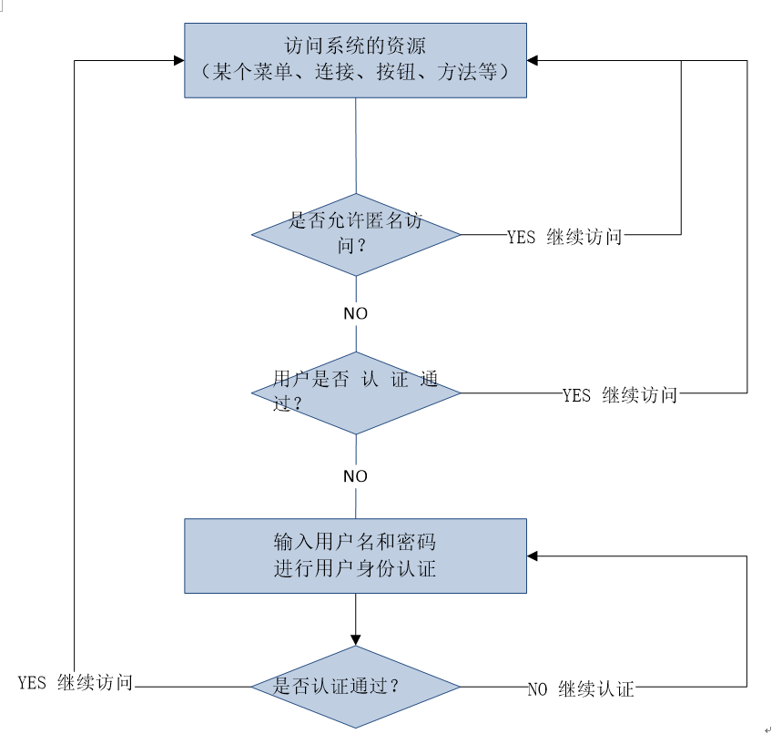
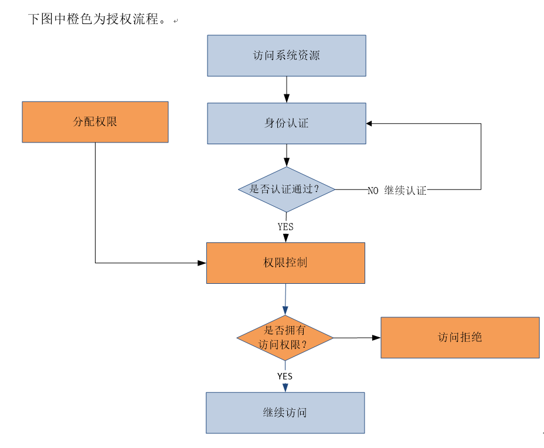
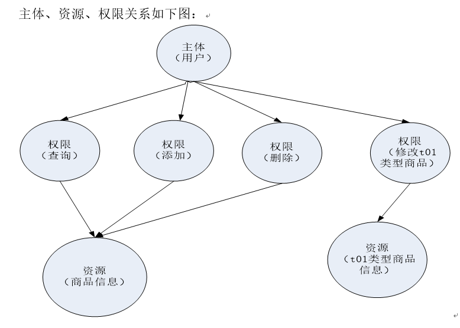
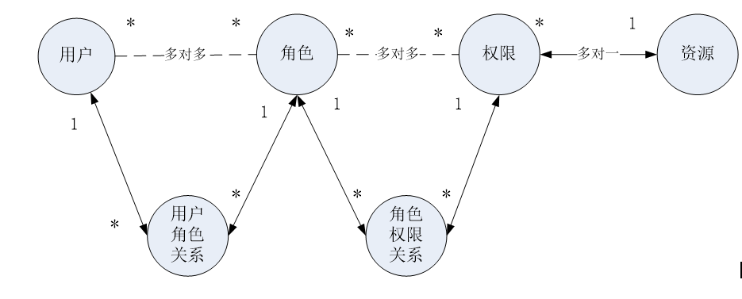
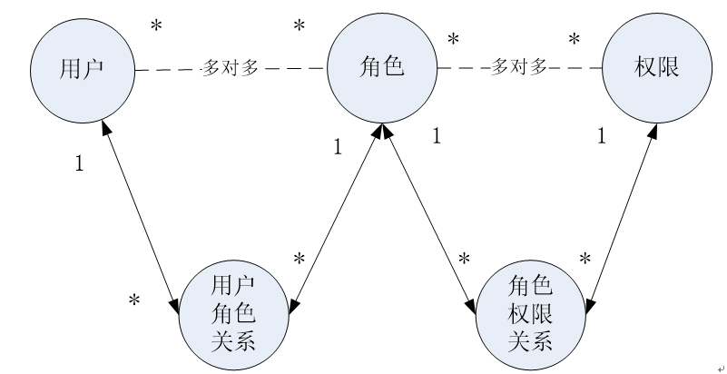

## 权限管理

### 什么是权限管理

1. 按照安全规则或者安全策略控制用户可以访问而且只能访问自己被授权的资源。

2. 权限管理包括用户身份 `认证` 和 `授权` 两部分，简称认证授权。对于需要访问控制的资源用户首先经过身份认证，认证通过后用户具有该资源的访问权限方可访问。


###  认证

#### 身份认证概念

身份认证，就是判断一个用户是否为合法用户的处理过程。

认证方式

+ 用户名和口令验证
+ 指纹验证；
+ 刷卡验证 等等


#### 身份认证流程




#### 关键对象

+ `Subject`：主体

  访问系统的用户，主体可以是用户、程序等，进行认证的都称为主体；

+ `Principal`：身份信息

  是主体（subject）进行身份认证的标识，标识必须具有唯一性，如用户名、手机号、邮箱地址等，一个主体可以有多个身份，但是必须有一个**主身份**（Primary Principal）。

+ `credential`：凭证信息

  是只有主体自己知道的安全信息，如密码、证书等。


### 授权

#### 授权概念

`授权` ，即**访问控制**，控制谁能访问哪些资源。主体进行身份认证后需要分配权限方可访问系统的资源，对于某些资源没有权限是无法访问的。


#### 授权流程




#### 关键对象

授权可简单理解为 `Who` 对 `What` (which)进行 `How` 操作：

+ Who，即主体（Subject），主体需要访问系统中的资源。
+ What，即资源（Resource），如系统菜单、页面、按钮、类方法、系统商品信息等。
  + 资源包括资源类型和资源实例，比如商品信息为资源类型，类型为t01的商品为资源实例，编号为001的商品信息也属于资源实例。
+ How，权限/许可（Permission），**规定了主体对资源的操作许可**
  + 权限离开资源没有意义，如用户查询权限、用户添加权限、某个类方法的调用权限、编号为001用户的修改权限等，通过权限可知主体对哪些资源都有哪些操作许可。


权限分为粗颗粒和细颗粒

+ **粗颗粒**权限是指对**资源类型**的权限
+ **细颗粒**权限是对**资源实例**的权限。

### 权限模型




通过数据模型表示：

+ `主体`（账号、密码）
+ `资源`（资源名称、访问地址）
+ `权限`（权限名称、资源id）
+ `角色`（角色名称）
+ 角色和权限关系（角色id、权限id）
+ 主体和角色关系（主体id、角色id）




通常开发中将**资源和权限**表合并为一张权限表，如下：

+ `主体`（账号、密码）
+ `权限`（权限名称、资源名称、资源访问地址）[合并]

+ `角色`（角色名称）
+ 角色和权限关系（角色id、权限id）
+ 主体和角色关系（主体id、角色id）




### 权限分配

对主体进行分配权限，主体只允许**在权限范围内对资源进行操作**

+ 比如：对 u01用户 分配商品修改权限，u01用户只能对商品进行修改。

权限分配的数据通常需要持久化，根据上边的数据模型创建表并将用户的权限信息存储在数据库中。


### 权限控制

用户拥有了权限即可操作权限范围内的资源，系统不知道主体是否具有访问权限需要对用户的访问进行控制。


#### 基于角色的访问控制

`RBAC` 基于角色的访问控制（ `Role-Based Access Control` ）**是以角色为中心**进行访问控

+ 比如：主体的角色为总经理可以查询企业运营报表，查询员工工资信息等

+ 判断逻辑代码可以理解为

  ```java
  if(主体.hasRole("总经理角色id")){
  	查询工资
  }
  ```

+ 缺点：以角色进行访问控制粒度较粗，如果上图中查询工资所需要的角色变化为总经理和部门经理，此时就需要修改判断逻辑为 “判断主体的角色是否是总经理或部门经理”，**系统可扩展性差**。

  需要修改代码，如下：

  ```java
  if(主体.hasRole("总经理角色id") ||  主体.hasRole("部门经理角色id")){
  	查询工资
  }
  ```


#### 基于资源的访问控制

`RBAC` 基于资源的访问控制（ `Resource-Based Access Control` ）是**以资源为中心**进行访问控制

+ 比如：主体必须具有查询工资权限才可以查询员工工资信息等

+ 判断逻辑代码可以理解为：

  ```java
  if(主体.hasPermission("查询工资权限标识")){
  	查询工资
  }
  ```

+ 优点：系统设计时定义好查询工资的权限标识，即使查询工资所需要的角色变化为总经理和部门经理也只需要将“查询工资信息权限”添加到“部门经理角色”的权限列表中，判断逻辑不用修改，系统可扩展性强。


## 权限管理解决方案

### 粗颗粒度和细颗粒度

