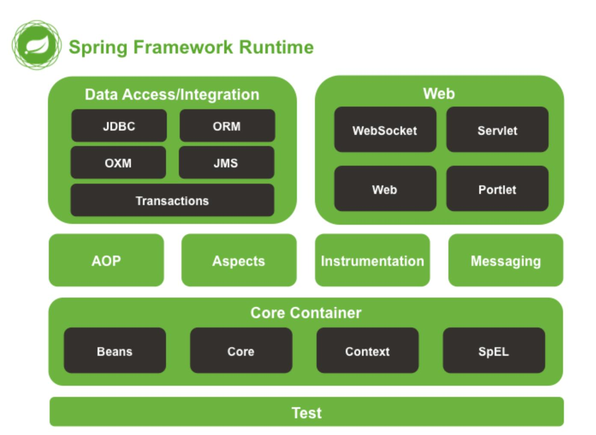

## Spring体系结构

Spring 框架采用分层架构，根据不同的功能被划分成了多个模块，这些模块大体可分为 Data Access/Integration、Web、AOP、Aspects、Messaging、Instrumentation、Core Container 和 Test




1. **Core Container（核心容器）**

   Spring 的核心容器是其他模块建立的基础，由 Beans 模块、Core 核心模块、Context 上下文模块和 Expression Language 表达式语言模块组成，具体介绍如下。

   - `Beans` 模块：提供了 `BeanFactory`，是工厂模式的经典实现，Spring 将管理对象称为 Bean。
   - `Core` 核心模块：提供了 Spring 框架的基本组成部分，包括 `IoC` 和 `DI` 功能。
   - `Context` 上下文模块：建立在核心和 Beans 模块的基础之上，它是访问定义和配置任何对象的媒介。`ApplicationContext` 接口是上下文模块的焦点。
   - `Expression Language` 模块：是运行时查询和操作对象图的强大的表达式语言。

2. **Web 模块**

   Spring 的 Web 层包括 Web、Servlet、Struts 和 Portlet 组件，具体介绍如下。

   - Web 模块：提供了基本的 Web 开发集成特性，例如多文件上传功能、使用的 Servlet 监听器的 IoC 容器初始化以及 Web 应用上下文。
   - Servlet模块：包括 Spring 模型—视图—控制器（MVC）实现 Web 应用程序。
   - Struts 模块：包含支持类内的 Spring 应用程序，集成了经典的 Struts Web 层。
   - Portlet 模块：提供了在 Portlet 环境中使用 MVC实现，类似 Web-Servlet 模块的功能。

3. **Data Access/Integration（数据访问／集成）**

   数据访问/集成层包括 JDBC、ORM、OXM、JMS 和 Transactions 模块，具体介绍如下。

   - `JDBC` 模块：提供了一个 JDBC 的抽象层，大幅度减少了在开发过程中对数据库操作的编码。
   - `ORM` 模块：对流行的对象关系映射 API，包括 JPA、JDO、Hibernate]和 iBatis 提供了的集成层。
   - OXM 模块：提供了一个支持对象/XML 映射的抽象层实现，如 JAXB、Castor、XMLBeans、JiBX 和 XStream。
   - JMS 模块：指 Java消息服务，包含的功能为生产和消费的信息。
   - `Transactions` 事务模块：支持编程和声明式事务管理实现特殊接口类，并为所有的 POJO。

4. **其他模块**

   Spring的其他模块还有 AOP、Aspects、Instrumentation 以及 Test 模块，具体介绍如下。

   - `AOP` 模块：提供了面向切面编程实现，允许定义方法拦截器和切入点，将代码按照功能进行分离，以降低耦合性。
   - `Aspects` 模块：提供与 AspectJ 的集成，是一个功能强大且成熟的面向切面编程（AOP）框架。
   - Instrumentation 模块：提供了类工具的支持和类加载器的实现，可以在特定的应用服务器中使用。
   - Test 模块：支持 Spring 组件，使用 JUnit 或 TestNG 框架的测试。


## 基础JAR包介绍

下载

[Spring]([Index of libs-release-local/org/springframework/spring/5.1.3.RELEASE](https://repo.spring.io/simple/libs-release-local/org/springframework/spring/5.1.3.RELEASE/))

[commons-logging.1.2]( http://commons.apache.org/proper/commons-logging/download_logging.cgi )

| 名称                                | 作用                                                         |
| ----------------------------------- | ------------------------------------------------------------ |
| spring-core-5.1.3.RELEASE.jar       | 包含 Spring 框架基本的核心工具类，Spring 其他组件都要用到这个包中的类，是其他组件的基本核心。 |
| spring-beans-5.1.3.RELEASE.jar      | 所有应用都要用到的，它包含访问配置文件、创建和管理 bean 以及进行 Inversion of Control（IoC）或者 Dependency Injection（DI）操作相关的所有类。 |
| spring-context-5.1.3.RELEASE.jar    | Spring 提供在基础 IoC 功能上的扩展服务，此外还提供许多企业级服务的支持，如邮件服务、任务调度、JNDI 定位、EJB 集成、远程访问、缓存以及各种视图层框架的封装等 |
| spring-expression-5.1.3.RELEASE.jar | 定义了 Spring 的表达式语言。 需要注意的是，在使用 Spring 开发时，除了 Spring 自带的 JAR 包以外，还需要一个第三方 JAR 包 commons.logging 处理日志信息 |


## IoC容器

`IoC` 是指在程序开发中，实例的创建不再由调用者管理，而是由 Spring 容器创建。Spring 容器会负责控制程序之间的关系，而不是由程序代码直接控制，因此，控制权由程序代码转移到了 Spring 容器中，控制权发生了反转，这就是 Spring 的 IoC 思想。

### BeanFactory

`BeanFactory` 是基础类型的 IoC 容器，由 org.springframework.beans.facytory.BeanFactory 接口定义，并提供了完整的 IoC 服务支持。简单来说，BeanFactory 就是一个管理 Bean 的工厂，它主要负责初始化各种 Bean，并调用它们的生命周期方法。

BeanFactory 接口有多个实现类，最常见的是 `org.springframework.beans.factory.xml.XmlBeanFactory`，它是根据 XML 配置文件中的定义装配 Bean 的。

创建 BeanFactory 实例时，需要提供 Spring 所管理容器的详细配置信息，这些信息通常采用 XML 文件形式管理。其加载配置信息的代码具体如下所示：

```java
BeanFactory beanFactory = new XmlBeanFactory(new FileSystemResource("D://applicationContext.xml"));
```

> 新版本中 ApplicationContext 接口,是 BeanFactory 子接 口.BeanFactory 的功能在 ApplicationContext 中都有.

### ApplicationContext

`ApplicationContext` 是 BeanFactory 的子接口，也被称为应用上下文。该接口的全路径为 org.springframework.context.ApplicationContext，它不仅提供了 BeanFactory 的所有功能，还添加了对 i18n（国际化）、资源访问、事件传播等方面的良好支持。

ApplicationContext 接口有两个常用的实现类:

1. `ClassPathXmlApplicationContext`

   该类从类路径 `ClassPath` 中寻找指定的 XML 配置文件，找到并装载完成 ApplicationContext 的实例化工作，具体如下所示。

   ```java
   ApplicationContext applicationContext = new ClassPathXmlApplicationContext(String configLocation);
   ```

2. `FileSystemXmlApplicationContext`

   该类从指定的文件系统路径中寻找指定的 XML 配置文件，找到并装载完成 ApplicationContext 的实例化工作，具体如下所示。

   ```java
   ApplicationContext applicationContext = new FileSystemXmlApplicationContext(String configLocation);
   ```

   它与 ClassPathXmlApplicationContext 的区别是：在读取 Spring 的配置文件时，`FileSystemXmlApplicationContext ` 不再从类路径中读取配置文件，而是通过参数指定配置文件的位置，它可以获取类路径之外的资源，如“F：/workspaces/applicationContext.xml”。

> 需要注意的是，BeanFactory 和 ApplicationContext 都是**通过 XML 配置文件加载 Bean 的**。
>
> 二者的主要区别在于，如果 Bean 的某一个属性没有注入，则使用 BeanFacotry 加载后，在第一次调用 getBean() 方法时会抛出异常，而 ApplicationContext 则在初始化时自检，这样有利于检查所依赖的属性是否注入。


### 在Web项目中

通常在 Java 项目中，会采用通过 ClassPathXmlApplicationContext 类实例化 ApplicationContext 容器的方式，而在 Web 项目中，ApplicationContext 容器的实例化工作会交由 Web 服务器完成。Web 服务器实例化 ApplicationContext 容器通常使用基于 `ContextLoaderListener`实现的方式，它只需要在 `web.xml` 中添加如下代码：

```xml
<!--指定Spring配置文件的位置，有多个配置文件时，以逗号分隔-->
<context-param>
    <param-name>contextConfigLocation</param-name>
    <!--spring将加载spring目录下的applicationContext.xml文件-->
    <param-value>
        classpath:spring/applicationContext.xml
    </param-value>
</context-param>

<!--指定以ContextLoaderListener方式启动Spring容器-->
<listener>
    <listener-class>
        org.springframework.web.context.ContextLoaderListener
    </listener-class>
</listener>
```


## 第一个Spring程序

1. 导入 jar

   四个核心包一个日志包(commons-logging)

   + commons-logging-1.2.jar
   + spring-beans-5.1.3.RELEASE.jar
   + spring-context-5.1.3.RELEASE.jar
   + spring-core-5.1.3.RELEASE.jar
   + spring-expression-5.1.3.RELEASE.jar

   

2. 在 src 下新建 applicationContext.xml

   1. 文件名称和路径自定义
   2. Spring 容器 ApplicationContext,applicationContext.xml 配 置的信息最终存储到了 AppliationContext 容器中
   3. spring 配置文件是基于 schema, 配置文件中只需要引入基本 schema

   ```xml
   <?xml version="1.0" encoding="UTF-8" ?>
   <beans xmlns="http://www.springframework.org/schema/beans"
          xmlns:xsi="http://www.w3.org/2001/XMLSchema-instance"
          xsi:schemaLocation="http://www.springframework.org/schema/beans
           http://www.springframework.org/schema/beans/spring-beans.xsd">
   	
       <!-- 通过<bean/> 创建对象.默认配置文件被加载时创建对象
   
   		 id 表示获取到对象标识
            class 创建哪个类的对象,全限定类名（包名+类名）。
       -->
       <bean id="person" class="com.ixfosa.pojo.Person"></bean>
   </beans>
   ```

   ```java
   public class Person {
       private int id;
       private String name;
       private int age;
       private char sex;
   }
   ```

3. 编写测试方法

   1. `getBean(“标签 id 值”, 返回值类型)`; **如果没有第二个参数, 默认是 Object**
   2. `getBeanDefinitionNames()`, Spring 容器中目前所有管理的所有对象

   ```java
   public class Demo1 {
       public static void main(String[] args) {
           ClassPathXmlApplicationContext applicationContext =
                   new ClassPathXmlApplicationContext("applicationContext.xml");
   
           Person person = applicationContext.getBean("person", Person.class);
           System.out.println(person); // Person{id=null, name='null', age=null, sex=null}
   
           String[] names = applicationContext.getBeanDefinitionNames();
           for (String name : names) {
               System.out.println(name); // person
   
           }
       }
   }
   ```


## 实例化Bean的三种方法

### 通过构造方法创建

1. 无参构造创建:默认情况
2. 有参构造创建:需要明确配置
   + 需要在类中提供有参构造方法
   + 在 applicationContext.xml 中设置调用哪个构造方法创建对象, 如果设定的条件匹配多个构造方法执行最后的构 造方法

```java
<?xml version="1.0" encoding="UTF-8" ?>
<beans xmlns="http://www.springframework.org/schema/beans"
       xmlns:xsi="http://www.w3.org/2001/XMLSchema-instance"
       xsi:schemaLocation="http://www.springframework.org/schema/beans
        http://www.springframework.org/schema/beans/spring-beans.xsd">

    <bean id="person2" class="com.ixfosa.pojo.Person">
        <!--
            index : 参数的索引,从 0 开始
            name: 参数名
            type:类型(区分开关键字和封装类 int 和 Integer)
            value 基本数据类型或String等
            ref 引用另一个 bean
        -->
        <constructor-arg index="0" name="id" type="int" value="123" />
        <constructor-arg index="1" name="name" type="java.lang.String" value="ixfosa" />
        <constructor-arg index="2" name="age" type="int" value="23" />
        <constructor-arg index="3" name="sex" type="char" value="男" />
    </bean>
</beans>
```

```java
public class Demo2 {
    public static void main(String[] args) {
        ClassPathXmlApplicationContext applicationContext =
                new ClassPathXmlApplicationContext("applicationContext.xml");

        Person person = applicationContext.getBean("person2", Person.class);
        // Person{id=123, name='ixfosa', age=23, sex=男}
        System.out.println(person);
    }
}
```


### 实例工厂

工厂设计模式:帮助创建类对象.一个工厂可以生产多个对象

实例工厂:需要先创建工厂,才能生产对象

实现步骤:

1. 必须要有一个实例工厂

   ```java
   public class PeopleFactory {
       public Person newInstance() {
           return new Person(4410, "ixfosa", 23, '男');
       }
   }
   ```

   

2. 在 applicationContext.xml 中配置工厂对象和需要创建的 对象

   ```xml
   <?xml version="1.0" encoding="UTF-8" ?>
   <beans xmlns="http://www.springframework.org/schema/beans"
          xmlns:xsi="http://www.w3.org/2001/XMLSchema-instance"
          xsi:schemaLocation="http://www.springframework.org/schema/beans
           http://www.springframework.org/schema/beans/spring-beans.xsd">
   
       <bean id="factory" class="com.ixfosa.pojo.PeopleFactory" />
       <bean id="person3" factory-bean="factory" factory-method="newInstance" /></bean>
   </beans>
   ```

3. 测试

   ```java
   public class Demo3 {
       public static void main(String[] args) {
           ClassPathXmlApplicationContext applicationContext =
                   new ClassPathXmlApplicationContext("applicationContext.xml");
   
           Person person = applicationContext.getBean("person3", Person.class);
           // Person{id=123, name='ixfosa', age=23, sex=男}
           System.out.println(person);
       }
   }
   ```

   

### 静态工厂

不需要创建工厂,快速创建对象.

实现步骤

1. 编写一个静态工厂(在方法上添加 static)

   ```java
   public class PeopleStaticFactory {
       public static Person newInstance() {
           return new Person(4410, "ixfosa", 23, '男');
       }
   }
   ```

2. 在 applicationContext.xml 中

   ```xml
   <?xml version="1.0" encoding="UTF-8" ?>
   <beans xmlns="http://www.springframework.org/schema/beans"
          xmlns:xsi="http://www.w3.org/2001/XMLSchema-instance"
          xsi:schemaLocation="http://www.springframework.org/schema/beans
           http://www.springframework.org/schema/beans/spring-beans.xsd">
   
       <bean id="person4" class="com.ixfosa.pojo.PeopleStaticFactory" factory-method="newInstance"/>
   </beans>
   ```

3. 测试

   ```java
   public class Demo4 {
       public static void main(String[] args) {
           ClassPathXmlApplicationContext applicationContext =
                   new ClassPathXmlApplicationContext("applicationContext.xml");
   
           Person person = applicationContext.getBean("person4", Person.class);
           // Person{id=123, name='ixfosa', age=23, sex=男}
           System.out.println(person);
       }
   }
   ```


## DI（依赖注入）

`依赖注入`（Dependency Injection，DI）和 `控制反转`含义相同，它们是从两个角度描述的同一个概念。

当某个 Java实例需要另一个 Java 实例时，传统的方法是由调用者创建被调用者的实例（例如，使用 new 关键字获得被调用者实例），而使用 Spring 框架后，被调用者的实例不再由调用者创建，而是由 Spring 容器创建，这称为**控制反转**。

Spring 容器在创建被调用者的实例时，会自动将调用者需要的对象实例注入给调用者，这样，调用者通过 Spring 容器获得被调用者实例，这称为依赖注入。


### 属性注入(通过 set 方法)

指 IoC 容器使用 setter 方法注入被依赖的实例。通过调用无参构造器或无参 static 工厂方法实例化 bean 后，调用该 bean 的 setter 方法，即可实现基于 setter 的 DI。

1. **如果属性是基本数据类型或 String 等**

   ```xml
   <bean id="user1" class="com.ixfosa.pojo.User">
       <property name="id" value="4410" />
       <property name="name" value="小佛" />
   </bean>
       
   <!-- 等效于 -->	
       
   <bean id="user11" class="com.ixfosa.pojo.User">
       <property name="id">
       	<value>123</value>
       </property>
       <property name="name">
       	<value>小佛</value>
       </property>
   </bean>
   ```

   ```java
   public class Demo5 {
       public static void main(String[] args) {
           ClassPathXmlApplicationContext applicationContext =
                   new ClassPathXmlApplicationContext("applicationContext.xml");
   
           User user1 = applicationContext.getBean("user1", User.class);
           System.out.println(user1);
   
           User user11 = applicationContext.getBean("user11", User.class);
           System.out.println(user11);
       }
   }
   ```

2. **如果属性是 Set**

   ```xml
   <!--如果属性是 Set<?>-->
   <bean id="user2" class="com.ixfosa.pojo.User">
       <property name="set">
           <set>
               <value>long</value>
               <value>zhong</value>
           </set>
       </property>
   </bean>
   
   <!--如果 set 中就只有一个值-->
   <bean id="user22" class="com.ixfosa.pojo.User">
       <property name="set" value="zhong" />
   </bean>
   ```

   ```java
   public class Demo6 {
       public static void main(String[] args) {
           ClassPathXmlApplicationContext applicationContext =
                   new ClassPathXmlApplicationContext("applicationContext.xml");
   
           User user2 = applicationContext.getBean("user2", User.class);
           System.out.println(user2);
   
           User user22 = applicationContext.getBean("user22", User.class);
           System.out.println(user22);
           // User{id=0, name='null', set=[long, zhong], list=null, map=null, ints=null}
           // User{id=0, name='null', set=[zhong], list=null, map=null, ints=null}
       }
   }
   ```

3. **如果属性是 List**

   ```xml
   <!--如果属性是 List<?>-->
   <bean id="user3" class="com.ixfosa.pojo.User">
       <property name="list">
           <list>
               <value>long</value>
               <value>zhong</value>
           </list>
       </property>
   </bean>
   
   <!--如果 list 中就只有一个值-->
   <bean id="user33" class="com.ixfosa.pojo.User">
       <property name="list" value="long" />
   </bean>
   ```

   ```java
   public class Demo7 {
       public static void main(String[] args) {
           ClassPathXmlApplicationContext applicationContext =
                   new ClassPathXmlApplicationContext("applicationContext.xml");
   
           User user3 = applicationContext.getBean("user3", User.class);
           System.out.println(user3);
   
           User user33 = applicationContext.getBean("user33", User.class);
           System.out.println(user33);
           // User{id=0, name='null', set=null, list=[long, zhong], map=null, ints=null}
           // User{id=0, name='null', set=null, list=[long], map=null, ints=null}
       }
   }
   ```

4. **如果属性是 map**

   ```xml
   <!-- 如果属性是 map-->
   <bean id="user4" class="com.ixfosa.pojo.User">
       <property name="map">
           <map>
               <entry key="name1" value="long" />
               <entry key="name2" value="zhong" />
           </map>
       </property>
   </bean>
   ```

   ```java
   public class Demo8 {
       public static void main(String[] args) {
           ClassPathXmlApplicationContext applicationContext =
                   new ClassPathXmlApplicationContext("applicationContext.xml");
   
           User user4 = applicationContext.getBean("user4", User.class);
           System.out.println(user4);
           // User{id=0, name='null', set=null, list=null, map={name1=long, name2=zhong}, ints=null}
       }
   }
   ```

5. **如果属性是数组**

   ```xml
   <!--如果属性是数组-->
   <bean id="user5" class="com.ixfosa.pojo.User">
       <property name="ints">
           <array>
               <value>1</value>
               <value>2</value>
               <value>3</value>
           </array>
       </property>
   </bean>
   <!--如果 数组 中就只有一个值-->
   <bean id="user55" class="com.ixfosa.pojo.User">
       <property name="ints" value="66" />
   </bean>
   ```

   ```java
   public class Demo9 {
       public static void main(String[] args) {
           ClassPathXmlApplicationContext applicationContext =
                   new ClassPathXmlApplicationContext("applicationContext.xml");
   
           User user5 = applicationContext.getBean("user5", User.class);
           System.out.println(user5);
   
           User user55 = applicationContext.getBean("user55", User.class);
           System.out.println(user55);
           // User{id=0, name='null', set=null, list=null, map=null, ints=[1, 2, 3]}
           // User{id=0, name='null', set=null, list=null, map=null, ints=[66]}
       }
   }
   ```

6. **如果属性是复杂数据类型**

   ```java
   public class User {
       private Person person;
   }
   
   public class Person {
       private int id;
       private String name;
       private int age;
       private char sex;
   }
   ```

   ```xml
    <!-- 如果属性是复杂数据类型 -->
   <bean id="user6" class="com.ixfosa.pojo.User">
       <property name="person" ref="person6" />
   </bean>
   
   <bean id="person6" class="com.ixfosa.pojo.Person">
       <property name="name" value="ixfosa" />
       <property name="sex" value="男" />
   </bean>
   ```

   ```java
   public class Demo10 {
       public static void main(String[] args) {
           ClassPathXmlApplicationContext applicationContext =
                   new ClassPathXmlApplicationContext("applicationContext.xml");
   
           User user6 = applicationContext.getBean("user6", User.class);
           System.out.println(user6.getPerson());
           // Person{id=0, name='ixfosa', age=0, sex=男}
       }
   }
   ```

7. **如果属性是List<?>且泛型是复杂数据类型**

   指 IoC 容器使用构造方法注入被依赖的实例。基于构造器的 DI 通过调用带参数的构造方法实现，每个参数代表一个依赖。

   ```java
   public class User {
       private List<Person> friends;
   }
   
   public class Person {
       private int id;
       private String name;
       private int age;
       private char sex;
   }
   ```

   ```xml
   <bean id="user7" class="com.ixfosa.pojo.User">
       <property name="friends" ref="person7" />
   </bean>
   
   <bean id="user77" class="com.ixfosa.pojo.User">
       <property name="friends">
           <list>
               <ref bean="person7" />
               <ref bean="person7" />
           </list>
       </property>
   </bean>
   
   <bean id="person7" class="com.ixfosa.pojo.Person">
       <property name="name" value="ixfosa" />
       <property name="sex" value="男" />
   </bean>
   ```

   ```java
   public class Demo11 {
       public static void main(String[] args) {
           ClassPathXmlApplicationContext applicationContext =
                   new ClassPathXmlApplicationContext("applicationContext.xml");
   
           User user7 = applicationContext.getBean("user7", User.class);
           System.out.println(user7.getFriends());
   
           User user77 = applicationContext.getBean("user77", User.class);
           System.out.println(user77.getFriends());
           // [Person{id=0, name='ixfosa', age=0, sex=男}]
           // [Person{id=0, name='ixfosa', age=0, sex=男}, Person{id=0, name='ixfosa', age=0, sex=男}]
       }
   }
   ```

8. **如果属性是Properties**

   ```xml
   <property name="user">
       <props>
           <prop key="userName">ixfosa</prop>
           <prop key="passWord">123456</prop>
           <prop key="验证码">dddd</prop>
       </props>
   </property>
   ```

   

### 构造注入

指 `IoC` 容器使用构造方法注入被依赖的实例。基于构造器的 DI 通过调用带参数的构造方法实现，每个参数代表一个依赖。


## Bean的配置及常用属性

Spring 容器可以被看作一个大工厂，而 Spring 容器中的 `Bean` 就相当于该工厂的产品。如果希望这个大工厂能够生产和管理 Bean，这时则需要告诉容器需要哪些 Bean，以及需要以何种方式将这些 Bean 装配到一起。

Spring 配置文件支持两种不同的格式，分别是 `XML` 文件格式和 `Properties` 文件格式。

通常情况下，Spring 会以 XML 文件格式作为 Spring 的配置文件，这种配置方式通过 XML 文件注册并管理 Bean 之间的依赖关系。

XML 格式配置文件的根元素是 `<beans>`，该元素包含了多个 `<bean>` 子元素，每一个 `<bean> `子元素定义了一个 Bean，并描述了该 Bean 如何被装配到 Spring 容器中。

| 属性名称        | 描述                                                         |
| --------------- | ------------------------------------------------------------ |
| `id`            | 是一个 Bean 的唯一标识符，Spring 容器对 Bean 的配置和管理都通过该属性完成 |
| `name`          | Spring 容器同样可以通过此属性对容器中的 Bean 进行配置和管理，name 属性中可以为 Bean 指定多个名称，每个名称之间用逗号或分号隔开 |
| `class`         | 该属性指定了 Bean 的具体实现类，它必须是一个完整的类名，使用类的全限定名 |
| `scope `        | 用于设定 Bean 实例的作用域，其属性值有 singleton（单例）、prototype（原型）、request、session 和 global Session。其默认值是 singleton |
| constructor-arg | <bean>元素的子元素，可以使用此元素传入构造参数进行实例化。该元素的 index 属性指定构造参数的序号（从 0 开始），type 属性指定构造参数的类型 |
| `property`      | <bean>元素的子元素，用于调用 Bean 实例中的 Set 方法完成属性赋值，从而完成依赖注入。该元素的 name 属性指定 Bean 实例中的相应属性名 |
| `ref`           | <property> 和 <constructor-arg> 等元素的子元索，该元素中的 bean 属性用于指定对 Bean 工厂中某个 Bean 实例的引用 |
| `value`         | <property> 和 <constractor-arg> 等元素的子元素，用于直接指定一个常量值 |
| list            | 用于封装 List 或数组类型的依赖注入                           |
| set             | 用于封装 Set 类型属性的依赖注入                              |
| map             | 用于封装 Map 类型属性的依赖注入                              |
| entry           | <map> 元素的子元素，用于设置一个键值对。其 key 属性指定字符串类型的键值，ref 或 value 子元素指定其值 |


## 装配Bean

Bean 的装配可以理解为依赖关系注入，**Bean 的装配方式也就是 Bean 的依赖注入方式。**Spring 容器支持多种形式的 Bean 的装配方式，如基于 XML 的 Bean 装配、基于 Annotation 的 Bean 装配和自动装配等。

### 基于XML装配Bean

Spring 基于 XML 的装配通常采用两种实现方式

+ `设值注入`（Setter Injection）
+ `构造注入`（Constructor Injection）。

在 Spring 实例化 Bean 的过程中，首先会调用默认的构造方法实例化 Bean 对象，然后通过 Java的反射机制调用 setXxx() 方法进行属性的注入。因此，设值注入要求一个 Bean 的对应类必须满足以下两点要求。

- **必须提供一个默认的无参构造方法。**
- **必须为需要注入的属性提供对应的 setter 方法。**

使用设值注入时，在 Spring 配置文件中，需要使用 `<bean>` 元素的子元素 `<property>` 元素为每个属性注入值。而使用构造注入时，在配置文件中，主要使用 `<constructor-arg>` 标签定义构造方法的参数，可以使用其 value 属性（或子元素）设置该参数的值。

1. 创建 Flower 类

   ```java
   package com.ixfosa.pojo;
   
   /**
    * Created by ixfosa on 2021/4/6 17:23
    */
   public class Flower {
       private int id;
       private String name;
   
       public Flower() {
           
       }
   
       public Flower(int id, String name) {
           this.id = id;
           this.name = name;
       }
   
       // 省略setter，getter，toString 方法
   }
   ```

2. 创建 Spring 配置文件

   ```xml
   <?xml version="1.0" encoding="UTF-8" ?>
   <beans xmlns="http://www.springframework.org/schema/beans"
          xmlns:xsi="http://www.w3.org/2001/XMLSchema-instance"
          xsi:schemaLocation="http://www.springframework.org/schema/beans
           http://www.springframework.org/schema/beans/spring-beans.xsd">
       
   	<!-- 使用设值注入方式装配Person实例 -->
       <bean id="flower1" class="com.ixfosa.pojo.Flower">
           <property name="id" value="1" />
           <property name="name" value="黑菊花" />
       </bean>
   
       <!-- 使用构造方法装配Person实例 -->
       <bean id="flower2" class="com.ixfosa.pojo.Flower">
           <constructor-arg index="0" type="int" name="id" value="2" />
           <constructor-arg index="1" type="java.lang.String" name="name" value="粉菊花" />
       </bean>
   </beans>
   ```

3. 创建测试类

   ```java
   public class Demo12 {
       public static void main(String[] args) {
           ClassPathXmlApplicationContext applicationContext =
                   new ClassPathXmlApplicationContext("applicationContext.xml");
   
           Flower flower1 = applicationContext.getBean("flower1", Flower.class);
           System.out.println(flower1);
   
           Flower flower2 = applicationContext.getBean("flower2", Flower.class);
           System.out.println(flower2);
           
           // Flower{id=1, name='黑菊花'}
           // Flower{id=2, name='粉菊花'}
       }
   }
   ```


### 基于Annotation装配Bean

在 Spring 中，尽管使用 XML 配置文件可以实现 Bean 的装配工作，但如果应用中 Bean 的数量较多，会导致 XML 配置文件过于臃肿，从而给维护和升级带来一定的困难。

Java 从 JDK 5.0 以后，提供了 Annotation（注解）功能，Spring 也提供了对 Annotation 技术的全面支持。常用的注解如下。

1. `@Component`

   可以使用此注解描述 Spring 中的 Bean，但它是一个泛化的概念，仅仅表示一个组件（Bean），并且可以作用在任何层次。使用时只需将该注解标注在相应类上即可。

2. `@Repository`

   用于将数据访问层（DAO层）的类标识为 Spring 中的 Bean，其功能与 @Component 相同。

3. `@Service`

   通常作用在业务层（Service 层），用于将业务层的类标识为 Spring 中的 Bean，其功能与 @Component 相同。

4. `@Controller`

   通常作用在控制层（如 Struts2的 Action），用于将控制层的类标识为 Spring 中的 Bean，其功能与 @Component 相同。

5. `@Autowired`

   用于对 Bean 的属性变量、属性的 Set 方法及构造函数进行标注，配合对应的注解处理器完成 Bean 的自动配置工作。默认按照 Bean 的类型进行装配。`不需要写对象的 get/set`

6. `@Resource`

   其作用与 Autowired 一样。其区别在于 **@Autowired 默认按照 Bean 类型装配**，而 **@Resource 默认按照 Bean 实例名称进行装配**。

   + @Resource 中有两个重要属性：`name` 和 `type`。

     Spring 将 name 属性解析为 Bean 实例名称，type 属性解析为 Bean 实例类型。如果指定 name 属性，则按实例名称进行装配；如果指定 type 属性，则按 Bean 类型进行装配。

     如果都不指定，则先按 Bean 实例名称装配，如果不能匹配，则再按照 Bean 类型进行装配；如果都无法匹配，则抛出 NoSuchBeanDefinitionException 异常。

7. `@Qualifier`

   与 @Autowired 注解配合使用，会将默认的按 Bean 类型装配修改为按 Bean 的实例名称装配，Bean 的实例名称由 @Qualifier 注解的参数指定。
   
   

```xml
<?xml version="1.0" encoding="UTF-8" ?>
<beans xmlns="http://www.springframework.org/schema/beans"
       xmlns:xsi="http://www.w3.org/2001/XMLSchema-instance"
       xmlns:context="http://www.springframework.org/schema/context"
       xsi:schemaLocation="http://www.springframework.org/schema/beans
       http://www.springframework.org/schema/beans/spring-beans.xsd
       http://www.springframework.org/schema/context
       http://www.springframework.org/schema/context/spring-context.xsd">

    <!--使用context命名空间，通知spring扫描指定目录，进行注解的解析-->
    <context:component-scan base-package="com.ixfosa" />
</beans>
```

```java
@Repository("helloDao")
public class HelloDao {
    public void sayHello() {
        System.out.println("hello Spring!!!");
    }
}

@Service("helloService")
public class HelloService {

    @Resource(name = "helloDao")
    private HelloDao helloDao;


    public void say() {
        helloDao.sayHello();
    }
}

@Controller("test")
public class Test {
    @Resource(name = "helloService")
    private HelloService service;

    public static void main(String[] args) {
        ClassPathXmlApplicationContext applicationContext =
                new ClassPathXmlApplicationContext("applicationContext.xml");

        Test test = applicationContext.getBean("test", Test.class);
        test.service.say();
    }
}
```


### 自动装配Bean

自动装配就是指 Spring容器可以自动装配（autowire）相互协作的 Bean 之间的关联关系，将一个 Bean 注入其他 Bean 的 Property 中。`需要setter方法`

要使用自动装配，就需要配置 `<bean>` 元素的 `autowire` 属性。autowire 属性有五个值

| 名称        | 说明                                                         |
| ----------- | ------------------------------------------------------------ |
| `byName`    | 根据 Property 的 name 自动装配，如果一个 Bean 的 name 和另一个 Bean 中的 Property 的 name 相同，则自动装配这个 Bean 到 Property 中。 |
| `byType`    | 根据 Property 的数据类型（Type）自动装配，如果一个 Bean 的数据类型兼容另一个 Bean 中 Property 的数据类型，则自动装配。spring 容器中不可以出现两个相同类型的 |
| constructor | 根据构造方法的参数的数据类型，进行 byType 模式的自动装配。底层使用 byName, 构造方法参数名和其他的 id 相同. |
| default     | 默认值,根据全局 default-autowire=””值.默认全局和局 部都没有配置情况下,相当于 no |
| no          | 默认情况下，不使用自动装配，Bean 依赖必须通过 ref 元素定义。 |

两种配置办法 

1. 在中通过 `autowire=” ”` 配置,只对这个生效

   ```xml
   <bean autowire="default | no | byName | byType | constructor" />
   ```

2. 在中通过 `default-autowire=” ”`配置,表当当前文件中所 有都是全局配置内容

   ```java
   <beans xmlns="http://www.springframework.org/schema/beans"
          xmlns:xsi="http://www.w3.org/2001/XMLSchema-instance"
          xsi:schemaLocation="http://www.springframework.org/schema/beans
              http://www.springframework.org/schema/beans/spring-beans.xsd"
              default-autowire="default | no | byName | byType | constructor">
   ```


```java
public class HelloDao {
    public void sayHello() {
        System.out.println("hello Spring!!!");
    }
}

public class HelloService {
    // 通过name注入
    private HelloDao helloDao;

    public void setHelloDao(HelloDao helloDao) {
        this.helloDao = helloDao;
    }

    public void say() {
        helloDao.sayHello();
    }
}


public class Test {
    // 通过类型注入
    private HelloService service;

    public void setService(HelloService service) {
        this.service = service;
    }

    public static void main(String[] args) {
        ClassPathXmlApplicationContext applicationContext =
                new ClassPathXmlApplicationContext("applicationContext.xml");

        Test test = applicationContext.getBean("test", Test.class);

        test.service.say();
    }
}
```

```xml
<?xml version="1.0" encoding="UTF-8" ?>
<beans xmlns="http://www.springframework.org/schema/beans"
       xmlns:xsi="http://www.w3.org/2001/XMLSchema-instance"
       xsi:schemaLocation="http://www.springframework.org/schema/beans
       http://www.springframework.org/schema/beans/spring-beans.xsd"
       default-autowire="byName" >

    <bean id="helloDao" class="com.ixfosa.dao.HelloDao" />

    <bean id="helloService" class="com.ixfosa.service.HelloService" />

    <bean id="test" class="com.ixfosa.test.Test" autowire="byType"/>

</beans>
```


## Bean的作用域(scope 属性)

Spring 容器在初始化一个 Bean 的实例时，同时会指定该实例的作用域。Spring 为 Bean 定义了五种作用域，具体如下。

1. `singleton`

   单例模式，使用 singleton 定义的 Bean 在 Spring 容器中只有一个实例，这也是 Bean `默认的作用域`。

2. `prototype`

   原型模式，每次通过 Spring 容器获取 prototype 定义的 Bean 时，容器都将创建一个新的 Bean 实例。

3. `request`

   在一次 HTTP 请求中，容器会返回该 Bean 的同一个实例。而对不同的 HTTP 请求，会返回不同的实例，该作用域仅在当前 HTTP Request 内有效。

4. `session`

   在一次 HTTP Session 中，容器会返回该 Bean 的同一个实例。而对不同的 HTTP 请求，会返回不同的实例，该作用域仅在当前 HTTP Session 内有效。

5. `global Session`

   在一个全局的 HTTP Session 中，容器会返回该 Bean 的同一个实例。该作用域仅在使用 portlet context 时有效。

6. `application`

   在 application 对象内是单例

```xml
<?xml version="1.0" encoding="UTF-8" ?>
<beans xmlns="http://www.springframework.org/schema/beans"
       xmlns:xsi="http://www.w3.org/2001/XMLSchema-instance"
       xmlns:context="http://www.springframework.org/schema/context"
       xsi:schemaLocation="http://www.springframework.org/schema/beans
       http://www.springframework.org/schema/beans/spring-beans.xsd
       http://www.springframework.org/schema/context
       http://www.springframework.org/schema/context/spring-context.xsd">
	
     <!--
        singleton 是 Spring 容器默认的作用域，当一个 Bean 的作用域为 singleton 时，
        Spring 容器中只会存在一个共享的 Bean 实例，并且所有对 Bean 的请求，只要 id 与该 Bean 定		  义相匹配，就只会返回 Bean 的同一个实例。
     -->
    <bean id="flower1" class="com.ixfosa.pojo.Flower" scope="singleton" />
    
    <!--使用 prototype 作用域的 Bean 会在每次请求该 Bean 时都会创建一个新的 Bean 实例。-->
    <bean id="flower2" class="com.ixfosa.pojo.Flower" scope="prototype" />

</beans>
```

```java
public class Flower {
    private int id;
    private String name;
}


public class Demo13 {
    public static void main(String[] args) {
        ClassPathXmlApplicationContext applicationContext =
                new ClassPathXmlApplicationContext("applicationContext.xml");

        Flower flower1 = applicationContext.getBean("flower1", Flower.class);
        Flower flower11 = applicationContext.getBean("flower1", Flower.class);
        System.out.println(flower1 == flower11); // true
        Flower flower2 = applicationContext.getBean("flower2", Flower.class);
        Flower flower22 = applicationContext.getBean("flower2", Flower.class);
        System.out.println(flower2 == flower22); // false
    }
}
```


## Bean的生命周期

Spring 容器可以管理 singleton 作用域 Bean 的生命周期，在此作用域下，Spring 能够精确地知道该 Bean 何时被创建，何时初始化完成，以及何时被销毁。

而对于 prototype 作用域的 Bean，Spring 只负责创建，当容器创建了 Bean 的实例后，Bean 的实例就交给客户端代码管理，Spring 容器将不再跟踪其生命周期。每次客户端请求 prototype 作用域的 Bean 时，Spring 容器都会创建一个新的实例，并且不会管那些被配置成 prototype 作用域的 Bean 的生命周期。

可以利用 Bean 在其存活期间的指定时刻完成一些相关操作。这种时刻可能有很多，但一般情况下，会在 Bean 被初始化后和被销毁前执行一些相关操作。

可以利用 Spring 提供的方法定制 Bean 的创建过程。

Spring 容器中 Bean 的生命周期流程:


Bean 生命周期的整个执行过程描述如下。

1. 根据配置情况调用 Bean 构造方法或工厂方法实例化 Bean。
2. 利用依赖注入完成 Bean 中所有属性值的配置注入。
3. 如果 Bean 实现了 BeanNameAware 接口，则 Spring 调用 Bean 的 setBeanName() 方法传入当前 Bean 的 id 值。
4. 如果 Bean 实现了 BeanFactoryAware 接口，则 Spring 调用 setBeanFactory() 方法传入当前工厂实例的引用。
5. 如果 Bean 实现了 ApplicationContextAware 接口，则 Spring 调用 setApplicationContext() 方法传入当前 ApplicationContext 实例的引用。
6. 如果 BeanPostProcessor 和 Bean 关联，则 Spring 将调用该接口的预初始化方法 postProcessBeforeInitialzation() 对 Bean 进行加工操作，此处非常重要，Spring 的 AOP 就是利用它实现的。
7. 如果 Bean 实现了 InitializingBean 接口，则 Spring 将调用 afterPropertiesSet() 方法。
8. 如果在配置文件中通过 init-method 属性指定了初始化方法，则调用该初始化方法。
9. 如果 BeanPostProcessor 和 Bean 关联，则 Spring 将调用该接口的初始化方法 postProcessAfterInitialization()。此时，Bean 已经可以被应用系统使用了。
10. 如果在 <bean> 中指定了该 Bean 的作用范围为 scope="singleton"，则将该 Bean 放入 Spring IoC 的缓存池中，将触发 Spring 对该 Bean 的生命周期管理；如果在 <bean> 中指定了该 Bean 的作用范围为 scope="prototype"，则将该 Bean 交给调用者，调用者管理该 Bean 的生命周期，Spring 不再管理该 Bean。
11. 如果 Bean 实现了 DisposableBean 接口，则 Spring 会调用 destory() 方法将 Spring 中的 Bean 销毁；如果在配置文件中通过 destory-method 属性指定了 Bean 的销毁方法，则 Spring 将调用该方法对 Bean 进行销毁。


## 使用 Spring 简化 MyBatis

1. 导 入 mybatis3.5.2 所 有 jar 和 spring5.1.3 基 本 包,spring-jdbc,spring-tx,spring-aop,spring-web,spring 整合 mybatis 的包等

   spring 整合 mybatis 的包 [mybatis-spring-2.0.6.jar](https://mvnrepository.com/artifact/org.mybatis/mybatis-spring/2.0.6)

2. 配置web.xml

   ```xml
   <?xml version="1.0" encoding="UTF-8"?>
   <web-app xmlns="http://xmlns.jcp.org/xml/ns/javaee"
            xmlns:xsi="http://www.w3.org/2001/XMLSchema-instance"
            xsi:schemaLocation="http://xmlns.jcp.org/xml/ns/javaee 
            http://xmlns.jcp.org/xml/ns/javaee/web-app_4_0.xsd"
            version="4.0">
       <context-param>
           <!-- 上下文参数 -->
           <param-name>contextConfigLocation</param-name>
           <!-- spring配置文件 -->
           <param-value>classpath:applicationContext.xml</param-value>
       </context-param>
   
       <!-- ContextLoaderListener 监听器,帮助加载Spring的配置文件爱 -->
       <listener>
           <listener-class>org.springframework.web.context.ContextLoaderListener</listener-class>
       </listener>
       
       <welcome-file-list>
           <welcome-file>index.jsp</welcome-file>
       </welcome-file-list>
   </web-app>
   ```

3. 编写 spring 配置文件 applicationContext.xml

   ```xml
   <?xml version="1.0" encoding="UTF-8" ?>
   <beans xmlns="http://www.springframework.org/schema/beans"
          xmlns:xsi="http://www.w3.org/2001/XMLSchema-instance"
          xsi:schemaLocation="http://www.springframework.org/schema/beans
          http://www.springframework.org/schema/beans/spring-beans.xsd">
   
       <!-- 数据源封装类 .数据源:获取数据库连接,spring-jdbc.jar中-->
       <bean id="dataSource" class="org.springframework.jdbc.datasource.DriverManagerDataSource">
           <property name="driverClassName" value="com.mysql.jdbc.Driver" />
           <property name="url" value="jdbc:mysql://localhost:3306/ssm?useUnicode=true&amp;characterEncoding=utf8" />
           <property name="username" value="root" />
           <property name="password" value="ixfosa" />
       </bean>
   
       <!-- 创建SqlSessionFactory对象 -->
       <bean id="factory" class="org.mybatis.spring.SqlSessionFactoryBean">
           <!-- 数据库连接信息来源于dataSource -->
           <property name="dataSource" ref="dataSource" />
       </bean>
   
       <!--
           扫描器相当于mybatis-config.xml中 mappers下package标签,
           扫描com.ixfosa.dao包后会给对应接口创建对象
       -->
       <bean class="org.mybatis.spring.mapper.MapperScannerConfigurer">
           <property name="basePackage" value="com.ixfosa.dao" />
           <property name="sqlSessionFactory" ref="factory" />
       </bean>
   
       <!-- 由spring管理service实现类 -->
       <bean id="flowerService" class="com.ixfosa.service.impl.FlowerServiceImpl">
           <property name="flowerDao" ref="flowerDao" />
       </bean>
   </beans>
   ```

   

4. 编写代码

   1. 正常编写 pojo

      ```java
      public class Flower {
      	private int id;
      	private String name;
      	private double price;
      	private String production;
      }
      ```

      

   2. 编写 dao 包下时必须使用**接口绑定**方案或**注解**方案(必须 **有接**口)

      ```java
      public interface FlowerDao {
          @Select("select * from flower")
          List<Flower> selAll();
      }
      ```

   3. 正常编写 Service 接口和 Service 实现类

      需要在 Service 实现类中声明 flowerDao 接口对象,并生成 `get/set` 方法

      ```java
      public interface FlowerService {
          List<Flower> showFlower();
      }
      
      public class FlowerServiceImpl implements FlowerService {
      
          FlowerDao flowerDao;
      
          public FlowerDao getFlowerDao() {
              return flowerDao;
          }
      
          public void setFlowerDao(FlowerDao flowerDao) {
              this.flowerDao = flowerDao;
          }
      
          @Override
          public List<Flower> showFlower() {
              return flowerDao.selAll();
          }
      }
      ```

   4. spring 无法管理 Servlet,在 service 中取出 Servie 对象

      ```java
      @WebServlet("/flower")
      public class FlowerServlet extends HttpServlet {
          FlowerService flowerService;
          @Override
          public void init() {
              // spring和web整合后所有信息都存放在webApplicationContext
              ApplicationContext applicationContext = WebApplicationContextUtils.
                      getRequiredWebApplicationContext(getServletContext());
              
              flowerService = applicationContext.getBean("flowerService", FlowerServiceImpl.class);
          }
      
          @Override
          protected void service(HttpServletRequest req, HttpServletResponse resp) throws ServletException, IOException {
              List<Flower> flowers = flowerService.showFlower();
              for (Flower flower : flowers) {
                  System.out.println(flower);
              }
          }
      }
      
      ```


## AOP概述

`面向切面编程`（AOP）和 `面向对象编程`（OOP）类似，也是一种编程模式。Spring AOP 是基于 AOP 编程模式的一个框架，它的使用有效减少了系统间的重复代码，达到了模块间的松耦合目的。

AOP 的全称是“Aspect Oriented Programming”，即面向切面编程，它将业务逻辑的各个部分进行隔离，使开发人员在编写业务逻辑时可以专心于核心业务，从而提高了开发效率。

AOP 采取横向抽取机制，取代了传统纵向继承体系的重复性代码，其应用主要体现在 `事务处理`、`日志管理`、`权限控制`、`异常处理` 等方面。

目前最流行的 AOP 框架有两个，分别为 `Spring AOP` 和 `AspectJ`。

Spring AOP 使用纯 Java实现，不需要专门的编译过程和类加载器，在运行期间通过代理方式向目标类植入增强的代码。

AspectJ 是一个基于 Java 语言的 AOP 框架，从 Spring 2.0 开始，Spring AOP 引入了对 AspectJ 的支持。AspectJ 扩展了 Java 语言，提供了一个专门的编译器，在编译时提供横向代码的植入。


 AOP 的相关术语，主要包含 Joinpoint、Pointcut、Advice、Target、Weaving、Proxy 和 Aspect，它们的含义如下表所示。

| 名称                | 说明                                                         |
| ------------------- | ------------------------------------------------------------ |
| Joinpoint（连接点） | 指那些被拦截到的点，在 Spring 中，可以被动态代理拦截目标类的方法。 |
| Pointcut（切入点）  | 指要对哪些 Joinpoint 进行拦截，即被拦截的连接点。            |
| Advice（通知）      | 指拦截到 Joinpoint 之后要做的事情，即对切入点增强的内容。    |
| Target（目标）      | 指代理的目标对象。                                           |
| Weaving（植入）     | 指把增强代码应用到目标上，生成代理对象的过程。               |
| Proxy（代理）       | 指生成的代理对象。                                           |
| Aspect（切面）      | 切入点和通知的结合。                                         |

常用概念 

+ 原有功能: 切点, pointcut 
+ 前置通知: 在切点之前执行的功能. before advice 
+ 后置通知: 在切点之后执行的功能,after advice
+ 如果切点执行过程中出现异常,会触发异常通知.throws advice 
+ 所有功能总称叫做切面.
+ 织入: 把切面嵌入到原有功能的过程叫做织入


## AOP 实现方式

spring 提供了 2 种 AOP 实现方式

1. `Schema-based `

   + 每个通知都需要实现接口或类 
   + 配置 spring 配置文件时在`<aop:config>`配置

2. `AspectJ `

   + 每个通知不需要实现接口或类
   + 配置 spring 配置文件是在 `<aop:config>`的子标签 `<aop:aspect>` 中配置

   

3. aop 命名空间:

   ```xml
   <beans xmlns="http://www.springframework.org/schema/beans"
       xmlns:xsi="http://www.w3.org/2001/XMLSchema-instance"
       xmlns:aop="http://www.springframework.org/schema/aop"
       xsi:schemaLocation="http://www.springframework.org/schema/beans
           http://www.springframework.org/schema/beans/spring-beans.xsd
           http://www.springframework.org/schema/aop
           http://www.springframework.org/schema/aop/spring-aop.xsd">
   ```


### Schema-based 实现

所需jar

+ `aopalliance.jar`
+ `aspectjweaver.jar`
+ commons-logging-1.2.jar
+ spring-aop-5.1.3.RELEASE.jar
+ spring-aspects-5.1.3.RELEASE.jar
+ spring-beans-5.1.3.RELEASE.jar
+ spring-context-5.1.3.RELEASE.jar
+ spring-core-5.1.3.RELEASE.jar
+ spring-expression-5.1.3.RELEASE.jar
+ spring-tx-5.1.3.RELEASE.jar


通知（Advice）其实就是对目标切入点进行增强的内容，Spring AOP 为通知（Advice）提供了 `org.aopalliance.aop.Advice` 接口。

| 名称                                                        | 说明                                                         |
| ----------------------------------------------------------- | ------------------------------------------------------------ |
| org.springframework.aop.MethodBeforeAdvice（前置通知）      | 在方法之前自动执行的通知称为前置通知，可以应用于权限管理等功能。 |
| org.springframework.aop.AfterReturningAdvice（后置通知）    | 在方法之后自动执行的通知称为后置通知，可以应用于关闭流、上传文件、删除临时文件等功能。 |
| org.aopalliance.intercept.MethodInterceptor（环绕通知）     | 在方法前后自动执行的通知称为环绕通知，可以应用于日志、事务管理等功能。 |
| org.springframework.aop.ThrowsAdvice（异常通知）            | 在方法抛出异常时自动执行的通知称为异常通知，可以应用于处理异常记录日志等功能。 |
| org.springframework.aop.IntroductionInterceptor（引介通知） | 在目标类中添加一些新的方法和属性，可以应用于修改旧版本程序（增强类）。 |


#### 前置通知

1. 新建前置通知类, 实现 `MethodBeforeAdvice`

   + arg0: 切点方法对象 Method 对象
   + arg1: 切点方法参数
   + 切点在哪个对象中

   ```java
   public class MyBeforeAdvice implements MethodBeforeAdvice {
       @Override
       public void before(Method method, Object[] objects, Object o) throws Throwable {
           System.out.println("method：" + method);
           System.out.println("objects：" + Arrays.toString(objects));
           System.out.println("o：" + o);
           System.out.println("MethodBeforeAdvice...");
       }
   }
   ```

   

2. 配置 spring 配置文件

   配置切点表达式：

   + `* `通配符,匹配任意方法名,任意类名,任意一级包名
   + 如果希望匹配任意方法参数 `(..)`

   ```xml
   <?xml version="1.0" encoding="UTF-8" ?>
   <beans xmlns="http://www.springframework.org/schema/beans"
      xmlns:xsi="http://www.w3.org/2001/XMLSchema-instance"
      xmlns:aop="http://www.springframework.org/schema/aop"
      xsi:schemaLocation="http://www.springframework.org/schema/beans
          http://www.springframework.org/schema/beans/spring-beans.xsd
          http://www.springframework.org/schema/aop
          http://www.springframework.org/schema/aop/spring-aop.xsd">
   
       <!-- 配置 Demo 类,测试使用 -->
      <bean id="demo" class="com.ixfosa.demo.Demo" />
   
       <!-- 配置通知类对象,在切面中引入 -->
       <bean id="mybefore" class="com.ixfosa.advice.MyBeforeAdvice" />
   
       <aop:config>
           <!-- 配置切点 -->
           <aop:pointcut expression="execution(* com.ixfosa.demo.Demo.*(..))" id="mypoint"/>
           <!-- 前置通知 -->
           <aop:advisor advice-ref="mybefore" pointcut-ref="mypoint"/>
       </aop:config>
   </beans>
   ```

3. 测试代码

   ```java
   public class Demo {
       public String demo(int arg0, int arg1) {
           System.out.println("demo...");
           return "ixfosa";
       }
   }
   ```

   ```java
   public class Test1 {
       public static void main(String[] args) {
           ClassPathXmlApplicationContext applicationContext =
                   new ClassPathXmlApplicationContext("applicationContext.xml");
   
           Demo demo = applicationContext.getBean("demo", Demo.class);
   
           demo.demo2(1, 2);
       }
   }
   
   // method：public java.lang.String com.ixfosa.demo.Demo.demo(int,int)
   // objects：[1, 2]
   // o：com.ixfosa.demo.Demo@15c43bd9
   // MethodBeforeAdvice...
   // demo...
   
   ```

   

#### 后置通知

1. 新建后置通知类, 实现 `MethodBeforeAdvice`

   + arg0: 切点方法返回值
   + arg1:切点方法对象
   + arg2:切点方法参数 
   + arg3:切点方法所在类的对象

   ```java
   public class MyBeforeAdvice implements MethodBeforeAdvice {
       @Override
       public void before(Method method, Object[] objects, Object o) throws Throwable {
           System.out.println("method：" + method);
           System.out.println("objects：" + Arrays.toString(objects));
           System.out.println("o：" + o);
           System.out.println("MethodBeforeAdvice...");
       }
   }
   ```

   

2. 配置 spring 配置文件

   ```xml
   <?xml version="1.0" encoding="UTF-8" ?>
   <beans xmlns="http://www.springframework.org/schema/beans"
      xmlns:xsi="http://www.w3.org/2001/XMLSchema-instance"
      xmlns:aop="http://www.springframework.org/schema/aop"
      xsi:schemaLocation="http://www.springframework.org/schema/beans
          http://www.springframework.org/schema/beans/spring-beans.xsd
          http://www.springframework.org/schema/aop
          http://www.springframework.org/schema/aop/spring-aop.xsd">
   
       <!-- 配置 Demo 类,测试使用 -->
      <bean id="demo" class="com.ixfosa.demo.Demo" />
   
      <bean id="myafter" class="com.ixfosa.advice.MyAfterAdvice" />
   
   
       <aop:config>
           <!-- 配置切点 -->
           <aop:pointcut expression="execution(* com.ixfosa.demo.Demo.*(..))" id="mypoint"/>
           
            <!-- 后置通知 -->
            <aop:advisor advice-ref="myafter" pointcut-ref="mypoint"/>
       </aop:config>
   </beans>
   ```

3. 测试代码

   ```java
   public class Demo {
       public String demo(int arg0, int arg1) {
           System.out.println("demo...");
           return "ixfosa";
       }
   }
   
   public class Test1 {
       public static void main(String[] args) {
           ClassPathXmlApplicationContext applicationContext =
                   new ClassPathXmlApplicationContext("applicationContext.xml");
   
           Demo demo = applicationContext.getBean("demo", Demo.class);
           demo.demo(1, 2);
       }
   }
   
   // demo...
   // o: ixfosa
   // method: public java.lang.String com.ixfosa.demo.Demo.demo(int,int)
   // objects: [1, 2]
   // o1: com.ixfosa.demo.Demo@68999068
   // AfterReturningAdvice...
   ```

   

#### 异常通知

1. 新建一个类实现 `throwsAdvice` 接口

   + 必须自己写方法,且必须叫 `afterThrowing`
   + 有两种参数方式，必须是 1 个或 4 个
   + 异常类型要与切点报的异常类型一致

   ```java
   public class MyThrow implements ThrowsAdvice {
       /*
       public void afterThrowing(Exception ex) {
           System.out.println(ex.getMessage());
           System.out.println("执行异常通过-schema-base 方式 ");
       }
       
       by zero
   	执行异常通过-schema-base 方式 
   	Exception in thread "main" java.lang.ArithmeticException: / by zero
       */
       
       public void afterThrowing(Method method, Object[] args, Object target, Exception ex) {
           System.out.println("method: " + method);
           System.out.println("args: " + Arrays.toString(args));
           System.out.println("target: " + target);
           System.out.println(ex.getMessage());
           System.out.println("执行异常通过-schema-base 方式 ");
       }
       
       // method: public java.lang.String com.ixfosa.demo.Demo.demo(int,int)
   	// args: [1, 2]
   	// target: com.ixfosa.demo.Demo@16ec5519
   	// / by zero
   	// 执行异常通过-schema-base 方式 
   	// Exception in thread "main" java.lang.ArithmeticException: / by zero
   }
   ```

   

2. 配置 spring 配置文件

   ```xml
   <?xml version="1.0" encoding="UTF-8" ?>
   <beans xmlns="http://www.springframework.org/schema/beans"
      xmlns:xsi="http://www.w3.org/2001/XMLSchema-instance"
      xmlns:aop="http://www.springframework.org/schema/aop"
      xsi:schemaLocation="http://www.springframework.org/schema/beans
          http://www.springframework.org/schema/beans/spring-beans.xsd
          http://www.springframework.org/schema/aop
          http://www.springframework.org/schema/aop/spring-aop.xsd">
   
       <!-- 配置 Demo 类,测试使用 -->
      <bean id="demo" class="com.ixfosa.demo.Demo" />
   
       <!-- 配置通知类对象,在切面中引入 -->
       <bean id="myThrow" class="com.ixfosa.advice.MyThrow" />
   
       <aop:config>
           <!-- 配置切点 -->
           <aop:pointcut expression="execution(* com.ixfosa.demo.Demo.*(..))" id="mypoint"/>
           
            <!-- 异常通知 -->
            <aop:advisor advice-ref="myThrow" pointcut-ref="mypoint" />
       </aop:config>
   </beans>
   ```

   

3. 测试代码

   ```java
   public class Demo {
       public String demo(int arg0, int arg1) {
           int a = 1 / 0;
           System.out.println("demo...");
           return "ixfosa";
       }
   }
   
   public class Test1 {
       public static void main(String[] args) {
           ClassPathXmlApplicationContext applicationContext =
                   new ClassPathXmlApplicationContext("applicationContext.xml");
   
           Demo demo = applicationContext.getBean("demo", Demo.class);
           demo.demo(1, 2);
       }
   }
   ```

   

#### 环绕通知

1. 新建一个类实现 `MethodInterceptor`

   ```java
   public class MyArround implements MethodInterceptor {
       @Override
       public Object invoke(MethodInvocation methodInvocation) throws Throwable {
           System.out.println("环绕-前置");
           // 放行,调用切点方式
           Object result = methodInvocation.proceed();
           System.out.println("环绕-后置");
           return result;
       }
   }
   ```

   

2. 配置 spring 配置文件

   ```xml
   <?xml version="1.0" encoding="UTF-8" ?>
   <beans xmlns="http://www.springframework.org/schema/beans"
      xmlns:xsi="http://www.w3.org/2001/XMLSchema-instance"
      xmlns:aop="http://www.springframework.org/schema/aop"
      xsi:schemaLocation="http://www.springframework.org/schema/beans
          http://www.springframework.org/schema/beans/spring-beans.xsd
          http://www.springframework.org/schema/aop
          http://www.springframework.org/schema/aop/spring-aop.xsd">
   
       <!-- 配置 Demo 类,测试使用 -->
      <bean id="demo" class="com.ixfosa.demo.Demo" />
   
       <!-- 配置通知类对象,在切面中引入 -->
       <bean id="myarround" class="com.ixfosa.advice.MyArround" />
   
       <aop:config>
           <!-- 配置切点 -->
           <aop:pointcut expression="execution(* com.ixfosa.demo.Demo.*(..))" id="mypoint"/>
   
            <!-- 环绕通知 -->
           <aop:advisor advice-ref="myarround" pointcut-ref="mypoint" />
       </aop:config>
   </beans>
   ```

   

3. 测试代码

   ```java
   public class Demo {
       public String demo(int arg0, int arg1) {
           int a = 1 / 0;
           System.out.println("demo...");
           return "ixfosa";
       }
   }
   
   public class Test1 {
       public static void main(String[] args) {
           ClassPathXmlApplicationContext applicationContext =
                   new ClassPathXmlApplicationContext("applicationContext.xml");
   
           Demo demo = applicationContext.getBean("demo", Demo.class);
           demo.demo(1, 2);
       }
   }
   
   // 环绕-前置
   // Exception in thread "main" java.lang.ArithmeticException: / by zero
   ```

   

### AspectJ 方式

在 spring 配置文件中配置

+ `<aop:aspect>`的 ref 属性表示: 方法在哪个类中
+ `<aop: xxxx/>`表示什么通知
+ `method`: 当触发这个通知时,调用哪个方法 

```xml
<aop:config>
    <aop:aspect ref="">
        <aop:pointcut expression="execution(* ...)" id=""/>

        <aop:before method="" pointcut-ref="" arg-names=""/>

        <aop:after method="" pointcut-ref=""/>
        
        <aop:after-returning method="" pointcut-ref=""/> 
        
        <aop:after-throwing method="" pointcut-ref=""/>
        
        <aop:around method=""  pointcut-ref=""/>-->
    </aop:aspect>
</aop:config>
```


#### 异常通知

只有当切点报异常才能触发异常通知

如果try{}catch{}，则不执行

1. 新建类,在类写任意名称的方法

   ```java
   // 需要实现接口，确定哪个通知，及告诉Spring应该执行哪个方法
   public class MyThrowAdvice {
       public void myException(Exception e) {
           System.out.println("执行异常通知" + e.getMessage());
       }
   }
   ```

2. 配置 spring 配置文件

   

   ```xml
   <?xml version="1.0" encoding="UTF-8" ?>
   <beans xmlns="http://www.springframework.org/schema/beans"
      xmlns:xsi="http://www.w3.org/2001/XMLSchema-instance"
      xmlns:aop="http://www.springframework.org/schema/aop"
      xsi:schemaLocation="http://www.springframework.org/schema/beans
          http://www.springframework.org/schema/beans/spring-beans.xsd
          http://www.springframework.org/schema/aop
          http://www.springframework.org/schema/aop/spring-aop.xsd">
   
      <bean id="demo" class="com.ixfosa.demo.Demo" />
   
       <bean id="myThrowAdvice" class="com.ixfosa.advice.MyThrowAdvice" />
   
       <aop:config>
           <aop:aspect ref="myThrowAdvice">
               <aop:pointcut expression="execution(* com.ixfosa.demo.Demo.*(..))" id="mypoint"/>
               <!-- 
   				`throwing`: 异常对象名,必须和通知中方法参数名相同
        			(可以不在通知中声明异常对象)
   			-->
               <aop:after-throwing method="myException" pointcut-ref="mypoint" throwing="e" />
           </aop:aspect>
       </aop:config>
   </beans>
   ```

3. 测试代码

   ```java
   public class Demo {
       public String demo(int arg0, int arg1) {
           int a = 1 / 0;
           System.out.println("demo...");
           return "ixfosa";
       }
   }
   
   public class Test1 {
       public static void main(String[] args) {
           ClassPathXmlApplicationContext applicationContext =
                   new ClassPathXmlApplicationContext("applicationContext.xml");
   
           Demo demo = applicationContext.getBean("demo", Demo.class);
           demo.demo(1, 2);
       }
   }
   
   // 执行异常通知/ by zero
   // Exception in thread "main" java.lang.ArithmeticException: / by zero
   ```

#### 其他通知

1. 新建类,不用实现， 类中方法名任意

   ```java
   public class MyAdvice {
       public void myBefore1(String arg0, int arg1) {
           System.out.println("前置"+ arg0 + arg1);
       }
   
       public void myBefore2(String arg0) {
           System.out.println("前置"+ arg0);
       }
   
       public void myAfter() {
           System.out.println("myAfter...");
       }
   
       public void myAftering() {
           System.out.println("myAftering...");
       }
   
       public void myThrow(){
           System.out.println("异常");
       }
   
       public Object myArround(ProceedingJoinPoint proceedingJoinPoint) throws Throwable {
           System.out.println("环绕-前置");
           Object result = proceedingJoinPoint.proceed();
           System.out.println("环绕后置");
           return result;
       }
   }
   ```

2. 配置 spring 配置文件

   + `<aop:after/>`后置通知,是否出现异常都执行
   + `<aop:after-returing/>`后置通知,只有当切点正确执行时 执行
   + ` <aop:after/>`和 `<aop:after-returing/> `和 执行顺序和配置顺序有关
   + `execution()` 括号不能扩上 args
   + 中间使用 `and` 不能使用 && 由 spring 把 and 解析成&&
   + `args(名称)` 名称自定义的顺序和 demo1(参数,参数) 对应
   + `<aop:before arg-names=” 名称 ”/>`  名 称 来 源 于 `expression=” ” `中 `args()`,名称必须一样
   + `args()` 有几个参数,`arg-names` 里面必须有几个参数
   + `arg-names=” ”` 里面名称必须和通知方法参数名对应

   ```java
   <?xml version="1.0" encoding="UTF-8" ?>
   <beans xmlns="http://www.springframework.org/schema/beans"
      xmlns:xsi="http://www.w3.org/2001/XMLSchema-instance"
      xmlns:aop="http://www.springframework.org/schema/aop"
      xsi:schemaLocation="http://www.springframework.org/schema/beans
          http://www.springframework.org/schema/beans/spring-beans.xsd
          http://www.springframework.org/schema/aop
          http://www.springframework.org/schema/aop/spring-aop.xsd">
   
       <!-- 配置 Demo 类,测试使用 -->
      <bean id="demo" class="com.ixfosa.demo.Demo" />
   
       <bean id="myAdvice" class="com.ixfosa.advice.MyAdvice" />
   
       <aop:config>
           <!-- 配置切点 -->
           <!-- <aop:pointcut expression="execution(* com.ixfosa.demo.Demo.*(..))" id="mypoint"/> -->
   
           <!-- 前置通知 -->
           <!-- <aop:advisor advice-ref="mybefore" pointcut-ref="mypoint"/> -->
   
           <!-- 后置通知 -->
           <!-- <aop:advisor advice-ref="myafter" pointcut-ref="mypoint"/> -->
   
           <!-- 异常通知 -->
           <!-- <aop:advisor advice-ref="myThrow" pointcut-ref="mypoint" /> -->
   
           <!-- 环绕通知 -->
           <!-- <aop:advisor advice-ref="myarround" pointcut-ref="mypoint" /> -->
   
   
           <aop:aspect ref="myAdvice">
               <aop:pointcut expression="execution(* com.ixfosa.demo.Demo.*())" id="mypoint"/>
                   
               <aop:pointcut expression="execution(* com.ixfosa.demo.Demo.demo1(String, int)) and args(arg0,arg1)" id="mypoint1"/>
                   
               <aop:pointcut expression="execution(* com.ixfosa.demo.Demo.demo2(String)) and args(arg0)" id="mypoint2"/>
   
                   
               <aop:before method="myBefore1" pointcut-ref="mypoint1" arg-names="arg0, arg1"/>
               <aop:before method="myBefore2" pointcut-ref="mypoint2" arg-names="arg0"/>
   
                   
               <aop:after method="myAfter" pointcut-ref="mypoint"/>
               <aop:after-returning method="myAftering" pointcut-ref="mypoint"/>
               <aop:after-throwing method="myThrow" pointcut-ref="mypoint"/>
               <aop:around method="myArround"  pointcut-ref="mypoint" />
           </aop:aspect>
       </aop:config>
   </beans>
   ```

3. 测试代码

   ```java
   public class Demo {
   
       public void demo() {
           // int a = 1 / 0;
           System.out.println("无参 -- demo...");
       }
   
       public void demo1(String arg0, int arg1) {
           System.out.println("demo1..." + arg0 + arg1);
       }
   
       public void demo2(String arg0) {
           System.out.println("demo2..." + arg0);
       }
   }
   
   public class Test1 {
       public static void main(String[] args) {
           ClassPathXmlApplicationContext applicationContext =
                   new ClassPathXmlApplicationContext("applicationContext.xml");
   
           Demo demo = applicationContext.getBean("demo", Demo.class);
   
           demo.demo();
           demo.demo1("ixfosa - ", 998);
           demo.demo2("ixfosa");
       }
   }
   ```

4. 执行结果

   ```
   环绕-前置
   无参 -- demo...
   环绕后置
   myAftering...
   myAfter...
   前置ixfosa - 998
   demo1...ixfosa - 998
   前置ixfosa
   demo2...ixfosa
   ```

   

#### 使用注解(基于 Aspect)

spring 不会自动去寻找注解,必须告诉 spring 哪些包下的类中可能有注解

```xml
 <!--扫描含com.mengma包下的所有注解-->
<context:component-scan base-package=""/>

<!-- 使切面开启自动代理 -->
<aop:aspectj-autoproxy></aop:aspectj-autoproxy>
```

​															

Annotation 注解介绍:

| 名称            | 说明                                                         |
| --------------- | ------------------------------------------------------------ |
| @Aspect         | 用于定义一个切面。                                           |
| @Before         | 用于定义前置通知，相当于 BeforeAdvice。                      |
| @AfterReturning | 用于定义后置通知，相当于 AfterReturningAdvice。              |
| @Around         | 用于定义环绕通知，相当于MethodInterceptor。                  |
| @AfterThrowing  | 用于定义抛出通知，相当于ThrowAdvice。                        |
| @After          | 用于定义最终final通知，不管是否异常，该通知都会执行。        |
| @DeclareParents | 用于定义引介通知，相当于IntroductionInterceptor（不要求掌握）。 |

1.  创建切面类MyAspect

   ```java
   package com.ixfosa.advice;
   
   import org.aspectj.lang.JoinPoint;
   import org.aspectj.lang.ProceedingJoinPoint;
   import org.aspectj.lang.annotation.*;
   import org.springframework.stereotype.Component;
   
   import java.util.Arrays;
   
   // 创建切面类
   @Component
   @Aspect
   public class MyAspect {
       @Pointcut("execution(* com.ixfosa.demo.Demo.demo())")
       private void mypoint(){}
   
       @Pointcut("execution(* com.ixfosa.demo.Demo.demo1(String, int)) && args(arg0, arg1)")
       private void mypoint1(String arg0, int arg1){}
   
       @Pointcut("execution(* com.ixfosa.demo.Demo.demo2(String)) && args(arg0)")
       private void mypoint2(String arg0){}
   
       @Before(value = "mypoint1(arg0, arg1)")
       public void myBefore1(JoinPoint joinPoint,String arg0, int arg1) {
           System.out.println("joinPoint: " + Arrays.toString(joinPoint.getArgs()));
           System.out.println("前置: "+ arg0 + arg1);
       }
   
       @Before("mypoint2(arg0)")
       public void myBefore2(String arg0) {
           System.out.println("前置: "+ arg0);
       }
   
       @After("mypoint()")
       public void myAfter() {
           System.out.println("myAfter...");
       }
   
       @AfterReturning("mypoint()")
       public void myAftering() {
           System.out.println("myAftering...");
       }
   
       @AfterThrowing(value = "mypoint()")
       public void myThrow(){
           System.out.println("异常");
       }
   
       @Around("mypoint()")
       public Object myArround(ProceedingJoinPoint proceedingJoinPoint) throws Throwable {
           System.out.println("环绕-前置");
           Object result = proceedingJoinPoint.proceed();
           System.out.println("环绕后置");
           return result;
       }
   }
   ```

2. 为目标类添加注解

   ```java
   @Component
   public class Demo {
   
   
       public void demo() {
           // int a = 1 / 0;
           System.out.println("无参 -- demo...");
       }
   
       public void demo1(String arg0, int arg1) {
           System.out.println("demo1: " + arg0 + arg1);
       }
   
       public void demo2(String arg0) {
           System.out.println("demo2: " + arg0);
       }
   }
   
   ```

3. 创建Spring配置文件

   ```xml
   <?xml version="1.0" encoding="UTF-8"?>
   <beans xmlns="http://www.springframework.org/schema/beans"
       xmlns:xsi="http://www.w3.org/2001/XMLSchema-instance"
       xmlns:aop="http://www.springframework.org/schema/aop"
       xmlns:context="http://www.springframework.org/schema/context"
       xsi:schemaLocation="http://www.springframework.org/schema/beans
           http://www.springframework.org/schema/beans/spring-beans.xsd
           http://www.springframework.org/schema/aop
           http://www.springframework.org/schema/aop/spring-aop.xsd
           http://www.springframework.org/schema/context
           http://www.springframework.org/schema/context/spring-context.xsd">
   	
       <!--扫描含com.ixfosa包下的所有注解-->
       <context:component-scan base-package="com.ixfosa"></context:component-scan>
        <!-- 使切面开启自动代理 -->
       <aop:aspectj-autoproxy proxy-target-class="true"></aop:aspectj-autoproxy>
   </beans>
   ```

4. 测试

   ```java
   public class Test1 {
       public static void main(String[] args) {
           ClassPathXmlApplicationContext applicationContext =
                   new ClassPathXmlApplicationContext("applicationContext.xml");
   
           Demo demo = applicationContext.getBean("demo", Demo.class);
   
           demo.demo();
           demo.demo1("ixfosa - ", 998);
           demo.demo2("ixfosa");
       }
   }
   
   环绕-前置
   无参 -- demo...
   环绕后置
   myAfter...
   myAftering...
   joinPoint: [ixfosa - , 998]
   前置: ixfosa - 998
   demo1: ixfosa - 998
   前置: ixfosa
   demo2: ixfosa
   ```
   
   

## 代理设计模式

代理设计模式优点

+ 保护真实对象
+ 让真实对象职责更明确
+ 扩展


### 静态代理

1. 由代理对象代理所有真实对象的功能
   + 自己编写代理类
   + 每个代理的功能需要单独编写
2. 静态代理设计模式的缺点: 
   + 当代理功能比较多时,代理类中方法需要写很多

代理设计模式优点

+ 保护真实对象
+ 让真实对象职责更明确
+ 扩展

```java
public interface Movie {
    void play();
}
```

```java
public class RealMovie implements Movie {
    @Override
    public void play() {
        System.out.println("《熊出没》");
    }
}
```

```java
public class Cinema implements Movie {

    private RealMovie realMovie;

    public Cinema(RealMovie realMovie) {
        this.realMovie = realMovie;
    }

    @Override
    public void play() {
        ad(true);
        realMovie.play();
        ad(false);
    }

    private void ad(boolean isStart) {
        if (isStart) {
            System.out.println("南孚电池，一节更比一节强！！！");
        } else {
            System.out.println("鄂尔多斯羊绒衫温暖全世界——鄂尔多斯羊绒衫!!!");
        }
    }
}
```


### 动态代理

#### JDK 动态代理

和 cglib 动态代理对比

1. 优点:
   + jdk 自带,不需要额外导入
2. 缺点:
   + 真实对象必须实现接口 
   + 利用反射机制.效率不高.

Java动态代理类位于`java.lang.reflect`包下，必须实现`InvocationHandler`接口，一般主要涉及到以下两个类：

1. Interface InvocationHandler：该接口中仅定义了一个方法

   ```java
   // 在实际使用时，第一个参数obj一般是指代理类，method是被代理的方法
   public object invoke(Object obj,Method method, Object[] args)
   // method.invoke(realObj, args)
   ```

2. Proxy：该类即为动态代理类，其中主要包含以下内容：

   ```java
   protected Proxy(InvocationHandler h)：构造函数，用于给内部的h赋值。
       
   static Class getProxyClass (ClassLoaderloader, Class[] interfaces)：获得一个代理类，其中loader是类装载器，interfaces是真实类所拥有的全部接口的数组。
       
   static Object newProxyInstance(ClassLoaderloader, Class[] interfaces, InvocationHandler h)：返回代理类的一个实例，返回后的代理类可以当作被代理类使用(可使用被代理类的在Subject接口中声明过的方法)
   ```

动态代理步骤：

1. 创建一个实现接口`InvocationHandler`的类，它必须实现`invoke`方法

   ```java
   public class Cinema implements InvocationHandler {
   
       private RealMovie realMovie = new RealMovie();
   
   
       private void ad(boolean isStart) {
           if (isStart) {
               System.out.println("南孚电池，一节更比一节强！！！");
           } else {
               System.out.println("鄂尔多斯羊绒衫温暖全世界——鄂尔多斯羊绒衫!!!");
           }
       }
   
       @Override
       public Object invoke(Object proxy, Method method, Object[] args) throws Throwable {
           ad(true);
           Object object = method.invoke(realMovie, args);
           return object;
       }
   }
   
   ```

   

2. 创建被代理的类以及接口

   ```java
   // 接口
   public interface Movie {
       void playXiongChuMo();
       void playHaiMianBaoBao();
   }
   
   
   // 被代理的类
   public class RealMovie implements Movie {
       @Override
       public void playXiongChuMo() {
           System.out.println("《熊出没》");
       }
   
       @Override
       public void playHaiMianBaoBao() {
           System.out.println("《海绵宝宝》");
       }
   }
   ```

   

3. 通过Proxy的静态方法`newProxyInstance`(ClassLoaderloader, Class[] interfaces, InvocationHandler h)创建一个代理

   ```java
   public class Test {
       public static void main(String[] args) {
           // true
           System.out.println(RealMovie.class.getClassLoader() == 
                   Cinema.class.getClassLoader());
   
           // 第一个参数:反射时使用的类加载器(类加载都是一样的)
           // 第二个参数:Proxy需要实现什么接口
           // 第三个参数:通过接口对象调用方法时,需要调用哪个类的invoke方法
           Cinema cinema = new Cinema();
           Movie movie = 
                   (Movie)Proxy.newProxyInstance(Cinema.class.getClassLoader(), 
                           new Class[]{Movie.class}, cinema);
   		
           // 通过代理调用方法
           movie.playHaiMianBaoBao();
           movie.playXiongChuMo();
   
           // 出现原因: 希望把接口对象转换为具体真实对象
           // Exception in thread "main" java.lang.ClassCastException: 	         com.sun.proxy.$Proxy0
           // RealMovie realMovie = (RealMovie) movie;
           // realMovie.playHaiMianBaoBao();
           // realMovie.playXiongChuMo();
       }
   }
   
   ```

   

#### cglib 动态代理

cglib 优点:

+ 基于字节码,生成真实对象的 `子类`，运行效率高于 JDK 动态代理
+ 不需要实现接口

cglib 缺点: 

+ 非 JDK 功能,需要额外导入 jar 

使用 spring aop 时,只要出现 Proxy 和真实对象转换异常 

+ 设置为 true 使用 cglib 

+ 设置为 false 使用 jdk(默认值)

  ```java
  <aop:aspectj-autoproxy proxy-target-class="true"></aop:aspectj-autoproxy>
  ```

1. 导入jar
   + asm-7.0.jar
   + cglib-3.2.10.jar


2. 创建被代理的类，不需要实现接口

   ```java
   public class RealMovie {
   
       public void playXiongChuMo() {
           System.out.println("《熊出没》");
       }
   
       public void playHaiMianBaoBao() {
           System.out.println("《海绵宝宝》");
       }
   }
   ```

   

3. 创建一个实现接口`MethodInterceptor`的类，它必须实现`intercept`方法

   ```java
   // 自定义MethodInterceptor
   public class Cinema implements MethodInterceptor {
   
       private RealMovie realMovie = new RealMovie();
   
   
       private void ad(boolean isStart) {
           if (isStart) {
               System.out.println("南孚电池，一节更比一节强！！！");
           } else {
               System.out.println("鄂尔多斯羊绒衫温暖全世界——鄂尔多斯羊绒衫!!!");
           }
       }
   
       // o            表示增强的对象，即实现这个接口类的一个对象；
       // method       表示要被拦截的方法；
       // objects      表示要被拦截方法的参数；
       // methodProxy  表示要触发父类的方法对象；
   
       @Override
       public Object intercept(Object o, Method method, Object[] objects, MethodProxy methodProxy) throws Throwable {
           Object object;
           // 对 playHaiMianBaoBao 进行代理
           if (method.getName() == "playHaiMianBaoBao") {
               ad(true);
               object = methodProxy.invoke(realMovie, objects);
               ad(false);
           } else {
               object = methodProxy.invoke(realMovie, objects);
           }
           return object;
       }
   }
   
   ```

   

4. 生成CGLIB代理对象调用目标方法

   ```java
   public class Test {
       public static void main(String[] args) {
           // 通过CGLIB动态代理获取代理对象的过程
           Enhancer enhancer = new Enhancer();
           // 设置enhancer对象的父类
           enhancer.setSuperclass(RealMovie.class);
           // 设置enhancer的回调对象
           enhancer.setCallback(new Cinema());
           // 创建代理对象
           RealMovie realMovie = (RealMovie) enhancer.create();
           // 通过代理对象调用目标方法
           realMovie.playHaiMianBaoBao();
   
           realMovie.playXiongChuMo();
       }
   }
   ```


## 事务管理

1. 声明式事务
   + 编程式事务

   由程序员编程事务控制代码，如OpenSessionInView 编程式事务

   + 声明式事务

   事务控制代码已经由 spring 写好，程序员只需要声明出哪些方法需要进行事务控制和如何进行事务控制

2. Spring的事务管理是基于 AOP 实现的，而 AOP 是以方法为单位的。Spring 的事务属性分别为传播行为、隔离级别、只读和超时属性，这些属性提供了事务应用的方法和描述策略。事务管理器基于通知(`advice`)的.

3. 在 Java EE 开发经常采用的分层模式中，Spring 的事务处理位于`业务逻辑层`，它提供了针对事务的解决方案。
4. spring-tx-5.1.3.RELEASE.jar文件，该文件是 Spring 提供的用于事务管理的 JAR 包，其中包括事务管理的三个核心接口：PlatformTransactionManager、TransactionDefinition 和 TransactionStatus。


5. 事务管理接口

   + **PlatformTransactionManager**

     PlatformTransactionManager 接口是 Spring 提供的平台`事务管理器`，用于管理事务。该接口中提供了三个事务操作方法，具体如下。

     ```java
     // 用于获取事务状态信息。
     TransactionStatus getTransaction（TransactionDefinition definition）
     // 用于提交事务 
     void commit（TransactionStatus status）
     // 用于回滚事务。
     void rollback（TransactionStatus status）
     ```

     在项目中，Spring 将 xml 中配置的事务详细信息封装到对象 TransactionDefinition 中，然后通过事务管理器的 getTransaction() 方法获得事务的状态（TransactionStatus），并对事务进行下一步的操作。

   + **TransactionDefinition**

     TransactionDefinition 接口是事务定义（描述）的对象，它提供了事务相关信息获取的方法，其中包括五个操作，具体如下

     ```java
     String getName()：获取事务对象名称。
     int getIsolationLevel()：获取事务的隔离级别。
     int getPropagationBehavior()：获取事务的传播行为。
     int getTimeout()：获取事务的超时时间。
     boolean isReadOnly()：获取事务是否只读。
     ```

     在上述五个方法的描述中，`事务的传播行为`是指在同一个方法中，不同操作前后所使用的事务。传播行 为的种类如所示。
     
     | 属性名称                  | 值            | 描 述                                                        |
     | ------------------------- | ------------- | ------------------------------------------------------------ |
     | PROPAGATION_REQUIRED      | `required`    | 支持当前事务。如果 A 方法已经在事务中，则 B 事务将直接使用。否则将创建新事务 |
     | PROPAGATION_SUPPORTS      | supports      | 支持当前事务。如果 A 方法已经在事务中，则 B 事务将直接使用。否则将以非事务状态执行 |
     | PROPAGATION_MANDATORY     | mandatory     | 支持当前事务。如果 A 方法没有事务，则抛出异常                |
     | PROPAGATION_REQUIRES_NEW  | requires_new  | 将创建新的事务，如果 A 方法已经在事务中，则将 A 事务挂起     |
     | PROPAGATION_NOT_SUPPORTED | not_supported | 不支持当前事务，总是以非事务状态执行。如果 A 方法已经在事务中，则将其挂起 |
     | PROPAGATION_NEVER         | never         | 不支持当前事务，如果 A 方法在事务中，则抛出异常              |
     | PROPAGATION.NESTED        | nested        | 嵌套事务，底层将使用 Savepoint 形成嵌套事务                  |
     
     在事务管理过程中，传播行为可以控制是否需要创建事务以及如何创建事务。通常情况下，数据的查询不会改变原数据，所以不需要进行事务管理，而对于数据的增加、修改和删除等操作，必须进行事务管理。如果没有指定事务的传播行为，则 `Spring 默认的传播行为是 required`。
   
   + **TransactionStatus**
   
     TransactionStatus 接口是事务的状态，它描述了某一时间点上事务的状态信息。其中包含六个操作，具体如表 所示。
   
     | 名称                       | 说明               |
     | -------------------------- | ------------------ |
     | void flush()               | 刷新事务           |
     | boolean hasSavepoint()     | 获取是否存在保存点 |
     | boolean isCompleted()      | 获取事务是否完成   |
     | boolean isNewTransaction() | 获取是否是新事务   |
     | boolean isRollbackOnly()   | 获取是否回滚       |
     | void setRollbackOnly()     | 设置事务回滚       |


## 声明式事务

Spring 实现声明式事务管理主要有两种方式：

- 基于 XML 方式的声明式事务管理。
- 通过 Annotation 注解方式的事务管理。

```xml
    <!-- 事务管理器，依赖于数据源  自动注入了 dataSource -->
    <bean id="txManager"
          class="org.springframework.jdbc.datasource.DataSourceTransactionManager" />

    <!-- 编写通知：对事务进行增强（通知），需要编写切入点和具体执行事务的细节 -->
    <tx:advice id="txAdvice" transaction-manager="txManager">
        <!--
            给切入点方法添加事务详情，
            name表示方法名称，
            *表示任意方法名称，
            propagation用于设置传播行为，
            read-only表示隔离级别，是否只读
        -->
        <tx:attributes>
            <tx:method name="ins*" />
            <tx:method name="del*" />
            <tx:method name="upd*" />
            <tx:method name="*"
                       rollback-for="Exception"
                       propagation=""
                       isolation=""
                       read-only=""/>
        </tx:attributes>
    </tx:advice>

    <!-- aop编写，让Spring自动对目标生成代理，需要使用AspectJ的表达式 -->
    <aop:config>
        <!-- 切入点 -->
        <aop:pointcut expression="execution(* com.ixfosa.service.*.*(..))" id="txPointCut" />
        <!-- 切面：将切入点与通知整合 -->
        <aop:advisor advice-ref="txAdvice" pointcut-ref="txPointCut" />
    </aop:config>
```

### 声明式事务中属性解释

```xml
<tx:attributes>
    <tx:method name="*"
               rollback-for="Exception"
               read-only="boolean"
               propagation="REQUIRED "	
               isolation="DEFAULT"
               no-rollback-for="" />
</tx:attributes>
```

1. `name=” ”`  哪些方法需要有事务控制，支持`*`通配符

2. `readonly=”boolean”` 是否是只读事务
+ 如果为 true，告诉数据库此事务为只读事务，数据会化优对，性能有一定提升, 所以只要是查询的方法,建议使用此数据
   + 如果为 `false(默认值)`,事务需要提交的事务，建议新增，删除，修改
   
3. `propagation` 控制事务传播行为
+ 当一个具有事务控制的方法被另一个有事务控制的方法调用后，需要如何管理事务（新建事务? 在事务中执行? 把事务挂起? 报异 ?）
  
+ propagation取值：
  
  1. REQUIRED (默认值)：如果当前有事务，就在事务中执行，如果当前没有事务，新建一个事务。
     2. SUPPORTS：如果当前有事务就在事务中执行，如果当前没有事务，就在非事务状态下执行。
     3. MANDATORY：必须在事务内部执行，如果当前有事务，就在事务中执行，如果没有事务报错
  
  4. REQUIRES_NEW：必须在事务中执行，如果当前没有事务，新建事 务，如果当前有事务，把当前事务挂起。
     5. NOT_SUPPORTED：必须在非事务下执行，如果当前没有事务,正 常执行,如果当前有事务,把当前事务挂起。
     6. NEVER：必须在非事务状态下执行，如果当前没有事务，正常执行， 如果当前有事务报错
     7. NESTED：必须在事务状态下执行，如果没有事务新建事务，如果当前有事务创建一个嵌套事务。
  
4. `isolation=” ” `事务隔离级别
   + 在多线程或并发访问下如何保证访问到的数据具有完整性的.
   + 脏读
     1. 一个事务(A)读取到另一个事务(B)中未提交的数据，另一 个事务中数据可能进行了改变,此时 A事务读取的数据可能和数据 库中数据是不一致的，此时认为数据是脏数据,读取脏数据过程叫做脏读
   + 不可重复读
     1. 主要针对的是某行数据(或行中某列)
     2. 主要针对的操作是修改操作
     3. 两次读取在同一个事务内
     4. 当事务 A 第一次读取事务后,事务 B 对事务 A 读取的淑君 进行修改，事务 A 中再次读取的数据和之前读取的数据不一致，过程不可重复读.
   + 幻读:
     1. 主要针对的操作是新增或删除
     2. 两次事务的结果
     3. 事务 A 按照特定条件查询出结果，事务 B 新增了一条符合条件的数据.事务 A 中查询的数据和数据库中的数据不一致的，事务 A 好像出现了幻觉,这种情况称为幻读。
   + isolation取值
     1. DEFAULT：默认值，由底层数据库自动判断应该使用什么隔离界别
     2. READ_UNCOMMITTED：可以读取未提交数据，可能出现脏读，不重复读，幻读。效率最高
     3. READ_COMMITTED：只能读取其他事务已提交数据，可以防止脏读，可能出现不可重复读和幻读.
     4. REPEATABLE_READ：读取的数据被添加锁，防止其他事务修改此数据，可以防止不可重复读，脏读，可能出现幻读
     5. SERIALIZABLE：排队操作，对整个表添加锁。一个事务在操作数据时，另一个事务等待事务操作完成后才能操作这个表。最安全的，效率最低的
5. `rollback-for=”异常类型全限定路径”`
   1. 当出现什么异常时需要进行回滚
   2. 建议给定该属性值，手动抛异常一定要给该属性值
6. `no-rollback-for=” ”`当出现什么异常时不滚回事务.

### 基于XML实现事务管理

通过银行转账的案例讲解如何使用 XML的方式实现 Spring 的声明式事务处理。

1. 导入jar文件

   + aopalliance.jar

   + aspectjweaver.jar

   + commons-logging-1.2.jar

   + mysql-connector-java-5.1.7-bin.jar

   + spring-aop-5.1.3.RELEASE.jar

   + spring-aspects-5.1.3.RELEASE.jar

   + spring-beans-5.1.3.RELEASE.jar

   + spring-context-5.1.3.RELEASE.jar

   + spring-core-5.1.3.RELEASE.jar

   + spring-expression-5.1.3.RELEASE.jar

   + spring-tx-5.1.3.RELEASE.jar

   + spring-jdbc-5.1.3.RELEASE.jar

     

2.  创建数据库、表以及插入数据

   ```sql
   CREATE TABLE account (
       id INT (11) PRIMARY KEY AUTO_INCREMENT,
       username VARCHAR(20) NOT NULL,
       money INT DEFAULT NULL
   );
   
   INSERT INTO account VALUES (1,'long',1000);
   INSERT INTO account VALUES (2,'zhong',1000);
   ```

3. 创建pojo

    ```java
   public class Account {
       private int id;
       private String username;
       private int money;
   }
   ```

   

4. 实现 dao

   + 创建 AccountDao 接口

     ```java
     public interface AccountDao {
         // 汇款
         public void out(Account account);
     
         // 收款
         public void in(Account account);
     }
     ```

   + 创建 AccountDao 接口实现类AccountDaoImpl

     ```java
     public class AccountDaoImpl implements AccountDao {
     
         JdbcTemplate jdbcTemplate;
     
         public void setJdbcTemplate(JdbcTemplate jdbcTemplate) {
             this.jdbcTemplate = jdbcTemplate;
         }
     
         // 汇款的实现方法
         @Override
         public int out(Account accOut) {
             return this.jdbcTemplate.update("update account set money=money-? " +
                         "where id=? and username=?",
                         accOut.getMoney(), accOut.getId(), accOut.getUsername());
         }
     
         // 收款的实现方法
         @Override
         public int in(Account accIn) {
             return this.jdbcTemplate.update("update account set money=money+? " +
                         "where id=? and username=?",
                         accIn.getMoney(), accIn.getId(), accIn.getUsername());
         }
     }
     ```

5. 实现 service

   + 创建 AccountService 接口

     ```java
     public interface AccountService {
         // 转账
         public void transfer(Account accOut, Account accIn) throws Exception;
     }
     ```

   + 创建 AccountService 接口的实现类 AccountServiceImpl

     ```java
     public class AccountServiceImpl implements AccountService {
         private AccountDao accountDao;
     
         public void setAccountDao(AccountDao accountDao) {
             this.accountDao = accountDao;
         }
     
         @Override
         public void transfer(Account accOut, Account accIn) throws Exception {
             int idxOut = accountDao.out(accOut);
             // 模拟转账出现错误或异常
             // int a = 1 / 0;
             int idxIn = accountDao.in(accIn);
     
             if (idxOut <=0 || idxIn <= 0) {
                 throw new Exception("err...");
             }
         }
     }
     ```

6. 创建配置文件

   + 创建db.properties文件

     ```properties
     jdbc.drive=com.mysql.jdbc.Driver
     jdbc.url=jdbc:mysql://localhost:3306/ssm?useUnicode=true&characterEncoding=utf8
     jdbc.username=root
     jdbc.password=ixfosa
     ```

   + 创建并配置applicationContext.xml文件

     ```xml
     <?xml version="1.0" encoding="UTF-8"?>
     <beans xmlns="http://www.springframework.org/schema/beans"
            xmlns:xsi="http://www.w3.org/2001/XMLSchema-instance"
            xmlns:aop="http://www.springframework.org/schema/aop"
            xmlns:tx="http://www.springframework.org/schema/tx"
            xmlns:context="http://www.springframework.org/schema/context"
            xsi:schemaLocation="http://www.springframework.org/schema/beans
             http://www.springframework.org/schema/beans/spring-beans.xsd
             http://www.springframework.org/schema/aop
             http://www.springframework.org/schema/aop/spring-aop.xsd
             http://www.springframework.org/schema/context
             http://www.springframework.org/schema/context/spring-context.xsd
             http://www.springframework.org/schema/tx
             http://www.springframework.org/schema/tx/spring-tx.xsd"
             default-autowire="byName">
     
         <!-- 加载properties文件 -->
         <context:property-placeholder location="classpath:db.properties" />
     
         <!-- 配置数据源，读取properties文件信息 -->
         <bean id="dataSource" class="org.springframework.jdbc.datasource.DriverManagerDataSource">
             <property name="driverClassName" value="${jdbc.drive}" />
             <property name="url" value="${jdbc.url}" />
             <property name="username" value="${jdbc.username}" />
             <property name="password" value="${jdbc.password}" />
         </bean>
     
         <!-- 配置jdbc模板 -->
         <bean id="jdbcTemplate" 
               class="org.springframework.jdbc.core.JdbcTemplate" />
     
         <!-- 配置 dao -->
         <bean id="accountDao" class="com.ixfosa.dao.impl.AccountDaoImpl" />
     
         <!-- 配置 service -->
         <bean id="accountService"               class="com.ixfosa.service.impl.AccountServiceImpl" />
     
         <!--配置 测试类 -->
         <bean id="test" class="com.ixfosa.test.Test" />
     
         <!-- 事务管理器，依赖于数据源 -->
         <bean id="txManager"
       class="org.springframework.jdbc.datasource.DataSourceTransactionManager" />
     
         <!-- 编写通知：对事务进行增强（通知），需要编写切入点和具体执行事务的细节 -->
         <tx:advice id="txAdvice" transaction-manager="txManager">
             <!--
                 给切入点方法添加事务详情，
                 name表示方法名称，
                 *表示任意方法名称，
                 propagation用于设置传播行为，
                 read-only表示隔离级别，是否只读
             -->
             <tx:attributes>
                 <tx:method name="ins*" />
                 <tx:method name="del*" />
                 <tx:method name="upd*" />
                 <tx:method name="*"
                            rollback-for="Exception"
                            propagation="REQUIRED"
                            isolation="DEFAULT"
                            read-only="false"/>
             </tx:attributes>
         </tx:advice>
     
         <!-- aop编写，让Spring自动对目标生成代理，需要使用AspectJ的表达式 -->
         <aop:config>
             <!-- 切入点 -->
             <aop:pointcut expression="execution(* com.ixfosa.service.*.*(..))" id="txPointCut" />
             <!-- 切面：将切入点与通知整合 -->
             <aop:advisor advice-ref="txAdvice" pointcut-ref="txPointCut" />
         </aop:config>
     </beans>
     ```

7. 测试

   ```java
   public class Test {
   
       private AccountService accountService;
   
       public void setAccountService(AccountService accountService) {
           this.accountService = accountService;
       }
   
       public static void main(String[] args) throws Exception {
   
           ClassPathXmlApplicationContext applicationContext =
                   new ClassPathXmlApplicationContext("applicationContext.xml");
   
           Test test = applicationContext.getBean("test", Test.class);
   
           int money = 100;
           Account accOut = new Account(1, "long", money);
           Account accIn = new Account(2, "zhong", money);
   
           test.accountService.transfer(accOut, accIn);
       }
   }
   ```


### 基于Annotation实现事务管理

1. 实现 dao

   + 创建 AccountDao 接口

     ```java
     public interface AccountDao {
         // 汇款
         public int out(Account account);
     
         // 收款
         public int in(Account account);
     }
     ```

   + 创建 AccountDao 接口实现类AccountDaoImpl

     ```java
     @Repository("accountDao")
     public class AccountDaoImpl implements AccountDao {
     
         @Resource(name = "jdbcTemplate")
         JdbcTemplate jdbcTemplate;
     
         public void setJdbcTemplate(JdbcTemplate jdbcTemplate) {
             this.jdbcTemplate = jdbcTemplate;
         }
     
         // 汇款的实现方法
         @Override
         public int out(Account accOut) {
             return this.jdbcTemplate.update("update account set money=money-? " +
                             "where id=? and username=?",
                     accOut.getMoney(), accOut.getId(), accOut.getUsername());
         }
     
         // 收款的实现方法
         @Override
         public int in(Account accIn) {
             return this.jdbcTemplate.update("update account set money=money+? " +
                             "where id=? and username=?",
                     accIn.getMoney(), accIn.getId(), accIn.getUsername());
         }
     }
     ```

2. 实现 service

   + 创建 AccountService 接口

     ```java
     public interface AccountService {
         // 转账
         public void transfer(Account accOut, Account accIn) throws Exception;
     }
     ```

   + 创建 AccountService 接口的实现类 AccountServiceImpl

     ```java
     package com.ixfosa.service.impl;
     
     import com.ixfosa.dao.AccountDao;
     import com.ixfosa.pojo.Account;
     import com.ixfosa.service.AccountService;
     import org.springframework.stereotype.Service;
     import org.springframework.transaction.annotation.Isolation;
     import org.springframework.transaction.annotation.Propagation;
     import org.springframework.transaction.annotation.Transactional;
     
     import javax.annotation.Resource;
     
     /**
      * Created by ixfosa on 2021/4/9 11:21
      */
     @Service("accountService")
     @Transactional(propagation = Propagation.REQUIRED,
             isolation = Isolation.DEFAULT,
             rollbackForClassName = "Exception")
     public class AccountServiceImpl implements AccountService {
     
         @Resource(name = "accountDao")
         private AccountDao accountDao;
     
         public void setAccountDao(AccountDao accountDao) {
             this.accountDao = accountDao;
         }
     
         @Override
         public void transfer(Account accOut, Account accIn) throws Exception {
             int idxOut = accountDao.out(accOut);
             // 模拟转账出现错误或异常
             // int a = 1 / 0;
             int idxIn = accountDao.in(accIn);
     
             if (idxOut <=0 || idxIn <= 0) {
                 throw new Exception("transfer failed...");
             }
         }
     }
     ```

3. 创建配置文件

   + 创建db.properties文件

     ```properties
     jdbc.drive=com.mysql.jdbc.Driver
     jdbc.url=jdbc:mysql://localhost:3306/ssm?useUnicode=true&characterEncoding=utf8
     jdbc.username=root
     jdbc.password=ixfosa
     ```

   + 创建并配置applicationContext.xml文件

     ```java
     <?xml version="1.0" encoding="UTF-8"?>
     <beans xmlns="http://www.springframework.org/schema/beans"
            xmlns:xsi="http://www.w3.org/2001/XMLSchema-instance"
            xmlns:aop="http://www.springframework.org/schema/aop"
            xmlns:tx="http://www.springframework.org/schema/tx"
            xmlns:context="http://www.springframework.org/schema/context"
            xsi:schemaLocation="http://www.springframework.org/schema/beans
             http://www.springframework.org/schema/beans/spring-beans.xsd
             http://www.springframework.org/schema/aop
             http://www.springframework.org/schema/aop/spring-aop.xsd
             http://www.springframework.org/schema/context
             http://www.springframework.org/schema/context/spring-context.xsd
             http://www.springframework.org/schema/tx
             http://www.springframework.org/schema/tx/spring-tx.xsd"
             default-autowire="byName">
     
         <!-- 加载properties文件 -->
         <context:property-placeholder location="classpath:db.properties" />
     
         <!-- 开启注解自动扫描 -->
         <context:component-scan base-package="com.ixfosa" />
     
         <bean id="dataSource" class="org.springframework.jdbc.datasource.DriverManagerDataSource">
             <property name="driverClassName" value="${jdbc.drive}"/>
             <property name="url" value="${jdbc.url}" />
             <property name="username" value="${jdbc.username}" />
             <property name="password" value="${jdbc.password}" />
         </bean>
     
         <!-- 配置jdbc模板 -->
         <bean id="jdbcTemplate" class="org.springframework.jdbc.core.JdbcTemplate" />
     
         <!-- 事务管理器，依赖于数据源 -->
         <bean id="txManager"
               class="org.springframework.jdbc.datasource.DataSourceTransactionManager" />
     
         <!-- 注册事务管理驱动 -->
         <tx:annotation-driven transaction-manager="txManager" />
     </beans>
     ```

4. 测试

   ```java
   package com.ixfosa.test;
   
   import com.ixfosa.pojo.Account;
   import com.ixfosa.service.AccountService;
   import org.springframework.context.support.ClassPathXmlApplicationContext;
   import org.springframework.stereotype.Component;
   
   import javax.annotation.Resource;
   
   /**
    * Created by ixfosa on 2021/4/9 11:02
    */
   
   
   @Component
   public class Test {
       @Resource(name = "accountService")
       private AccountService accountService;
   
       public static void main(String[] args) throws Exception {
   
           ClassPathXmlApplicationContext applicationContext =
                   new ClassPathXmlApplicationContext("applicationContext.xml");
   
           Test test = applicationContext.getBean("test", Test.class);
   
           int money = 100;
           Account accOut = new Account(1, "long", money);
           Account accIn = new Account(2, "zhong", money);
   
           test.accountService.transfer(accOut, accIn);
       }
   }
   ```


## 加载 properties 文件

### 使用 properties 配置  dataSource 时

1. 加载properties文件 

```xml
<!-- 加载properties文件 如果需要记载多个配置文件逗号分割 -->
<context:property-placeholder location="classpath:db.properties" />
```

2. 添加了properties文件加载，并且在中开启自动注入注意的地方
   + SqlSessionFactoryBean 的 id 不能叫做 sqlSessionFactory 
   + 把原来通过 ref 引用替换成 value 赋值，自动注入只能影响 ref，不会影响 value 赋值

```xml
<!-- 创建SqlSessionFactory对象 -->
<bean id="factory" class="org.mybatis.spring.SqlSessionFactoryBean">
    <!-- 数据库连接信息来源于dataSource -->
    <property name="dataSource" ref="dataSource" />
</bean>

<bean class="org.mybatis.spring.mapper.MapperScannerConfigurer">
    <property name="basePackage" value="com.ixfosa.mapper" />
     value="com.ixfosa.mapper"></property>
    <property name="sqlSessionFactoryBeanName" value="factory" />
</bean>
```


### 代码中使用 properties 中的值

在被Spring管理的类中通过 `@Value(“${key}”)` 取出properties中内容

+ 添加注解扫描

  ```xml
  <!-- 开启注解自动扫描 -->
  <context:component-scan base-package="" />
  ```

+ 在类中添加 
  + key 和变量名可以不相同
  + 变量类型任意，只要保证 key 对应的 value 能转换成这个 类型就可以
  +  注意如果 key 为name，会设置值为当前电脑的用户名。` @Value("${name}")`

```properties
user.id=1
user.username=ixfosa
user.gender=man
```

```xml
<?xml version="1.0" encoding="UTF-8"?>
<beans xmlns="http://www.springframework.org/schema/beans"
       xmlns:xsi="http://www.w3.org/2001/XMLSchema-instance"
       xmlns:context="http://www.springframework.org/schema/context"
       xsi:schemaLocation="http://www.springframework.org/schema/beans
        http://www.springframework.org/schema/beans/spring-beans.xsd
        http://www.springframework.org/schema/context
        http://www.springframework.org/schema/context/spring-context.xsd">


    <!-- 加载properties文件 -->
    <context:property-placeholder location="classpath:user.properties" />

    <context:component-scan base-package="com.ixfosa" />

</beans>
```

```java
@Component("user")
public class User {
    @Value("${user.id}")
    private int id;
    @Value("${user.username}")
    private String name;
    @Value("${user.gender}")
    private String gender;
}

package com.ixfosa.test;

import com.ixfosa.pojo.User;
import org.springframework.context.support.ClassPathXmlApplicationContext;

public class Test {
    public static void main(String[] args) {
        
        ClassPathXmlApplicationContext applicationContext =
                new ClassPathXmlApplicationContext("applicationContext.xml");

        User user = applicationContext.getBean("user", User.class);
        System.out.println(user);
    }
}

```


