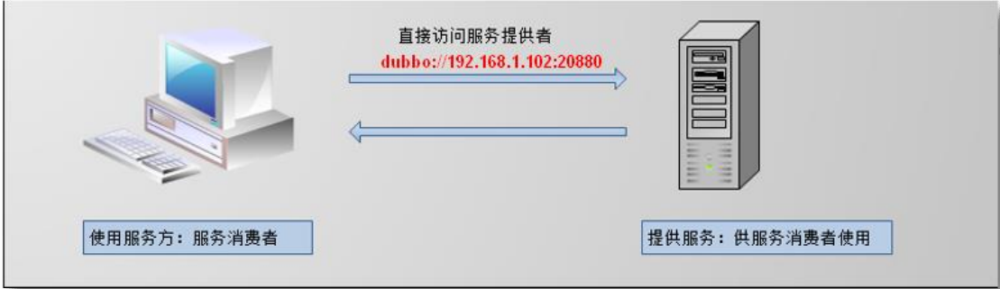

## RPC 基础知识

1. `RPC` 【Remote Procedure Call】是指远程过程调用
   + 是一种进程间通信方
   + 是一种技术思想，而不是规范。

> 它允许程序调用另一个地址空间（网络的另一台机器上）的过程或函 数，而不用开发人员显式编码这个调用的细节。调用本地方法和调用远程方法一样。


2. RPC 的特点  
   + 简单：使用简单，建立分布式应用更容易。 
   + 高效：调用过程看起来十分清晰，效率高。
   + 通用：进程间通讯的方式，有通用的规则。


3. RPC架构
   一个完整的RPC架构里面包含了四个核心的组件，分别是C lient，Client Stub，Server以及Server Stub，这个Stub可以理解为存根。
   - 客户端(Client)，服务的调用方。
   - 客户端存根(Client Stub)，存放服务端的地址消息，再将客户端的请求参数打包成网络消息，然后通过网络远程发送给服务方。
   - 服务端(Server)，真正的服务提供者。
   - 服务端存根(Server Stub)，接收客户端发送过来的消息，将消息解包，并调用本地的方法。


4. RPC 基本原理

   	

   1. 调用方 client 要使用右侧 server 的功能（方法），发起对方法的调用
   2. client stub 是 PRC 中定义的存根，看做是 client 的助手。stub 把要调用的方法参数进行序 列化，方法名称和其他数据包装起来。
   3. 通过网络 socket(网络通信的技术)，把方法调用的细节内容发送给右侧的 server 
   4. server 端通过 socket 接收请求的方法名称，参数等数据，传给 stub。 
   5. server 端接到的数据由 serverstub(server 的助手)处理，调用 server 的真正方法，处理业务
   6. server 方法处理完业务，把处理的结果对象（Object）交给了助手，助手把 Object 进行序 列化，对象转为二进制数据。
   7. server 助手二进制数据交给网络处理程序 
   8. 通过网络将二进制数据，发送给 client。 
   9. client 接数据，交给 client 助手。 
   10. client 助手，接收数据通过反序列化为 java 对象（Object），作为远程方法调用结果。

   

> rpc 通讯是基于 tcp 或 udp 议 
>
> 序列化方式（xml/json/二进制）


## Dubbo 概述

1. Apache Dubbo (incubating)  
   + 一款高性能、轻量级的开源 Java `RPC` 框架
   + 提供了三大核心能力：
     + 面向接口的远程方法调用
     + 智能容错和负载均衡
     + 以及服务自动注册和发现。 
   + 是一个分布式服务框架，致力于提供高性能和透明化的 RPC 远程服务调用方案、服 务治理方案。


2. 基本架构

   

   + `服务提供者`（Provider）：暴露服务的服务提供方，服务提供者在启动时，向注册中心注 册自己提供的服务。 

   + `服务消费者`（Consumer）: 调用远程服务的服务消费方，服务消费者在启动时，向注册 中心订阅自己所需的服务，服务消费者，从提供者地址列表中，基于软负载均衡算法，选一 台提供者进行调用，如果调用失败，再选另一台调用。 

   + `注册中心`（Registry）：注册中心返回服务提供者地址列表给消费者，如果有变更，注册 中心将基于长连接推送变更数据给消费者 

   + `监控中心`（Monitor）：服务消费者和提供者，在内存中累计调用次数和调用时间，定时 每分钟发送一次统计数据到监控中心

     > 调用关系说明
     >
     > + 服务容器负责启动，加载，运行服务提供者。
     > + 服务提供者在启动时，向注册中心注册自己提供的服务。
     > + 服务消费者在启动时，向注册中心订阅自己所需的服务。
     > + 注册中心返回服务提供者地址列表给消费者，如果有变更，注册中心将基于长连接推送变更数据给消费者。
     > + 服务消费者，从提供者地址列表中，基于软负载均衡算法，选一台提供者进行调用，如果调用失败，再选另一台调用。
     > + 服务消费者和提供者，在内存中累计调用次数和调用时间，定时每分钟发送一次统计数据到监控中心。


​	

## 注册中心-Zookeeper

###  注册中心概述

服务注册中心 通过特定协议来完成服务对外的统一(管理)。

Dubbo 提供 的注册中心有如下几种类型可供选： 

+ Multicast 注册中心：组播方式 
+ Redis 注册中心：使用 Redis 作为注册中心 
+ Simple 注册中心：就是一个 dubbo 服务。作为注册中心。提供查找服务的功能。 
+ Zookeeper 注册中心：使用 Zookeeper 作为注册中心，Zookeeper 是一个高性能的，分布式的，开放源码的分布式应用程序协调服务。简称 zk。


注册中心工作方式


### 安装 zookeeper

1. 下载zookeeper  网址 http://zookeeper.apache.org/releases.html
2. 解压zookeeper  解压运行 `zkServer.cmd` ，初次运行会报错，没有zoo.cfg配置文件 
3.  修改zoo.cfg配置文件  
   + 将conf下的 `zoo_sample.cfg` 复制一份改名为 `zoo.cfg` 即可。 
   + 注意几个重要位置：  `dataDir=./临时数据存储的目录`（可写相对路径）  
   + `clientPort=2181`   zookeeper的端口号  修改完成后再次启动zookeeper  
4. 使用 `zkCli.cmd` 测试 
   + `ls /`：列出zookeeper根下保存的所有节点  
   + create –e /ixfosa123：创建一个 ixfosa 节点，值为123  get /ixfosa：获取/ixfosa节点的值 

> `Zookeeper3.5` 以后的版本, 会自动占用 `8080` 端口
>
> + 修改 `conf/zoo.cfg` 配置文件更改端口 `admin.serverPort=post`
>
> 避免与 `dubbo-admin` 端口冲突

```properties
# 修改默认 启动所占用的端口
admin.serverPort=8083

# 心跳的时间，单位毫秒. Zookeeper 服务器之间或客户端与服务器之间维持心跳的时间间隔，
# 也就是每个 tickTime 时间就会发送一个心跳。表明存活状态。
tickTime=2000

# The number of ticks that the initial 
# synchronization phase can take
initLimit=10
# The number of ticks that can pass between 
# sending a request and getting an acknowledgement
syncLimit=5

# 数据目录，可以是任意目录。存储 zookeeper 的快照文件、pid 文件，默认为/tmp/zookeeper，
# 建议在 zookeeper 安装目录下创建 data 目录，
# 将 dataDir 配置改为/usr/local/zookeeper-3.4.10/data
dataDir=../data

# 客户端连接 zookeeper 的端口，即 zookeeper 对外的服务端口，默认为 2181
clientPort=2181
```


## dubbo-admin 监控中心

dubbo 的使用，其实只需要有注册中心，消费者，提供者这三个就可以使用了，但是并不能 看到有哪些消费者和提供者，为了更好的调试，发现问题，解决问题，因此引入 dubbo-admin。 通过 dubbo-admin 可以对消费者和提供者进行管理。可以在 dubbo 应用部署做动态的调整， 服务的管理。

> + `dubbo-admin` 图形化的服务管理页面；安装时需要指定注册中心地址，即可从注册中心中获取到所有的提 供者/消费者进行配置管理
> + `dubbo-monitor-simple` 简单的监控中心；


1. 下载dubbo-admin

   + `git clone https://github.com/apache/dubbo-admin.git`
     + 后端部分：`dubbo-admin-server`
       + 构建： `mvn clean package -Dmaven.test.skip=true`
       + 启动：`java  -jar dubbo-admin-server-0.3.0.jar`
     + 前端部分：`dubbo-admin-ui`   
       + 安装依赖：`npm install`
       + 启动：`npm run dev`

   

2. `application.properties` 配置项说明

   - admin.config-center
     - 推荐使用，配置中心地址，比如`admin.config-center="zookeeper://127.0.0.1:2181"`
     - 需要在配置中心中，配置注册中心和元数据中心地址配置格式如下：

   - admin.registry.address
     - 不推荐使用，老版本的配置中心地址，比如：`admin.registry.address="zookeeper://127.0.0.1:2181"`
     - 如使用该配置，Dubbo Admin会将其作为注册中心和配置中心使用，元数据中心将无法使用，会影响服务测试等功能。

   ```properties
   # centers in dubbo2.7, if you want to add parameters, please add them to the url
   admin.registry.address=zookeeper://127.0.0.1:2181
   admin.config-center=zookeeper://127.0.0.1:2181
   admin.metadata-report.address=zookeeper://127.0.0.1:2181
   
   # 登陆 dubbo-admin-ui 的密码
   admin.root.user.name=root
   admin.root.user.password=root
   
   #session timeout, default is one hour
   admin.check.sessionTimeoutMilli=3600000
   
   # compress
   server.compression.enabled=true
   server.compression.mime-types=text/css,text/javascript,application/javascript
   server.compression.min-response-size=10240
   ```


## 使用 Zookeeper

### 工程架构

+ 分包 
  + 建议将服务接口、服务模型、服务异常等均放在公共包中。
+ 粒度 
  + 服务接口尽可能大粒度，每个服务方法应代表一个功能，而不是某功能的一个步骤， 否则将面临分布式事务问题，Dubbo 暂未提供分布式事务支持。 
  + 服务接口建议以业务场景为单位划分，并对相近业务做抽象，防止接口数量爆炸。
  + **不建议使用过于抽象的通用接口**，如：Map query(Map)，这样的接口没有明确语义， 会给后期维护带来不便。
+ 版本
  + 每个接口都应定义版本号，为后续不兼容升级提供可能
  + 如： `<dubbo:service interface="com.xxx.XxxService" version="1.0" />`
  + 建议使用两位版本号，要变更服务版本。先升级一半提供者为新版本，再将消费者全 部升为新版本，然后将剩下的一半提供者升为新版本。

+ 新建三个 maven javase 工程
  + service-interface：服务接口 (被服务提供者、服务消费者所依赖)
  + service-provider：服务提供者
  + service-consumer：服务消费者

### service-interface：接口工程

+ 项目结构

  ```java
  |-- src
  	|-- main
  		|-- java
  			|-- top.
  				|-- ixfosa
  					|-- service
                          |-- HelloService.java
                          |-- SayService.java
                   	|-- App.java
  ```

  

+ HelloService.java

  ```java
  public interface HelloService {
      void hello();
  }
  ```

  

+ SayService.java

  ```java
  public interface SayService {
      void say();
  }
  ```

  

### service-provider：服务提供者

+ 项目结构

  ```java
  |-- src
  	|-- main
  		|-- java
  			|-- top
  				|-- ixfosa
  					|-- service
                          |-- impl
                          	|-- HelloServiceImpl.java
                   	|-- App.java
      	|-- resources
      		|-- provider.xml
  |-- pom.xml
  ```

+ pom.xml

  ```xml
  <!-- 引入dubbo -->
  <dependency>
      <groupId>com.alibaba</groupId>
      <artifactId>dubbo</artifactId>
      <version>2.6.2</version>
  </dependency>
  
  <!-- 注册中心使用的是zookeeper，引入操作zookeeper的客户端端 -->
  <dependency>
      <groupId>org.apache.curator</groupId>
      <artifactId>curator-framework</artifactId>
      <version>2.12.0</version>
  </dependency>
  
  <!-- 接口工程,公共资源项目 -->
  <dependency>
      <groupId>top.ixfosa</groupId>
      <artifactId>service-interface</artifactId>
      <version>1.0</version>
  </dependency>
  
  <!-- Spring依赖 -->
  <dependency>
      <groupId>org.springframework</groupId>
      <artifactId>spring-context</artifactId>
      <version>5.2.16.RELEASE</version>
  </dependency>
  ```

+ HelloServiceImpl.java

  ```java
  public class HelloServiceImpl implements HelloService {
      @Override
      public void hello() {
          System.out.println("Hello Dubbo...");
      }
  }
  ```

+ provider.xml

  ```xml
  <?xml version="1.0" encoding="UTF-8"?>
  <beans xmlns="http://www.springframework.org/schema/beans"
         xmlns:xsi="http://www.w3.org/2001/XMLSchema-instance"
         xmlns:dubbo="http://dubbo.apache.org/schema/dubbo"
         xsi:schemaLocation="http://www.springframework.org/schema/beans
         http://www.springframework.org/schema/beans/spring-beans.xsd
         http://dubbo.apache.org/schema/dubbo
         http://dubbo.apache.org/schema/dubbo/dubbo.xsd">
  
      <!-- 1、指定当前服务/应用的名字（同样的服务名字相同，不要和别的服务同名） -->
      <dubbo:application name="service-provider" />
  
      <!-- 2、指定注册中心的位置 -->
      <!-- <dubbo:registry address="zookeeper://127.0.0.1:2181" /> -->
      <dubbo:registry protocol="zookeeper" address="127.0.0.1:2181" />
  
      <!-- 3、指定通信规则（通信协议？通信端口） -->
      <dubbo:protocol name="dubbo" port="20880" />
  
      <!-- 4、暴露服务   ref：指向服务的真正的实现对象 -->
      <dubbo:service interface="top.ixfosa.service.HelloService"
                     ref="helloService" timeout="1000" version="1.0.0">
          <dubbo:method name="hello" timeout="1000" />
      </dubbo:service>
  
      <!-- 加载业务接口的实现类到spring容器中 -->
      <bean id="helloService" class="top.ixfosa.service.impl.HelloServiceImpl" />
  	
      <!--统一设置服务提供方的规则  -->
      <dubbo:provider timeout="1000" />
      
      <!-- 连接监控中心 -->
      <!-- <dubbo:monitor protocol="registry" /> -->
  </beans>
  ```

+ App.java

  ```java
  public class App {
      public static void main( String[] args ) throws IOException {
          ClassPathXmlApplicationContext ioc =
                  new ClassPathXmlApplicationContext("provider.xml");
  
          ioc.start();
          System.in.read();
      }
  }
  ```


### service-consumer：服务消费者

+ 项目结构

  ```java
  |-- src
  	|-- main
  		|-- java
  			|-- top
  				|-- ixfosa
  					|-- service
                          |-- impl
                          	|-- SayServiceImpl.java
                   	|-- App.java
      	|-- resources
      		|-- consumer.xml
  |-- pom.xml
  ```

+ pom.xml

  ```xml
  <!-- 引入dubbo -->
  <!-- https://mvnrepository.com/artifact/com.alibaba/dubbo -->
  <dependency>
      <groupId>com.alibaba</groupId>
      <artifactId>dubbo</artifactId>
      <version>2.6.2</version>
  </dependency>
  <!-- 注册中心使用的是zookeeper，引入操作zookeeper的客户端端 -->
  <dependency>
      <groupId>org.apache.curator</groupId>
      <artifactId>curator-framework</artifactId>
      <version>2.12.0</version>
  </dependency>
  
  <dependency>
      <groupId>org.springframework</groupId>
      <artifactId>spring-context</artifactId>
      <version>5.2.16.RELEASE</version>
  </dependency>
  
  <!-- 接口工程 -->
  <dependency>
      <groupId>top.ixfosa</groupId>
      <artifactId>service-interface</artifactId>
      <version>1.0</version>
  </dependency>
  ```

+ SayServiceImpl.java

  ```java
  @Service
  public class SayServiceImpl implements SayService  {
      @Autowired
      private HelloService helloService;
  
      @Override
      public void say() {
          System.out.println("say...");
          helloService.hello();
      }
  }
  ```

+ consumer.xml

  ```xml
  <?xml version="1.0" encoding="UTF-8"?>
  <beans xmlns="http://www.springframework.org/schema/beans"
         xmlns:context="http://www.springframework.org/schema/context"
         xmlns:xsi="http://www.w3.org/2001/XMLSchema-instance"
         xmlns:dubbo="http://dubbo.apache.org/schema/dubbo"
         xsi:schemaLocation="http://www.springframework.org/schema/beans
         http://www.springframework.org/schema/beans/spring-beans.xsd
         http://www.springframework.org/schema/context
  	   http://www.springframework.org/schema/context/spring-context-4.3.xsd
         http://dubbo.apache.org/schema/dubbo
         http://dubbo.apache.org/schema/dubbo/dubbo.xsd">
  
      <!-- 开启Spring注解扫描 -->
      <context:component-scan base-package="top.ixfosa.service.impl" />
      
      <!-- 指定当前服务/应用的名字 -->
      <dubbo:application name="service-provider" />
  
      <!-- 指定注册中心的位置 -->
      <dubbo:registry address="zookeeper://127.0.0.1:2181" />
  
  
      <!-- 配置本地存根 -->
      <!--声明需要调用的远程服务的接口；生成远程服务代理  -->
      <!--
          1）、精确优先 (方法级优先，接口级次之，全局配置再次之)
          2）、消费者设置优先(如果级别一样，则消费方优先，提供方次之)
      -->
      <!-- timeout="0" 默认是1000ms-->
      <!-- retries="":重试次数，不包含第一次调用，0代表不重试-->
      <!-- 幂等（设置重试次数）【查询、删除、修改】、非幂等（不能设置重试次数）【新增】 -->
      <dubbo:reference interface="top.ixfosa.service.HelloService"
                       id="helloService" timeout="5000" retries="3" version="*">
          <!-- <dubbo:method name="hello" timeout="1000" /> -->
      </dubbo:reference>
  
  
      <!-- 配置当前消费者的统一规则：所有的服务都不检查 -->
      <dubbo:consumer check="false" timeout="5000"></dubbo:consumer>
  
      <!-- <dubbo:monitor protocol="registry"></dubbo:monitor> -->
      <!-- <dubbo:monitor address="127.0.0.1:7070"></dubbo:monitor> -->
  </beans>
  ```

+ App.java

  ```java
  public class App {
      public static void main( String[] args ) throws IOException {
          ClassPathXmlApplicationContext ioc =
                  new ClassPathXmlApplicationContext("consumer.xml");
  
          SayService sayService = ioc.getBean(SayService.class);
          sayService.say();
  
          System.out.println( "Hello World!" );
          System.out.println("调用完成....");
  
          System.in.read();
      }
  }
  ```


### 运行应用

1. 启动 zookeeper 客户端  `zkServer.cmd`

2. 启动 dubbo-admin-server 后台，` java -jar  jar文件`
3. 启动 dubbo-admin-ui 前台，`npm run dev`
4. 启动 service-provider 服务提供者
5. 启动 service-consumer：服务消费者

```java
// service-provider：服务提供者 控制台输出
Hello Dubbo...

//service-consumer：服务消费者 控制台输出
say...
Hello World!
调用完成....
```


## 直连方式

### 直连方式概述

点对点的直连项目: 消费者直接访问服务提供者，**没有注册中心**。

+ 消费者必须指定服务 提供者的访问地址（url）。 

+ 消费者直接通过 url 地址访问固定的服务提供者。这个 url 地址是不变的。

  


### link-service-interface：接口工程

+ 项目结构

  ```java
  |-- src
  	|-- main
  		|-- java
  			|-- top.
  				|-- ixfosa
  					|-- service
                          |-- HelloService.java
                          |-- SayService.java
                   	|-- App.java
  ```

  

+ HelloService.java

  ```java
  public interface HelloService {
      void hello();
  }
  ```

  

+ SayService.java

  ```java
  public interface SayService {
      void say();
  }
  ```

  

### link-service-provider：服务提供者

+ 项目结构

  ```java
  |-- src
  	|-- main
  		|-- java
  			|-- top
  				|-- ixfosa
  					|-- service
                          |-- impl
                          	|-- HelloServiceImpl.java
                   	|-- App.java
      	|-- resources
      		|-- provider.xml
  |-- pom.xml
  ```

+ pom.xml

  ```xml
  <!-- 引入dubbo -->
  <dependency>
      <groupId>com.alibaba</groupId>
      <artifactId>dubbo</artifactId>
      <version>2.6.2</version>
  </dependency>
  
  <!-- 注册中心使用的是zookeeper，引入操作zookeeper的客户端端 -->
  <dependency>
      <groupId>org.apache.curator</groupId>
      <artifactId>curator-framework</artifactId>
      <version>2.12.0</version>
  </dependency>
  
  <!-- 接口工程,公共资源项目 -->
  <dependency>
      <groupId>top.ixfosa</groupId>
      <artifactId>link-service-interface</artifactId>
      <version>1.0</version>
  </dependency>
  
  <!-- Spring依赖 -->
  <dependency>
      <groupId>org.springframework</groupId>
      <artifactId>spring-context</artifactId>
      <version>5.2.16.RELEASE</version>
  </dependency>
  ```

+ HelloServiceImpl.java

  ```java
  public class HelloServiceImpl implements HelloService {
      @Override
      public void hello() {
          System.out.println("Hello Dubbo...");
      }
  }
  ```

+ provider.xml

  ```xml
  <?xml version="1.0" encoding="UTF-8"?>
  <beans xmlns="http://www.springframework.org/schema/beans"
         xmlns:xsi="http://www.w3.org/2001/XMLSchema-instance"
         xmlns:dubbo="http://dubbo.apache.org/schema/dubbo"
         xsi:schemaLocation="http://www.springframework.org/schema/beans
         http://www.springframework.org/schema/beans/spring-beans.xsd
         http://dubbo.apache.org/schema/dubbo
         http://dubbo.apache.org/schema/dubbo/dubbo.xsd">
  
      <!-- 声明dubbo服务提供者的名称:保证唯一性 -->
      <dubbo:application name="link-service-provider" />
  
  
      <!--设置dubbo使用的协议和端口号
          name:dubbo使用协议的名称
          port:dubbo服务的端口号
      -->
      <dubbo:protocol name="dubbo" port="20880" />
  
      <!-- 暴露服务   ref：指向服务的真正的实现对象 -->
      <dubbo:service interface="top.ixfosa.service.HelloService"
                     ref="helloService" registry="N/A">
  
      </dubbo:service>
  
      <!-- 加载业务接口的实现类到spring容器中 -->
      <bean id="helloService" class="top.ixfosa.service.impl.HelloServiceImpl" />
  </beans>
  ```

+ App.java

  ```java
  public class App {
      public static void main( String[] args ) throws IOException {
          ClassPathXmlApplicationContext ioc =
                  new ClassPathXmlApplicationContext("provider.xml");
  
          ioc.start();
          System.in.read();
      }
  }
  ```


### link-service-consumer：服务消费者

+ 项目结构

  ```java
  |-- src
  	|-- main
  		|-- java
  			|-- top
  				|-- ixfosa
  					|-- service
                          |-- impl
                          	|-- SayServiceImpl.java
                   	|-- App.java
      	|-- resources
      		|-- consumer.xml
  |-- pom.xml
  ```

+ pom.xml

  ```xml
  <!-- 引入dubbo -->
  <!-- https://mvnrepository.com/artifact/com.alibaba/dubbo -->
  <dependency>
      <groupId>com.alibaba</groupId>
      <artifactId>dubbo</artifactId>
      <version>2.6.2</version>
  </dependency>
  <!-- 注册中心使用的是zookeeper，引入操作zookeeper的客户端端 -->
  <dependency>
      <groupId>org.apache.curator</groupId>
      <artifactId>curator-framework</artifactId>
      <version>2.12.0</version>
  </dependency>
  
  <dependency>
      <groupId>org.springframework</groupId>
      <artifactId>spring-context</artifactId>
      <version>5.2.16.RELEASE</version>
  </dependency>
  
  <!-- 接口工程 -->
  <dependency>
      <groupId>top.ixfosa</groupId>
      <artifactId>link-service-interface</artifactId>
      <version>1.0</version>
  </dependency>
  ```

+ SayServiceImpl.java

  ```java
  @Service
  public class SayServiceImpl implements SayService  {
      @Autowired
      private HelloService helloService;
  
      @Override
      public void say() {
          System.out.println("say...");
          helloService.hello();
      }
  }
  ```

+ consumer.xml

  ```xml
  <?xml version="1.0" encoding="UTF-8"?>
  <beans xmlns="http://www.springframework.org/schema/beans"
         xmlns:context="http://www.springframework.org/schema/context"
         xmlns:xsi="http://www.w3.org/2001/XMLSchema-instance"
         xmlns:dubbo="http://dubbo.apache.org/schema/dubbo"
         xsi:schemaLocation="http://www.springframework.org/schema/beans
         http://www.springframework.org/schema/beans/spring-beans.xsd
         http://www.springframework.org/schema/context
  	   http://www.springframework.org/schema/context/spring-context-4.3.xsd
         http://dubbo.apache.org/schema/dubbo
         http://dubbo.apache.org/schema/dubbo/dubbo.xsd">
  
      <!-- 开启Spring注解扫描 -->
      <context:component-scan base-package="top.ixfosa.service.impl" />
      <!-- 指定当前服务/应用的名字 -->
      <dubbo:application name="link-service-provider" />
  
      <!-- 引用远程接口服务 -->
      <dubbo:reference
              interface="top.ixfosa.service.HelloService"
              id="helloService"
              url="dubbo://localhost:20880"
              registry="N/A"
      />
  </beans>
  ```

  

```java
// service-provider：服务提供者 控制台输出
Hello Dubbo...

//service-consumer：服务消费者 控制台输出
say...
Hello World!
调用完成....
```


## 整合SpringBoot

### 公共资源项目

+ 项目结构

  

+ 数据模型 Student

  ```java
  @Data
  @AllArgsConstructor
  public class Student implements Serializable {
      private Integer id;
      private String name;
      private Integer age;
      private Character gender;
  }
  ```

+ 公共接口

  + StudentService.java

    ```java
    public interface StudentService {
        List<Student> findStuList();
    }
    ```

  + TeacherService

    ```java
    public interface TeacherService {
        List<Student> initStuList();
    }
    ```

+ pom.xml

  ```xml
  <dependency>
      <groupId>org.projectlombok</groupId>
      <artifactId>lombok</artifactId>
      <version>1.18.20</version>
  </dependency>
  ```


### 直连方式

#### 服务提供者

+ 项目结构

  

+ pom.xml 依赖

  ```xml
  <dependencies>
      <!-- MyBatis-Plus 依赖 -->
      <dependency>
          <groupId>com.baomidou</groupId>
          <artifactId>mybatis-plus-boot-starter</artifactId>
          <version>3.4.3.1</version>
      </dependency>
      <!-- MySQL 驱动-->
      <dependency>
          <groupId>mysql</groupId>
          <artifactId>mysql-connector-java</artifactId>
          <scope>runtime</scope>
      </dependency>
      <!-- 数据库连接池 -->
      <dependency>
          <groupId>com.alibaba</groupId>
          <artifactId>druid</artifactId>
          <version>1.1.10</version>
      </dependency>
      <!-- Spring-Boot Dubbbo 启动器 -->
      <dependency>
          <groupId>com.alibaba.boot</groupId>
          <artifactId>dubbo-spring-boot-starter</artifactId>
          <version>0.2.0</version>
      </dependency>
      <!-- 接口工程 -->
      <dependency>
          <groupId>top.ixfosa</groupId>
          <artifactId>springboot-service-interface</artifactId>
          <version>1.0</version>
      </dependency>
   	<dependency>
          <groupId>org.springframework.boot</groupId>
          <artifactId>spring-boot-starter-test</artifactId>
          <scope>test</scope>
      </dependency>
  </dependencies>
  ```

+ application.properties

  ```properties
  spring.datasource.driver-class-name=com.mysql.cj.jdbc.Driver
  spring.datasource.url=jdbc:mysql://localhost:3306/springdata?useUnicode=true&characterEncoding=utf8
  spring.datasource.username=root
  spring.datasource.password=ixfosa
  spring.datasource.type=com.alibaba.druid.pool.DruidDataSource
  
  # dubbo 相关配置
  # <!-- 声明dubbo服务提供者的名称:保证唯一性 -->
  # <dubbo:application name="link-service-provider" />
  dubbo.application.name=springboot-service-provider
  
  # 设置dubbo使用的协议和端口号
  # <dubbo:protocol name="dubbo" port="20880" />
  dubbo.protocol.name=dubbo
  dubbo.protocol.port=20880
  dubbo.registry.address=N/A
  ```

+ StudentMapperjava

  ```java
  @Repository
  public interface StudentMapper extends BaseMapper<Student> {
  }
  ```

+ StudentServiceImpl.java

  ````java
  @Service // 暴露服务
  @Component
  public class StudentServiceImpl implements StudentService {
  
      @Autowired
      private StudentMapper mapper;
  
      @Override
      public List<Student> findStuList() {
          return mapper.selectList(null);
      }
  }
  ````

+ SpringbootServiceProviderApplication.java

  ```java
  @SpringBootApplication
  @MapperScan("top.ixfosa.mapper")
  @EnableDubbo(scanBasePackages="top.ixfosa.service")
  public class SpringbootServiceProviderApplication {
  
      public static void main(String[] args) throws IOException {
          SpringApplication.run(SpringbootServiceProviderApplication.class, args);
          System.in.read();
      }
  }
  ```


#### 服务消费者

+ 项目结构

  

+ pom.xml 依赖

  ```xml
  <dependencies>
      <dependency>
          <groupId>org.springframework.boot</groupId>
          <artifactId>spring-boot-starter-web</artifactId>
      </dependency>
      <dependency>
          <groupId>org.springframework.boot</groupId>
          <artifactId>spring-boot-starter-test</artifactId>
          <scope>test</scope>
      </dependency>
      
      <dependency>
          <groupId>com.alibaba.boot</groupId>
          <artifactId>dubbo-spring-boot-starter</artifactId>
          <version>0.2.0</version>
      </dependency>
      
      <dependency>
          <groupId>top.ixfosa</groupId>
          <artifactId>springboot-service-interface</artifactId>
          <version>1.0</version>
      </dependency>
  </dependencies>
  ```

  

+ application.properties

  ```properties
  # 指定当前服务/应用的名字
  # <dubbo:application name="link-service-provider" />
  dubbo.application.name=spring-service-consumer
  ```

+ TeacherServiceImpl.java

  ````java
  @Component
  public class TeacherServiceImpl implements TeacherService {
      @Reference(url = "dubbo://localhost:20880")  // dubbo直连
      private StudentService studentService;
      @Override
      public List<Student> initStuList() {
          return studentService.findStuList();
      }
  }
  ````

+ TeacherController.java

  ````java
  @RestController
  public class TeacherController {
      @Autowired
      private TeacherService teacherService;
  
      @RequestMapping("list")
      public List<Student> list() {
          return teacherService.initStuList();
      }
  }
  ````

+ SpringbootServiceConsumerApplication.java

  ```java
  @SpringBootApplication
  @EnableDubbo(scanBasePackages = "top.ixfosa.controller")
  public class SpringbootServiceConsumerApplication {
  
      public static void main(String[] args) {
          SpringApplication.run(SpringbootServiceConsumerApplication.class, args);
      }
  }
  ```

> 访问：`http://localhost:8080/list`


### 使用注册中心方式

+ 修改 application.properties

  + 服务提供者

    ```properties
    spring.datasource.driver-class-name=com.mysql.cj.jdbc.Driver
    spring.datasource.url=jdbc:mysql://localhost:3306/springdata?useUnicode=true&characterEncoding=utf8
    spring.datasource.username=root
    spring.datasource.password=ixfosa
    spring.datasource.type=com.alibaba.druid.pool.DruidDataSource
    
    # dubbo 相关配置
    # <!-- 声明dubbo服务提供者的名称:保证唯一性 -->
    # <dubbo:application name="link-service-provider" />
    dubbo.application.name=springboot-service-provider
    
    # 设置dubbo使用的协议和端口号
    # <dubbo:protocol name="dubbo" port="20880" />
    # dubbo.protocol.name=dubbo
    # dubbo.protocol.port=20880
    # dubbo.registry.address=N/A
    
    # 使用 zookeeper 注册中心
    dubbo.registry.address=127.0.0.1:2181
    dubbo.registry.protocol=zookeeper
    ```

  + 服务消费者

    ```properties
    server.port=8888   // 8080 端口被 dubbo-admin-server 占用
    
    # 指定当前服务/应用的名字
    # <dubbo:application name="link-service-provider" />
    dubbo.application.name=spring-service-consumer
    dubbo.registry.address=zookeeper://127.0.0.1:2181
    ```

+ 修改 服务消费者 TeacherServiceImpl.java：

  ```java
  @Component
  public class TeacherServiceImpl implements TeacherService {
  
      @Reference // (url = "dubbo://localhost:20880")
      private StudentService studentService;
      @Override
      public List<Student> initStuList() {
          return studentService.findStuList();
      }
  }
  ```

> 访问：http://localhost:8888/list


## dubbo 常用标签


## dubbo配置


## 注册中心的高可用