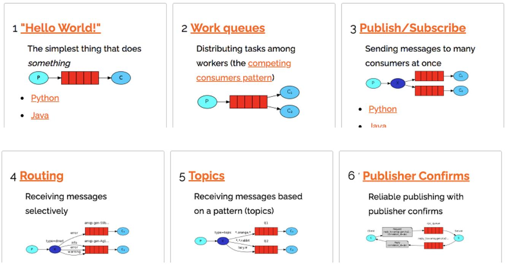
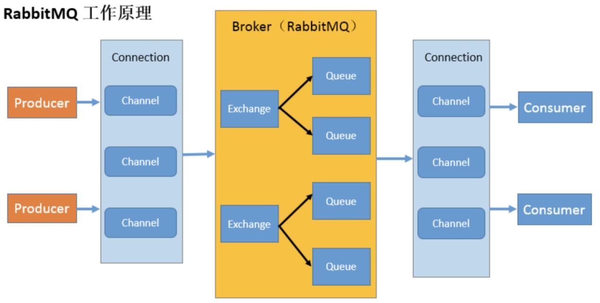

## RabbitMQ 的概念 

+ RabbitMQ 是一个消息中间件：它接受并转发消息。
+ 实现了高级消息队列协议（AMQP）的开源消息代理软件（亦称面向消息的中间件）。
+ RabbitMQ服务器是用Erlang语言编写的


## 四大核心概念 

+ `生产者` (Producer)

  + 生产者创建消息，然后发布到 RabbitMQ 中

+ `交换机` (Exchange)

  + 生产者将消息发送到 Exchange，由交换器将消息路由到一个或者多个队列中。如果路由不到，或许会返回给生产者（需要设置 mandatory 参数），或许直接丢弃

+ `消费者` (Consumer)

  + 消费者连接到 RabbitMQ 服务器，并订阅到队列上
  + 消费与接收具有相似的含义。消费者大多时候是一个等待接收消息的程序。
  + 请注意生产者，消费者和消息中间件很多时候并不在同一机器上。
  + 同一个应用程序既可以是生产者又是可以是消费者。
  + 交换器类型
    + `fanout` ：把所有发送到该交换器的消息路由到所有与该交换器绑定的队列中（广播）
    + `direct` ：把消息路由到 BindingKey 和 RoutingKey 完全匹配的队列中（单播）
    + `topic` ：将消息路由到 BindingKey 和 RoutingKey 相匹配的队列中。
      + BindingKey 和 RoutingKey 是一个点号“`.`”分隔的字符串
      + BindingKey 中可以存在两种特殊字符“`*`”（匹配一个单词）、“`#`”（匹配零或多个单词），用于做\*模糊匹配*
    + `headers` ：不依赖于路由键的匹配规则来路由消息，而是根据发送的消息内容中的 headers 属性进行匹配

+ `队列` (Queue)

  + 是 RabbitMQ 内部使用的一种数据结构，用于存储消息

  + 多个消费者订阅同一个队列时，队列中的消息将以**轮询**（round-robin）的分发方式发送给消费者
  + 队列仅受主机的内存和磁盘限制的约束，本质上是一个大的消息缓冲区。
  + 许多生产者可以将消息发送到一个队列，许多消费者可以尝试从一个队列接收数据。

## 核心部分 




## 工作原理

生产者发送消息

+ 生产者连接到 RabbitMQ Broker，建立一个连接（Connection），开启一个信道（Channel）
+ 生产者声明一个交换器，并设置相关属性，比如交换机类型、是否持久化等
+ 生产者声明一个队列，并设置相关属性，比如是否排他、是否持久化、是否自动删除等
+ 生产者通过路由键将交换器和队列绑定起来
+ 生产者发送消息至 RabbitMQ Broker，其中包含路由键、交换器等信息
+ 相应的交换器根据接收到的路由键查找相匹配的队列
+ 如果找到，则将从生产者发送过来的消息存入相应的队列中；如果没有找到，则根据生产者配置的属性选择丢弃还是回退给生产者
+ 关闭信道，关闭连接

> 如果尝试声明一个已经存在的交换器或者队列，只要声明的参数完全匹配现存的交换器或者队列，RabbitMQ 就可以什么都不做，并成功返回；如果声明的参数不匹配则会抛出异常




相关概念

+ `Broker` ：消息中间件的服务节点
+ `Virtual host` ：出于多租户和安全因素设计的，把 AMQP 的基本组件划分到一个虚拟的分组中，类似于网络中的 namespace 概念。当多个不同的用户使用同一个 RabbitMQ server 提供的服务时，可以划分出 多个 vhost，每个用户在自己的 vhost 创建 exchange／queue 等
+ `RoutingKey` ：路由键，生产者将消息发给交换器时，用来指定这个消息的路由规则
+ `Connection` ：publisher／consumer 和 broker 之间的 TCP 连接。
  + 一个 Connection 可以用来创建多个 Channel 实例，但是 Channel 实例不能在线程间共享，应用程序应该为每一个线程开辟一个 Channel
+ `Channel` ：如果每一次访问 RabbitMQ 都建立一个 Connection，在消息量大的时候建立 TCP Connection 的开销将是巨大的，效率也较低。Channel 是在 connection 内部建立的逻辑连接，如果应用程序支持多线程，通常每个 thread 创建单独的 channel 进行通讯，AMQP method 包含了 channel id 帮助客户端和 message broker 识别 channel，所以 channel 之间是完全隔离的。Channel 作为轻量级的 Connection 极大减少了操作系统建立 TCP connection 的开销 
+ `Exchange` ：message 到达 broker 的第一站，根据分发规则，匹配查询表中的 routing key，分发 消息到 queue 中去。
+ `Queue` ：消息最终被送到这里等待 consumer 取走 
+ `Binding` ：exchange 和 queue 之间的虚拟连接，binding 中可以包含 routing key，Binding 信息被保存到 exchange 中的查询表中，用于 message 的分发依据
+ `Message`：消息一般可以包含 2 个部分：消息体和标签。消息体（payload）一般是一个带有业务逻辑结构的数据；消息的标签（label）用来表述这条消息，比如一个**交换器的名称**和一个**路由键**


## 安装RabbitMQ

```shell
1. 上传相关 RPM 软件包
[root@ixfosa ~]# cd /opt/
[root@ixfosa opt]# rz
[root@ixfosa opt]# ll
total 33572
-rw-r--r--. 1 root root 18850824 Jun 15 17:03 erlang-21.3-1.el7.x86_64.rpm
-rw-r--r--. 1 root root 15520399 Jun 15 17:03 rabbitmq-server-3.8.8-1.el7.noarch.rpm

# 查看Linux版本
[root@ixfosa opt]# uname -a
Linux ixfosa 3.10.0-693.el7.x86_64 #1 SMP Tue Aug 22 21:09:27 UTC 2017 x86_64 x86_64 x86_64 GNU/Linux


2. 安装文件(分别按照以下顺序安装)
rpm -ivh erlang-21.3-1.el7.x86_64.rpm
yum install socat -y
rpm -ivh rabbitmq-server-3.8.8-1.el7.noarch.rpm


3. 常用命令(按照以下顺序执行)
# 添加开机启动 RabbitMQ 服务
chkconfig rabbitmq-server on
# 启动服务
/sbin/service rabbitmq-server start
# 查看服务状态
# Active: active (running) since Fri 2021-10-15 12:18:57 CST; 9min ago
/sbin/service rabbitmq-server status
# 停止服务(选择执行)
/sbin/service rabbitmq-server stop
# 开启 web 管理插件
rabbitmq-plugins enable rabbitmq_management
# 用默认账号密码(guest)访问地址 http://192.168.1.129:15672出现权限问题


4. 添加一个新的用户
# 创建账号
rabbitmqctl add_user admin ixfosa
# 设置用户角色
rabbitmqctl set_user_tags admin administrator
# 设置用户权限
set_permissions [-p <vhostpath>] <user> <conf> <write> <read>
rabbitmqctl set_permissions -p "/" admin ".*" ".*" ".*"
# 用户 user_admin 具有/vhost1 这个 virtual host 中所有资源的配置、写、读权限
# 当前用户和角色
rabbitmqctl list_users


5. 再次利用 admin 用户登录


6. 重置命令
# 关闭应用的命令为
rabbitmqctl stop_app
# 清除的命令为
rabbitmqctl reset
# 重新启动命令为
rabbitmqctl start_app


7. 注意事项
# 启动时 可能报如下错误
[root@ixfosa opt]# /sbin/service rabbitmq-server start 
Redirecting to /bin/systemctl start rabbitmq-server.service
Job for rabbitmq-server.service failed because the control process exited with error code. See "systemctl status rabbitmq-server.service" and "journalctl -xe" for details.
[root@ixfosa opt]# journalctl -xe
Oct 12 15:26:32 ixfosa rabbitmqctl[14424]: ===========
Oct 12 15:26:32 ixfosa rabbitmqctl[14424]: attempted to contact: [rabbit@ixfosa]
Oct 12 15:26:32 ixfosa rabbitmqctl[14424]: rabbit@ixfosa:
Oct 12 15:26:32 ixfosa rabbitmqctl[14424]: * unable to connect to epmd (port 4369) on ixfosa: timeout (timed out)
........

# 解决
[root@ixfosa opt]#  vi /etc/hosts
127.0.0.1   hostname            # 在 /etc/hosts 文件中添加
```


## Hello World

