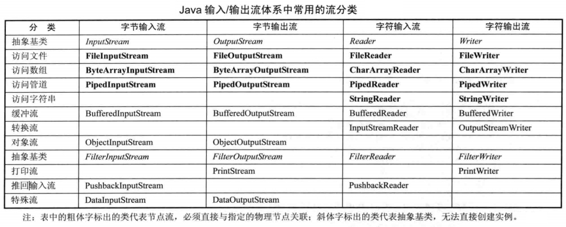

## File类

### File类概述

File类可以描述一个文件或者一个文件夹。

+ 在 java.io 包下，只能操作文件和目录，不能访问文件内容本身

+ File类的构造方法：

```java
// 指定文件或者文件夹的`路径`创建一个File文件。
File(String pathname)  

// 根据 parent 抽象路径名和 child 路径名字符串创建一个新 File 实例。 
File(File parent, String child)

File(String parent, String child)
```

+ 全局静态常量
  + 路径分隔符：char `pathSeparatorChar`、String `pathSeparator`
  + 文件名称分隔符：char `separatorChar`、String `separator`


### 目录分隔符和路径

目录分隔符：  在windows机器上 的目录分隔符是 `\`  ,在linux机器上的目录分隔符是`/` .

> **注意**：  
> 在windows上面`\ 与 /`都可以使用作为目录分隔符。 而且，`如果写 / 的时候只需要写一个即可`。


路径问题：

+ `绝对路径`： 该文件在硬盘上 的完整路径。绝对路径一般都是以盘符开头的。
+ `相对路径`:  相对路径就是资源文件相对于当前程序所在的路径。
  +  `.` 当前路径
  + `..` 上一级路径

> 注意： 如果程序当前所在的路径与资源文件不是在同一个盘下面，是没法写相对路径的。


### File常用方法

#### 创建

```java
createNewFile()	在指定位置创建一个空文件，成功就返回true，如果已存在就不创建然后返回false

renameTo(File dest)	重命名文件或文件夹，也可以操作非空的文件夹。
	如果目标文件与源文件是在`同一个路径下`，那么renameTo的作用是`重命名`
	如果目标文件与源文件`不在同一个路径下`，那么renameTo的作用就是`剪切`，而且还不能操作文件夹。
	移动/重命名成功则返回true，失败则返回false。
    
static File createTempFile(String prefix, String suffix)：
   在默认的临时文件目录中创建一个临时的文件，使用给定前缀、 系统生成的随机数和给定后缀作为文件名
   （prefix 参数至少是 3 字节长，suffix 参数为 null 时，将使用默认的后缀“.tmp”）
    
static File createTempFile(String prefix, String suffix, File directory)：
   在 directory 所指定的目录中创建一个临时的文件，使用给定前缀、系统生成的随机数和给定后缀作为文件名
```

```java
import java.io.File;
import java.io.IOException;

public class Demo {
	
	public static void main(String[] args) throws IOException {

		File file = new File("E:\\aa");

		// createNewFile 创建一个指定的文件，如果该文件存在了，则不会再创建，
        // 如果还没有存在则创建。创建成功返回true，否则返回false。
		System.out.println("创建成功了吗？"+file.createNewFile());  //创建成功了吗？true
		
		File dir = new  File("E:\\a.txt");
		System.out.println("创建文件夹成功吗？"+dir.mkdir()); // 创建文件夹成功吗？true 
        
        // mkdir 创建一个单级文件夹，
		dir = new File("F:\\aa\\bb");  // F不存在
		System.out.println("创建多级文件夹："+ dir.mkdirs()); // 创建多级文件夹：false
		
		// renameTo()  
		// 如果目标文件与源文件是在同一个路径下，那么renameTo的作用是重命名
		// 如果目标文件与源文件不是在同一个路径下，那么renameTo的作用就是剪切，而且还不能操作文件夹。
		File destFile = new File("E:\\aaaaaaw");
        // 重命名成功吗？true
		System.out.println("重命名成功吗？"+file.renameTo(destFile)) ; 
	}
}
```


#### 删除

```java
delete()  删除文件或一个空文件夹，如果是文件夹且不为空，则不能删除，成功返回true，失败返回false。
    
// 在虚拟机终止时，请求删除此抽象路径名表示的文件或目录，保证程序异常时创建的临时文件也可以被删除    
deleteOnExit()
```

```java
import java.io.File;

public class Demo {
	public static void main(String[] args) {

		// 删除的。
		File file = new File("E:\\a.txt");
        
        // delete方法不能用于删除非空的文件夹。
		System.out.println("删除成功吗？ "+ file.delete());  
		file.deleteOnExit();  // jvm退出的时候删除文件。 一般用于删除临时 文件。		
		

		// 判断
		File file = new File("..\\..\\a.txt");
		System.out.println("存在吗？"+ file.exists());
        
        // 如果是文件返回true，否则返回false
		System.out.println("判断是否是一个文件："+file.isFile());
        // 是文件夹返回ture，否则返回false
		System.out.println("判断是否是一个文件夹："+ file.isDirectory());
		System.out.println("是隐藏的 文件吗："+ file.isHidden());
        
        // 测试此抽象路径名是否为绝对路径名。
		System.out.println("是绝对路吗？"+ file.isAbsolute()); 
	}
}
```


#### 判断

```java
exists()		文件或文件夹是否存在。
isFile()		是否是一个文件，如果不存在，则始终为false。
isDirectory()	是否是一个目录，如果不存在，则始终为false。
isHidden()		是否是一个隐藏的文件或是否是隐藏的目录。
isAbsolute()	测试此抽象路径名是否为绝对路径名。
    
boolean canRead()：判断 File 对象所对应的文件和目录是否可读
boolean canWrite()：判断 File 对象所对应的文件和目录是否可写
boolean canExecute()：判断应用程序是否可以执行此 File 对象所对应的文件或目录
```

```java
import java.io.File;

public class Demo {
	public static void main(String[] args) {

		File file = new File("E:/a.txt");
		
		File parentFile = new File("E:\\");
		File file2 = new File("F:\\","a.txt");
		
        // 存在吗？ false // exists 判断该文件是否存在，存在返回true，否则返回false。
		System.out.println("存在吗？ "+ file.exists()); 
		
		System.out.println("目录分隔符："+ File.separator); // 目录分隔符：\
	}
}
```


#### 获取

```java
getName()		    获取文件或文件夹的名称，不包含上级路径。
getPath()           返回绝对路径，可以是相对路径，但是目录要指定
getAbsolutePath()	获取文件的绝对路径，与文件是否存在没关系
length()		获取文件的大小（字节数），如果文件不存在则返回0L，如果是文件夹也返回0L。
getParent()		返回此抽象路径名父目录的路径名字符串；如果此路径名没有指定父目录，则返回null。
lastModified()	获取最后一次被修改的时间。

getAbsolutePath()   目录分隔符
```

```java
import java.io.File;

public class Demo {
	public static void main(String[] args) {
		
		File file = new  File(".");
        // 当前路径是：E:\smile\.
		System.out.println("当前路径是："+ file.getAbsolutePath());    
		
		File file2 = new File("..\\..\\a.txt");
		System.out.println("存在吗？"+ file2.exists());  //存在吗？false
	}
}
```

```java
public class  Demo {
	public static void main(String[] args) throws IOException{

		File file = new File("..\\c.txt");

		System.out.println("创建成功了吗？"+file.createNewFile());  // 创建成功了吗？true

		System.out.println("存在吗？ "+ file.exists());   // 存在吗？ true
		System.out.println("文件名："+ file.getName());   //文件名：c.txt
		System.out.println("获取相对路径："+ file.getPath()); // 获取相对路径：..\c.txt
		System.out.println("getAbsolutePath获取绝对路径："+file.getAbsolutePath()); 
        
        // getAbsolutePath获取绝对路径：E:\smile\..\c.txt 
		System.out.println("获取文件的父路径："+ file.getParent());  // 获取文件的父路径：..
		// 获取文件的的大小(字节为单位)：0
        System.out.println("获取文件的的大小(字节为单位)："+ file.length()); 
		
		//  使用毫秒值转换成Date对象
		long lastModified = file.lastModified();
		Date date = new Date(lastModified);	
		SimpleDateFormat dateFormat = 
            new SimpleDateFormat("yyyy年MM月dd日  HH:mm:ss");  
        // 2020年07月24日  11:08:01
		System.out.println("获取最后一次的修改时间(毫秒值)："+ dateFormat.format(date) );  
	}
}
```


#### 文件夹相关

```java
mkdir()				在指定位置创建目录，这只会创建最后一级目录，如果上级目录不存在就抛异常。
mkdirs()			在指定位置创建目录，这会创建路径中所有不存在的目录。

staic File[] listRoots()	列出所有的根目录（Window中就是所有系统的盘符）
list()		 返回目录下的文件或者目录名，包含隐藏文件。对于文件这样操作会返回null。
listFiles()  返回目录下的文件或者目录对象（File类实例），包含隐藏文件。对于文件这样操作会返回null。

list(FilenameFilter filter)	把当前文件夹下面的所有子文件名与子文件夹名存储到一个String类型的数组中 返回。

// 把当前文件夹下面的所有子文件与子文件夹都使用了一个Flie对象描述，
// 然后把这些File对象存储到一个FIle数组中返回
listFiles(FilenameFilter filter) 
```

```java
import java.io.File;

public class Demo {
	public static void main(String[] args) {

		File[] roots = File.listRoots(); //列出所有的根目录
		for(File file  : roots){
			System.out.println(file);    //C:\   D:\    E:\
		}
		
		File file = new File("E:\smile");
        // 把当前文件夹下面的所有子文件名与子文件夹名存储到一个String类型的数组中 返回。
		String[] fileNames = file.list(); 
		for(String fileName : fileNames){
			System.out.println(fileName);
		}
		/*
            Demo.class
            Demo.java
            ixfosa.txt
            java
            linux
            py
		*/
		
         // 把当前文件夹下面的所有子文件与子文件夹都使用了一个File对象描述，
        // 然后把这些File对象存储到一个FIle数组中返回
		File[] files = file.listFiles();
		for(File fileItem : files){
			System.out.println("文件名："+ fileItem.getName());
		}
		/*
            文件名：Demo.class
            文件名：Demo.java
            文件名：ixfosa.txt
            文件名：java
            文件名：linux
            文件名：py
		 */
	}
}
```

```java
import java.io.File;
import java.io.FilenameFilter;

/*
需求1 ：  指定一个文件夹，然后该文件夹下面所有java文件。
需求2： 指定一个文件夹，然后列出文件夹下面的所有子文件与文件夹，但是格式要如下:
 
文件：
	文件名1
	文件名2
	文件名3
	..

文件夹：
	文件夹名1
	文件夹名2
	文件夹名3
	....
*/

// 自定义一个文件名过滤器
class MyFilter implements FilenameFilter{

	@Override
	public boolean accept(File dir, String name) {
		//System.out.println("文件夹:"+dir+" 文件名："+ name);
		/*文件夹:E:\smile 文件名：Demo.class
		文件夹:E:\smile 文件名：Demo.java
		文件夹:E:\smile 文件名：ixfosa.txt
		文件夹:E:\smile 文件名：java
		文件夹:E:\smile 文件名：linux
		文件夹:E:\smile 文件名：MyFilter.class
		文件夹:E:\smile 文件名：py*/
		return name.endsWith(".java");
	}
}

public class Demo {
	public static void main(String[] args) {

		File dir = new File("E:\\smile");
		//listJava2(dir);  //Demo.java
		//listJava(dir);  //Demo.java

		listFile(dir);
	}

	public static void listJava2(File dir){
		File[] files = dir.listFiles(new MyFilter()); //得到文件夹下面的所有子文件与文件夹。
		for(File file : files){
			System.out.println(file.getName());
		}
	}

	//列出所有的java文件
	public static void listJava(File dir){
        
		File[] files = dir.listFiles(); //获取到了所有的子文件

		for(File file : files){
			String fileName = file.getName();

			/*if(fileName.endsWith(".java")&&file.isFile()){
				System.out.println(fileName);
			}*/

			if(fileName.matches(".+\\.java") && file.isFile()){
				System.out.println(fileName);
			}
		}
	}

	public static void listFile(File dir){
		File[] files = dir.listFiles();//获取到所有的子文件
		System.out.println("文件：");
		for(File fileItem : files){
			if(fileItem.isFile()){
				System.out.println("\t"+fileItem.getName());
			}
		}

		System.out.println("文件夹：");
		for(File fileItem : files){
			if(fileItem.isDirectory()){
				System.out.println("\t"+fileItem.getName());
			}
		}
	}
}
```


## IO流概述

IO流 应用

+ IO技术主要的作用是解决设备与设备之间 的数据传输问题。
  + 硬盘                ---->   内存
  + 内存的数据     ---->  硬盘上
  + 把键盘的数据 -----> 内存中

+ O技术的应用场景：
  + 导出报表、 上传、 下载 

> 数据保存到硬盘上，该数据就可以做到永久性的保存。   数据一般是以文件的形式保存到硬盘上


IO 流

+ 所有传统的流类型（类或抽象类）都放在` java. io `包下

+ 流对象封装了用于保存输入或输出信息的缓冲空间，以及针对这个缓冲空间进行操作的方法

+ 步骤：

  - 创建节点对象
  - 创建 IO 流对象
  - 具体的 IO 操作（read()、write()）
  - 关闭 IO 流对象

+ IO流分类：

  + 如果是按照数据的流向划分：从程序运行所在内存的角度来划分的
    + `输入流`
    + `输出流`

  + 如果按照处理的单位划分：

    + `字节流`: 字节流读取得都是文件中二进制数据，读取到二进制数据不会经过任何的处理。

    + `字符流`： 字符流读取的数据是以字符为单位的 。 字符流也是读取文件中的二进制数据，不过会把这些二进制数据转换成我们能 识别的字符。  

      > `字符流 = 字节流 + 解码`
      >
      > 字节流和字符流字节流操作的数据单元是` 8 `位的字节字符流操作的数据单元是 16 位的字符（2个字节）

+ 节点流和处理流

  - `节点流`，和实际的输入/输出节点连接，流的构造器参数是一个物理节点
  - `处理流`（包装流），对已存在的节点流进行连接或封装，流的构造器参数是已经存在的流
  - 使用处理流来包装节点流，程序通过处理流来执行输入/输出功能，让节点流与底层的 I/O 设备、 文件交互

+ 4 个抽象基类：`InputStream`、`OutputStream`、`Reader`、`Writer`

+ `InputStreamReader`、`OutputStreamWriter` 类是从字节流到字符流的桥梁




## 字节流

### 输入字节流

----| `InputStream` 所有输入字节流的基类  抽象类
-------| `FileInputStream`  读取文件数据的输入字节流 

使用FileInputStream读取文件数据的步骤：

1. 找到目标文件
2. 建立数据的输入通道。
3. 读取文件中的数据。
4. 关闭 资源.

> 问题1： 读取完一个文件的数据的时候，不关闭资源有什么影响?
> 答案： 资源文件一旦 使用完毕应该马上释放，否则其他的程序无法对该资源文件进行其他 的操作。

```java
public class Demo {
	public static void main(String[] args) throws IOException {

		//readTest1();
		//readTest2();
		//readTest3();
		readTest4();
	}

	// 方式4：使用缓冲数组配合循环一起读取。28
	public static void readTest4() throws IOException{
		long startTime = System.currentTimeMillis();
		// 找到目标文件
		File file = new File("E:\\smile\\java\\images\\java-thread.jpg");
		// 建立数据的输入通道
		FileInputStream fileInputStream = new FileInputStream(file);
		// 建立缓冲数组配合循环读取文件的数据。
		int length = 0; //保存每次读取到的字节个数。
        
        // 存储读取到的数据  
        // 缓冲数组 的长度一般是1024的倍数，因为与计算机的处理单位。  理论上缓冲数组越大，效率越高
		byte[] buf = new byte[1024]; 
		// read方法如果读取到了文件的末尾，那么会返回-1表示。
		while((length = fileInputStream.read(buf))!=-1){ 
			System.out.print(new String(buf,0,length));
		}
		
		// 关闭资源
		fileInputStream.close();

		long endTime = System.currentTimeMillis();
		System.out.println("读取的时间是："+ (endTime-startTime)); //446
	}

    /*-----------------------------------------------------------------------------*/

	// 方式3：使用缓冲数组 读取。    缺点： 无法读取完整一个文件的数据。 12G
	public static void readTest3() throws IOException{
		// 找到目标文件
		File file = new File("E:\\a.txt");
		// 建立数据的输入通道
		FileInputStream fileInputStream = new FileInputStream(file);
		// 建立缓冲字节数组，读取文件的数据。
		byte[] buf = new byte[1024];  // 缓冲
        
        // 如果使用read读取数据传入字节数组，那么数据是存储到字节数组中的，
        // 而这时候read方法的返回值是表示的是本次读取了几个字节数据到字节数组中。
		int length = fileInputStream.read(buf); 
		System.out.println("length:"+ length);
		
		// 使用字节数组构建字符串
		String content = new String(buf,0,length);
		System.out.println("内容："+ content);   //中文会乱码
		// 关闭资源
		fileInputStream.close();
	}

	/*-----------------------------------------------------------------------------*/

	// 方式2 ： 使用循环读取文件的数据
	public static void readTest2() throws IOException{
		long startTime = System.currentTimeMillis();
		// 找到目标文件
		File file = new File("E:\\smile\\java\\images\\java-thread.jpg");
		// 建立数据的输入通道
		FileInputStream fileInputStream = new FileInputStream(file);
		// 读取文件的数据
		int content = 0; // 声明该变量用于存储读取到的数据
		while((content = fileInputStream.read())!=-1){
			System.out.print(content);
		}
		//关闭资源
		fileInputStream.close();
		
		long endTime = System.currentTimeMillis();  
		System.out.println("读取的时间是："+ (endTime-startTime)); // 446
	}

	/*-----------------------------------------------------------------------------*/

	// 读取的方式一缺陷： 无法读取完整一个文件 的数据.
	public static void readTest1() throws IOException{
		// 找到目标文件
		File file = new File("E:\\a.txt");
		// 建立数据的输入通道。
		FileInputStream fileInputStream = new FileInputStream(file);
		// 读取文件中的数据
        // read() 读取一个字节的数据，把读取的数据返回。
		int content = fileInputStream.read(); 
		System.out.println("读到的内容是："+ (char)content);
		// 关闭资源    实际上就是释放资源。 
		 fileInputStream.close();
	}
}
```

```java
public class Demo {
	public static void main(String[] args) throws IOException {

		// 找到目标文件
		File file = new File("E:\\a.txt");

		// 建立数据的输入通道
		FileInputStream fileInputStream = new FileInputStream(file);

		//  建立缓冲字节数组读取文件
		byte[] buf = new byte[8];
		int length = 0 ;
		
		while((length = fileInputStream.read(buf))!=-1){

			// System.out.print(new String(buf)); 

			/* 
			// a.txt 实际内容 ixfosalongzhong(15byte)  实际：ixfosalongzhongo
				第一次：ixfosalo
				第二次：ngzhongo    多输出 o
				分析： 建立缓冲字节数组byte[] buf = new byte[8]; 写满后数据并不会消失
			 */	

			// System.out.print(new String(buf,0,length));  //ixfosalongzhong
			
			// System.out.print(buf);  //[B@15db9742 [B@15db9742

			System.out.println(Arrays.toString(buf));
			// [105, 120, 102, 111, 115, 97, 108, 111]
			// [110, 103, 122, 104, 111, 110, 103, 111]
		}

		// 释放文件资源
		fileInputStream.close();
	}
}
```


###  输出字节流

------| `OutputStream` 是所有输出字节流的父类。  `抽象类`
--------| `FileOutStream` 向文件输出数据的输出字节流。


**FileOutputStream要注意的细节：**

 	1. 使用FileOutputStream 的时候，如果目标文件不存在，那么会`自动创建`目标文件对象。 
	2. 使用FileOutputStream写数据的时候，如果目标文件已经存在，那么会`先清空`目标文件中的数据，然后再写入数据。
	3. 使用FileOutputStream写数据的时候, 如果目标文件已经存在，需要在原来数据基础上追加数据的时候应该使用`new FileOutputStream(file,true)`构造函数，第二参数为`true`。
	4. 使用FileOutputStream的write方法写数据的时候，虽然接收的是一个int类型的数据，但是真正写出的只是一个`字节`的数据，只是把低八位的二进制数据写出，其他二十四位数据全部丢弃。
    

**FileOutputStream如何使用**

 	1. 找到目标文件
	2. 建立数据的输出通道。
	3. 把数据转换成字节数组写出。
	4. 关闭资源


```java

import java.io.File;
import java.io.FileInputStream;
import java.io.FileNotFoundException;
import java.io.FileOutputStream;
import java.io.IOException;

public class Demo {
	
	public static void main(String[] args) throws IOException {

		writeTest3();
		// writeTest2();
		// writeTest1();
	}
	
	// 使用字节数组把数据写出。
	public static void writeTest3() throws IOException{

		// 找到目标文件
		File file = new File("E:\\b.txt");
		// 建立数据输出通道
		FileOutputStream fileOutputStream = new FileOutputStream(file);

		// 把数据写出。
		String data = "abc";
		byte[] buf = data.getBytes();

		fileOutputStream.write(buf, 0, 3); 
        
		//关闭资源
		fileOutputStream.close();
	}
		
	
	//使用字节数组把数据写出。
	public static void writeTest2() throws IOException{

		// 找到目标文件
		File file = new File("E:\\b.txt");
		// 建立数据输出通道
		FileOutputStream fileOutputStream = new FileOutputStream(file,true);
		//把数据写出。
		String data = "\r\nhello world";
        
		fileOutputStream.write(data.getBytes());
		//关闭资源
		fileOutputStream.close();
	}
	
	// 每次只能写一个字节的数据出去。
	public static void writeTest1() throws IOException{
        
		// 找到目标文件
		File file = new File("E:\\b.txt");
		// 建立数据的输出通道
		FileOutputStream fileOutputStream = new FileOutputStream(file);
		//把数据写出
		fileOutputStream.write('h');
		fileOutputStream.write('e');
		fileOutputStream.write('l');
		fileOutputStream.write('l');
		fileOutputStream.write('o');
		//关闭资源
		fileOutputStream.close();
	}
}
```

```java
import java.io.File;
import java.io.FileInputStream;
import java.io.FileNotFoundException;
import java.io.FileOutputStream;
import java.io.IOException;
import java.util.Arrays;

/*
使用FileOutputStream的write方法写数据的时候，虽然接收的是一个int类型的数据，但是真正写出的只是一个字节的数据，只是把低八位的二进制数据写出，其他二十四位数据全部丢弃。

 
 00000000-000000000-00000001-11111111   511
*/
public class Demo {
	public static void main(String[] args) throws IOException {

		readTest();
		writeTest();
	}
	
	public static void readTest() throws IOException{

		// 找到目标文件
		File file = new File("E:\\c.txt");
		// 建立数据的输入通道
		FileInputStream fileInputStream = new FileInputStream(file);

		//建立缓冲输入读取文件数据
		byte[] buf = new byte[4];

		// 读取文件数据
		int length = fileInputStream.read(buf);
        
		// 字节数组的内容：[-1, 0, 0, 0]		
		System.out.println("字节数组的内容："+ Arrays.toString(buf));  

		// 关闭资源
		fileInputStream.close();
		
	}
	
	public static void writeTest() throws FileNotFoundException, IOException {

		// 找到目标文件
		File file = new File("E:\\c.txt");
		// 建立数据的输出通道
		FileOutputStream fileOutputStream = new FileOutputStream(file);
		//把数据写出
		fileOutputStream.write(511);
		// 关闭资源
		fileOutputStream.close();
	}
}
```


### 拷贝图片

```java
/*
	练习： 使用缓冲输入输出字节流拷贝一个图片。
*/
public class Demo {
	public static void main(String[] args) throws IOException {

		// 找到目标文件
		File  inFile = new File("E:\\smile\\java\\images\\java-thread.jpg");
		File outFile = new File("E:\\1.jpg");

		// 建立数据输入输出通道
		FileInputStream fileInputStream = new FileInputStream(inFile);
		FileOutputStream fileOutputStream = new FileOutputStream(outFile);

		// 建立缓冲输入输出流
		BufferedInputStream bufferedInputStream = 
           			 	new BufferedInputStream(fileInputStream);
		BufferedOutputStream bufferedOutputStream = 
            			new BufferedOutputStream(fileOutputStream);

		// 边读边写
		int content = 0; 

		//int length = bufferedInputStream.read(buf);   
        // 如果传入了缓冲数组，内容是存储到缓冲数组中，返回值是存储到缓冲数组中的字节个数。
		// 如果使用read方法没有传入缓冲数组，那么返回值是读取到的内容。
        while((content = bufferedInputStream.read())!=-1){ 
			bufferedOutputStream.write(content);
			//bufferedOutputStream.flush();
		}
		//关闭资源
		bufferedInputStream.close();
		bufferedOutputStream.close();
	}
}
```

```java
/*
	需求： 拷贝一张图片。
*/
public class CopyImage {
	public static void main(String[] args) throws IOException {

		//找到目标文件
		File inFile = new File("E:\\smile\\java\\images\\java-thread.jpg");
		File destFile = new File("E:\\1.jpg");

		//建立数据的输入输出通道
		FileInputStream fileInputStream = new  FileInputStream(inFile);
        // 追加数据....
		FileOutputStream fileOutputStream = new FileOutputStream(destFile); 
		
		// 每新创建一个FileOutputStream的时候，默认情况下FileOutputStream的指针
        // 是指向了文件的开始的位置。每写出一次，指向都会出现相应移动。
		//建立缓冲数据，边读边写
		byte[] buf = new byte[1024]; 
		int length = 0 ;

		while((length = fileInputStream.read(buf))!=-1){ // 最后一次只剩下了824个字节
			fileOutputStream.write(buf,0,length); // 写出很多次数据，所以就必须要追加。
		}

		//关闭资源 原则： 先开后关，后开先关。
		fileOutputStream.close();
		fileInputStream.close();
	}

}
```


### 缓冲输入字节流

输入字节流体系： 
----| `InputStream`  输入字节流的基类。 抽象
-------| `FileInputStream` 读取文件数据的输入字节流
-------| `BufferedInputStream` 缓冲输入字节流 ，缓冲输入字节流的出现主要是为了提高读取文件数据的效率。该类内部只不过是`维护了一个8kb的字节数组`而已。                             

> 注意： `凡是缓冲流都不具备读写文件的能力`。

使用BufferedInputStream的步骤:

 	1. 找到目标文件。
	2. 建立数据 的输入通道
	3. 建立缓冲 输入字节流流
	4. 关闭资源

```java

import java.io.BufferedInputStream;
import java.io.BufferedOutputStream;
import java.io.File;
import java.io.FileInputStream;
import java.io.FileOutputStream;
import java.io.IOException;

public class Demo {
	public static void main(String[] args) throws IOException {

		readTest2();
	}

	public static void readTest2() throws IOException{

		//找到目标文件
		File file = new File("E:\\a.txt");
		
		FileInputStream fileInputStream= new FileInputStream(file);
		BufferedInputStream bufferedInputStream= 
            new BufferedInputStream(fileInputStream);
        
		// bufferedInputStream.read();
		
		FileOutputStream fileOutputStream= new FileOutputStream(file);
		BufferedOutputStream bufferedOutputStream= 
            new BufferedOutputStream(fileOutputStream);
        
		// fileOutputStream.write(null);
		
		// 读取文件数据
		int content = 0 ;

		// 疑问：BufferedInputStream出现 的目的是了提高读取文件的效率，
        // 但是BufferedInputStream的read方法每次读取一个字节的数据
		// 而FileInputStreram每次也是读取一个字节的数据，那么BufferedInputStream效率高从
        // 何而来？
		while((content = fileInputStream.read())!=-1){
			System.out.print((char)content);
		}

		// 关闭资源
        // 调用BufferedInputStream的close方法实际上关闭的是FileinputStream.
		bufferedInputStream.close();
	}


	// 读取文件的时候我们都是使用缓冲数组读取。效率会更加高
	public static void readTest() throws IOException{

		File file = new File("E:\\a.txt");
		// 建立数组通道
		FileInputStream fileInputStream = new FileInputStream(file);
		//建立缓冲数组读取数据
		byte[] buf = new byte[1024*8];
		int length = 0;
		while((length = fileInputStream.read(buf))!=-1){
			System.out.print(new String(buf,0,length));
		}

		//关闭资源
		fileInputStream.close();
	}
}
```

### 缓冲输出字节流

缓冲输出字节流体系： 

-----| `OutputStream`  所有输出字节流的基类  抽象类
--------| `FileOutputStream` 向文件 输出数据 的输出字节流
--------| `Bufferedoutputstream`  缓冲输出字节流   目的是为了提高写数据的效率。 内部也是维护了一个`8kb的字节数组`。
        						 

BufferedOutputStream 要注意的细节

 	1. 使用BufferedOutStream写数据的时候，它的write方法是是先把数据写到它内部维护的字节数组中。
  	2. 使用BufferedOutStream写数据的时候，它的write方法是是先把数据写到它内部维护的字节数组中，如果需要把数据真正的写到硬盘上面，需要调用`flush`方法或者是`close`方法、 或者是内部维护的字节数组已经填满数据的时候。

```java
public class Demo {

	public static void main(String[] args) throws IOException {

		// 找到目标文件
		File file = new File("E:\\a.txt");
		// 建立数据的输出通道
		FileOutputStream  fileOutputStream = new FileOutputStream(file);

		// 建立缓冲输出字节流对象
		BufferedOutputStream bufferedOutputStream  = 
            new BufferedOutputStream(fileOutputStream);

		// 把数据写出
		bufferedOutputStream.write("hello world".getBytes()); 

		// 把缓冲数组中内部的数据写到硬盘上面。
		bufferedOutputStream.flush();

		bufferedOutputStream.close();
	}
}
```


### IO异常的处理

```java
import java.io.File;
import java.io.FileInputStream;
import java.io.FileOutputStream;
import java.io.IOException;

import javax.management.RuntimeErrorException;

/*
 	IO异常 的处理
 */
public class Demo {
	public static void main(String[] args) {

		// readTest();
		copyImage();
	}

	// 拷贝图片
	public static void copyImage() {

		FileInputStream fileInputStream = null;
		FileOutputStream fileOutputStream = null;

		try {
			// 找到目标文件
			File inFile = new File("E:\\smile\\java\\images\\java-thread.jpg");
			File outFile = new File("E:\\1.jpg");

			// 建立输入输出通道
			fileInputStream = new FileInputStream(inFile);
			fileOutputStream = new FileOutputStream(outFile);

			// 建立缓冲数组，边读边写
			byte[] buf = new byte[1024];
			int length = 0;

			while ((length = fileInputStream.read(buf)) != -1) {
				fileOutputStream.write(buf, 0, length);
			}

		} catch (IOException e) {

			System.out.println("拷贝图片出错...");
			throw new RuntimeException(e);

		} finally {
			// 关闭资源
			try {
				if (fileOutputStream != null) {
					fileOutputStream.close();
					System.out.println("关闭输出流对象成功...");
				}
			} catch (IOException e) {
				System.out.println("关闭输出流资源失败...");
				throw new RuntimeException(e);
			} finally {
				if (fileInputStream != null) {
					try {
						fileInputStream.close();
						System.out.println("关闭输入流对象成功...");
					} catch (IOException e) {
						System.out.println("关闭输入流对象失败...");
						throw new RuntimeException(e);
					}
				}

			}
		}
	}

	public static void readTest() {

		FileInputStream fileInputStream = null;
		try {
			// 找到目标文件
			File file = new File("F:\\aaaaa.txt");
			// 建立数据输入通道
			fileInputStream = new FileInputStream(file);

			// 建立缓冲数组读取数据
			byte[] buf = new byte[1024];
			int length = 0;

			while ((length = fileInputStream.read(buf)) != -1) {
				System.out.print(new String(buf, 0, length));
			}
		} catch (IOException e) {
			/*
			 * 处理的代码... 首先你要阻止后面的代码执行,而且要需要通知调用者这里出错了... 
			 * throw new RuntimeException(e);
			 * 把IOException传递给RuntimeException包装一层，然后再抛出，这样子做的目的是
			 * 为了让调用者使用变得更加灵活。
			 */
			System.out.println("读取文件资源出错....");
			throw new RuntimeException(e);
		} finally {
			try {
				if (fileInputStream != null) {
					fileInputStream.close();
					System.out.println("关闭资源成功...");
				}
			} catch (IOException e) {
				System.out.println("关闭资源失败...");
				throw new RuntimeException(e);
			}
		}
	}
}
```


## 字符流

### 输入字符流

-----| `Reader` 输入字符流的基类   抽象类
--------|  `FileReader` 读取文件的输入字符流。

FileReader的用法
	1. 找到目标文件
	2. 建立数据的输入通道
	3. 读取数据
	4. 关闭资源

```java
public class Demo {
	public static void main(String[] args) throws IOException {
		readTest2();
		// readTest1();
	}

	// 使用缓冲字符数组读取文件。
	public static void readTest2() throws IOException{

		// 找到目标文件
		File file = new File("E:\\smile\\Demo.java");
		// 建立数据的输入通道
		FileReader fileReader = new FileReader(file);

		// 建立缓冲字符数组读取文件数据
		char[] buf = new char[1024];
		int length = 0;

		while((length = fileReader.read(buf)) != -1){
			System.out.print(new String(buf,0,length));  
		}

		//关闭资源
		fileReader.close();
	}
	
	public static void readTest1() throws IOException{

		// 找到目标文件
		File file = new File("E:\\smile\\Demo.java");
		// 建立数据的输入通道
		FileReader fileReader = new FileReader(file);

		int content = 0 ;

		while((content = fileReader.read()) != -1){ // 每次只会读取一个字符，效率低。
			System.out.print((char)content);   
		}

		// 关闭资源
		fileReader.close();
	}
}
```

### 输出字符流

------| `Writer` 输出字符流的基类。 抽象类
-----------| `FileWriter` 向文件数据数据的输出字符流

FileWriter的使用步骤：

 	1. 找到目标文件。
	2. 建立数据输出通道
	3. 写出数据。
	4. 关闭资源

FileWriter要注意的事项：

 	1. 使用FileWriter写数据的时候，FileWriter内部是维护了一个`1024`个字符数组的，写数据的时候会先写入到它内部维护的字符数组中，如果需要
     把数据真正写到硬盘上，需要调用`flush`或者是`close`方法或者是填满了内部的字符数组。
	2. 使用FileWriter的时候，如果目标文件不存在，那么会自动创建目标文件。
	3. 使用FileWriter的时候， 如果目标文件已经存在了，那么默认情况会先情况文件中的数据，然后再写入数据 ， 如果需要在原来的基础上追加数据，需要使用`new FileWriter(File , boolean)`的构造方法，第二参数为`true`。

```java
public class Demo {
	public static void main(String[] args) throws IOException {
		writeTest();
	}

	public static void  writeTest() throws IOException{

		// 找到目标文件
		File file = new File("E:\\a.txt");
		// 建立数据输出通道
		FileWriter fileWriter = new FileWriter(file, true);

		// 准备数据，把数据写出
		String data = "辣条！！";
		fileWriter.write(data);  // 字符流具备解码的功能。

		// 刷新字符流
		//fileWriter.flush();

		// 关闭资源
		fileWriter.close();
	}
}
```

```java
import java.io.File;
import java.io.FileInputStream;
import java.io.FileReader;
import java.io.IOException;

// 使用字节流读取中文
public class Demo {

	public static void main(String[] args) throws IOException {
        
		File file = new File("E:\\a.txt");

		FileInputStream fileInputStream = new FileInputStream(file);

		byte[] buf = new byte[1024];
		int length = 0;

		while((length = fileInputStream.read(buf)) != -1){
			System.out.println(new String(buf,0,length)); // 借用字符串的解码功能。 
		}
		fileInputStream.close();
	}
}
```

```java
import java.io.BufferedReader;
import java.io.BufferedWriter;
import java.io.File;
import java.io.FileNotFoundException;
import java.io.FileReader;
import java.io.FileWriter;
import java.io.IOException;
/*
    何时使用字符流，何时使用字节流？依据是什么？
        使用字符流的应用场景： 如果是读写字符数据的时候则使用字符流。
        使用字节流的应用场景： 如果读写的数据都不需要转换成字符的时候，则使用字节流。 
 */
// 使用字符流拷贝文件
public class Copy {
	public static void main(String[] args) throws IOException {
		BufferedReader bufferedReader = 
            new BufferedReader(new FileReader("E:\\Test.txt"));
        
		BufferedWriter bufferedWriter = 
            new BufferedWriter(new FileWriter("E:\\Test.exe"));
        
		String line=null;
		while((line = bufferedReader.readLine())!=null){
			bufferedWriter.write(line);
		}
		bufferedWriter.close();
		bufferedReader.close();
	}
}
```

### 缓冲输入字符流

-------| `Reader` 所有输入字符流的基类。 抽象类
----------| `FileReader` 读取文件字符串的输入字符流。
----------| `BufferedReader`   缓冲输入字符流  。 

> 缓冲输入字符流出现的目的是为了提高读取文件 的效率和拓展了FileReader的功能。  该类内部也是维护了一个字符数组

> 记住：缓冲流都不具备读写文件的能力。

```java
public class Demo {
	public static void main(String[] args) throws IOException {

		// readTest1();
		File file  = new File("E:\\smile\\Demo.java");
		//建立数据的输入通道。
		FileReader fileReader = new FileReader(file);
		String line =  null;
		
		while((line = myReadLine(fileReader))!=null){
			System.out.println(line);
		}
	}

	// 自己去实现readLine方法。
	public static String myReadLine(FileReader fileReader) throws IOException{

		// 创建一个字符串缓冲类对象
        // StringBuilder主要是用于存储读取到的数据,非线程安全
		StringBuilder sb = new StringBuilder(); 

		int content = 0 ;

		while((content = fileReader.read()) != -1){
			if(content=='\r'){
				continue;
			}else if(content=='\n'){
				break;
			}else{
				// 普通字符
				sb.append((char)content);
			}
		}
		// 代表已经读取完毕了。
		if(content == -1){
			return null;
		}
		return sb.toString();  
	}

	public static void readTest1() throws IOException{

		// 找到目标文件
		File file  = new File("E:\\a.txt");
		// 建立数据的输入通道。
		FileReader fileReader = new FileReader(file);
		//建立缓冲输入字符流
		BufferedReader bufferedReader = new BufferedReader(fileReader);

		//读取数据
		/*
		// 读到了一个字符。读取到的字符肯定也是从Bufferedreader内部的字符数组中获取的到,
		// 所以效率高。
		int content = bufferedReader.read(); 
		System.out.println((char)content);
		*/
        
		// 使用BUfferedReader拓展的功能，readLine()  一次读取一行文本，
        // 如果读到了文件的末尾返回null表示。
		String line =  null;
		while((line = bufferedReader.readLine()) != null){ 
            // 虽然readLine每次读取一行数据，但是读取的line是不包含\r\n的、
			System.out.println(Arrays.toString("aaa".getBytes()));
		}
		// 关闭资源
		bufferedReader.close();
	}
}
```


### 缓冲输出字符流

------|` Writer ` 所有输出字符流的基类，  抽象类。
---------| `FileWriter` 向文件输出字符数据的输出字符流。
---------| `BufferedWriter` 缓冲输出字符流 ，提高FileWriter的写数据效率与拓展FileWriter的功能。

> BufferedWriter内部提供了一个`8192`长度的字符数组作为缓冲区，拓展了FileWriter的功能

```java
public class Demo {
	public static void main(String[] args) throws IOException {

		// 找到目标文件
		File file = new File("E:\\a.txt");
		// 建立数据的输出通道
		FileWriter fileWriter = new FileWriter(file,true);
		// 建立缓冲输出流对象
		BufferedWriter bufferedWriter = new BufferedWriter(fileWriter);

		// 写出数据
		// bufferedWriter.newLine(); //newLine() 换行。 实际上就是想文件输出\r\n.
		bufferedWriter.write("\r\n");
		bufferedWriter.write("夏哈哈！！");

		// 关闭资源
		bufferedWriter.flush();
		bufferedWriter.close();
	}
}
```


### 练习

```java
/*
	练习： 缓冲输入输出字符流用户登陆注册...
*/
public class Login {

	static Scanner scanner = new Scanner(System.in);

	public static void main(String[] args) throws IOException {

		while(true){
			System.out.println("请选择功能： A(注册)   B(登陆)");
			String option =  scanner.next();
			if("a".equalsIgnoreCase(option)){
				// 注册
				reg();
			}else if("b".equalsIgnoreCase(option)){
				// 登陆
				login();
			}else{
				System.out.println("你的输入有误,请重新输入...");
			}
		}
	}

	// 登陆
	public static void login() throws IOException{
		System.out.println("请输入用户名：");
		String userName = scanner.next();
		System.out.println("请输入密码：");
		String password = scanner.next();
		String info = userName+" "+ password;

		// 读取文件的信息，查看文件否有该用户的信息存在，如果存在则登陆成功。
		// 建立数据的输入通道
		// 建立缓冲输入字符流
		BufferedReader bufferedReader = new BufferedReader(new FileReader("E:\\users.txt"));

		String line = null;
		
		boolean isLogin = false; // 用于记录是否登陆成功的标识， 默认是登陆失败的。

		// 不断的读取文件的内容
		while((line = bufferedReader.readLine())!=null){
			if(info.equals(line)){
				isLogin = true;
				break;
			}
		}
		
		if(isLogin){
			System.out.println("欢迎"+userName+"登陆成功...");
		}else{
			System.out.println("不存在该用户信息，请注册!!");
		}
	}

	// 注册
	public static void reg() throws IOException{

		System.out.println("请输入用户名：");
		String userName = scanner.next();
		System.out.println("请 输入密码：");
		String password = scanner.next();
		String info = userName+" "+ password;

		// 把用户的注册的信息写到文件上
		File file = new File("F:\\users.txt");

		FileWriter fileWriter = new FileWriter(file,true);

		// 建立缓冲输出字符流
		BufferedWriter bufferedWriter = new BufferedWriter(fileWriter);

		// 把用户信息写出
		bufferedWriter.write(info);
		bufferedWriter.newLine();

		// 关闭资源
		bufferedWriter.close();
	}
}
```


## 序列流

`SequenceInputStream` : 把多个字节输入流合并成一个字节输入流对象

### 合并文件内容

```java
	/*
    SequenceInputStream(序列流)
    需求：把a.txt与b.txt 文件的内容合并。
 */
public class Demo {
	public static void main(String[] args) throws IOException {
		merge3();
	}

	// 把三个文件合并成一个文件
	public static void merge3() throws IOException{
		//找到目标文件
		File file1 = new File("E:\\a.txt");
		File file2 = new File("E:\\b.txt");
		File file3 = new File("E:\\c.txt");
		File file4 = new File("E:\\d.txt");
		
		
		// 建立对应 的输入输出流对象
		FileOutputStream fileOutputStream = new FileOutputStream(file4);
		FileInputStream fileInputStream1 = new FileInputStream(file1);
		FileInputStream fileInputStream2 = new FileInputStream(file2);
		FileInputStream fileInputStream3 = new FileInputStream(file3);

		// 创建序列流对象
		Vector<FileInputStream> vector = new Vector<FileInputStream>();
		vector.add(fileInputStream1);
		vector.add(fileInputStream2);
		vector.add(fileInputStream3);
		Enumeration<FileInputStream> e = vector.elements();

		SequenceInputStream sequenceInputStream = new SequenceInputStream(e);
		
		// 读取文件数据
		byte[] buf = new byte[1024];
		int length = 0;
		while((length = sequenceInputStream.read(buf)) != -1){
			fileOutputStream.write(buf,0,length);
		}
		
		// 关闭资源
		sequenceInputStream.close();
		fileOutputStream.close();
	}

	// 使用SequenceInputStream合并文件。
	public static void merge2() throws IOException{

		// 找到目标文件
		File inFile1 = new File("E:\\a.txt");
		File inFile2 = new File("E:\\b.txt");
		File outFile = new File("E:\\c.txt");

		// 建立数据的输入输出通道
		FileOutputStream fileOutputStream = new FileOutputStream(outFile);
		FileInputStream fileInputStream1 = new FileInputStream(inFile1);
		FileInputStream fileInputStream2 = new FileInputStream(inFile2);

		//建立序列流对象
		SequenceInputStream inputStream = 
            new SequenceInputStream(fileInputStream1,fileInputStream2);

		byte[] buf = new byte[1024];
		int length = 0;
		
		while((length = inputStream.read(buf))!=-1){
			fileOutputStream.write(buf,0,length);
		}
		// 关闭资源
		inputStream.close();
		fileOutputStream.close();
	}

	// 需求：把a.txt与b.txt 文件的内容合并。
	public static void merge1() throws IOException{
        
		// 找到目标文件
		File inFile1 = new File("F:\\a.txt");
		File inFile2 = new File("F:\\b.txt");
		File outFile = new File("F:\\c.txt");

		// 建立数据的输入输出通道
		FileOutputStream fileOutputStream = new FileOutputStream(outFile);
		FileInputStream fileInputStream1 = new FileInputStream(inFile1);
		FileInputStream fileInputStream2 = new FileInputStream(inFile2);
		
		// 把输入流存储到集合中，然后再从集合中读取
		ArrayList<FileInputStream> list = new ArrayList<FileInputStream>();
		list.add(fileInputStream1);
		list.add(fileInputStream2);
		
		//准备一个缓冲数组
		byte[] buf = new byte[1024];
		int length = 0 ;
		
		for(int i = 0 ; i< list.size() ; i++){
			FileInputStream fileInputStream = list.get(i);
			while((length = fileInputStream.read(buf))!=-1){
				fileOutputStream.write(buf,0,length);
			}
			// 关闭资源
			fileInputStream.close();
		}
		fileOutputStream.close();
	}
}
```


### 文件切割

```java
/*
 	需求： 把一首mp3先切割成n份，然后再把这些文件合并起来。
 */
public class Demo {

	public static void main(String[] args) throws IOException {
		// cutFile();
		mergeFlile();
	}

	// 合并
	public static void mergeFlile() throws IOException{

		//找到目标文件
		File dir = new File("F:\\music");

		//通过目标文件夹找到所有的MP3文件，然后把所有的MP3文件添加到vector中。
		Vector<FileInputStream> vector = new Vector<FileInputStream>();
		File[] files = dir.listFiles();

		for(File file : files){
			if(file.getName().endsWith(".mp3")){
				vector.add(new FileInputStream(file));
			}
		}

		//通过Vector获取迭代器
		Enumeration<FileInputStream> e = vector.elements();

		//创建序列流
		SequenceInputStream inputStream = new SequenceInputStream(e);

		//建立文件的输出通道
		FileOutputStream fileOutputStream = new FileOutputStream("F:\\合并.mp3");

		//建立缓冲数组读取文件
		byte[] buf = new byte[1024];
		int length = 0 ;

		while((length =  inputStream.read(buf))!=-1){
			fileOutputStream.write(buf,0,length);
		}
		//关闭资源
		fileOutputStream.close();
		inputStream.close();
	}

	// 切割MP3
	public static void cutFile() throws IOException{

		File file = new File("F:\\1.mp3");
        
		// 目标文件夹
		File dir = new File("F:\\music");

		// 建立数据的输入通道
		FileInputStream fileInputStream = new FileInputStream(file);

		// 建立缓冲数组读取
		byte[] buf = new byte[1024*1024];
		int length = 0;

		for(int i = 0; (length = fileInputStream.read(buf)) != -1; i++){
			FileOutputStream fileOutputStream =	
                new FileOutputStream(new File(dir,"part"+i+".mp3"));
            
			fileOutputStream.write(buf, 0, length);
			fileOutputStream.close();e[- c=]
		}
		// 关闭资源
		fileInputStream.close();
	}
}
```


## 对象流

对象的输入输出流 : 对象的输入输出流 主要的作用是用于写对象的信息与读取对象的信息。
对象信息一旦写到文件上那么对象的信息就可以做到持久化了

对象的输出流：ObjectInputStream(InputStream in) 

+ 实例方法 `Object readObject()`：从 ObjectInputStream 读取对象（可能需要**强转**）

对象的输入流:  ObjectOutputStream(OutputStream out)

+ 实例方法 `void writeObject(Object obj)`：将指定的对象写入 ObjectOutputStream


**对象输入输出流要注意的细节：**

+ 如果对象需要被写出到文件上，那么对象所属的类必须要实现`Serializable接口`。 

  + Serializable接口没有任何的方法，是一个`标识接口`而已。

+ 对象的反序列化创建对象的时候并不会调用到`构造方法`的、

+ `serialVersionUID` 是用于记录class文件的版本信息的

  + serialVersionUID这个数字是通过一个类的类名、成员、包名、工程名算出的一个数字。

  + 使用`ObjectInputStream`反序列化的时候，ObjectInputStream会先读取文件中的`serialVersionUID`，然后与本地的class文件的serialVersionUID进行对比，如果这两个id不一致，那么反序列化就失败了
  + 如果序列化与反序列化的时候可能会修改类的成员，那么最好一开始就给这个类指定一个serialVersionUID
    + 如果一类已经指定的serialVersionUID，然后在序列化与反序列化的时候，jvm都不会再自己算这个 class的serialVersionUID了。

+ 如果一个对象某个数据不想被序列化到硬盘上，可以使用关键字`transient`修饰。

+ 如果一个类维护了另外`一个类的引用`，那么另外一个类也需要实现`Serializable接口`。

```java
class Address implements Serializable{
	String country;
	String city;
	public Address(String country,String city){
		this.country = country;
		this.city = city;
	}
}

class User implements Serializable{
	private static final long serialVersionUID = 1L;
	String userName ;
	String password;
	transient int age;  // transient 透明
	Address address ;
	public User(String userName , String passwrod) {
		this.userName = userName;
		this.password = passwrod;
	}

	public User(String userName , String passwrod,int age,Address address) {
		this.userName = userName;
		this.password = passwrod;
		this.age = age;
		this.address = address;
	}

	@Override
	public String toString() {
		return "用户名："+this.userName+ " 密码："+ 
            this.password+" 年龄："+this.age+" 地址："+this.address.city;
	}
}

public class Demo {
	public static void main(String[] args) throws IOException, Exception {
		writeObj();
		// readObj();
	}

	// 把文件中的对象信息读取出来-------->对象的反序列化
	public static void readObj() throws  IOException, ClassNotFoundException{

		// 找到目标文件
		File file = new File("E:\\obj.txt");
		// 建立数据的输入通道
		FileInputStream fileInputStream = new FileInputStream(file);
		// 建立对象的输入流对象
		ObjectInputStream objectInputStream = new ObjectInputStream(fileInputStream);

		// 读取对象信息
        // 创建对象肯定要依赖对象所属 的class文件。
		User user = (User) objectInputStream.readObject(); 
		System.out.println("对象的信息："+ user);
	}

	// 定义方法把对象的信息写到硬盘上------>对象的序列化。
	public static void writeObj() throws IOException{

		// 把user对象的信息持久化存储。
		Address address = new Address("中国","夏畈");
		User user = new User("admin","123",22,address);

		// 找到目标文件
		File file = new File("E:\\obj.txt");
		// 建立数据输出流对象
		FileOutputStream fileOutputStream = new FileOutputStream(file);
		// 建立对象的输出流对象
		ObjectOutputStream objectOutputStream = 
            new ObjectOutputStream(fileOutputStream);

		// 把对象写出
		objectOutputStream.writeObject(user);

		// 关闭资源
		objectOutputStream.close();
	}
}
```


## 打印流

+ 都是输出流

+ 可以打印任意类型的数据，而且打印数据之前都会先把数据转换成字符串再进行打印。

+ PrintStream 构造器：
  + PrintStream(File file, String csn)
  + PrintStream(String fileName, String csn)
  + PrintStream(OutputStream out)
+ PrintWriter 构造器
  + PrintWriter(File file, String csn)
  + PrintWriter(String fileName, String csn)
  + PrintWriter(Writer out, boolean autoFlush)
    + 如果 **autoFlush** 为 true，则在调用 println、printf 或 format 的其中一个方法时将刷新输出缓冲区，否则只会在调用 flush、close 方法时才会写出所有缓冲的输出字符
+ 实例方法：
  + `void print(Object o)`：打印任意类型数据值或对象的字符串值
  + `void println(Object o)`：打印任意类型数据或对象的字符串值，然后换行
  + `PrintStream printf(String format, Object… args)`：使用指定格式字符串和参数将格式化的字符串写入此输出流
+ 标准**字节**打印流，输出到显示器：`System.out`

+ 标准错误字节打印流：`System.err`

+ System 类中**重定向**标准输入/输出的类方法

  + `void setIn(InputStream in)`：将 SyStem.in 的输入重定向到其它输入流
  + `void setOut(PrintStream out)`：将 SyStem.out 的输出重定向到其它打印流
  + `void setErr(PrintStream err)`：将 SyStem.err 的输出重定向到其它打印流

  

```java

class Animal{
	String name;
	String color;
	public Animal(String name,String color){
		this.name = name;
		this.color = color;
	}
	@Override
	public String toString() {
		return "名字："+this.name+ " 颜色："+ this.color;
	}
}

public class Demo {
	public static void main(String[] args) throws IOException {

		// 打印流可以打印任何类型的数据，而且打印数据之前都会先把数据转换成字符串再进行打印。
		File file = new  File("E:\\a.txt");
		// 创建一个打印流
		PrintStream printStream = new PrintStream(file);
		
		printStream.println(97);
		printStream.println(3.14);
		printStream.println('a');
		printStream.println(true);
        
		Animal a = new Animal("老鼠", "黑色");
		printStream.println(a);
		
		// 默认标准的输出流就是向控制台输出的，
		System.setOut(printStream); // 重新设置了标准的输出流对象
		System.out.println("哈哈，猜猜我在哪里！！");
	}
}
```

```java
// 收集异常的日志信息。
public class Demo {
	public static void main(String[] args) throws IOException {
		
		File logFile = new File("E:\\2020年7月25日.log");

		PrintStream logPrintStream = 
            new PrintStream( new FileOutputStream(logFile, true) );

		try{
			int c = 4/0;
			System.out.println("c="+c);
			int[] arr = null;
			System.out.println(arr.length);
		}catch(Exception e){
			e.printStackTrace(logPrintStream);
		}
	}
}
```


## 转换流

+ 输入字节流的转换流：
  + `InputStreamReader` 是字节流通向字符流的桥

+ 输出字节流的转换流：
  + `OutputStreamWriter`   可以把输出字节流转换成输出字符流 。 

- 构造器
  + InputStreamReader(InputStream in, String charsetName)
  + OutputStreamWriter(OutputStream out, String charsetName)
- 转换流特有的方法`String getEncoding()`：返回此流使用的字符编码的名称
- 转换流的作用：
  + 如果一个字节流需要转换字符流使用，这时候就可以使用转换流。字节流 ----> 字符流
  + 使用转换流可以指定编码表进行读写文件。

```java
public class Demo {
	public static void main(String[] args) throws IOException {

		//readTest();
		//writeTest();'
		
		//writeTest2();
		readTest2();
	}

	// 使用输入字节流的转换流指定码表进行读取文件数据
	public static void readTest2() throws IOException{

		File file = new File("F:\\a.txt");
		FileInputStream fileInputStream = new FileInputStream(file);
        
		//创建字节流的转换流并且指定码表进行读取
		InputStreamReader inputStreamReader = 
            new InputStreamReader(fileInputStream, "utf-8");

		char[] buf = new char[1024];
		int length = 0;

		while((length = inputStreamReader.read(buf))!=-1){
			System.out.println(new String(buf,0,length));
		}
	}

	// 使用输出字节流的转换流指定码表写出数据
	public static void writeTest2() throws IOException{

		File file = new File("E:\\a.txt");
		// 建立数据的输出通道
		FileOutputStream fileOutputStream = new FileOutputStream(file);
		// 把输出字节流转换成字符流并且指定编码表。
		OutputStreamWriter outputStreamWriter = 
            new OutputStreamWriter(fileOutputStream, "utf-8");

		outputStreamWriter.write("中国好!!!");
        
		// 关闭资源
		outputStreamWriter.close();
	}

    
	public static void writeTest() throws IOException{

		File file = new File("E:\\a.txt");
		FileOutputStream fileOutputStream = new FileOutputStream(file);

		// 把输出字节流转换成输出字符流。
		OutputStreamWriter outputStreamWriter = 
            new OutputStreamWriter(fileOutputStream);
		
		outputStreamWriter.write("大家好");
		outputStreamWriter.close();
	}

    
	public static void readTest() throws IOException{

		InputStream in = System.in; // 获取了标准的输入流。
		// System.out.println("读到 的字符："+ (char)in.read()); 

		// 需要把字节流转换成字符流。
		InputStreamReader inputStreamReader = new InputStreamReader(in);

		// 使用字符流的缓冲类
		BufferedReader bufferedReader = new BufferedReader(inputStreamReader);

		String line = null;

		while((line = bufferedReader.readLine())!=null){
			System.out.println("内容："+ line);
		}
	}
}
```


## 编码与解码

编码： 把看得懂的字符变成看不懂码值这个过程我们称作为编码。

解码： 把码值查找对应的字符，我们把这个过程称作为解码。

> 注意： 以后编码与解码一般我们都使用统一的码表。否则非常容易出乱码。

```java
import java.io.UnsupportedEncodingException;
import java.util.Arrays;

public class Demo {
	public static void main(String[] args) throws Exception {

		/*
		String str = "中国";
		byte[] buf = str.getBytes("utf-8"); // 平台默认的编码表是gbk编码表。  编码
		System.out.println("数组的元素："+Arrays.toString(buf)); //
		
		str = new String(buf,"utf-8");  //默认使用了gbk码表去解码。 
		System.out.println("解码后的字符串："+ str);		
		*/
		
		/*
		String str = "a中国"; // ,0, 97, 78, 45, 86, -3
		// 编码与解码的时候指定 的码表是unicode实际上就是用了utf-16.
		byte[] buf = str.getBytes("unicode");  
		System.out.println("数组的内容："+ Arrays.toString(buf));
		*/
		
		
		String str = "大家好";
		byte[] buf = str.getBytes(); //使用gbk进行编码
        
        // -76, -13, -68, -46, -70, -61
		System.out.println("字节数组："+ Arrays.toString(buf));  
		
		str = new String(buf,"iso8859-1");

		// 出现乱码之后都可以被还原吗？
		byte[] buf2 = str.getBytes("iso8859-1");

		str = new String(buf2,"gbk"); 

		System.out.println(str);
	}
}
```


## 文件遍历

递归：函数的自身调用函数的自身。

+ 前提： 必须要有条件的情况下调用。

```java
//需求： 算出5的阶乘。 5! = 5*4 *3 * 2*1
public class Demo {

	public static void main(String[] args) {
		int result = print(5);
		System.out.println("结果："+ result);
	}

	public static int print(int num){
		if(num==1){
			return 1;
		}else{
			return num*print(num-1);
		}
	}

	public static int test(int num){
		int result  =  1;
		while(num>0){
			result = result*num;
			num--;
		}
		return result;
	}
}
```

```java
/*
    1：列出一个文件夹的子孙文件与目录。

    2，列出指定目录中所有的子孙文件与子孙目录名，要求名称前面要有相应数量的空格：
            第一级前面有0个，第二级前面有1个，第三级前面有2个...，以此类推。

    3，列出指定目录中所有的子孙文件与子孙目录名，要求要是树状结构，效果如下所示：

    4: 删除一个非空的文件夹。
 */

public class Demo {
	public static void main(String[] args) {

	/*	File dir = new File("F:\\1208project\\day22");
		listFiles3(dir,"|--");*/
		
		File dir = new File("F:\\aa");
		deleteDir(dir);
	}

	// 删除了一个非空的目录
	public static void deleteDir(File dir){ // bb
		File[] files = dir.listFiles(); //列出了所有的子文件
		for(File file : files){
			if(file.isFile()){
				file.delete();
			}else if(file.isDirectory()){
				deleteDir(file);
			}
		}
		dir.delete();
	}

	public static void listFiles3(File dir,String space){ 
		File[] files = dir.listFiles(); //列出所有 的子文件
		for(File file : files){
			if(file.isFile()){
				System.out.println(space+file.getName());
			}else if(file.isDirectory()){
				System.out.println(space+file.getName());
				listFiles3(file,"|   "+space);
			}
		}
	}

	// 列出一个文件夹的子孙文件与目录。
	public static void listFiles2(File dir,String space){ //space 存储的是空格
		File[] files = dir.listFiles(); //列出所有 的子文件
		for(File file : files){
			if(file.isFile()){
				System.out.println(space+file.getName());
			}else if(file.isDirectory()){
				System.out.println(space+file.getName());
				listFiles2(file,"  "+space);
			}
		}
	}

	// 列出一个文件夹的子孙文件与目录。
	public static void listFiles1(File dir){
		File[] files = dir.listFiles(); //列出所有的子文件
		for(File file : files){
			if(file.isFile()){
				System.out.println("文件名："+file.getName());
			}else if(file.isDirectory()){
				System.out.println("文件夹："+file.getName());
				listFiles1(file);
			}
		}
	}
}
```


## 配置文件类 Properties

`Properties`（配置文件类）: 主要用于生产配置文件与读取配置文件的信息。

Properties 继承于 `Hashtable` 表示一个持久的属性集属性列表中每个键及其对应值都是一个字符串。

Properties要注意的细节：

+ 如果配置文件的信息一旦使用了`中文`，那么在使用`store`方法生成配置文件的时候只能使用`字符流解决`，如果使用字节流生成配置文件的话，默认使用的是`iso8859-1`码表进行编码存储，这时候会出现乱码。
+ 如果Properties中的内容发生了变化，一定要重新生成配置文件，否则配置文件信息不会发生变化。

```java
// 获取JVM的系统属性
import java.util.Properties;
public class ReadJVM {
    public static void main(String[] args) {
        Properties pps = System.getProperties();
        pps.list(System.out);
    }
}
```

```java

public class Demo {
	public static void main(String[] args) throws IOException {
		creatProperties();
		
		//readProperties();
	}

	// 读取配置文件的信息 
	public static void readProperties() throws IOException{

		// 创建Properties对象
		Properties properties = new Properties();
		// 加载配置文件信息到Properties中
		properties.load(new FileReader("F:\\persons.properties"));

		// 遍历
		Set<Entry<Object, Object>> entrys = properties.entrySet();
		for(Entry<Object, Object> entry : entrys){
			System.out.println("键："+ entry.getKey() +" 值："+ entry.getValue());
		}

		// 把修改后的Properties再生成一个配置文件
		properties.setProperty("狗娃", "007");
		properties.store(new FileWriter("E:\\persons.properties"), "hehe");
	}

	// 保存配置文件文件的信息。
	public static void creatProperties() throws IOException{
        
		// 创建Properties
		Properties properties = new Properties();

		properties.setProperty("狗娃", "123");
		properties.setProperty("狗剩","234");
		properties.setProperty("铁蛋","345");

		// 遍历Properties
		/*
		Set<Entry<Object, Object>> entrys = properties.entrySet();
		for(Entry<Object, Object> entry  :entrys){
			System.out.println("键："+ entry.getKey() +" 值："+ entry.getValue());
		}
		*/
		
		// 使用Properties生产配置文件。
		// properties.store(new FileOutputStream("F:\\persons.properties"), "haha"); 		 // 第一个参数是一个输出流对象，第二参数是使用一个字符串描述这个配置文件的信息。
		properties.store(new FileWriter("E:\\persons.properties"), "hehe");
        // 追加
		// properties.store(new FileWriter("E:\\persons.properties", true), "hehe"); 
	}
}
```


```java
/*
 	需求： 使用properties实现本软件只能 运行三次，超过了三次之后就提示购买正版，退jvm.
 */
public class Demo {
	public static void main(String[] args) throws IOException {

		File file = new File("E:\\count.properties");

		if(!file.exists()){
			// 如果配置文件不存在，则创建该配置文件
			file.createNewFile();
		}
		
		// 创建Properties对象。
		Properties properties = new Properties();
		// 把配置文件的信息加载到properties中
		properties.load(new FileInputStream(file));

		FileOutputStream fileOutputStream = new FileOutputStream(file);

		int count = 0; // 定义该变量是用于保存软件的运行次数的。

		// 读取配置文件的运行次数
		String value = properties.getProperty("count");
		if(value != null){
			count = Integer.parseInt(value);
		}
		
		// 判断使用的次数是否已经达到了三次，
		if(count == 3){
			System.out.println("你已经超出了试用次数，请购买正版软件！！");
			System.exit(0);
		}

		count++;
		System.out.println("你已经使用了本软件第"+count+"次");
		properties.setProperty("count", count+"");  //count+"" 转String

		// 使用Properties生成一个配置文件
		properties.store(fileOutputStream,"runtime");
	}
}
```


## 装饰者设计模式

装饰者设计模式：增强一个类的功能，而且还可以让这些装饰类互相装饰。

装饰者设计模式的步骤：

1. 在装饰类的内部维护一个被装饰类的引用。
2. 让装饰类有一个共同的父类或者是父接口

> 继承实现的增强类和修饰模式(组合)实现的增强类有何区别？
>
> + 继承实现的增强类：
>   + 优点：代码结构清晰，而且实现简单. 
>   + 缺点：对于每一个的需要增强的类都要创建具体的子类来帮助其增强，这样会导致继承体系过于庞大。
> + 修饰模式实现的增强类：
>   + 优点：内部可以通过多态技术对多个需要增强的类进行增强， 可以是这些装饰类达到互相装饰的效果。使用比较灵活。
>   + 缺点：需要内部通过多态技术维护需要被增强的类的实例。进而使得代码稍微复杂

```java
public class Demo {
	public static void main(String[] args) throws IOException {

		File file = new File("E:\\smile\\Demo.java");
		// 建立数据的输入通道
		FileReader fileReader = new FileReader(file);
        
		// 建立带行号的缓冲输入字符流
		BufferedLineNum bufferedLineNum = new BufferedLineNum(fileReader);
		
		// 带有分号的缓冲输入字符流
		BufferedSemi bufferedSemi = new BufferedSemi(fileReader);
		
		// 带有双引号的缓冲输入字符流
		BufferedQuto bufferedQuto = new BufferedQuto(fileReader);
		
		String line = null;
		while((line = bufferedQuto.readLine()) != null){
			System.out.println(line);
		}
	}
 }


class BufferedLineNum extends BufferedReader{

	// 行号
	int count = 1 ;

	public BufferedLineNum(Reader in) {
		super(in);
	}

	@Override
	public String readLine() throws IOException {

		String line = super.readLine();

		if(line ==null){
			return null;
		}
		line = count+" "+ line;
		count++;
		return line;
	}
}

// 带分号的缓冲输入字符流
class BufferedSemi extends BufferedReader{

	public BufferedSemi(Reader in) {
		super(in);
	}

	@Override
	public String readLine() throws IOException {
		String line =  super.readLine();
		if(line==null){
			return null;
		}
		line = line+";";
		return line;
	}
}

// 带双引号的缓冲输入字符流
class  BufferedQuto extends BufferedReader{

	public BufferedQuto(Reader in) {
		super(in);
	}

	@Override
	public String readLine() throws IOException {
		String line = super.readLine();
		if(line==null){
			return null;
		}
		line = "\""+line+"\"";
		return line;
	}
}
```

```java
// 带行号的缓冲输入字符流
class BufferedLineNum2  extends BufferedReader{  

	// 在内部维护一个被装饰类的引用。
	BufferedReader bufferedReader;

	int count = 1;

	public BufferedLineNum(BufferedReader bufferedReader){
		super(bufferedReader);// 注意： 该语句没有任何的作用，只不过是为了让代码不报错。
		this.bufferedReader = bufferedReader;
	}

	public String readLine() throws IOException{
		String line = bufferedReader.readLine();
		if(line==null){
			return null;
		}
		line = count+" "+line;
		count++;
		return line;
	}
}

// 分号缓冲输入字符流
// 什么要继承?  是为了让这些装饰类的对象可以作为参数进行传递，达到互相装饰 的效果。
class BufferedSemi extends BufferedReader{  

	//在内部维护一个被装饰类的引用。
	BufferedReader bufferedReader;
		
	public BufferedSemi2(BufferedReader bufferedReader){ // new BuffereLineNum();
		super(bufferedReader); / 注意： 该语句没有任何的作用，只不过是为了让代码不报错。
		this.bufferedReader = bufferedReader;
	}

	public String readLine() throws IOException{
		String line = bufferedReader.readLine();  
		if(line==null){
			return null;
		}
		line = line +";";
		return line;
	}

}

// 冲类带双引号
class BufferedQuto extends BufferedReader{

	//在内部维护一个被装饰的类
	BufferedReader bufferedReader;

	public BufferedQuto2(BufferedReader bufferedReader){  //new  BufferedSemi2();
		super(bufferedReader) ; //只是为了让代码不报错..
		this.bufferedReader = bufferedReader;
	}

	public String readLine() throws IOException{
		String line = bufferedReader.readLine();
		if(line==null){
			return null;
		}
		line = "\""+line +"\"";
		return line;
	}
}
```

```java
/*练习：
	一家三口每个人都会工作，儿子的工作就是画画，母亲的工作就是在儿子的基础上做一个增强，不单止可以画画，还可以上涂料。
	爸爸的工作就是在妈妈基础上做了增强，就是上画框。
*/

interface Work{
	public void work();
}

class Son implements Work{

	@Override
	public void work() {
		System.out.println("画画...");
	}
}

class Mather implements Work{

	//需要被增强的类。
	Work worker;

	public Mather(Work worker){
		this.worker = worker;
	}

	@Override
	public void work() {
		worker.work();
		System.out.println("给画上颜色..");
	}
}

class Father implements Work{

	//需要被增强的类的引用
	Work worker;

	public Father(Work worker){
		this.worker = worker;
	}

	@Override
	public void work() {
		worker.work();
		System.out.println("上画框...");
	}
}

public class Demo {
	public static void main(String[] args) {

		Son s = new Son();
//		s.work();
		Mather m = new Mather(s);
//		m.work();
		Father f = new Father(s);
		f.work();
	}
}
```

