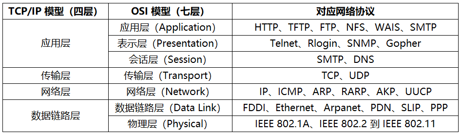
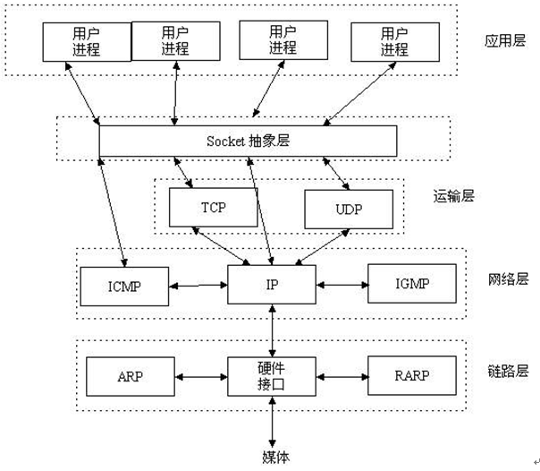

基础知识

+ 网络编程： 网络编程主要用于解决计算机与计算机（手机、平板..）之间的数据传输问题。
  + 不需要基于html页面就可以达到数据之间的传输。 比如： feiQ , QQ , 微信....
+ 网页编程： 就是要基于html页面的基础上进行数据的交互的。 比如： oa(办公自动化)

+ 计算机网络： 分布在不同地域的计算机通过外部设备链接起来达到了消息互通、资源共享的效果就称作为一个计算机网络。

+ 网络通讯的三要素：
  + `IP`：找到网络中哪台电脑 `IP地址 = 网络号+ 主机号` 
    + IP 地址IP 地址是一个 32 位（32bit）或 128 位的二进制数，用于唯一地标识网络中的一个通信实
    + IPv4 地址被分成了 A、B、C、D、E 五类
    + IPv4 地址通常用“点分十进制”表示成（a.b.c.d）的形式，其中，a, b, c, d 都是 0~255 之间的十进制整数
    + IPv6 有 3 种表示方法，分别是冒分十六进制表示法（如 0:0:0:0:0:0:0:0）、0 位压缩表示法、内嵌 IPv4 地址表示法 
    + 表示本机(本地回环地址)：`127.0.0.1` `localhost` 
    + 本机 IP本地局域网：10.0.0.0 - 10.255.255.255、192.168.0.0 - 192.168.255.255
  + `端口号`：找到电脑中的哪个App
    - 公认端口：从 0 到 1023
    - 注册端口：从 1024 到 49151
    - 动态和/或私有端口：从 49152 到 65535
  + `协议`：数据怎样的封装格式传输
    + Java 默认提供了对 file、ftp、gopher、http、https、jar、mailto、netdoc 协议的支持
+ `socket`（套接字）源 IP 地址和目的 IP 地址以及源端口号和目的端口号的组合不同主机之间的进程进行双向通信的端点




## Socket 通信

### 简介

`Socket` 是`应用层`与 `TCP/IP 协议族`通信的中间软件抽象层，它是一组接口在设计模式中，Socket 其实就是一个门面模式，它把复杂的 TCP/IP 协议族隐藏在 Socket 接口后面，对用户来说，一组简单的接口就是全部，让 Socket 去组织数据，以符合指定的协议

一个套接字就是网络上进程通信的一端，提供了应用层进程利用网络协议交换数据的机制。

Socket是由IP地址和端口结合的，提供向应用层进程传送数据包的机制 



### 主要类型

+ **流套接字(SOCK_STREAM)**
  + 流套接字用于提供`面向连接`、`可靠`的数据传输服务。该服务将保证数据能够实现无差错、无重复送，并按`顺序接收`。流套接字之所以能够实现可靠的数据服务，原因在于其使用了传输控制协议传输控制协议，即`TCP`(The Transmission Control Protocol)协议 [3] 。
+ **数据报套接字(SOCK_DGRAM)**
  + 数据报套接字提供一种`无连接`的服务。该服务并**不能保证数据传输的可靠性**,数据有可能在传输过程中丢失或出现数据重复，且无法保证顺序地接收到数据。数据报套接字使用`UDP`( User DatagramProtocol)协议进行数据的传输。
+ **原始套接字(SOCK_RAW)**
  + 原始套接字与标准套接字(流套接字和数据报套接字)的区别在于：
    + 原始套接字可以读写内核没有处理的IP数据包
    + 而流套接字只能读取TCP协议的数据，数据报套接字只能读取UDP协议的数据。
    + 因此，如果要访问其他协议发送的数据必须使用原始套接 。

### 工作流程

要通过互联网进行通信，至少需要一对套接字

+ 一个运行于客户端，称之为 Client Socket
+ 一个运行于服务器端，称之为 Server Socket 

套接字之间的连接的步骤 ：

1. 服务器监听
   + 指服务器端套接字并不定位具体的客户端套接字，而是处于等待连接的状态，实时监控网络状态  。
2. 客户端请求
   + 指由客户端的套接字提出连接请求，要连接的目标是服务器端的套接字。
     + 客户端的套接字需要指出服务器端套接字的`地址`和`端口号`，然后就向服务器端接字提出请求
3. 连接确认
   + 指当服务器端套接字监听到或者说接收到客户端套接字的连接请求，就会响应客户端套接字的请求，建立一个新的线程，并把服务器端套接字的描述发送给客户端。一旦客户端确认了此描述，连接就建立好了。而服务器端套接字继续处于监听状态，接收其他客户端套接字的连接请求。


### 主要特点

面向连接(TCP)服务的主要特点如下：

+ 数据传输过程必须经过建立连接、维护连接和释放连接3个阶段 ；
+ 在传输过程中，各分组不需要携带目的主机的地址；
+ 可靠性好，但由于协议复杂，通信效率不高 。


面向无连接(UDP)服务的主要特点如下：

+ 不需要连接的各个阶段 ；
+ 每个分组都携带完整的目的主机地址，在系统中独立传送 ；
+ 由于没有顺序控制，所以接收方的分组可能出现乱序、重复和丢失现象；
+ 通信效率高，但可靠性不能确保。


## InetAddress(IP类)

- 代表 IP 地址
- 类方法
  + `InetAddress getByName(String host)`：根据主机获取对应的 IP 对象
  + `InetAddress getLocalHost()`：获取本机 IP 地址对应的 IP 对
  + `isReachable()`：测试是否可以在指定时间内到达该地址
- 实例方法
  + `String getHostAddress()`：返回该 InetAddress 实例对应的 IP 地址字符串
  + `String getHostName()`：获取此 IP 地址的主机名
  + `String getCanonicalHostName()`：获取此 IP 地址的`全限定域名`

```java
import java.net.InetAddress;
import java.net.UnknownHostException;

public class Demo {
	public static void main(String[] args) throws UnknownHostException {
		
		// getLocalHost 获取本机的IP地址对象
		InetAddress address = InetAddress.getLocalHost();
        
        // IP地址：192.168.183.1
		System.out.println("IP地址："+address.getHostAddress());  
        // 主机名：ixfosa
		System.out.println("主机名："+address.getHostName());  
		

		// 获取别人机器的IP地址对象。
		// 可以根据一个IP地址的字符串形式或者是一个主机名生成一个IP地址对象。
		InetAddress address2 = InetAddress.getByName("ixfosa");
        // IP地址：192.168.183.1
		System.out.println("IP地址："+address2.getHostAddress());
		System.out.println("主机名："+address2.getHostName()); //主机名：ixfosa


		InetAddress[]  arr = InetAddress.getAllByName("www.baidu.com");//域名*/
		System.out.println("主机名："+arr[0].getHostName()); //主机名：www.baidu.com
		System.out.println("IP地址："+arr[0].getHostAddress()); //IP地址：14.215.177.39

		System.out.println();

		for (InetAddress inetAddress : arr) {
            // 主机名：www.baidu.com
			System.out.println("主机名："+inetAddress.getHostName()); 
			System.out.println("主机名："+inetAddress.getHostAddress()); 
		}
	}
}
```

## 流套接字 TCP

TCP通讯协议特点：

 	1. tcp是基于IO流进行数据 的传输 的，面向连接。
  	2. tcp进行数据传输的时候是没有大小限制的。
  	3. tcp是面向连接，通过三次握手的机制保证数据的完整性。 可靠协议。
  	4. tcp是面向连接的，所以速度慢。
  	5. tcp是区分客户端与服务端 的。


### TCP 客户端

Socket 客户端：

+ `Socket`(客户端) , tcp的客户端一旦启动马上要与服务端进行连接。
  - 使用Socket 的构造器来连接到指定服务器
    + `Socket(InetAddress/String remoteAddress, int port)`：创建连接到指定远程主机、远程端口的 Socket，使用本地主机的默认 IP 地址，系统动态分配的
    + `Socket(InetAddress/String remoteAddress, int port, InetAddress localAddr, int localPort)`：创建连接到指定远程主机、远程端口的 Socket，并指定本地 IP 地址和本地端口
  - 获取输入流和输出流
    + `InputStream getInputStream()`：返回该 Socket 对象对应的输入流，让程序通过该输入流从 Socket 中取出数据
    + `OutputStream getOutputStream()`：返回该 Socket 对象对应的输出流，让程序通过该输出流向 Socket 中输出数据
  - `InetAddress getInetAddress()`：返回该 Socket 对象的的 IP 对象
  - 客户端应该单独启动一个线程，该线程专门负责读取服务器端数据

```java
/*
tcp的客户端使用步骤：
	1. 建立tcp的客户端服务。
	2. 获取到对应的流对象。
	3. 写出或读取数据
	4. 关闭资源。
*/
// tcp客户端
public class Clinet {
	public static void main(String[] args) throws IOException{

		// 建立tcp的服务
		Socket socket  = new Socket(InetAddress.getLocalHost(), 9090);

		// 获取到Socket的输出流对象
		OutputStream outputStream = socket.getOutputStream();

		//利用输出流对象把数据写出即可。
		outputStream.write("服务端你好".getBytes());
		
		//获取到输入流对象，读取服务端回送的数据。
		InputStream inputStream = socket.getInputStream();

		byte[] buf = new byte[1024];
		int length = inputStream.read(buf);

		System.out.println("客户端接收到的数据："+ new String(buf, 0, length));
		
		//关闭资源
		socket.close();		
	}
}
```

###  TCP 服务端

ServerSocket  服务端类：

+ `ServerSocket(int port)`：构造器,用指定的端口 port 来创建一个 ServerSocket

+ `Socket accept()`：监听来自客户端连接请求，如果接收到一个客户端 Socket 的连接请求，该方法将返回一个**与客户端 Socket 对应的 Socket**，否则该方法将一直处于等待状态，线程也被阻塞
+ `InetAddress getInetAddress()`：返回此服务器端的 IP 对象
+ 服务器端应该为每个 Socket 单独启动一个线程，每个线程负责与一个客户端进行通

```java
/*
java.net.BindException:   端口被占用。

ServerSocket的使用 步骤
	1. 建立tcp服务端 的服务。
	2. 接受客户端的连接产生一个Socket.
	3. 获取对应的流对象读取或者写出数据。
	4. 关闭资源。
*/

// tcp的服务端
public class Server {

	public static void main(String[] args) throws Exception {

		// 建立Tcp的服务端,并且监听一个端口。
		ServerSocket serverSocket = new ServerSocket(9090);

		// 接受客户端的连接
        // accept()接受客户端的连接 该方法也是一个阻塞型的方法，没有客户端与其连接时，会一直等待下去。
		Socket socket  =  serverSocket.accept(); 
		// 获取输入流对象，读取客户端发送的内容。
		InputStream inputStream = socket.getInputStream();

		byte[] buf = new byte[1024];
		int length = 0;

		length = inputStream.read(buf);
		System.out.println("服务端接收："+ new String(buf, 0, length));
		
		// 获取socket输出流对象，想客户端发送数据
		OutputStream outputStream = socket.getOutputStream();
		outputStream.write("客户端你好啊！".getBytes());
		
		// 关闭资源
		serverSocket.close();
	}
}
```

### 客户端与服务端一问一答

```java
import java.io.BufferedReader;
import java.io.IOException;
import java.io.InputStreamReader;
import java.io.OutputStreamWriter;
import java.net.InetAddress;
import java.net.Socket;

/*
 需求： 客户端与服务端一问一答聊天。
 
 1.如果使用BuffrerdReader的readline方法一定要加上\r\n才把数据写出。
 2.使用字符流一定要调用flush方法数据才会写出。
 */

//聊天的客户端
public class ChatClient {
	public static void main(String[] args) throws IOException {

		//建立tcp的客户端服务
		Socket socket = new Socket(InetAddress.getLocalHost(),9090);

		//获取socket的输出流对象。
		OutputStreamWriter socketOut =	new OutputStreamWriter(socket.getOutputStream());

		//获取socket的输入流对象
		BufferedReader socketReader = new BufferedReader(new InputStreamReader(socket.getInputStream()));
		
		//获取键盘的输入流对象，读取数据
		BufferedReader keyReader = new BufferedReader(new InputStreamReader(System.in));
		
		String line = null;

		//不断的读取键盘录入的数据，然后把数据写出
		while((line = keyReader.readLine())!=null){

			socketOut.write(line+"\r\n");

			//刷新
			socketOut.flush();

			//读取服务端回送的数据
			line = socketReader.readLine();
			System.out.println("服务端回送的数据是："+line);
		}
		//关闭资源
		socket.close();
	}
}

/*-----------------------------------------------------------------------------*/

import java.io.BufferedReader;
import java.io.IOException;
import java.io.InputStreamReader;
import java.io.OutputStreamWriter;
import java.net.ServerSocket;
import java.net.Socket;

/*
 聊天的服务端
 */
public class ChatServer {
	public static void main(String[] args) throws IOException {

		//建立tcp的服务端
		ServerSocket serverSocket = new ServerSocket(9090);

		//接受客户端的连接，产生一个SOcket
		Socket socket = serverSocket.accept();

		//获取到Socket的输入流对象
		BufferedReader socketReader = new BufferedReader(new InputStreamReader(socket.getInputStream()));
		
		//获取到Socket输出流对象
		OutputStreamWriter socketOut =  new OutputStreamWriter(socket.getOutputStream());
		
		//获取键盘的输入流对象
		BufferedReader keyReader = new BufferedReader(new InputStreamReader(System.in));
		
		//读取客户端的数据
		String line = null;

		while((line = socketReader.readLine())!=null){

			System.out.println("服务端接收到的数据："+ line);

			System.out.println("请输入回送给客户端的数据：");

			line = keyReader.readLine();
			socketOut.write(line+"\r\n");

			socketOut.flush();
		}
		//关闭资源
		serverSocket.close();
	}
}
```

### 模拟Tomcat服务器

```java
import java.io.IOException;
import java.io.OutputStream;
import java.net.ServerSocket;
import java.net.Socket;

// 模拟Tomcat服务器
public class TomcatDemo extends Thread {

	Socket socket;

	public TomcatDemo(Socket socket){
		this.socket = socket;
	}

	public void run() {
		try {
			// 获取socket的输出流对象
			OutputStream outputStream = socket.getOutputStream();
			// 把数据写到浏览器上
			outputStream.write("<html><head><title>aaa</title></head><body>你好啊浏览器</body></html>".getBytes());
			socket.close();
		} catch (IOException e) {
			e.printStackTrace();
		}
	}

	public static void main(String[] args) throws IOException {

		// 建立tcp的服务端
		ServerSocket serverSocket = new ServerSocket(9090);

		// 不断的接受客户端的连接
		while(true){
			Socket socket = serverSocket.accept();
			new TomcatDemo(socket).start();
		}
	}
}
```


## 数据报套接字 UDP

UDP通讯协议的特点：

+ 将数据极封装为数据包，面向无连接。每个数据包大小限制在64K中
+ 因为无连接，所以不可靠
+ 因为不需要建立连接，所以速度快
+ udp 通讯是不分服务端与客户端的，只分发送端与接收端。

udp协议下的Socket:

+ `DatagramSocket`：发送、接收数据包

  + DatagramSocket 的构造器
    + `DatagramSocket()`：创建一个 DatagramSocket 实例，并将该对象绑定到本机默认 IP 地址、系统动态分配的端口
    + `DatagramSocket(int port, InetAddress laddr)`：创建一个 DatagramSocket 实例，并将该对象绑定到指定 IP 地址、指定端口

  + 接收和发送数据
    + `void receive(DatagramPacket p)`：从该 DatagramSocket 中接收数据
    + `void send(DatagramPacket p)`：以该 DatagramSocket 对象向外发送数据包

+ `DatagramPacket`：代表数据包

  + DatagramPacket 的构造器
    + `DatagramPacket(byte[]buf, int length)`：以一个空数组来创建 DatagramPacket 对象，该对象的作用是**接收** DatagramSocket 中的数据
    + `DatagramPacket(byte[] buf, int offset, int length)`：以一个空数组来创建 DatagramPacket 对象，并指定接**收到**的数据放入 buf 数组中时从 offset 开始，最多放 length 个字节
    + `DatagramPacket(byte[] buf, int length, InetAddress addr, int port)`：以包含数据的数组来创建一个用于**发送**的 DatagramPacket 对象，创建该 DatagramPacket 对象时还指定了 IP 地址和端口（该数据包的目的地）
      + buf: 发送的数据内容
      + length : 发送数据内容的大小。
      + address : 发送的目的IP地址对象
      + port : 端口号。
    + `DatagramPacket(byte[] buf, int offset, int length, InetAddress address, int port)`：以包含数据的数组来创建一个用于**发送**的 DatagramPacket 对象，指定发送 buf 数组中从 offset 开始，总共 length 个字节
  + 获取发送者的 IP 地址和端口
    + `InetAddress getAddress()`：返回此数据包的目标机器/发送主机的 IP 地址
    + `int getPort()`：返回此数据包的目标机器/发送主机的端口
    + `SocketAddress getSocketAddress()`：返回此数据包的目标 SocketAddress 或发送此数据包的主机的 SocketAddress

> 使用 DatagramSocket 来发送、接收数据包（DatagramPacket）
>
> 使用 MulticastSocket 来实现多点广播通信


发送端的使用步骤：

 	1. 建立udp的服务。
	2. 准备数据，把数据封装到数据包中发送。 发送端的数据包要带上ip地址与端口号。
	3. 调用udp的服务，发送数据。
	4. 关闭资源。

### UDP 发送端

```java
import java.io.IOException;
import java.net.DatagramPacket;
import java.net.DatagramSocket;
import java.net.InetAddress;
import java.net.SocketException;

// 发送端
public class Sender {
	public static void main(String[] args) throws IOException {

		// 建立udp的服务
		DatagramSocket datagramSocket = new DatagramSocket();

		// 准备数据，把数据封装到数据包中。
		String data = "这个是我第一个udp的例子..";

		// 创建了一个数据包
		DatagramPacket packet = new DatagramPacket(data.getBytes(), 
               data.getBytes().length,InetAddress.getLocalHost() , 9090);

		// 调用udp的服务发送数据包
		datagramSocket.send(packet);

		// 关闭资源 ---实际上就是释放占用的端口号
		datagramSocket.close();
	}
}	
```

### UDP 接收端

```java
import java.io.IOException;
import java.net.DatagramPacket;
import java.net.DatagramSocket;

//接收端
/*
 接收端的使用步骤
 	1. 建立udp的服务
 	2. 准备空 的数据 包接收数据。
 	3. 调用udp的服务接收数据。
 	4. 关闭资源
 
 */
public class Receive {
	public static void main(String[] args) throws IOException {

		// 建立udp的服务 ，并且要监听一个端口。
		DatagramSocket  socket = new DatagramSocket(9090);
		
		// 准备空的数据包用于存放数据。
		byte[] buf = new byte[1024];
		DatagramPacket datagramPacket = new DatagramPacket(buf, buf.length); // 1024

		// 调用udp的服务接收数据
        // receive是一个阻塞型的方法,没有接收到数据包之前会一直等待,
        // 数据实际上就是存储到了byte的自己数组中了。
		socket.receive(datagramPacket);
		// getLength() 获取数据包存储了几个字节。
		System.out.println("接收端接收到的数据："+ 
                           new String(buf,0,datagramPacket.getLength())); 

		// 关闭资源
		socket.close();
	}
}
```


### 群聊

```java
import java.io.BufferedReader;
import java.io.IOException;
import java.io.InputStreamReader;
import java.net.DatagramPacket;
import java.net.DatagramSocket;
import java.net.InetAddress;
import java.net.SocketException;
import java.net.UnknownHostException;

// 群聊发送端
public class ChatSender extends Thread {

	@Override
	public void run() {
		try {

			//建立udp的服务
			DatagramSocket socket = new DatagramSocket();

			//准备数据，把数据封装到数据包中发送
			BufferedReader keyReader = new BufferedReader(new InputStreamReader(System.in));

			String line = null;
			DatagramPacket packet  = null;

			while((line = keyReader.readLine())!=null){
				//把数据封装 到数据数据包中，然后发送数据。
				packet = new DatagramPacket(line.getBytes(), line.getBytes().length, InetAddress.getByName("192.168.1.255"), 9090);

				//把数据发送出去
				socket.send(packet);
			}

			//关闭 资源
			socket.close();
		} catch (IOException e) {
			e.printStackTrace();
		}
	}
}

/*-----------------------------------------------------------------------------*/

import java.io.IOException;
import java.net.DatagramPacket;
import java.net.DatagramSocket;
import java.net.SocketException;

// 群聊接收端
public class ChatReceive extends Thread {
	
	@Override
	public void run() {
		try {

			// 建立udp的服务,要监听一个端口
			DatagramSocket socket = new DatagramSocket(9090);

			// 准备空的数据包存储数据
			byte[] buf = new byte[1024];

			DatagramPacket packet = new DatagramPacket(buf, buf.length);

			boolean flag = true;

			while(flag){
				socket.receive(packet);
				// packet.getAddress() 获取对方数据 包的IP地址对象。
				System.out.println(packet.getAddress().getHostAddress()+"说:"+
                                   new String(buf,0,packet.getLength()));
			}
			// 关闭资源
			socket.close();
		
		}catch (IOException e) {
			e.printStackTrace();
		}
	}
}

/*-----------------------------------------------------------------------------*/

public class ChatMain {
	public static void main(String[] args) {

		ChatReceive chatReceive = new ChatReceive();
		chatReceive.start();
		
		ChatSender chatSender = new ChatSender();
		chatSender.start();
	}
}
```

### 丢包

```java
import java.net.DatagramPacket;
import java.net.DatagramSocket;
import java.net.InetAddress;
import java.net.UnknownHostException;

/*
udp是一个不可靠（数据包可能会丢失）的协议

什么情况下数据包会出现丢失呢？
	1.带宽不足 。
	2.cpu的处理能力不足。
 */

public class SafeSender {
	public static void main(String[] args) throws Exception {
		//建立udp的服务
		DatagramSocket socket = new DatagramSocket();
		//准备数据，数据封装到数据中发送
		DatagramPacket packet = null;

		for(int i =  0 ; i< 10; i++){  //连续发送10个数据包
			String data = i +"aaaaaaaaaaaaaaaaaaaaaaaaaaaaaaaaaaaaaaaaaaaaaaaaaaaaaaaaaaaaaaaaaaaaaaaaaaaaaaaaaaaaaaaaaaaaaaaaaaaaaaaaaaaaaaaaaaaaaaaaaaaaaaaaaaaaaaaaaaaaaaaaaaaaaaaaaaaaaaaaaaaaaaaaaaaaaaaaaaaaaaaaaaaaaaaaaaaaaaaaaaaaaaaaaaaaaaaaaaaaaaaaaaaaaaaaaaaaaaaaaaaaaaaaaaaaaaaaaaaaaaaaaaaaaaaaaaaaaaaaaaaaaaaaaaaaaaaaaaaaaaaaaaaaaaaaaaaaaaaaaaaaaaaaaaaaaaaaaaaaaaaaaaaaaaaaaaaaaaaaaaaaaaaaaaaaaaaaaaaaaaaaaaaaaaaaaaaaaaaaaaaaaaaaaaaaaaaaaaaaaaaaaaaaaaaaaaaaaaaaaaaaaaaaaaaaaaaaaaaaaaaaaaaaaaaaaaaaaaaaaaaaaaaaaaaaaaaaaaaaaaaaaaaaaaaaaaaaaaaaaaaaaaaaaaaaaaaaaaaaaaaaaaaaaaaaaaaaaaaaaaaaaaaaaaaaaaaaaaaaaaaaaaaaaaaaaaaaaaaaaaaaaaaaaaaaaaaaaaaaaaaaaaaaaaaaaaaaaaaaaaaaaaaaaaaaaaaaaaaaaaaaaaaaaaaaaaaaaaaaaaaaaaaaaaaaaaaaaaaaaaaaaaaaaaaaaaaaaaaaaaaaaaaaaaaaaaaaaaaaaaaaaaaaaaaaaaaaaaaaaaaaaaaaaaaaaaaaaaaaaaaaaaaaaaaaaaaaaaaaaaaaaaaaaaaaaaaaaaaaaaaaaaaaaaaaaaaaaaaaaaaaaaaaaaaaaaaaaaaaaaaaaaaaaaaaaaaaaaaaaaaaaaaaaaaaaaaaaaaaaaaaaaaaaaaaaaaaaaaaaaaaaaaaaaaaaaaaaaaaaaaaaaaaaaaaaaaaaaaaaaaaaaaaaaaaaaaaaaaaaaaaaaaaaaaaaaaaaaaaaaaaaaaaaaaaaaaaaaaaaaaaaaaaaaaaaaaaaaaaaaaaaaaaaaaaaaaaaaaaaaaaaaaaaaaaaaaaaaaaaaaaaaaaaaaaaaaaaaaaaaaaaaaaaaaaaaaaaaaaaaaaaaaaaaaaaaaaaaaaaaaaaaaaaaaaaaaaaaaaaaaaaaaaaaaaaaaaaaaaaaaaaaaaaaaaaaaaaaaaaaaaaaaaaaaaaaaaaaaaaaaaaaaaaaaaaaaaaaaaaaaaaaaaaaaaaaaaaaaaaaaaaaaaaaaaaaaaaaaaaaaaaaaaaaaaaaaaaaaaaaaaaaaaaaaaaaaaaaaaaaaaaaaaaaaaaaaaaaaaaaaaaaaaaaaaaaaaaaaaaaaaaaaaaaaaaaaaaaaaaaaaaaaaaaaaaaaaaaaaaaaaaaaaaaaaaaaaaaaaaaaaaaaaaaaaaaaaaaaaaaaaaaaaaaaaaaaaaaaaaaaaaaaaaaaaaaaaaaaaaaaaaaaaaaaaaaaaaaaaaaaaaaaaaaaaaaaaaaaaaaaaaaaaaaaaaaaaaaaaaaaaaaaaaaaaaaaaaaaaaaaaaaaaaaaaaaaaaaaaaaaaaaaaaaaaaaaaaaaaaaaaaaaaaaaaaaaaaaaaaaaaaaaaaaaaaaaaaaaaaaaaaaaaaaaaaaaaaaaaaaaaaaaaaaaaaaaaaaaaaaaaaaaaaaaaaaaaaaaaaaaaaaaaaaaaaaaaaaaaaaaaaaaaaaaaaaaaaaaaaaaaaaaaaaaaaaaaaaaaaaaaaaaaaaaaaaaaaaaaaaaaaaaaaaaaaaaaaaaaaaaaaaaaaaaaaaaaaaaaaaaaaaaaaaaaaaaaaaaaaaaaaaaaaaaaaaaaaaaaaaaaaaaaaaaaaaaaaaaaaaaaaaaaaaaaaaaaaaaaaaaaaaaaaaaaaaaaaaaaaaaaaaaaaaaaaaaaaaaaaaaaaaaaaaaaaaaaaaaaaaaaaaaaaaaaaaaaaaaaaaaaaaaaaaaaaaaaaaaaaaaaaaaaaaaaaaaaaaaaaaaaaaaaaaaaaaaa";

			packet = new DatagramPacket(data.getBytes(), 
                         data.getBytes().length, InetAddress.getLocalHost(), 9090);
			//发送数据包
			socket.send(packet);
		}
		//关闭资源
		socket.close();
	}
}

/*-----------------------------------------------------------------------------*/

import java.io.IOException;
import java.net.DatagramPacket;
import java.net.DatagramSocket;

public class SafeReceive {
	public static void main(String[] args) throws IOException, Exception {

		// 建立udp的服务
		DatagramSocket socket = new DatagramSocket(9090);
		
		// 建立空的数据包存储数据
		byte[] buf = new byte[1024];
		DatagramPacket packet = new DatagramPacket(buf, buf.length);
		
		// 不断接收数据包
		while(true){
			socket.receive(packet);
			System.out.println(new String(buf, 0, packet.getLength()));
			Thread.sleep(10);
		}
	}
}
```


### 使用udp协议给飞Q发送消息

```java
import java.io.IOException;
import java.net.DatagramPacket;
import java.net.DatagramSocket;
import java.net.InetAddress;

/*
 每个网络程序都有自己所处理的特定格式数据,如果接收到的数据不符合指定的格式，那么就会被当成垃圾数据丢弃。(加密..)

 飞Q接收的数据格式：
 version:time :sender : ip: flag:content ;
 版本号          时间         发送人   :IP： 发送的标识符(32): 真正的内容;

 在udp协议中，有一个IP地址称作为广播地址，广播地址就是主机号为255地址。

 给广播IP地址发送消息的时候，在同一个网络段的机器都可以接收 到信息。
 192.168.15.255

 */

// 使用udp协议给飞Q发送消息。
public class FeiQDemo {
	public static void main(String[] args) throws IOException {

		// 建立udp的服务
		DatagramSocket socket = new DatagramSocket();

		// 准备数据，把数据封装到数据包中
		String data = getData("feiQ你好！");

		DatagramPacket packet = new DatagramPacket(data.getBytes(),
				data.getBytes().length,
				InetAddress.getByName("192.168.15.255"), 2425);

		// 发送数据
		socket.send(packet);
		// 关闭资源
		socket.close();

	}

	// 把数据拼接成指定格式的数据
	public static String getData(String content) {
		StringBuilder sb = new StringBuilder();
		sb.append("1.0:");
		sb.append(System.currentTimeMillis() + ":");
		sb.append("ixfosa:");
		sb.append("192.168.10.1:");
		sb.append("32:");
		sb.append(content);

		return sb.toString();
	}
}
```

### 收发图片

```java
import java.io.FileInputStream;
import java.io.FileNotFoundException;
import java.io.IOException;
import java.io.OutputStream;
import java.net.ServerSocket;
import java.net.Socket;
import java.util.HashSet;

/*
	编写一个服务端可以给多个客户端发送图片。 （多线程）
*/
public class ImageServer extends Thread {

	Socket socket ;

	//使用该集合是用于存储ip地址的。
	static HashSet<String> ips = new HashSet<String>();

	public  ImageServer(Socket socket) {
		this.socket = socket;
	}

	@Override
	public void run() {
		try {

			//获取到socket输出流对象
			OutputStream outputStream = socket.getOutputStream();

			//获取图片的输入流对象
			FileInputStream fileInputStream = new FileInputStream("E:\\3.jpg");

			//读取图片数据，把数据写出
			byte[] buf = new byte[1024];
			int length = 0 ;

			while((length = fileInputStream.read(buf))!=-1){

				outputStream.write(buf,0,length);
			}
			
            // socket.getInetAddress() 获取对方的IP地址
			String ip = socket.getInetAddress().getHostAddress();   
			if(ips.add(ip)){
				System.out.println("恭喜" + ip + 
                                   "同学成功下载，当前下载的人数是："+ ips.size());
			}

			//关闭资源
			fileInputStream.close();
			socket.close();
		}catch (IOException e) {

		}
	}

	public static void main(String[] args) throws IOException {

		//建立tcp的服务 ,并且要监听一个端口
		ServerSocket serverSocket  = new ServerSocket(9090);
		while(true){

			//接受用户的链接。
			Socket socket = serverSocket.accept();
			new ImageServer(socket).start();
		}
	}
}

/*-----------------------------------------------------------------------------*/

import java.io.FileOutputStream;
import java.io.IOException;
import java.io.InputStream;
import java.net.InetAddress;
import java.net.Socket;
import java.net.UnknownHostException;

// 下载图片的客户端
public class ImageClient {
	public static void main(String[] args) throws Exception{

		//建立tcp的服务
		Socket socket = new Socket(InetAddress.getLocalHost(),9090);

		//获取socket的输入流对象
		InputStream inputStream = socket.getInputStream();

		//获取文件的输出流对象
		FileOutputStream fileOutputStream = new FileOutputStream("D:\\3.jpg");

		//边读边写
		byte[] buf = new byte[1024];
		int length = 0 ;

		while((length = inputStream.read(buf))!=-1){
			fileOutputStream.write(buf,0,length);
		}

		//关闭资源
		fileOutputStream.close();
		socket.close();
	}
}
```

### 登陆与注册

```java
import java.io.BufferedReader;
import java.io.IOException;
import java.io.InputStreamReader;
import java.io.OutputStreamWriter;
import java.net.InetAddress;
import java.net.Socket;

/*
 	实现登陆与注册 功能。  
        客户端与服务端连接的时候，就要提示客户端请选择功能。
        客户端注册的时候，用户名与密码都是发送给服务端 的，服务端需要把数据保存到服务端的文件上。
        登陆： 登陆的时候客户端输入用户名与密码发送给服务端，服务端需要校验，返回结果给客户端。
*/

public class LoginClinet {
	public static void main(String[] args) throws IOException {		

		Socket socket = new Socket(InetAddress.getLocalHost(),9090);

		//获取socket的输出流对象
		OutputStreamWriter  socketOut = new OutputStreamWriter(socket.getOutputStream());
		
		//获取到socket的输入流对象
		BufferedReader socketReader = new BufferedReader(new InputStreamReader(socket.getInputStream()));
		
		//获取到键盘的输入流对象
		BufferedReader keyReader = new BufferedReader(new InputStreamReader(System.in));

		while(true){

			System.out.println("请选择功能： A(登陆)  B(注册)");

			String option = keyReader.readLine();

			if("a".equalsIgnoreCase(option)){

				getInfo(socketOut, keyReader, option);

				//读取服务器反馈的信息
				String line = socketReader.readLine();

				System.out.println(line);

			}else if("b".equalsIgnoreCase(option)){

				getInfo(socketOut, keyReader, option);

				//读取服务器反馈的信息
				String line = socketReader.readLine();

				System.out.println(line);
			}
		}
	}

	public static void getInfo(OutputStreamWriter  socketOut,BufferedReader keyReader, String option)
			throws IOException {

		System.out.println("请输入用户名:");
		String userName = keyReader.readLine();

		System.out.println("请输入密码：");
		String password = keyReader.readLine();

		String info = option +" "+userName+" "+password+"\r\n";

		socketOut.write(info);
		socketOut.flush();
	}
}

/*-----------------------------------------------------------------------------*/

import java.io.BufferedReader;
import java.io.File;
import java.io.FileReader;
import java.io.FileWriter;
import java.io.IOException;
import java.io.InputStreamReader;
import java.io.OutputStreamWriter;
import java.net.ServerSocket;
import java.net.Socket;
import java.util.Properties;

public class LoginServer extends Thread {

	Socket socket;

	static File file = new File("E:\\users.properties");

	public LoginServer(Socket socket) {
		this.socket = socket;
	}

	static {
		try {
			if (!file.exists()) {
				file.createNewFile();
			}
		} catch (IOException e) {
			e.printStackTrace();
		}
	}

	@Override
	public void run() {
	while(true){
			try {

				// 获取socket的输入流对象
				BufferedReader bufferedReader = new BufferedReader(
						new InputStreamReader(socket.getInputStream()));

				// 获取socket的输出流对象
				OutputStreamWriter socketOut = new OutputStreamWriter(
						socket.getOutputStream());

				// 读取客户端输入的信息
				String info = bufferedReader.readLine();

				String[] datas = info.split(" ");

				// 获取到用户 的选择功能
				String option = datas[0];
				String userName = datas[1];
				String password = datas[2];

				if ("a".equalsIgnoreCase(option)) {
					// 登陆
					Properties properties = new Properties();
					// 加载配置文件
					properties.load(new FileReader(file));
					if (properties.containsKey(userName)) {

						String tempPass = properties.getProperty(userName);
						if (password.equals(tempPass)) {
							socketOut.write("欢迎" + userName + "登陆成功\r\n");

						} else {
							socketOut.write("密码错误\r\n");
						}

					} else {
						socketOut.write("用户名不存在，请重新输入...\r\n");
					}

					socketOut.flush();

				} else if ("b".equalsIgnoreCase(option)) {

					// 创建一个配置文件类
					Properties properties = new Properties();

					//加载原来的配置文件
					properties.load(new FileReader(file));

					if (!properties.containsKey(userName)) {

						// 不存在该用户名
						properties.setProperty(userName, password);

						// 生成一个配置文件
						properties.store(new FileWriter(file), "users");
						socketOut.write("注册成功..\r\n");

					} else {

						// 存在用户名
						socketOut.write("用户名已经被注册，请重新输入\r\n");
					}
					socketOut.flush();
				}
			} catch (Exception e) {
				e.printStackTrace();
			}
		}

	}

	public static void main(String[] args) throws IOException {
		ServerSocket serverSocket = new ServerSocket(9090);
		while (true) {
			Socket socket = serverSocket.accept();
			new LoginServer(socket).start();
		}
	}
}
```


## URLDecoder 和 URLEncoder

**URLDecoder 和 URLEncoder**

- 用于完成 URL 地址中普通字符串和 application/x-www-form-urlencoded MIME 字符串之间的相互转换
- `String URLDecoder.decode(String s, String enc)`：使用指定字符集将特殊字符串转换成普通字符串（解码）
- `String URLEncoder.encode(String s, String enc)`：使用指定字符集将普通字符串转换成特殊字符串（编码）


**URL 和 URLConnection**

+ URL
  - URI 实例代表一个**统一资源标识符**，不能用于定位任何资源，唯一作用是解析（resolve）
  - URL 对象代表一个**统一资源定位符**，通过**定位**的方式确定一个资源
  - URL 可以由协议名、主机、端口和资源名组成格式：protocol://host:port/resourceName，如 http://www.ixfosa.top/index.jsp
  - 创建 URL 对象URL(String spec)：根据 String 表示形式创建 URL 对象
    + URL(String protocol, String host, int port, String file)：根据指定协议、主机、端口号（-1，表示使用指定协议的默认端口）和资源文件（如 "/index.jsp"）创建 URL 对象
  - 访问 URL 对应的资源
    + `String getFile()`：获取该 URL 的资源名
    + `String getHost()`：获取该 URL 的主机名
    + `String getPath()`：获取该 URL 的路径部分
    + `int getPort()`：获取该 URL 的端口号
    + `String getProtocol()`：获取该 URL 的协议名称
    + `String getQuery()`：获取该 URL 的査询字符串部分
    + `URLConnection openConnection()`：返回一个 URLConnection 对象，它代表了与 URL 所引用的远程对象的连接
    + `InputStream openStream()`：打开与此 URL 的连接，并返回一个用于读取该 URL 资源的输入流
+ URLConnection
  + 封装访问远程网络资源一般方法的类
  + 通过 URLConnection 实例向该 URL 发送请求、读取 URL 引用的资源
  + 实例方法
    + `InputStream getInputStream()`：返回该 URLConnection 对应的输入流，用于获取 URLConnection 响应的内容
    + `OutputStream getOutputStream()`：返回该 URLConnection 对应的输出流，用于向 URLConnection 发送请求参数
  + 发送 GET 请求时只需将请求参数放在 URL 字符串之后，以?隔开，程序直接调用 URLConnection 对象的 `connect()` 方法即可
  + 发送 POST 请求，则需要先设置 doln 和 doOut 两个请求头字段的值，再使用 URLConnection 对应的输出流来发送请求参数

