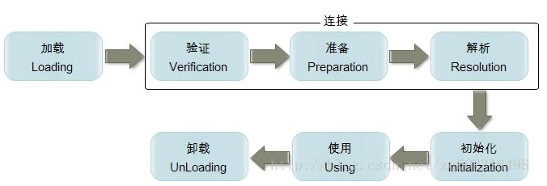

反射概述

**反射**（reflection），是指计算机程序在运行时（runtime）可以访问、检测和修改它本身状态或行为的一种能力。用比喻来说，反射就是程序在运行的时候能够“观察”并且修改自己的行为。

> java反射：在运行时期，动态地去获取一个类中的信息（类的信息、构造器信息、方法信息、字段等信息）

> 注意： 在反射技术中一个类的任何成员都有对应 的类进行描述。  
>
> 比如：  成员变量（`Field`）   方法（`Method`）

**Java反射机制的功能：**

+ 在运行时判断任意一个对象所属的类；
+ 在运行时构造任意一个类的对象；
+ 在运行时判断任意一个类所具有的成员变量和方法；
+ 在运行时调用任意一个对象的方法；
+ 生成动态代理。


反射特点:

+ 性能问题
  + Java反射机制中包含了一些动态类型，所以Java虚拟机不能够对这些动态代码进行优化。因此，反射操作的效率要比正常操作效率低很多。
+ 安全限制
  + 使用反射通常需要程序的运行没有安全方面的限制。如果一个程序对安全性提出要求，则最好不要使用反射。
+ 程序健壮性
  + 反射允许代码执行一些通常不被允许的操作，所以使用反射有可能会导致意想不到的后果。反射代码破坏了Java程序结构的抽象性，所以当程序运行的平台发生变化的时候，由于抽象的逻辑结构不能被识别，代码产生的效果与之前会产生差异。 

​	

## 类的生命周期

- 类的加载：将类的 class 文件（二进制数据）读入内存，并为之创建一个 `java.lang.Class` 对象（由类加载器完成）
- 类的连接：把类的二进制数据合并到 JRE 中包括：验证、准备（为类的类变量分配内存并设置默认初始值）、解析
- 类的初始化：对类变量进行初始化包括：声明**类变量**时指定初始值、使用**静态初始化块**为类变量指定初始值（执行顺序与它们在源代码中的排列顺序相同）
  +   主动引用：如果一个类被直接引用，就会触发类的初始化。
    + 通过new关键字实例化对象
    + 读取或设置类的静态变量
    + 调用类的静态方法。
    + 通过反射方式执行 实例化对象，读取或设置类的静态变量，调用类的静态方法。
    + 初始化子类的时候，会触发父类的初始化。
    + 作为程序入口直接运行时（也就是直接调用main方法）。
- 类的使用：包括主动引用和被动引用，
  + 被动引用：
    + 引用父类的静态字段，只会引起父类的初始化，而不会引起子类的初始化。
    + 定义类数组，不会引起类的初始化。
    + 引用类的常量，不会引起类的初始化。
  + **使用阶段包括主动引用和被动引用，主动饮用会引起类的初始化，而被动引用不会引起类的初始化。**
- 类的卸载：在方法区中清空类信息，java类的整个生命周期结束
  + 类进行卸载的前提
    + 该类所有的实例都已经被回收，也就是java堆中不存在该类的任何实例。
    + 加载该类的ClassLoader已经被回收。
    + 该类对应的java.lang.Class对象没有任何地方被引用，无法在任何地方通过反射访问该类的方法。

  

**类的生命周期**




## 类加载器

+ 类加载器（class loader）用来加载 Java 类到 Java 虚拟机中。

  + 类加载器 负责读取 Java 字节代码，并转换成 java.lang.Class类的一个实例。

+ JAVA类装载方式

  + 隐式装载：程序在运行过程中当碰到通过new 等方式生成对象时，隐式调用类装载器加载对应的类到jvm中。 
  + 显式装载：通过class.forname()等方法，显式加载需要的类

+ JVM三种预定义类型类加载器

  + 启动类加载器（Bootstrp loader）
    + Bootstrp加载器是用C++语言写
    + 在Java虚拟机启动后初始化
    + 主要负责加载
      + `%JAVA_HOME%/jre/lib`核心类库
      + `-Xbootclasspath`参数指定路径下指定的jar包
      + `%JAVA_HOME%/jre/classes`中的类 等虚拟机识别的类库加载到内存中。
    + 启动类加载器加载到的路径可通过`System.getProperty(“sun.boot.class.path”)`查看。

  1. 扩展类加载器（ExtClassLoader）

     + Bootstrp loader加载 ExtClassLoader, 并且将ExtClassLoader的父加载器设置为Bootstrp loader

     + 由Sun的ExtClassLoader（sun.misc.Launcher$ExtClassLoader）实现的
     + 负责将JAVA_HOME /lib/ext或者由系统变量-Djava.ext.dir指定位置中的类库加载到内存中。
     + 开发者可以直接使用标准扩展类加载器，具体可由扩展类加载器加载到的路径可通过`System.getProperty("java.ext.dirs")`查看。

  2. 系统类加载器（AppClassLoader ）

     + Bootstrp loader加载完ExtClassLoader后，就会加载AppClassLoader,并且将AppClassLoader的父加载器指定为 ExtClassLoader。
     + 系统类加载器是由 Sun 的 AppClassLoader（sun.misc.Launcher$AppClassLoader）实现的
     + 负责将用户类路径(java -classpath或-Djava.class.path变量所指的目录，即当前类所在路径及其引用的第三方类库的路径)下的类库加载到内存中。
     + 开发者可以直接使用系统类加载器，具体可由系统类加载器加载到的路径可通过`System.getProperty("java.class.path")`查看。


**双亲委派模型**

> 如果一个类加载器收到了类加载的请求，它首先不会自己去尝试加载这个类，而是把这个请求**委派给父类加载器**去完成，每一个层次的加载器都是如此，因此所有的类加载请求都会传给顶层的启动类加载器，只有当父载器反馈自己无法完成该加载请求（该加载器的搜索范围中没有找到对应的类）时，子加载器才会尝试自己去加载


## 获得 Class 对象

获得 Class 对象

- 使用 Class 类的 `Class<?> forName(String className)` 类方法（该字符串参数的值是某个类的**全限定类名**，会对类初始化）
- 调用某个类的 `class 属性`来获取该类对应的 Class 对象（所有的数据类型都有 class 属性，包括数组、基本类型以及 `void`）
- 调用某个对象的 `Class<?> getClass()` 方法（可能需要强转）


> 在 JVM 中，一个类用其**全限定类名**和**其类加载器**作为其唯一标识
>
> 包装类和 Void 类的静态字段 TYPE 表示其基本类型的 Class 对象
>
> 所有的具有相同的维数和相同元素类型的数组共享同一个 Class 对象

```java
package cn.ixfosa.reflect;

public class Person {
	private int id;
	String name;
	public Person(int id,String name){
		this.id = id;
		this.name = name;
	}
    
	public Person(){}
	

	public void eat(int num){
		System.out.println(name+"吃很"+num+"斤饭");
	}
	private static void sleep(int num){
		System.out.println("明天睡上"+num+"小时");
	}
	public static void  sum(int[] arr){
		System.out.println("长度是："+ arr.length);
	}

	@Override
	public String toString() {
		return " 编号："+ this.id +" 姓名："+ this.name;
	}
	
}

/*------------------------------------------------------------*/

package cn.ixfosa.reflect;

public class Demo {
	
	Person p;
	
	public static void main(String[] args) throws ClassNotFoundException {
		// Person p = new Person(110,"狗娃");
		
		// 推荐使用： 获取Class对象的方式一
		Class clazz1 = Class.forName("cn.ixfosa.reflect.Person");
		System.out.println("clazz1:"+ clazz1);
		
		
		// 获取Class对象的方式二： 通过类名获取
		Class clazz2 = Person.class;
		System.out.println("clazz1==clazz2?"+ (clazz1==clazz2));
		

		// 获取Class对象的方式三 ：通过对象获取
		Class clazz3 = new Person(110,"狗娃").getClass();
		System.out.println("clazz2==clazz3?"+ (clazz2==clazz3));
	}
}
```


##  通过Class对象获取构造器

获取 Class 对应类所包含的构造器（由 Constructor 对象表示）

+ `Constructor<T> getConstructor(Class<?>… parameterTypes)`：获取此 Class 对象对应类的、**带指定形参列表**的 `public` 构造器
+ `Constructor<T> getDeclaredConstructor(Class<?>.. parameterTypes)`：获取此 Class 对象对应类的、**带指定形参列表**的构造器，**与访问权限无关**
+ `Constructor<?>[] getConstructors()`：获取此 Class 对象对应类的所有 `public` 构造器
+ `Constructor<?>[] getDeclaredConstructors()`：获取此 Class 对象对应类的所有构造器，**与访问权限无关**

> `constructor.setAccessible(true)`  暴力反射

```java
package cn.ixfosa.reflect;

public class Person {
	private int id;
	String name;
    
	public Person(int id,String name){
		this.id = id;
		this.name = name;
	}
    
	public Person(){}
	

	public void eat(int num){
		System.out.println(name+"吃很"+num+"斤饭");
	}
    
	private static void sleep(int num){
		System.out.println("明天睡上"+num+"小时");
	}
    
	public static void  sum(int[] arr){
		System.out.println("长度是："+ arr.length);
	}

	@Override
	public String toString() {
		return " 编号："+ this.id +" 姓名："+ this.name;
	}
	
}

/*------------------------------------------------------------*/

package cn.ixfosa.reflect;

import java.lang.reflect.Constructor;

/*
 	如何通过Class对象获取构造方法。
 */
public class Demo {
	public static void main(String[] args) throws Exception {

		// 获取到对应的Class对象
		Class clazz = Class.forName("cn.ixfosa.reflect.Person");
		
		// 通过Class对象获取对应的构造方法
		/*
		// getConstructors()获取一个类的所有公共的构造方法
		Constructor[] constructors = clazz.getConstructors();  
		for(Constructor constructor : constructors){
			System.out.println(constructor);
		}
		
		// 获取到一个类的所有构造方法，包括私有的在内 。
		Constructor[] constructors =  clazz.getDeclaredConstructors(); 
		for(Constructor constructor : constructors){
			System.out.println(constructor);
		}
		*/
		
		/*
		// getConstructor 获取单个指定的构造方法。
		Constructor constructor = clazz.getConstructor(int.class,String.class); 
		// newInstance()创建一个对象
		Person p  = (Person) constructor.newInstance(999,"ixfosa");
		System.out.println(p);
		*/
		

		// 获取私有的构造函数
		Constructor constructor =  clazz.getDeclaredConstructor(null);

		// 暴力反射
		constructor.setAccessible(true);
		Person p  =(Person) constructor.newInstance(null);
		System.out.println(p);
	}
}
```


## 通过Class对象获取方法

获取 Class 对应类所包含的方法（由 Method 对象表示）

+ `Method getMethod(String name, Class<?>.. parameterTypes)`：获取此 Class 对象对应类的、带指定形参列表的 `public` 方法（包括继承的方法）
+ `Method getDeclaredMethod(String name, Class<?>.. parameterTypes)`：获取此 Class 对象对应类的、**带指定形参列表**的方法，**与访问权限无关**（不包括继承的方法）
+ `Method[] getMethods()`：获取此 Class 对象所表示的类的所有 `public` 方法（包括继承的方法）
+ `Method[] getDeclaredMethods()`：获取此 Class 对象对应类的全部方法，**与访问权限无关**（不包括继承的方法）

```java
package cn.ixfosa.reflect;

public class Person {
	private int id;
	String name;
    
	public Person(int id,String name){
		this.id = id;
		this.name = name;
	}
    
	public Person(){}
	

	public void eat(int num){
		System.out.println(name+"吃很"+num+"斤饭");
	}
    
	private static void sleep(int num){
		System.out.println("明天睡上"+num+"小时");
	}
    
	public static void  sum(int[] arr){
		System.out.println("长度是："+ arr.length);
	}

	@Override
	public String toString() {
		return " 编号："+ this.id +" 姓名："+ this.name;
	}
	
}


// ----------------------------------------------------------------------


package cn.ixfosa.reflect;

import java.lang.reflect.Method;

/*
     通过Class对象获取到对应的方法。
     	在反射技术中使用了Method类描述了方法的。
 */
public class Demo {
	public static void main(String[] args) throws Exception {

		// 获取到对应的Class对象
		Class clazz = Class.forName("cn.ioxfosa.reflect.Person");

		// 获取到所有公共的方法
		/*
		// getMethods() 获取所有的公共方法而已。
		// Method[] methods = clazz.getMethods();
		
		// 获取到所有的方法，但是不包含父类的方法。
		Method[] methods = clazz.getDeclaredMethods(); 

		for(Method method : methods){
			System.out.println(method);
		}*/
		
        
		/*	
		Person p = new Person(110,"狗娃");
		Method m = clazz.getMethod("eat", int.class);
		// invoke 执行一个方法。 第一个参数：方法的调用对象。 第二参数： 方法所需要的参数。
		m.invoke(p, 3); 
		
		// 执行私有的方法
		Method m =clazz.getDeclaredMethod("sleep",int.class);
		// 设置访问权限允许访问
		m.setAccessible(true);
		m.invoke(null, 6);
		*/

		Method m = clazz.getMethod("sum", int[].class);
		m.invoke(p, new int[]{12,5,9});
	}
}
```


## 通过反射获取成员变量

访问 Class 对应类所包含的成员变量（由 Field 对象表示）

+ `Field getField(String name)`：获取此 Class 对象对应类的、指定名称的 `public` 成员变量（包括继承）
+ `Field getDeclaredField(String name)`：获取此 Class 对象对应类的、指定名称的成员变量，与成员变量的访问权限无关（不包括继承）
+ `Field[] getFields()`：返回此 Class 对象对应类的所有 `public` 成员变量（包括继承的字符）
+ `Field[] getDeclaredFields()`：获取此 Class 对象对应类的全部成员变量，与成员变量的访问权限无关（不包括继承）

```java
package cn.ixfosa.reflect;

public class Person {
	private int id;
	String name;
	
	public Person(int id,String name){
		this.id = id;
		this.name = name;
	}
	
	public Person(){}
	
	
	public void eat(int num){
		System.out.println(name+"吃很"+num+"斤饭");
	}
    
	private static void sleep(int num){
		System.out.println("明天睡上"+num+"小时");
	}
    
	public static void  sum(int[] arr){
		System.out.println("长度是："+ arr.length);
	}
	
	@Override
	public String toString() {
		return " 编号："+ this.id +" 姓名："+ this.name;
	}
	
}


public class Demo {
	public static void main(String[] args) throws Exception {

		// 获取到对应的Class对象
		Class clazz = Class.forName("cn.ioxfosa.reflect.Person");

		// 获取到所有的成员变量
		/*
		Field[] fields = clazz.getDeclaredFields();
		for(Field field  : fields){
			System.out.println(field);
		}
		*/

		Person p = new Person();

		Field field = clazz.getDeclaredField("id");

		// 设置访问权限可以访问
		field.setAccessible(true);
		field.set(p, 110); // 第一个参数： 设置该数据 的成员变量，第二个参数：属性值。

		System.out.println(p);
	}
}
```


## 使用反射生进行操作

- Constructor、Method、Field 都在 java.lang.reflect 包下，直接父类都是 `AccessibleObject`
- 如果反射的对象需要**调用**对应类中的 `private` 修饰的构造器、方法或成员变量，应调用 Constructor 对象、Method 对象或 Field 对象的如下方法：`void setAccessible(boolean flag)`：设置此对象的 accessible 标志为指定的布尔值（值为 true 时，指示反射的对象在使用时**取消访问权限检查**）
- 先检查要调用的构造器或方法是否有 public 修饰，再检查是否有 private 修饰

### 创建对象

- 使用 Class 对象的 `T newInstance()`方法来创建该 Class 对象对应类的实例，要求该 Class对象的对应类有无参数构造器
- 先使用 Class 对象获取**指定**的构造器 Constructor 对象，再调用 Constructor 对象的`T newInstance(Object… initargs)`方法来创建该 Class 对象对应类的实例


### 调用方法

- 先使用 Class 对象获取**指定**的方法 Method 对象，再调用 Method 对象的 invoke() 方法
  + `Object invoke(Object obj, Object…args)`：该方法中的 obj 是执行该方法的对象，后面的 args 是执行该方法时传入该方法的实参
- 如果调用的是类方法，第一个参数设置为 null
- 如果调用是数组型参数（形参个数可变）的方法，把实际参数作为 Object[] 的元素再传递
  + 即：`Object invoke(执行该方法的对象, new Object[]{ 所有实参 })`
- 返回值的类型是 Object ，可能需要强转


### 访问成员变量值

Field 提供了如下两组方法来读取或设置成员变量值：

+ 读取

  + `Object get(Object obj)`：获取 obj 对象上此 Field 表示的字段的值
  + `xxx getXxx(Object obj)`：获取 obj 对象的该成员变量的值（此处的 Xxx 对应 8 种基本类型，如果该成员变量的类型是引用类型，则取消 get 后面的 Xxx）

+ 设置

  + `Field set(Object obj)`：设置 obj 对象上此 Field 表示的字段的值

  + `void setXxx(Object obj, Xxx val)`：将 obj 对象的该成员变量设置成 val 值（此处的 Xxx 对应 8 种基本类型，如果该成员变量的类型是引用类型，则取消 set 后面的 Xxx）


### 操作数组

- 在 java. lang. reflect 包下的 Array 类中的类方法：
  + `Object newInstance(Class<?>componentType,int…length)`：创建一个具有指定的元素类型、指定维度的新数组
  + `int getLength(Object array)`：以 int 形式返回指定数组对象的长度
  + `xxx getXxx(Object array, int index)`：返回 array 数组中第 index 个元素
  + `void setXxx(Object array, int index, xxx val)`：将 array 数组中第 index 个元素的值设为 val
    + 其中 xxx 是各种基本数据类型
      + 如果数组元素是引用类型，则方法变
        + `get(ObjeCt array, int index)`
        + ``set(Object array, int index, Object val)`


## 使用反射加载资源文件

- Class 类中的 `InputStream getResourceAsStream(String name)`：name 不以 '/' 开头时默认是从**当前类的字节码所在的路径**去加载资源，以 '/' 开头则是从 **classpath 的根路径**去加载资源
- ClassLoader 类中的 `InputStream getResourceAsStream(String name)`：从 **classpath 的根路径**去加载资源，返回所读取资源的输入流，**name 不能以 '/' 开头**
- 获取 ClassLoader 对象的方法
  - Class 类中的 `ClassLoader getClassLoader()`：返回该类的类加载器
  - Thread 类中的 `ClassLoader getContextClassLoader()`：返回该线程的上下文 ClassLoader

> Java程序中的相对路径
>
> 在Java程序中使用File时写相对路径，是指相对于执行java命令时当前所在的文件夹。


**classpath路径**

在Java程序中，一般情况下使用绝对路径还是相对路径都不太合适，因为Java程序的jar包所放的位置不确定，执行java程序时当前的路径也不确定，所以不合适。一般在Java程序中我们会把资源放到`classpath`中，然后使用classpath路径查找资源。

Classpath路径：就是使用classpath目前的路径。

```java
package cn.ixfosa.path;

import java.io.File;
import java.io.FileNotFoundException;
import java.io.FileReader;
import java.io.IOException;
import java.io.InputStream;
import java.util.Properties;
/*
 如果经常会发生变化的数据我们可以定义在配置文件上。 比如说：数据库的用户名与密码。
  
 配置文件的路径应该如何写呢？
 	绝对路径：一个文件的完整路径信息。一般绝对路径是包含有盘符的。  
 		绝对路径的缺陷： 因为绝对路径是有盘符开头的，有些系统是没有盘符的。
 	
 	相对路径: 相对路径是相对于当前程序的路径。当前路径就是执行java命令的时候，控制台所在的路径。
 	
 	类文件路径: 类文件路径就是使用了classpath的路径找对应的资源文件。
 		如果需要使用到类文件路径首先先要获取到一个Class对象。
 */
public class DBUtil {
	
	static Properties properties ;
	
	// 获取classpath中的资源（InputStream）
	static{
		try {
			properties = new Properties();
			//去加载配置文件  /
			Class clazz = DBUtil.class; 

			//  "/"代表了Classpath的路径。    
            //  getResourceAsStream 该方法里面使用的路径就是使用了类文件路径。
			InputStream inputStream = clazz.getResourceAsStream("/db.properties");
			
			properties.load(inputStream);
		} catch (IOException e) {
			e.printStackTrace();
		}
	}
	
	public static void main(String[] args) {
		System.out.println("当前路径："+ new File(".").getAbsolutePath() );
		System.out.println("用户名："+ properties.getProperty("userName") +
                           "密码"+properties.getProperty("password"));
	}
}

/*-------------------------------------------------------*/

db.properties
userName=root
password=admin
```


## 反射练习

```java
// obj.txt 文件
cn.itcast.introspector.Person
id=110
name=狗娃
```

```java
package cn.ixfosa.introspector;

import java.io.BufferedReader;

import java.io.FileReader;
import java.lang.reflect.Constructor;
import java.lang.reflect.Field;

/*
	需求： 编写一个工厂方法根据配置文件的内容，工厂方法返回对应的对象，并且把对象要有对应的属性值。
 */
public class Demo {
	public static void main(String[] args) throws Exception {

		Person p = (Person) getInstance();
		System.out.println(p);
	}
	
	// 根据配置文件的内容生产对象的对象并且要把对象的属性值封装到对象中。
	public static Object getInstance() throws Exception{

		BufferedReader bufferedReader = new 
            BufferedReader(new FileReader("obj.txt"));

		String className =  bufferedReader.readLine(); //读取配置文件获取到完整的类名。

		Class clazz = Class.forName(className);

		// 通过class对象获取到无参的构造方法
		Constructor constructor = clazz.getConstructor(null);

		// 创建对象
		Object o  = constructor.newInstance(null);

		// 读取属性值
		String line = null;
		while((line = bufferedReader.readLine())!=null){

			String[] datas = line.split("=");

			// 通过属性名获取到对应的Field对象。
			Field field = clazz.getDeclaredField(datas[0]);

			if(field.getType()==int.class){
				field.set(o, Integer.parseInt(datas[1]));
			}else{
				field.set(o, datas[1]);
			}
		}
		return o;
	}
}
```


## 内省概述

内省(type introspection 自省)：自省机制仅指程序在运行时对自身信息(元数据)的检测(`一个变态的反射`)；

+ 内省(Introspector) 是Java 语言对 `JavaBean` 类属性、事件的一种缺省处理方法。
+ 是操作 javaBean 的 API，用来访问某个属性的 getter/setter 方法。

内省主要解决的问题： 把对象的属性数据封装到对象中。


**JavaBean组成**

+ **属性（properties）**
+ **方法（method）**
+  **事件（event）**


**JavaBean特征**

+ 类     `public` 
+ 构造 `public` `无参` 
  + 不定义构造方式时，Java编译器可以构造无参数方式；
+ 属性  `private`
+ 方法  `setter` 的以及 `getter` 的方法得到JavaBean里的 `私有属性` 数值；

```java
// 标准的 javabean
public class User {
    private String name;
    private int age;
    public User(String name, int age) {
        this.name = name;
        this.age = age;
    }
    public String getName() {
        return name;
    }
    public void setName(String name) {
        this.name = name;
    }
    public int getAge() {
        return age;
    }
    public void setAge(int age) {
        this.age = age;
    }
}
```


## JDK内省类库

### Introspector类

内省 核心类是 `Introspector`，`java.beans` 包下

+  `getBeanInfo` 系类方法，可以拿到一个 JavaBean 的所有信息。
+ BeanInfo 接口
  + `getPropertyDescriptors`  得到 javaBean 的字段信息列表
  + `getMethodDescriptors`      得到 getter 和 setter 方法信息列表。

```java
@Test
public void test() throws Exception {
    // 获取整个Bean的信息
    // BeanInfo beanInfo= Introspector.getBeanInfo(user.getClass());
    // 在Object类时候停止检索，可以选择在任意一个父类停止
    BeanInfo beanInfo = Introspector.getBeanInfo(User.class, Object.class);

    System.out.println("所有属性描述：");
    // 获取所有的属性描述
    PropertyDescriptor[] pds = beanInfo.getPropertyDescriptors();
    for (PropertyDescriptor propertyDescriptor : pds) {
        System.out.println(propertyDescriptor.getName()); // age, name
    }
    
    System.out.println("所有方法描述：");
    for (MethodDescriptor methodDescriptor : beanInfo.getMethodDescriptors()) {
        // getName, setAge,setName, getAge
        System.out.println(methodDescriptor.getName());
        // Method method = methodDescriptor.getMethod();
    }
}
```

[简书](https://www.jianshu.com/p/205444f4b1eb)

### PropertyDescriptor类

PropertyDescriptor类表示JavaBean类通过存储器导出一个属性。主要方法：

+ getPropertyType()，获得属性的Class对象;

+ getReadMethod()，获得用于读取属性值的方法；
+ getWriteMethod()，获得用于写入属性值的方法;

```java
@Test
public void test () throws Exception {
    
    User user = new User("jack", 21);

    String propertyName = "name";
    PropertyDescriptor namePd = new PropertyDescriptor(propertyName, User.class);
	
    // 名字：jack
    System.out.println("名字：" + namePd.getReadMethod().invoke(user));
    
    namePd.getWriteMethod().invoke(user, "tom");
    // 名字：tom
    System.out.println("名字：" + namePd.getReadMethod().invoke(user));

    System.out.println("========================================");

    String agePropertyName = "age";
    PropertyDescriptor agePd = new PropertyDescriptor(agePropertyName, User.class);
	// 年龄：21
    System.out.println("年龄：" + agePd.getReadMethod().invoke(user));
    // 年龄：22
    agePd.getWriteMethod().invoke(user, 22);
    System.out.println("年龄：" + agePd.getReadMethod().invoke(user));

}   
```


